# Array, Hash, And Pointer Discrimination

Lookup, complement, ends, and cumulative-state problems.

Study goal: recognize when this family is the winner, reject the nearest wrong alternatives, and know the smallest requirement change that would switch the pattern.

## Switch Map

```mermaid
flowchart TD
  Root["Array, Hash, And Pointer Discrimination"]
  Root --> C01["HashMap / Frequency / Set"]
  C01 --> G01["Guard<br/>Do not force window/pointers unless contiguity or sorted elimination is explicit."]
  C01 --> C01S01["Two Pointers<br/>Make the input sorted and ask for one pair or in-place validation."]
  C01 --> C01S02["Sliding Window<br/>Change the output to longest/shortest contiguous subarray or substring satisfying the same count rule."]
  Root --> C02["Two Pointers"]
  C02 --> G02["Guard<br/>Do not use two pointers on unsorted data unless movement has a proof."]
  C02 --> C02S01["HashMap/HashSet<br/>Remove sorted order but keep one-pair existence or index output."]
  C02 --> C02S02["Sliding Window<br/>Ask for longest/shortest contiguous segment with a maintainable condition."]
  Root --> C03["Prefix Sum / Prefix-Suffix"]
  C03 --> G03["Guard<br/>Do not use prefix as a reflex; name the repeated aggregate first."]
  C03 --> C03S01["Sliding Window<br/>Constrain values to nonnegative and ask for shortest/longest contiguous range by sum."]
  C03 --> C03S02["Dynamic Programming<br/>Ask for best score/min cost over choices at each index."]
  Root --> C04["Basics / Implementation"]
  C04 --> G04["Guard<br/>Do not choose a pattern before naming required output, structure, constraints, and workload."]
  C04 --> C04S01["HashMap/HashSet<br/>Ask for existence/count by value."]
  C04 --> C04S02["Two Pointers<br/>Sort the input or ask for end-to-end validation."]
```

## Problems

| Rank | Problem | Winner | Why winner | Near-miss mutation | Wrong-pattern guard | Java | LeetCode |
|---:|---|---|---|---|---|---|---|
| 1 | Two Sum | HashMap / Frequency / Set | Brute force tries all pairs; complement lookup makes the second value O(1). | Two Pointers: Make the input sorted and ask for one pair or in-place validation. Sliding Window: Change the output to longest/shortest contiguous subarray or substring satisfying the same count rule. | Do not force window/pointers unless contiguity or sorted elimination is explicit. | [Java](../../src/main/java/org/chijai/day1/Arrays/session2/Three3Sum2Sum.java) | [LC](https://leetcode.com/problems/two-sum/) |
| 4 | Product Of Array Except Self | Prefix Sum / Prefix-Suffix | For each index recomputing products is O(n^2); prefix/suffix accumulates in two passes. | Sliding Window: Constrain values to nonnegative and ask for shortest/longest contiguous range by sum. Dynamic Programming: Ask for best score/min cost over choices at each index. | Do not use prefix as a reflex; name the repeated aggregate first. | [Java](../../src/main/java/org/chijai/day3/session2/prefix/suffix/ProductOfArrayExceptSelf.java) | [LC](https://leetcode.com/problems/product-of-array-except-self/) |
| 9 | Valid Anagram | HashMap / Frequency / Set | Sorting works but costs O(n log n); frequency counts compare in linear time. | Two Pointers: Make the input sorted and ask for one pair or in-place validation. Sliding Window: Change the output to longest/shortest contiguous subarray or substring satisfying the same count rule. | Do not force window/pointers unless contiguity or sorted elimination is explicit. | [Java](../../src/main/java/org/chijai/day3/session3/ValidAnagram.java) | [LC](https://leetcode.com/problems/valid-anagram/) |
| 10 | Valid Palindrome | Two Pointers | Building a cleaned string is extra space; two pointers validate in place. | HashMap/HashSet: Remove sorted order but keep one-pair existence or index output. Sliding Window: Ask for longest/shortest contiguous segment with a maintainable condition. | Do not use two pointers on unsorted data unless movement has a proof. | [Java](../../src/main/java/org/chijai/day3/session3/ValidPalindrome.java) | - |
| 12 | Two Sum II - Input Array Is Sorted | Two Pointers | HashMap works, but sorted order gives O(1) space by eliminating impossible pairs. | HashMap/HashSet: Remove sorted order but keep one-pair existence or index output. Sliding Window: Ask for longest/shortest contiguous segment with a maintainable condition. | Do not use two pointers on unsorted data unless movement has a proof. | [Java](../../src/main/java/org/chijai/day1/Arrays/session2/Three3Sum2Sum.java) | [LC](https://leetcode.com/problems/two-sum-ii-input-array-is-sorted/) |
| 13 | Container With Most Water | Two Pointers | Brute force checks all pairs; moving taller side cannot improve the limiting height. | HashMap/HashSet: Remove sorted order but keep one-pair existence or index output. Sliding Window: Ask for longest/shortest contiguous segment with a maintainable condition. | Do not use two pointers on unsorted data unless movement has a proof. | [Java](../../src/main/java/org/chijai/day1/Arrays/session2/ContainerWithMostWater.java) | - |
| 14 | Trapping Rain Water | Two Pointers | Brute force rescans left/right max for each index; two pointers maintain both maxima. | HashMap/HashSet: Remove sorted order but keep one-pair existence or index output. Sliding Window: Ask for longest/shortest contiguous segment with a maintainable condition. | Do not use two pointers on unsorted data unless movement has a proof. | [Java](../../src/main/java/org/chijai/day3/session2/prefix/suffix/TrappingRainwater.java) | [LC](https://leetcode.com/problems/trapping-rain-water/) |
| 50 | Binary Subarrays With Sum | Prefix Sum / Prefix-Suffix | Brute force sums all ranges; binary nonnegative values let the window count at-most sums. | Sliding Window: Constrain values to nonnegative and ask for shortest/longest contiguous range by sum. Dynamic Programming: Ask for best score/min cost over choices at each index. | Do not use prefix as a reflex; name the repeated aggregate first. | [Java](../../src/main/java/org/chijai/day3/session2/prefix/suffix/NiceSubArrays.java) | [LC](https://leetcode.com/problems/binary-subarrays-with-sum/) |
| 51 | Majority Element | HashMap / Frequency / Set | Counting uses O(n) space; majority > n/2 lets pair cancellation preserve the answer. | Two Pointers: Make the input sorted and ask for one pair or in-place validation. Sliding Window: Change the output to longest/shortest contiguous subarray or substring satisfying the same count rule. | Do not force window/pointers unless contiguity or sorted elimination is explicit. | [Java](../../src/main/java/org/chijai/day1/Arrays/session2/MajorityElement.java) | [LC](https://leetcode.com/problems/majority-element/) |
| 53 | Ransom Note | HashMap / Frequency / Set | Brute force repeatedly searches magazine; counting turns every char check into O(1). | Two Pointers: Make the input sorted and ask for one pair or in-place validation. Sliding Window: Change the output to longest/shortest contiguous subarray or substring satisfying the same count rule. | Do not force window/pointers unless contiguity or sorted elimination is explicit. | [Java](../../src/main/java/org/chijai/day1/Arrays/session1/RansomNote.java) | [LC](https://leetcode.com/problems/ransom-note/) |
| 59 | Sort Colors | Two Pointers | Sorting is overkill for three values; partitioning maintains regions in one pass. | HashMap/HashSet: Remove sorted order but keep one-pair existence or index output. Sliding Window: Ask for longest/shortest contiguous segment with a maintainable condition. | Do not use two pointers on unsorted data unless movement has a proof. | [Java](../../src/main/java/org/chijai/day1/Arrays/session1/SortColors.java) | [LC](https://leetcode.com/problems/sort-colors/) |
| 103 | Longest Palindrome | HashMap / Frequency / Set | Order does not matter here; frequency parity decides how many chars can be used. | Two Pointers: Make the input sorted and ask for one pair or in-place validation. Sliding Window: Change the output to longest/shortest contiguous subarray or substring satisfying the same count rule. | Do not force window/pointers unless contiguity or sorted elimination is explicit. | [Java](../../src/main/java/org/chijai/day3/session3/LongestPalindrome.java) | [LC](https://leetcode.com/problems/longest-palindrome/) |
| 104 | Longest Palindromic Substring | Two Pointers | Every palindrome is defined by its center, which is cheaper than checking all substrings. | HashMap/HashSet: Remove sorted order but keep one-pair existence or index output. Sliding Window: Ask for longest/shortest contiguous segment with a maintainable condition. | Do not use two pointers on unsorted data unless movement has a proof. | [Java](../../src/main/java/org/chijai/day3/session3/LongestPalindromicSubstring.java) | [LC](https://leetcode.com/problems/longest-palindromic-substring/) |
| 152 | Spiral Matrix | Basics / Implementation | Visited simulation is more state than needed; boundaries define the remaining ring. | HashMap/HashSet: Ask for existence/count by value. Two Pointers: Sort the input or ask for end-to-end validation. | Do not choose a pattern before naming required output, structure, constraints, and workload. | [Java](../../src/main/java/org/chijai/day1/Arrays/session1/SpiralMatrix.java) | [LC](https://leetcode.com/problems/spiral-matrix/) |
| 153 | String To Integer Atoi | Basics / Implementation | Using built-in parse or wider assumptions misses whitespace, sign, and overflow rules. | HashMap/HashSet: Ask for existence/count by value. Two Pointers: Sort the input or ask for end-to-end validation. | Do not choose a pattern before naming required output, structure, constraints, and workload. | [Java](../../src/main/java/org/chijai/day3/session3/StringToIntegerAtoi.java) | [LC](https://leetcode.com/problems/string-to-integer-atoi/) |
| 198 | Distinct Subsequences II | Basics / Implementation | Use brute force to expose repeated work, then choose the invariant and data structure. | HashMap/HashSet: Ask for existence/count by value. Two Pointers: Sort the input or ask for end-to-end validation. | Do not choose a pattern before naming required output, structure, constraints, and workload. | [Java](../../src/main/java/org/chijai/day10/session2/CountUniqueChars.java) | [LC](https://leetcode.com/problems/distinct-subsequences-ii/) |

## Drill

For each row, speak: required output -> structure -> constraint/workload -> winner -> why not nearest alternative -> minimal mutation -> new winner.

Rows in this file: 16