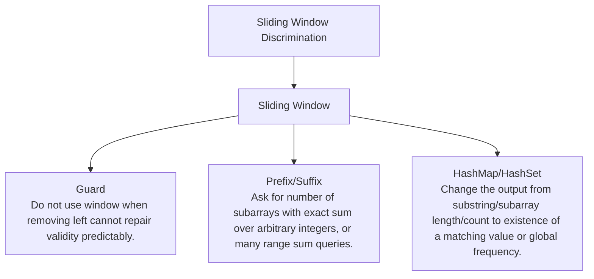

# Sliding Window Discrimination

Contiguous region problems where validity can be repaired incrementally.

Study goal: recognize when this family is the winner, reject the nearest wrong alternatives, and know the smallest requirement change that would switch the pattern.

## Switch Map

## Problems

| Rank | Problem | Winner | Why winner | Near-miss reasoning | Wrong-pattern guard | Java | LeetCode |
|---:|---|---|---|---|---|---|---|
| 3 | Longest Substring Without Repeating Characters | Sliding Window | Restarting at every duplicate loses useful overlap; a set/map keeps current window valid. | Prefix/Suffix: Why not now - The window is useful only while the condition can be repaired monotonically.; Missing - Need to count arbitrary subarrays or answer many range aggregates.; Minimal change - Ask for number of subarrays with exact sum over arbitrary integers, or many range sum queries.; Now works - Prefix state compares current aggregate with previous aggregates without relying on shrink validity. HashMap/HashSet: Why not now - A plain map alone does not encode contiguous boundaries.; Missing - No contiguous output; only lookup, frequency, or complement membership.; Minimal change - Change the output from substring/subarray length/count to existence of a matching value or global frequency.; Now works - The boundary invariant disappears and O(1) lookup is the main operation. | Do not use window when removing left cannot repair validity predictably. | [Java](../../src/main/java/org/chijai/day3/session1/LongestSubString.java) | [LC](https://leetcode.com/problems/longest-substring-without-repeating-characters/) |
| 5 | Minimum Window Substring | Sliding Window | Checking every substring repeats frequency validation; need/have counts update incrementally. | Prefix/Suffix: Why not now - The window is useful only while the condition can be repaired monotonically.; Missing - Need to count arbitrary subarrays or answer many range aggregates.; Minimal change - Ask for number of subarrays with exact sum over arbitrary integers, or many range sum queries.; Now works - Prefix state compares current aggregate with previous aggregates without relying on shrink validity. HashMap/HashSet: Why not now - A plain map alone does not encode contiguous boundaries.; Missing - No contiguous output; only lookup, frequency, or complement membership.; Minimal change - Change the output from substring/subarray length/count to existence of a matching value or global frequency.; Now works - The boundary invariant disappears and O(1) lookup is the main operation. | Do not use window when removing left cannot repair validity predictably. | [Java](../../src/main/java/org/chijai/day3/session1/MinimumWindowSubstring.java) | [LC](https://leetcode.com/problems/minimum-window-substring/) |
| 47 | Longest Substring With At Most K Distinct Characters | Sliding Window | All substrings repeat counting; sliding window updates counts as boundaries move once. | Prefix/Suffix: Why not now - The window is useful only while the condition can be repaired monotonically.; Missing - Need to count arbitrary subarrays or answer many range aggregates.; Minimal change - Ask for number of subarrays with exact sum over arbitrary integers, or many range sum queries.; Now works - Prefix state compares current aggregate with previous aggregates without relying on shrink validity. HashMap/HashSet: Why not now - A plain map alone does not encode contiguous boundaries.; Missing - No contiguous output; only lookup, frequency, or complement membership.; Minimal change - Change the output from substring/subarray length/count to existence of a matching value or global frequency.; Now works - The boundary invariant disappears and O(1) lookup is the main operation. | Do not use window when removing left cannot repair validity predictably. | [Java](../../src/main/java/org/chijai/day3/session1/AtMostKDistinct.java) | [LC](https://leetcode.com/problems/longest-substring-with-at-most-k-distinct-characters/) |
| 52 | Find All Anagrams In A String | Sliding Window | Sorting each candidate window is expensive; update char counts by one in/out. | Prefix/Suffix: Why not now - The window is useful only while the condition can be repaired monotonically.; Missing - Need to count arbitrary subarrays or answer many range aggregates.; Minimal change - Ask for number of subarrays with exact sum over arbitrary integers, or many range sum queries.; Now works - Prefix state compares current aggregate with previous aggregates without relying on shrink validity. HashMap/HashSet: Why not now - A plain map alone does not encode contiguous boundaries.; Missing - No contiguous output; only lookup, frequency, or complement membership.; Minimal change - Change the output from substring/subarray length/count to existence of a matching value or global frequency.; Now works - The boundary invariant disappears and O(1) lookup is the main operation. | Do not use window when removing left cannot repair validity predictably. | [Java](../../src/main/java/org/chijai/day3/session1/FindAllAnagramsInAString.java) | - |
| 81 | Moving Average From Data Stream | Sliding Window | Recomputing average scans the window; running sum updates in O(1). | Prefix/Suffix: Why not now - Prefix sums work for immutable arrays, but the stream window evicts old values.; Missing - Static range queries over an already-known array.; Minimal change - Change stream calls into many fixed-range average queries on an array.; Now works - Prefix sums answer each range in O(1). Design Data Structure: Why not now - The object API is simple; the core invariant is fixed-size window sum.; Missing - More operations such as reset, variable window size, or multiple keys.; Minimal change - Add per-user moving averages or variable windows.; Now works - The API contract starts driving the backing structures. | Do not recompute the average; maintain fixed-window sum and evict exactly one old value. | [Java](../../src/main/java/org/chijai/day7/session1/heap/MovingAverage.java) | [LC](https://leetcode.com/problems/moving-average-from-data-stream/) |
| 109 | Count Number Of Nice Subarrays | Sliding Window | Enumerating subarrays repeats odd counts; prefix/window reuses odd-count state. | Prefix/Suffix: Why not now - The window is useful only while the condition can be repaired monotonically.; Missing - Need to count arbitrary subarrays or answer many range aggregates.; Minimal change - Ask for number of subarrays with exact sum over arbitrary integers, or many range sum queries.; Now works - Prefix state compares current aggregate with previous aggregates without relying on shrink validity. HashMap/HashSet: Why not now - A plain map alone does not encode contiguous boundaries.; Missing - No contiguous output; only lookup, frequency, or complement membership.; Minimal change - Change the output from substring/subarray length/count to existence of a matching value or global frequency.; Now works - The boundary invariant disappears and O(1) lookup is the main operation. | Do not use window when removing left cannot repair validity predictably. | [Java](../../src/main/java/org/chijai/day3/session2/prefix/suffix/NiceSubArrays.java) | [LC](https://leetcode.com/problems/count-number-of-nice-subarrays/) |
| 207 | Longest Continuous Increasing Subsequence | Sliding Window | LIS tails/DP is overkill because skipping is not allowed. | LIS / DP: Why not now - Continuous forbids skipping, so no previous-index search is needed.; Missing - Subsequence, not subarray.; Minimal change - Allow deleting elements while preserving order.; Now works - Each index can extend many earlier smaller indices. Sliding Window With Counts: Why not now - There is no frequency constraint to maintain.; Missing - A window validity condition such as at most k violations.; Minimal change - Allow at most k non-increasing breaks.; Now works - The left boundary repairs validity as breaks enter. | Do not use LIS tails; continuous means the streak resets when order breaks. | [Java](../../src/main/java/org/chijai/day9/dp/session2/LIS.java) | [LC](https://leetcode.com/problems/longest-continuous-increasing-subsequence/) |

## Drill

For each row, speak: required output -> structure -> constraint/workload -> winner -> why not nearest alternative -> minimal mutation -> new winner.

Rows in this file: 7