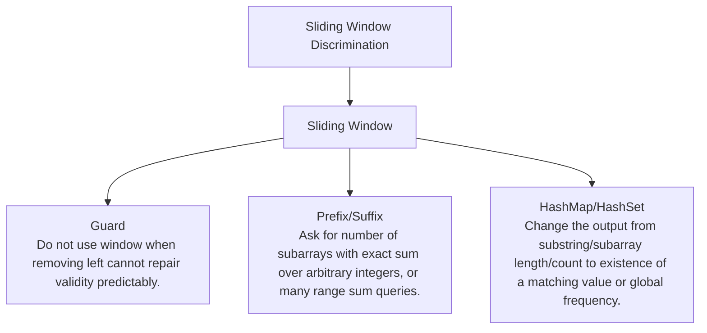

# Sliding Window Discrimination

Contiguous region problems where validity can be repaired incrementally.

Study goal: recognize when this family is the winner, reject the nearest wrong alternatives, and know the smallest requirement change that would switch the pattern.

## Switch Map

## Problems

| Rank | Problem | Winner | Why winner | Near-miss mutation | Wrong-pattern guard | Java | LeetCode |
|---:|---|---|---|---|---|---|---|
| 3 | Longest Substring Without Repeating Characters | Sliding Window | Restarting at every duplicate loses useful overlap; a set/map keeps current window valid. | Prefix/Suffix: Ask for number of subarrays with exact sum over arbitrary integers, or many range sum queries. HashMap/HashSet: Change the output from substring/subarray length/count to existence of a matching value or global frequency. | Do not use window when removing left cannot repair validity predictably. | [Java](../../src/main/java/org/chijai/day3/session1/LongestSubString.java) | [LC](https://leetcode.com/problems/longest-substring-without-repeating-characters/) |
| 5 | Minimum Window Substring | Sliding Window | Checking every substring repeats frequency validation; need/have counts update incrementally. | Prefix/Suffix: Ask for number of subarrays with exact sum over arbitrary integers, or many range sum queries. HashMap/HashSet: Change the output from substring/subarray length/count to existence of a matching value or global frequency. | Do not use window when removing left cannot repair validity predictably. | [Java](../../src/main/java/org/chijai/day3/session1/MinimumWindowSubstring.java) | [LC](https://leetcode.com/problems/minimum-window-substring/) |
| 47 | Longest Substring With At Most K Distinct Characters | Sliding Window | All substrings repeat counting; sliding window updates counts as boundaries move once. | Prefix/Suffix: Ask for number of subarrays with exact sum over arbitrary integers, or many range sum queries. HashMap/HashSet: Change the output from substring/subarray length/count to existence of a matching value or global frequency. | Do not use window when removing left cannot repair validity predictably. | [Java](../../src/main/java/org/chijai/day3/session1/AtMostKDistinct.java) | [LC](https://leetcode.com/problems/longest-substring-with-at-most-k-distinct-characters/) |
| 52 | Find All Anagrams In A String | Sliding Window | Sorting each candidate window is expensive; update char counts by one in/out. | Prefix/Suffix: Ask for number of subarrays with exact sum over arbitrary integers, or many range sum queries. HashMap/HashSet: Change the output from substring/subarray length/count to existence of a matching value or global frequency. | Do not use window when removing left cannot repair validity predictably. | [Java](../../src/main/java/org/chijai/day3/session1/FindAllAnagramsInAString.java) | - |
| 105 | Count Number Of Nice Subarrays | Sliding Window | Enumerating subarrays repeats odd counts; prefix/window reuses odd-count state. | Prefix/Suffix: Ask for number of subarrays with exact sum over arbitrary integers, or many range sum queries. HashMap/HashSet: Change the output from substring/subarray length/count to existence of a matching value or global frequency. | Do not use window when removing left cannot repair validity predictably. | [Java](../../src/main/java/org/chijai/day3/session2/prefix/suffix/NiceSubArrays.java) | [LC](https://leetcode.com/problems/count-number-of-nice-subarrays/) |

## Drill

For each row, speak: required output -> structure -> constraint/workload -> winner -> why not nearest alternative -> minimal mutation -> new winner.

Rows in this file: 5