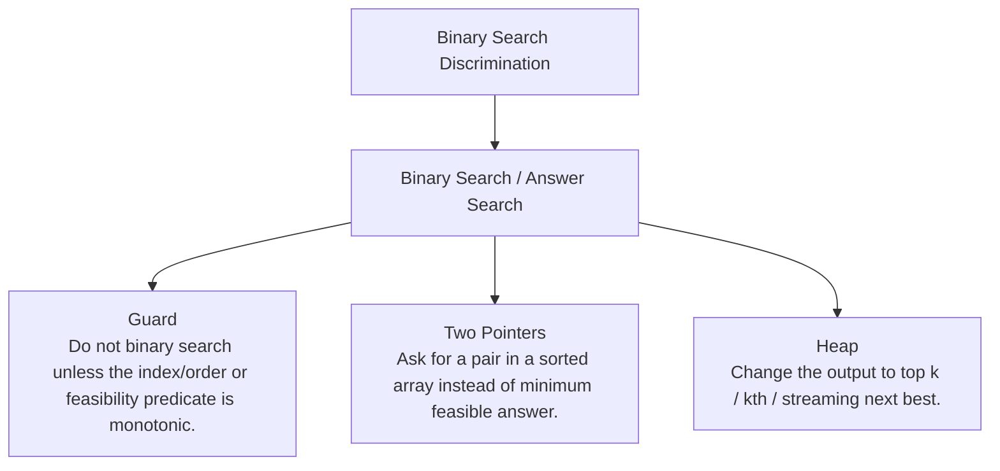

# Binary Search Discrimination

Sorted-index and monotonic-answer problems.

Study goal: recognize when this family is the winner, reject the nearest wrong alternatives, and know the smallest requirement change that would switch the pattern.

## Switch Map

## Problems

| Rank | Problem | Winner | Why winner | Near-miss mutation | Wrong-pattern guard | Java | LeetCode |
|---:|---|---|---|---|---|---|---|
| 2 | Binary Search | Binary Search / Answer Search | Linear scan is O(n); sorted order gives monotonic elimination in O(log n). | Two Pointers: Ask for a pair in a sorted array instead of minimum feasible answer. Heap: Change the output to top k / kth / streaming next best. | Do not binary search unless the index/order or feasibility predicate is monotonic. | [Java](../../src/main/java/org/chijai/day2/session1/BinarySearch.java) | [LC](https://leetcode.com/problems/binary-search/) |
| 22 | Koko Eating Bananas | Binary Search / Answer Search | Trying every speed up to maxPile is too slow; feasibility is monotonic. | Two Pointers: Ask for a pair in a sorted array instead of minimum feasible answer. Heap: Change the output to top k / kth / streaming next best. | Do not binary search unless the index/order or feasibility predicate is monotonic. | [Java](../../src/main/java/org/chijai/day2/session2/KokoBananas.java) | [LC](https://leetcode.com/problems/koko-eating-bananas/) |
| 23 | Search In Rotated Sorted Array | Binary Search / Answer Search | A normal sorted-array binary search fails because the pivot breaks global ordering. | Two Pointers: Ask for a pair in a sorted array instead of minimum feasible answer. Heap: Change the output to top k / kth / streaming next best. | Do not binary search unless the index/order or feasibility predicate is monotonic. | [Java](../../src/main/java/org/chijai/day2/session1/SearchRange.java) | [LC](https://leetcode.com/problems/search-in-rotated-sorted-array/) |
| 24 | Find First And Last Position Of Element In Sorted Array | Binary Search / Answer Search | Finding one target then expanding can become O(n) when all elements equal target. | Two Pointers: Ask for a pair in a sorted array instead of minimum feasible answer. Heap: Change the output to top k / kth / streaming next best. | Do not binary search unless the index/order or feasibility predicate is monotonic. | [Java](../../src/main/java/org/chijai/day2/session1/SearchRange.java) | [LC](https://leetcode.com/problems/find-first-and-last-position-of-element-in-sorted-array/) |
| 73 | Search In Rotated Sorted Array II | Binary Search / Answer Search | Duplicates can destroy the sorted-half signal, so worst-case time can degrade to O(n). | Two Pointers: Ask for a pair in a sorted array instead of minimum feasible answer. Heap: Change the output to top k / kth / streaming next best. | Do not binary search unless the index/order or feasibility predicate is monotonic. | [Java](../../src/main/java/org/chijai/day2/session1/SearchRange.java) | [LC](https://leetcode.com/problems/search-in-rotated-sorted-array-ii/) |
| 76 | Search Insert Position | Binary Search / Answer Search | Equality is a boundary candidate, not a reason to abandon the left side. | Two Pointers: Ask for a pair in a sorted array instead of minimum feasible answer. Heap: Change the output to top k / kth / streaming next best. | Do not binary search unless the index/order or feasibility predicate is monotonic. | [Java](../../src/main/java/org/chijai/day2/session1/BinarySearch.java) | [LC](https://leetcode.com/problems/search-insert-position/) |
| 80 | Find Peak Element | Binary Search / Answer Search | Binary search does not require sorted data, only a safe half-discard rule. | Two Pointers: Ask for a pair in a sorted array instead of minimum feasible answer. Heap: Change the output to top k / kth / streaming next best. | Do not binary search unless the index/order or feasibility predicate is monotonic. | [Java](../../src/main/java/org/chijai/day2/session1/SearchRange.java) | [LC](https://leetcode.com/problems/find-peak-element/) |
| 81 | First Bad Version | Binary Search / Answer Search | Checking versions one by one wastes the monotonic bad suffix. | Two Pointers: Ask for a pair in a sorted array instead of minimum feasible answer. Heap: Change the output to top k / kth / streaming next best. | Do not binary search unless the index/order or feasibility predicate is monotonic. | [Java](../../src/main/java/org/chijai/day2/session1/BinarySearch.java) | [LC](https://leetcode.com/problems/first-bad-version/) |
| 82 | Split Array Largest Sum | Binary Search / Answer Search | The feasibility check is monotonic: larger max sum never needs more pieces. | Two Pointers: Ask for a pair in a sorted array instead of minimum feasible answer. Heap: Change the output to top k / kth / streaming next best. | Do not binary search unless the index/order or feasibility predicate is monotonic. | [Java](../../src/main/java/org/chijai/day2/session2/AGGRCOW.java) | [LC](https://leetcode.com/problems/split-array-largest-sum/) |
| 87 | Capacity To Ship Packages Within D Days | Binary Search / Answer Search | Capacity must be at least max weight, and larger capacity never requires more days. | Two Pointers: Ask for a pair in a sorted array instead of minimum feasible answer. Heap: Change the output to top k / kth / streaming next best. | Do not binary search unless the index/order or feasibility predicate is monotonic. | [Java](../../src/main/java/org/chijai/day2/session2/KokoBananas.java) | [LC](https://leetcode.com/problems/capacity-to-ship-packages-within-d-days/) |
| 88 | Minimum Number Of Days To Make M Bouquets | Binary Search / Answer Search | Day feasibility is monotonic, but adjacency resets the current flower streak. | Two Pointers: Ask for a pair in a sorted array instead of minimum feasible answer. Heap: Change the output to top k / kth / streaming next best. | Do not binary search unless the index/order or feasibility predicate is monotonic. | [Java](../../src/main/java/org/chijai/day2/session2/KokoBananas.java) | [LC](https://leetcode.com/problems/minimum-number-of-days-to-make-m-bouquets/) |
| 98 | Time Based Key Value Store | Binary Search / Answer Search | Scanning history on every get is slow; timestamps are monotonic per key. | Two Pointers: Ask for a pair in a sorted array instead of minimum feasible answer. Heap: Change the output to top k / kth / streaming next best. | Do not binary search unless the index/order or feasibility predicate is monotonic. | [Java](../../src/main/java/org/chijai/day2/session3/TimeBasedKeyValueStore.java) | [LC](https://leetcode.com/problems/time-based-key-value-store/) |
| 127 | Sqrtx | Binary Search / Answer Search | Linear testing is slow and mid*mid can overflow without long arithmetic. | Two Pointers: Ask for a pair in a sorted array instead of minimum feasible answer. Heap: Change the output to top k / kth / streaming next best. | Do not binary search unless the index/order or feasibility predicate is monotonic. | [Java](../../src/main/java/org/chijai/day2/session1/SearchRange.java) | [LC](https://leetcode.com/problems/sqrtx/) |

## Drill

For each row, speak: required output -> structure -> constraint/workload -> winner -> why not nearest alternative -> minimal mutation -> new winner.

Rows in this file: 13