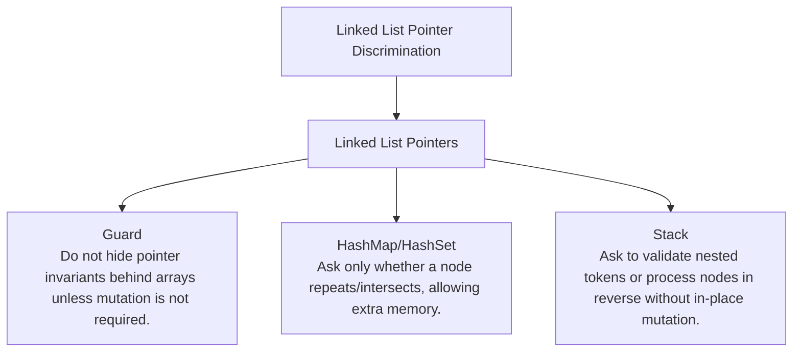

# Linked List Pointer Discrimination

Identity, pointer rewiring, cycles, recency lists, and merge structures.

Study goal: recognize when this family is the winner, reject the nearest wrong alternatives, and know the smallest requirement change that would switch the pattern.

## Switch Map

## Problems

| Rank | Problem | Winner | Why winner | Near-miss mutation | Wrong-pattern guard | Java | LeetCode |
|---:|---|---|---|---|---|---|---|
| 6 | Reverse Linked List | Linked List Pointers | Stack/list copy is extra memory; three pointers reverse in place. | HashMap/HashSet: Ask only whether a node repeats/intersects, allowing extra memory. Stack: Ask to validate nested tokens or process nodes in reverse without in-place mutation. | Do not hide pointer invariants behind arrays unless mutation is not required. | [Java](../../src/main/java/org/chijai/day4/LinkedList/session1/ReverseLinkedList.java) | [LC](https://leetcode.com/problems/reverse-linked-list/) |
| 7 | Linked List Cycle | Linked List Pointers | HashSet detects repeats with memory; Floyd uses speed difference in O(1) space. | HashMap/HashSet: Ask only whether a node repeats/intersects, allowing extra memory. Stack: Ask to validate nested tokens or process nodes in reverse without in-place mutation. | Do not hide pointer invariants behind arrays unless mutation is not required. | [Java](../../src/main/java/org/chijai/day4/LinkedList/session1/LinkedListCycle.java) | [LC](https://leetcode.com/problems/linked-list-cycle/) |
| 8 | Merge Two Sorted Lists | Linked List Pointers | Creating an array loses list structure; merge pointers preserve nodes in one pass. | HashMap/HashSet: Ask only whether a node repeats/intersects, allowing extra memory. Stack: Ask to validate nested tokens or process nodes in reverse without in-place mutation. | Do not hide pointer invariants behind arrays unless mutation is not required. | [Java](../../src/main/java/org/chijai/day4/LinkedList/session4/Merge2SortedLists.java) | [LC](https://leetcode.com/problems/merge-two-sorted-lists/) |
| 11 | Merge K Sorted Lists | Linked List Pointers | Repeatedly scanning k heads costs O(kN); heap reduces selection to O(log k). | HashMap/HashSet: Ask only whether a node repeats/intersects, allowing extra memory. Stack: Ask to validate nested tokens or process nodes in reverse without in-place mutation. | Do not hide pointer invariants behind arrays unless mutation is not required. | [Java](../../src/main/java/org/chijai/day4/LinkedList/session4/MergeKSortedLists.java) | [LC](https://leetcode.com/problems/merge-k-sorted-lists/) |
| 25 | LRU Cache | Linked List Pointers | A plain map cannot evict least-recently-used; a list gives O(1) move/remove. | HashMap/HashSet: Ask only whether a node repeats/intersects, allowing extra memory. Stack: Ask to validate nested tokens or process nodes in reverse without in-place mutation. | Do not hide pointer invariants behind arrays unless mutation is not required. | [Java](../../src/main/java/org/chijai/day4/LinkedList/session3/LruCache.java) | [LC](https://leetcode.com/problems/lru-cache/) |
| 26 | Copy List With Random Pointer | Linked List Pointers | Random pointers prevent simple one-pass copy; a map preserves identity mapping. | HashMap/HashSet: Ask only whether a node repeats/intersects, allowing extra memory. Stack: Ask to validate nested tokens or process nodes in reverse without in-place mutation. | Do not hide pointer invariants behind arrays unless mutation is not required. | [Java](../../src/main/java/org/chijai/day4/LinkedList/session2/CopyListWithRandomPointer.java) | - |
| 54 | Intersection Of Two Linked Lists | Linked List Pointers | HashSet works but costs space; pointer switching aligns the remaining distances. | HashMap/HashSet: Ask only whether a node repeats/intersects, allowing extra memory. Stack: Ask to validate nested tokens or process nodes in reverse without in-place mutation. | Do not hide pointer invariants behind arrays unless mutation is not required. | [Java](../../src/main/java/org/chijai/day4/LinkedList/session1/Intersection.java) | [LC](https://leetcode.com/problems/intersection-of-two-linked-lists/) |
| 55 | Linked List Cycle Ii | Linked List Pointers | Cycle existence is not enough; Floyd distance math locates the entry in O(1) space. | HashMap/HashSet: Ask only whether a node repeats/intersects, allowing extra memory. Stack: Ask to validate nested tokens or process nodes in reverse without in-place mutation. | Do not hide pointer invariants behind arrays unless mutation is not required. | [Java](../../src/main/java/org/chijai/day4/LinkedList/session4/LinkedListCycleII.java) | - |
| 56 | Reverse Nodes in k-Group | Linked List Pointers | Blind reversal corrupts final short group; group boundary check preserves list. | HashMap/HashSet: Ask only whether a node repeats/intersects, allowing extra memory. Stack: Ask to validate nested tokens or process nodes in reverse without in-place mutation. | Do not hide pointer invariants behind arrays unless mutation is not required. | [Java](../../src/main/java/org/chijai/day4/LinkedList/session2/ReverseLinkedListNodesK.java) | [LC](https://leetcode.com/problems/reverse-nodes-in-k-group/) |
| 60 | Odd Even Linked List | Linked List Pointers | Array grouping is extra space; pointers can preserve relative order in place. | HashMap/HashSet: Ask only whether a node repeats/intersects, allowing extra memory. Stack: Ask to validate nested tokens or process nodes in reverse without in-place mutation. | Do not hide pointer invariants behind arrays unless mutation is not required. | [Java](../../src/main/java/org/chijai/day4/LinkedList/session2/ReverseLinkedListNodesK.java) | [LC](https://leetcode.com/problems/odd-even-linked-list/) |
| 61 | Rotate List | Linked List Pointers | Repeated single rotations are too slow; length gives the final split directly. | HashMap/HashSet: Ask only whether a node repeats/intersects, allowing extra memory. Stack: Ask to validate nested tokens or process nodes in reverse without in-place mutation. | Do not hide pointer invariants behind arrays unless mutation is not required. | [Java](../../src/main/java/org/chijai/day4/LinkedList/session2/ReverseLinkedListNodesK.java) | [LC](https://leetcode.com/problems/rotate-list/) |
| 62 | Swap Nodes In Pairs | Linked List Pointers | Value swap is not always allowed; pointer swap preserves nodes. | HashMap/HashSet: Ask only whether a node repeats/intersects, allowing extra memory. Stack: Ask to validate nested tokens or process nodes in reverse without in-place mutation. | Do not hide pointer invariants behind arrays unless mutation is not required. | [Java](../../src/main/java/org/chijai/day4/LinkedList/session2/ReverseLinkedListNodesK.java) | [LC](https://leetcode.com/problems/swap-nodes-in-pairs/) |
| 63 | First Unique Number | Linked List Pointers | Scanning every query is slow; counts plus ordered candidates make showFirstUnique cheap. | HashMap/HashSet: Ask only whether a node repeats/intersects, allowing extra memory. Stack: Ask to validate nested tokens or process nodes in reverse without in-place mutation. | Do not hide pointer invariants behind arrays unless mutation is not required. | [Java](../../src/main/java/org/chijai/day4/LinkedList/session3/LruCache.java) | [LC](https://leetcode.com/problems/first-unique-number/) |
| 78 | Design Browser History | Linked List Pointers | Arrays are simple but pointer/list model makes state transitions explicit. | HashMap/HashSet: Ask only whether a node repeats/intersects, allowing extra memory. Stack: Ask to validate nested tokens or process nodes in reverse without in-place mutation. | Do not hide pointer invariants behind arrays unless mutation is not required. | [Java](../../src/main/java/org/chijai/day4/LinkedList/session3/LruCache.java) | [LC](https://leetcode.com/problems/design-browser-history/) |
| 79 | Moving Average From Data Stream | Linked List Pointers | Recomputing average scans the window; running sum updates in O(1). | HashMap/HashSet: Ask only whether a node repeats/intersects, allowing extra memory. Stack: Ask to validate nested tokens or process nodes in reverse without in-place mutation. | Do not hide pointer invariants behind arrays unless mutation is not required. | [Java](../../src/main/java/org/chijai/day4/LinkedList/session3/LruCache.java) | [LC](https://leetcode.com/problems/moving-average-from-data-stream/) |
| 106 | Middle Of Linked List | Linked List Pointers | Brute force may use extra storage; pointer invariants let us solve in one pass or O(1) space. | HashMap/HashSet: Ask only whether a node repeats/intersects, allowing extra memory. Stack: Ask to validate nested tokens or process nodes in reverse without in-place mutation. | Do not hide pointer invariants behind arrays unless mutation is not required. | [Java](../../src/main/java/org/chijai/day4/LinkedList/session4/MiddleOfLinkedList.java) | - |
| 191 | Reverse Linked List Ii | Linked List Pointers | Head can change; dummy plus sublist predecessor prevents edge-case bugs. | HashMap/HashSet: Ask only whether a node repeats/intersects, allowing extra memory. Stack: Ask to validate nested tokens or process nodes in reverse without in-place mutation. | Do not hide pointer invariants behind arrays unless mutation is not required. | [Java](../../src/main/java/org/chijai/day4/LinkedList/session2/ReverseLinkedListNodesK.java) | [LC](https://leetcode.com/problems/reverse-linked-list-ii/) |

## Drill

For each row, speak: required output -> structure -> constraint/workload -> winner -> why not nearest alternative -> minimal mutation -> new winner.

Rows in this file: 17