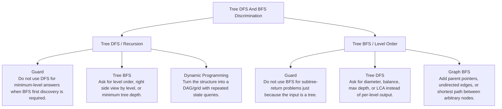

# Tree DFS And BFS Discrimination

Subtree return contracts versus level-order queue contracts.

Study goal: recognize when this family is the winner, reject the nearest wrong alternatives, and know the smallest requirement change that would switch the pattern.

## Switch Map

## Problems

| Rank | Problem | Winner | Why winner | Near-miss reasoning | Wrong-pattern guard | Java | LeetCode |
|---:|---|---|---|---|---|---|---|
| 15 | Binary Tree Level Order Traversal | Tree BFS / Level Order | Naive queue loop loses level boundaries; size snapshot preserves grouping. | Tree DFS: Why not now - BFS is chosen because level order or nearest layer is part of the output.; Missing - A subtree return contract such as height, validity, path, or aggregate.; Minimal change - Ask for diameter, balance, max depth, or LCA instead of per-level output.; Now works - A recursive helper can combine left/right answers bottom-up. Graph BFS: Why not now - Tree BFS has no revisits unless parent links or extra edges are introduced.; Missing - General graph neighbors and visited state.; Minimal change - Add parent pointers, undirected edges, or shortest path between arbitrary nodes.; Now works - Visited state and shortest-path layering become mandatory. | Do not use BFS for subtree-return problems just because the input is a tree. | [Java](../../src/main/java/org/chijai/day6/trees/session1/BinaryTreeTraversal.java) | [LC](https://leetcode.com/problems/binary-tree-level-order-traversal/) |
| 16 | Validate Binary Search Tree | Tree DFS / Recursion | Checking only parent-child misses ancestor violations. | Tree BFS: Why not now - DFS is chosen when the result is a subtree/path return, not a level boundary.; Missing - Output grouped by level, nearest depth, or first node seen at each layer.; Minimal change - Ask for level order, right side view by level, or minimum tree depth.; Now works - Queue-size snapshots preserve level boundaries naturally. Dynamic Programming: Why not now - A tree helper may be DP-like, but there are no overlapping subproblems in a normal tree.; Missing - Repeated states reachable by multiple paths.; Minimal change - Turn the structure into a DAG/grid with repeated state queries.; Now works - Caching state results prevents recomputation. | Do not use DFS for minimum-level answers when BFS first discovery is required. | [Java](../../src/main/java/org/chijai/day6/trees/session1/BinaryTreeInorderTraversal.java) | [LC](https://leetcode.com/problems/validate-binary-search-tree/) |
| 17 | Lowest Common Ancestor Of A Binary Tree | Tree DFS / Recursion | Paths can be found separately, but DFS return contract finds LCA in one pass. | Tree BFS: Why not now - DFS is chosen when the result is a subtree/path return, not a level boundary.; Missing - Output grouped by level, nearest depth, or first node seen at each layer.; Minimal change - Ask for level order, right side view by level, or minimum tree depth.; Now works - Queue-size snapshots preserve level boundaries naturally. Dynamic Programming: Why not now - A tree helper may be DP-like, but there are no overlapping subproblems in a normal tree.; Missing - Repeated states reachable by multiple paths.; Minimal change - Turn the structure into a DAG/grid with repeated state queries.; Now works - Caching state results prevents recomputation. | Do not use DFS for minimum-level answers when BFS first discovery is required. | [Java](../../src/main/java/org/chijai/day6/trees/session1/LCA.java) | [LC](https://leetcode.com/problems/lowest-common-ancestor-of-a-binary-tree/) |
| 27 | Kth Smallest Element in a BST | Tree DFS / Recursion | Heap/sort is unnecessary because BST already encodes order. | Tree BFS: Why not now - DFS is chosen when the result is a subtree/path return, not a level boundary.; Missing - Output grouped by level, nearest depth, or first node seen at each layer.; Minimal change - Ask for level order, right side view by level, or minimum tree depth.; Now works - Queue-size snapshots preserve level boundaries naturally. Dynamic Programming: Why not now - A tree helper may be DP-like, but there are no overlapping subproblems in a normal tree.; Missing - Repeated states reachable by multiple paths.; Minimal change - Turn the structure into a DAG/grid with repeated state queries.; Now works - Caching state results prevents recomputation. | Do not use DFS for minimum-level answers when BFS first discovery is required. | [Java](../../src/main/java/org/chijai/day6/trees/session3/KthSmallestElementInBST.java) | [LC](https://leetcode.com/problems/kth-smallest-element-in-a-bst/) |
| 28 | Diameter of Binary Tree | Tree DFS / Recursion | Global answer differs from helper return value. | Tree BFS: Why not now - DFS is chosen when the result is a subtree/path return, not a level boundary.; Missing - Output grouped by level, nearest depth, or first node seen at each layer.; Minimal change - Ask for level order, right side view by level, or minimum tree depth.; Now works - Queue-size snapshots preserve level boundaries naturally. Dynamic Programming: Why not now - A tree helper may be DP-like, but there are no overlapping subproblems in a normal tree.; Missing - Repeated states reachable by multiple paths.; Minimal change - Turn the structure into a DAG/grid with repeated state queries.; Now works - Caching state results prevents recomputation. | Do not use DFS for minimum-level answers when BFS first discovery is required. | [Java](../../src/main/java/org/chijai/day6/trees/session3/BinaryTree.java) | [LC](https://leetcode.com/problems/diameter-of-binary-tree/) |
| 29 | Path Sum III | Tree DFS / Recursion | Brute force restarts DFS at every node; prefix sums reuse ancestor sums. | Prefix/Suffix: Why not now - Prefix sum is inside the DFS path, not a flat array scan.; Missing - Ancestor path context and backtracking removal.; Minimal change - Change the tree to an array subarray-sum problem.; Now works - A running prefix map over indices is enough. Tree DFS: Why not now - Plain DFS alone restarts work at every node.; Missing - Need to count all downward paths ending at current node efficiently.; Minimal change - Ask only whether one root-to-leaf path equals target.; Now works - A simple path-sum DFS return/check is sufficient. | Do not restart DFS from every node; keep prefix counts on the current root path. | [Java](../../src/main/java/org/chijai/day6/trees/session4/BinaryTreePathProblems.java) | [LC](https://leetcode.com/problems/path-sum-iii/) |
| 57 | Lowest Common Ancestor Of A Binary Search Tree | Tree DFS / Recursion | BST ordering turns LCA into one directed walk instead of full DFS. | Tree BFS: Why not now - DFS is chosen when the result is a subtree/path return, not a level boundary.; Missing - Output grouped by level, nearest depth, or first node seen at each layer.; Minimal change - Ask for level order, right side view by level, or minimum tree depth.; Now works - Queue-size snapshots preserve level boundaries naturally. Dynamic Programming: Why not now - A tree helper may be DP-like, but there are no overlapping subproblems in a normal tree.; Missing - Repeated states reachable by multiple paths.; Minimal change - Turn the structure into a DAG/grid with repeated state queries.; Now works - Caching state results prevents recomputation. | Do not use DFS for minimum-level answers when BFS first discovery is required. | [Java](../../src/main/java/org/chijai/day6/trees/session1/LCA_BST.java) | [LC](https://leetcode.com/problems/lowest-common-ancestor-of-a-binary-search-tree/) |
| 58 | Binary Tree Right Side View | Tree BFS / Level Order | DFS can work, but level BFS directly exposes the rightmost node per depth. | Tree DFS: Why not now - BFS is chosen because level order or nearest layer is part of the output.; Missing - A subtree return contract such as height, validity, path, or aggregate.; Minimal change - Ask for diameter, balance, max depth, or LCA instead of per-level output.; Now works - A recursive helper can combine left/right answers bottom-up. Graph BFS: Why not now - Tree BFS has no revisits unless parent links or extra edges are introduced.; Missing - General graph neighbors and visited state.; Minimal change - Add parent pointers, undirected edges, or shortest path between arbitrary nodes.; Now works - Visited state and shortest-path layering become mandatory. | Do not use BFS for subtree-return problems just because the input is a tree. | [Java](../../src/main/java/org/chijai/day6/trees/session1/BinaryTreeSideView.java) | [LC](https://leetcode.com/problems/binary-tree-right-side-view/) |
| 63 | Binary Tree Inorder Traversal | Tree DFS / Recursion | Recursive or stack both follow the same left-spine invariant. | Tree BFS: Why not now - DFS is chosen when the result is a subtree/path return, not a level boundary.; Missing - Output grouped by level, nearest depth, or first node seen at each layer.; Minimal change - Ask for level order, right side view by level, or minimum tree depth.; Now works - Queue-size snapshots preserve level boundaries naturally. Dynamic Programming: Why not now - A tree helper may be DP-like, but there are no overlapping subproblems in a normal tree.; Missing - Repeated states reachable by multiple paths.; Minimal change - Turn the structure into a DAG/grid with repeated state queries.; Now works - Caching state results prevents recomputation. | Do not use DFS for minimum-level answers when BFS first discovery is required. | [Java](../../src/main/java/org/chijai/day6/trees/session1/BinaryTreeInorderTraversal.java) | [LC](https://leetcode.com/problems/binary-tree-inorder-traversal/) |
| 64 | Invert Binary Tree | Tree DFS / Recursion | The operation is local and identical for all subtrees. | Tree BFS: Why not now - DFS is chosen when the result is a subtree/path return, not a level boundary.; Missing - Output grouped by level, nearest depth, or first node seen at each layer.; Minimal change - Ask for level order, right side view by level, or minimum tree depth.; Now works - Queue-size snapshots preserve level boundaries naturally. Dynamic Programming: Why not now - A tree helper may be DP-like, but there are no overlapping subproblems in a normal tree.; Missing - Repeated states reachable by multiple paths.; Minimal change - Turn the structure into a DAG/grid with repeated state queries.; Now works - Caching state results prevents recomputation. | Do not use DFS for minimum-level answers when BFS first discovery is required. | [Java](../../src/main/java/org/chijai/day6/trees/session3/InvertBinaryTree.java) | [LC](https://leetcode.com/problems/invert-binary-tree/) |
| 65 | Construct Binary Search Tree From Preorder Traversal | Tree DFS / Recursion | Searching split points repeatedly is slower; bounds consume preorder once. | Tree BFS: Why not now - DFS is chosen when the result is a subtree/path return, not a level boundary.; Missing - Output grouped by level, nearest depth, or first node seen at each layer.; Minimal change - Ask for level order, right side view by level, or minimum tree depth.; Now works - Queue-size snapshots preserve level boundaries naturally. Dynamic Programming: Why not now - A tree helper may be DP-like, but there are no overlapping subproblems in a normal tree.; Missing - Repeated states reachable by multiple paths.; Minimal change - Turn the structure into a DAG/grid with repeated state queries.; Now works - Caching state results prevents recomputation. | Do not use DFS for minimum-level answers when BFS first discovery is required. | [Java](../../src/main/java/org/chijai/day6/trees/session2/ConstructTree.java) | [LC](https://leetcode.com/problems/construct-binary-search-tree-from-preorder-traversal/) |
| 66 | Sum Root To Leaf Numbers | Tree DFS / Recursion | The state is the path value, not the full path list. | Tree BFS: Why not now - DFS is chosen when the result is a subtree/path return, not a level boundary.; Missing - Output grouped by level, nearest depth, or first node seen at each layer.; Minimal change - Ask for level order, right side view by level, or minimum tree depth.; Now works - Queue-size snapshots preserve level boundaries naturally. Dynamic Programming: Why not now - A tree helper may be DP-like, but there are no overlapping subproblems in a normal tree.; Missing - Repeated states reachable by multiple paths.; Minimal change - Turn the structure into a DAG/grid with repeated state queries.; Now works - Caching state results prevents recomputation. | Do not use DFS for minimum-level answers when BFS first discovery is required. | [Java](../../src/main/java/org/chijai/day6/trees/session4/BinaryTreePathProblems.java) | [LC](https://leetcode.com/problems/sum-root-to-leaf-numbers/) |
| 73 | Serialize And Deserialize Binary Tree | Tree DFS / Recursion | Values alone lose missing-child positions; null markers preserve shape. | Tree BFS: Why not now - DFS is chosen when the result is a subtree/path return, not a level boundary.; Missing - Output grouped by level, nearest depth, or first node seen at each layer.; Minimal change - Ask for level order, right side view by level, or minimum tree depth.; Now works - Queue-size snapshots preserve level boundaries naturally. Dynamic Programming: Why not now - A tree helper may be DP-like, but there are no overlapping subproblems in a normal tree.; Missing - Repeated states reachable by multiple paths.; Minimal change - Turn the structure into a DAG/grid with repeated state queries.; Now works - Caching state results prevents recomputation. | Do not use DFS for minimum-level answers when BFS first discovery is required. | [Java](../../src/main/java/org/chijai/day6/trees/session2/SerializeAndDeserializeBinaryTree.java) | [LC](https://leetcode.com/problems/serialize-and-deserialize-binary-tree/) |
| 83 | Verify Preorder Serialization Of A Binary Tree | Tree DFS / Recursion | Building the tree is unnecessary; valid serialization preserves slot balance. | Tree BFS: Why not now - DFS is chosen when the result is a subtree/path return, not a level boundary.; Missing - Output grouped by level, nearest depth, or first node seen at each layer.; Minimal change - Ask for level order, right side view by level, or minimum tree depth.; Now works - Queue-size snapshots preserve level boundaries naturally. Dynamic Programming: Why not now - A tree helper may be DP-like, but there are no overlapping subproblems in a normal tree.; Missing - Repeated states reachable by multiple paths.; Minimal change - Turn the structure into a DAG/grid with repeated state queries.; Now works - Caching state results prevents recomputation. | Do not use DFS for minimum-level answers when BFS first discovery is required. | [Java](../../src/main/java/org/chijai/day6/trees/session2/ConstructTree.java) | [LC](https://leetcode.com/problems/verify-preorder-serialization-of-a-binary-tree/) |
| 95 | Construct Binary Tree From Inorder And Postorder Traversal | Tree DFS / Recursion | Linear search for root each time is slow; map inorder value to index. | Tree BFS: Why not now - DFS is chosen when the result is a subtree/path return, not a level boundary.; Missing - Output grouped by level, nearest depth, or first node seen at each layer.; Minimal change - Ask for level order, right side view by level, or minimum tree depth.; Now works - Queue-size snapshots preserve level boundaries naturally. Dynamic Programming: Why not now - A tree helper may be DP-like, but there are no overlapping subproblems in a normal tree.; Missing - Repeated states reachable by multiple paths.; Minimal change - Turn the structure into a DAG/grid with repeated state queries.; Now works - Caching state results prevents recomputation. | Do not use DFS for minimum-level answers when BFS first discovery is required. | [Java](../../src/main/java/org/chijai/day6/trees/session2/ConstructTree.java) | [LC](https://leetcode.com/problems/construct-binary-tree-from-inorder-and-postorder-traversal/) |
| 97 | Construct Binary Tree From Preorder And Inorder Traversal | Tree DFS / Recursion | The two traversals define structure when values are unique. | Tree BFS: Why not now - DFS is chosen when the result is a subtree/path return, not a level boundary.; Missing - Output grouped by level, nearest depth, or first node seen at each layer.; Minimal change - Ask for level order, right side view by level, or minimum tree depth.; Now works - Queue-size snapshots preserve level boundaries naturally. Dynamic Programming: Why not now - A tree helper may be DP-like, but there are no overlapping subproblems in a normal tree.; Missing - Repeated states reachable by multiple paths.; Minimal change - Turn the structure into a DAG/grid with repeated state queries.; Now works - Caching state results prevents recomputation. | Do not use DFS for minimum-level answers when BFS first discovery is required. | [Java](../../src/main/java/org/chijai/day6/trees/session2/ConstructTree.java) | [LC](https://leetcode.com/problems/construct-binary-tree-from-preorder-and-inorder-traversal/) |
| 98 | Binary Tree Maximum Path Sum | Tree DFS / Recursion | Return value and global maximum are different concepts. | Tree BFS: Why not now - DFS is chosen when the result is a subtree/path return, not a level boundary.; Missing - Output grouped by level, nearest depth, or first node seen at each layer.; Minimal change - Ask for level order, right side view by level, or minimum tree depth.; Now works - Queue-size snapshots preserve level boundaries naturally. Dynamic Programming: Why not now - A tree helper may be DP-like, but there are no overlapping subproblems in a normal tree.; Missing - Repeated states reachable by multiple paths.; Minimal change - Turn the structure into a DAG/grid with repeated state queries.; Now works - Caching state results prevents recomputation. | Do not use DFS for minimum-level answers when BFS first discovery is required. | [Java](../../src/main/java/org/chijai/day6/trees/session4/BinaryTreePathProblems.java) | [LC](https://leetcode.com/problems/binary-tree-maximum-path-sum/) |
| 113 | Path Sum | Tree DFS / Recursion | Only root-to-leaf complete paths count. | Tree BFS: Why not now - DFS is chosen when the result is a subtree/path return, not a level boundary.; Missing - Output grouped by level, nearest depth, or first node seen at each layer.; Minimal change - Ask for level order, right side view by level, or minimum tree depth.; Now works - Queue-size snapshots preserve level boundaries naturally. Dynamic Programming: Why not now - A tree helper may be DP-like, but there are no overlapping subproblems in a normal tree.; Missing - Repeated states reachable by multiple paths.; Minimal change - Turn the structure into a DAG/grid with repeated state queries.; Now works - Caching state results prevents recomputation. | Do not use DFS for minimum-level answers when BFS first discovery is required. | [Java](../../src/main/java/org/chijai/day6/trees/session4/BinaryTreePathProblems.java) | [LC](https://leetcode.com/problems/path-sum/) |
| 114 | Binary Tree Postorder Traversal | Tree DFS / Recursion | A parent cannot be finalized before children when return data flows upward. | Tree BFS: Why not now - DFS is chosen when the result is a subtree/path return, not a level boundary.; Missing - Output grouped by level, nearest depth, or first node seen at each layer.; Minimal change - Ask for level order, right side view by level, or minimum tree depth.; Now works - Queue-size snapshots preserve level boundaries naturally. Dynamic Programming: Why not now - A tree helper may be DP-like, but there are no overlapping subproblems in a normal tree.; Missing - Repeated states reachable by multiple paths.; Minimal change - Turn the structure into a DAG/grid with repeated state queries.; Now works - Caching state results prevents recomputation. | Do not use DFS for minimum-level answers when BFS first discovery is required. | [Java](../../src/main/java/org/chijai/day6/trees/session1/BinaryTreeInorderTraversal.java) | [LC](https://leetcode.com/problems/binary-tree-postorder-traversal/) |
| 115 | Binary Tree Preorder Traversal | Tree DFS / Recursion | Root-first order captures decisions before descending. | Tree BFS: Why not now - DFS is chosen when the result is a subtree/path return, not a level boundary.; Missing - Output grouped by level, nearest depth, or first node seen at each layer.; Minimal change - Ask for level order, right side view by level, or minimum tree depth.; Now works - Queue-size snapshots preserve level boundaries naturally. Dynamic Programming: Why not now - A tree helper may be DP-like, but there are no overlapping subproblems in a normal tree.; Missing - Repeated states reachable by multiple paths.; Minimal change - Turn the structure into a DAG/grid with repeated state queries.; Now works - Caching state results prevents recomputation. | Do not use DFS for minimum-level answers when BFS first discovery is required. | [Java](../../src/main/java/org/chijai/day6/trees/session1/BinaryTreeInorderTraversal.java) | [LC](https://leetcode.com/problems/binary-tree-preorder-traversal/) |
| 116 | Insert Into A Binary Search Tree | Tree DFS / Recursion | BST property removes the need to search both sides. | Tree BFS: Why not now - DFS is chosen when the result is a subtree/path return, not a level boundary.; Missing - Output grouped by level, nearest depth, or first node seen at each layer.; Minimal change - Ask for level order, right side view by level, or minimum tree depth.; Now works - Queue-size snapshots preserve level boundaries naturally. Dynamic Programming: Why not now - A tree helper may be DP-like, but there are no overlapping subproblems in a normal tree.; Missing - Repeated states reachable by multiple paths.; Minimal change - Turn the structure into a DAG/grid with repeated state queries.; Now works - Caching state results prevents recomputation. | Do not use DFS for minimum-level answers when BFS first discovery is required. | [Java](../../src/main/java/org/chijai/day6/trees/session1/LCA_BST.java) | [LC](https://leetcode.com/problems/insert-into-a-binary-search-tree/) |
| 117 | Minimum Absolute Difference In BST | Tree DFS / Recursion | Comparing all pairs is unnecessary once sorted order is available. | Tree BFS: Why not now - DFS is chosen when the result is a subtree/path return, not a level boundary.; Missing - Output grouped by level, nearest depth, or first node seen at each layer.; Minimal change - Ask for level order, right side view by level, or minimum tree depth.; Now works - Queue-size snapshots preserve level boundaries naturally. Dynamic Programming: Why not now - A tree helper may be DP-like, but there are no overlapping subproblems in a normal tree.; Missing - Repeated states reachable by multiple paths.; Minimal change - Turn the structure into a DAG/grid with repeated state queries.; Now works - Caching state results prevents recomputation. | Do not use DFS for minimum-level answers when BFS first discovery is required. | [Java](../../src/main/java/org/chijai/day6/trees/session1/LCA_BST.java) | [LC](https://leetcode.com/problems/minimum-absolute-difference-in-bst/) |
| 118 | Range Sum Of BST | Tree DFS / Recursion | Full traversal works but wastes branches that cannot contribute. | Tree BFS: Why not now - DFS is chosen when the result is a subtree/path return, not a level boundary.; Missing - Output grouped by level, nearest depth, or first node seen at each layer.; Minimal change - Ask for level order, right side view by level, or minimum tree depth.; Now works - Queue-size snapshots preserve level boundaries naturally. Dynamic Programming: Why not now - A tree helper may be DP-like, but there are no overlapping subproblems in a normal tree.; Missing - Repeated states reachable by multiple paths.; Minimal change - Turn the structure into a DAG/grid with repeated state queries.; Now works - Caching state results prevents recomputation. | Do not use DFS for minimum-level answers when BFS first discovery is required. | [Java](../../src/main/java/org/chijai/day6/trees/session1/LCA_BST.java) | [LC](https://leetcode.com/problems/range-sum-of-bst/) |
| 119 | Search In A Binary Search Tree | Tree DFS / Recursion | BST ordering prunes half the tree at every step. | Tree BFS: Why not now - DFS is chosen when the result is a subtree/path return, not a level boundary.; Missing - Output grouped by level, nearest depth, or first node seen at each layer.; Minimal change - Ask for level order, right side view by level, or minimum tree depth.; Now works - Queue-size snapshots preserve level boundaries naturally. Dynamic Programming: Why not now - A tree helper may be DP-like, but there are no overlapping subproblems in a normal tree.; Missing - Repeated states reachable by multiple paths.; Minimal change - Turn the structure into a DAG/grid with repeated state queries.; Now works - Caching state results prevents recomputation. | Do not use DFS for minimum-level answers when BFS first discovery is required. | [Java](../../src/main/java/org/chijai/day6/trees/session1/LCA_BST.java) | [LC](https://leetcode.com/problems/search-in-a-binary-search-tree/) |
| 120 | All Nodes Distance K in Binary Tree | Tree DFS / Recursion | Searching only target's subtree misses nodes reached through ancestors. | Tree BFS: Why not now - DFS is chosen when the result is a subtree/path return, not a level boundary.; Missing - Output grouped by level, nearest depth, or first node seen at each layer.; Minimal change - Ask for level order, right side view by level, or minimum tree depth.; Now works - Queue-size snapshots preserve level boundaries naturally. Dynamic Programming: Why not now - A tree helper may be DP-like, but there are no overlapping subproblems in a normal tree.; Missing - Repeated states reachable by multiple paths.; Minimal change - Turn the structure into a DAG/grid with repeated state queries.; Now works - Caching state results prevents recomputation. | Do not use DFS for minimum-level answers when BFS first discovery is required. | [Java](../../src/main/java/org/chijai/day6/trees/session2/BurnBinaryTree.java) | [LC](https://leetcode.com/problems/all-nodes-distance-k-in-binary-tree/) |
| 121 | Amount of Time for Binary Tree to Be Infected | Tree DFS / Recursion | Subtree height from start misses infection paths that travel through parents. | Tree BFS: Why not now - DFS is chosen when the result is a subtree/path return, not a level boundary.; Missing - Output grouped by level, nearest depth, or first node seen at each layer.; Minimal change - Ask for level order, right side view by level, or minimum tree depth.; Now works - Queue-size snapshots preserve level boundaries naturally. Dynamic Programming: Why not now - A tree helper may be DP-like, but there are no overlapping subproblems in a normal tree.; Missing - Repeated states reachable by multiple paths.; Minimal change - Turn the structure into a DAG/grid with repeated state queries.; Now works - Caching state results prevents recomputation. | Do not use DFS for minimum-level answers when BFS first discovery is required. | [Java](../../src/main/java/org/chijai/day6/trees/session2/BurnBinaryTree.java) | [LC](https://leetcode.com/problems/amount-of-time-for-binary-tree-to-be-infected/) |
| 122 | Recover Binary Search Tree | Tree DFS / Recursion | BST validity is an inorder ordering invariant, not a local parent-child check. | Tree BFS: Why not now - DFS is chosen when the result is a subtree/path return, not a level boundary.; Missing - Output grouped by level, nearest depth, or first node seen at each layer.; Minimal change - Ask for level order, right side view by level, or minimum tree depth.; Now works - Queue-size snapshots preserve level boundaries naturally. Dynamic Programming: Why not now - A tree helper may be DP-like, but there are no overlapping subproblems in a normal tree.; Missing - Repeated states reachable by multiple paths.; Minimal change - Turn the structure into a DAG/grid with repeated state queries.; Now works - Caching state results prevents recomputation. | Do not use DFS for minimum-level answers when BFS first discovery is required. | [Java](../../src/main/java/org/chijai/day6/trees/session2/RecoverBST.java) | [LC](https://leetcode.com/problems/recover-binary-search-tree/) |
| 123 | Binary Search Tree Iterator | Tree DFS / Recursion | Need sorted iteration without flattening the whole tree up front. | Tree BFS: Why not now - DFS is chosen when the result is a subtree/path return, not a level boundary.; Missing - Output grouped by level, nearest depth, or first node seen at each layer.; Minimal change - Ask for level order, right side view by level, or minimum tree depth.; Now works - Queue-size snapshots preserve level boundaries naturally. Dynamic Programming: Why not now - A tree helper may be DP-like, but there are no overlapping subproblems in a normal tree.; Missing - Repeated states reachable by multiple paths.; Minimal change - Turn the structure into a DAG/grid with repeated state queries.; Now works - Caching state results prevents recomputation. | Do not use DFS for minimum-level answers when BFS first discovery is required. | [Java](../../src/main/java/org/chijai/day6/trees/session2/RecoverBST.java) | [LC](https://leetcode.com/problems/binary-search-tree-iterator/) |
| 124 | Convert BST To Greater Tree | Tree DFS / Recursion | BST sorted order makes right-node-left the natural accumulation order. | Tree BFS: Why not now - DFS is chosen when the result is a subtree/path return, not a level boundary.; Missing - Output grouped by level, nearest depth, or first node seen at each layer.; Minimal change - Ask for level order, right side view by level, or minimum tree depth.; Now works - Queue-size snapshots preserve level boundaries naturally. Dynamic Programming: Why not now - A tree helper may be DP-like, but there are no overlapping subproblems in a normal tree.; Missing - Repeated states reachable by multiple paths.; Minimal change - Turn the structure into a DAG/grid with repeated state queries.; Now works - Caching state results prevents recomputation. | Do not use DFS for minimum-level answers when BFS first discovery is required. | [Java](../../src/main/java/org/chijai/day6/trees/session2/RecoverBST.java) | [LC](https://leetcode.com/problems/convert-bst-to-greater-tree/) |
| 177 | Path Sum II | Tree DFS / Recursion | Path list is mutable, so choose/explore/undo is required. | Tree BFS: Why not now - DFS is chosen when the result is a subtree/path return, not a level boundary.; Missing - Output grouped by level, nearest depth, or first node seen at each layer.; Minimal change - Ask for level order, right side view by level, or minimum tree depth.; Now works - Queue-size snapshots preserve level boundaries naturally. Dynamic Programming: Why not now - A tree helper may be DP-like, but there are no overlapping subproblems in a normal tree.; Missing - Repeated states reachable by multiple paths.; Minimal change - Turn the structure into a DAG/grid with repeated state queries.; Now works - Caching state results prevents recomputation. | Do not use DFS for minimum-level answers when BFS first discovery is required. | [Java](../../src/main/java/org/chijai/day6/trees/session4/BinaryTreePathProblems.java) | [LC](https://leetcode.com/problems/path-sum-ii/) |
| 178 | Lowest Common Ancestor Of A Binary Tree II | Tree DFS / Recursion | Returning one found node is wrong when the other target is absent. | Tree BFS: Why not now - DFS is chosen when the result is a subtree/path return, not a level boundary.; Missing - Output grouped by level, nearest depth, or first node seen at each layer.; Minimal change - Ask for level order, right side view by level, or minimum tree depth.; Now works - Queue-size snapshots preserve level boundaries naturally. Dynamic Programming: Why not now - A tree helper may be DP-like, but there are no overlapping subproblems in a normal tree.; Missing - Repeated states reachable by multiple paths.; Minimal change - Turn the structure into a DAG/grid with repeated state queries.; Now works - Caching state results prevents recomputation. | Do not use DFS for minimum-level answers when BFS first discovery is required. | [Java](../../src/main/java/org/chijai/day6/trees/session1/LCA.java) | [LC](https://leetcode.com/problems/lowest-common-ancestor-of-a-binary-tree-ii/) |
| 179 | Lowest Common Ancestor Of A Binary Tree III | Tree DFS / Recursion | No root traversal is needed when each node can move upward. | Tree BFS: Why not now - DFS is chosen when the result is a subtree/path return, not a level boundary.; Missing - Output grouped by level, nearest depth, or first node seen at each layer.; Minimal change - Ask for level order, right side view by level, or minimum tree depth.; Now works - Queue-size snapshots preserve level boundaries naturally. Dynamic Programming: Why not now - A tree helper may be DP-like, but there are no overlapping subproblems in a normal tree.; Missing - Repeated states reachable by multiple paths.; Minimal change - Turn the structure into a DAG/grid with repeated state queries.; Now works - Caching state results prevents recomputation. | Do not use DFS for minimum-level answers when BFS first discovery is required. | [Java](../../src/main/java/org/chijai/day6/trees/session1/LCA.java) | [LC](https://leetcode.com/problems/lowest-common-ancestor-of-a-binary-tree-iii/) |
| 180 | Lowest Common Ancestor Of A Binary Tree IV | Tree DFS / Recursion | Pairwise LCA repeats work; a target set lets DFS aggregate matches. | Tree BFS: Why not now - DFS is chosen when the result is a subtree/path return, not a level boundary.; Missing - Output grouped by level, nearest depth, or first node seen at each layer.; Minimal change - Ask for level order, right side view by level, or minimum tree depth.; Now works - Queue-size snapshots preserve level boundaries naturally. Dynamic Programming: Why not now - A tree helper may be DP-like, but there are no overlapping subproblems in a normal tree.; Missing - Repeated states reachable by multiple paths.; Minimal change - Turn the structure into a DAG/grid with repeated state queries.; Now works - Caching state results prevents recomputation. | Do not use DFS for minimum-level answers when BFS first discovery is required. | [Java](../../src/main/java/org/chijai/day6/trees/session1/LCA.java) | [LC](https://leetcode.com/problems/lowest-common-ancestor-of-a-binary-tree-iv/) |

## Drill

For each row, speak: required output -> structure -> constraint/workload -> winner -> why not nearest alternative -> minimal mutation -> new winner.

Rows in this file: 33