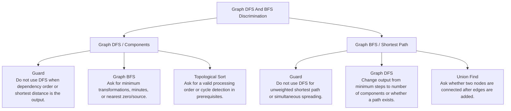

# Graph DFS And BFS Discrimination

Component ownership versus shortest-path or level expansion.

Study goal: recognize when this family is the winner, reject the nearest wrong alternatives, and know the smallest requirement change that would switch the pattern.

## Switch Map

## Problems

| Rank | Problem | Winner | Why winner | Near-miss mutation | Wrong-pattern guard | Java | LeetCode |
|---:|---|---|---|---|---|---|---|
| 18 | Number Of Islands | Graph DFS / Components | Without visited marking, the same land cells get counted repeatedly. | Graph BFS: Ask for minimum transformations, minutes, or nearest zero/source. Topological Sort: Ask for a valid processing order or cycle detection in prerequisites. | Do not use DFS when dependency order or shortest distance is the output. | [Java](../../src/main/java/org/chijai/day8/graph/session1/Islands.java) | [LC](https://leetcode.com/problems/number-of-islands/) |
| 21 | Word Ladder | Graph BFS / Shortest Path | DFS may find a longer path first; all transformations cost one step. | Graph DFS: Change output from minimum steps to number of components or whether a path exists. Union Find: Ask whether two nodes are connected after edges are added. | Do not use DFS for unweighted shortest path or simultaneous spreading. | [Java](../../src/main/java/org/chijai/day8/graph/session3/WordLadder.java) | [LC](https://leetcode.com/problems/word-ladder/) |
| 30 | Rotting Oranges | Graph BFS / Shortest Path | Starting BFS separately repeats infection work and gives wrong simultaneous timing. | Graph DFS: Change output from minimum steps to number of components or whether a path exists. Union Find: Ask whether two nodes are connected after edges are added. | Do not use DFS for unweighted shortest path or simultaneous spreading. | [Java](../../src/main/java/org/chijai/day8/graph/session1/RottenOranges.java) | [LC](https://leetcode.com/problems/rotting-oranges/) |
| 31 | 01 Matrix | Graph BFS / Shortest Path | Running BFS from every one repeats work; multi-source BFS expands all shortest distances together. | Graph DFS: Change output from minimum steps to number of components or whether a path exists. Union Find: Ask whether two nodes are connected after edges are added. | Do not use DFS for unweighted shortest path or simultaneous spreading. | [Java](../../src/main/java/org/chijai/day8/graph/session1/Matrix01.java) | [LC](https://leetcode.com/problems/01-matrix/) |
| 40 | Flood Fill | Graph DFS / Components | Blind DFS can recolor wrong regions or loop when new color equals old color. | Graph BFS: Ask for minimum transformations, minutes, or nearest zero/source. Topological Sort: Ask for a valid processing order or cycle detection in prerequisites. | Do not use DFS when dependency order or shortest distance is the output. | [Java](../../src/main/java/org/chijai/day8/graph/session1/FloodFill.java) | [LC](https://leetcode.com/problems/flood-fill/) |
| 41 | Is Graph Bipartite? | Graph DFS / Components | Visited alone is insufficient; conflicts appear when an edge sees same-color endpoints. | Graph BFS: Ask for minimum transformations, minutes, or nearest zero/source. Topological Sort: Ask for a valid processing order or cycle detection in prerequisites. | Do not use DFS when dependency order or shortest distance is the output. | [Java](../../src/main/java/org/chijai/day8/graph/session2/GraphBipartite.java) | [LC](https://leetcode.com/problems/is-graph-bipartite/) |
| 68 | Network Delay Time | Graph BFS / Shortest Path | Unweighted BFS is not valid with weighted edges; heap order settles shortest distances. | Graph DFS: Change output from minimum steps to number of components or whether a path exists. Union Find: Ask whether two nodes are connected after edges are added. | Do not use DFS for unweighted shortest path or simultaneous spreading. | [Java](../../src/main/java/org/chijai/day8/graph/session2/NetworkDelayTime.java) | [LC](https://leetcode.com/problems/network-delay-time/) |
| 69 | Pacific Atlantic Water Flow | Graph DFS / Components | DFS from every cell to both oceans repeats huge overlap. | Graph BFS: Ask for minimum transformations, minutes, or nearest zero/source. Topological Sort: Ask for a valid processing order or cycle detection in prerequisites. | Do not use DFS when dependency order or shortest distance is the output. | [Java](../../src/main/java/org/chijai/day8/graph/session1/Islands.java) | [LC](https://leetcode.com/problems/pacific-atlantic-water-flow/) |
| 70 | Surrounded Regions | Graph DFS / Components | Flipping every O before knowing border reachability captures safe regions incorrectly. | Graph BFS: Ask for minimum transformations, minutes, or nearest zero/source. Topological Sort: Ask for a valid processing order or cycle detection in prerequisites. | Do not use DFS when dependency order or shortest distance is the output. | [Java](../../src/main/java/org/chijai/day8/graph/session1/Islands.java) | [LC](https://leetcode.com/problems/surrounded-regions/) |
| 75 | Number Of Provinces | Graph BFS / Shortest Path | Checking pairs repeatedly is unnecessary once a city's component is visited. | Graph DFS: Change output from minimum steps to number of components or whether a path exists. Union Find: Ask whether two nodes are connected after edges are added. | Do not use DFS for unweighted shortest path or simultaneous spreading. | [Java](../../src/main/java/org/chijai/day8/graph/session1/Islands.java) | [LC](https://leetcode.com/problems/number-of-provinces/) |
| 76 | Clone Graph | Graph DFS / Components | Naive recursive copy loops on cycles and duplicates shared nodes. | Graph BFS: Ask for minimum transformations, minutes, or nearest zero/source. Topological Sort: Ask for a valid processing order or cycle detection in prerequisites. | Do not use DFS when dependency order or shortest distance is the output. | [Java](../../src/main/java/org/chijai/day8/graph/session2/CloneGraph.java) | [LC](https://leetcode.com/problems/clone-graph/) |
| 120 | K Highest Ranked Items Within A Price Range | Graph BFS / Shortest Path | DFS does not preserve shortest distance order in the grid. | Graph DFS: Change output from minimum steps to number of components or whether a path exists. Union Find: Ask whether two nodes are connected after edges are added. | Do not use DFS for unweighted shortest path or simultaneous spreading. | [Java](../../src/main/java/org/chijai/day8/graph/session3/KHighestRankedItemsWithinAPriceRange.java) | [LC](https://leetcode.com/problems/k-highest-ranked-items-within-a-price-range/) |
| 121 | Number Of Closed Islands | Graph DFS / Components | Counting components alone overcounts islands connected to the border. | Graph BFS: Ask for minimum transformations, minutes, or nearest zero/source. Topological Sort: Ask for a valid processing order or cycle detection in prerequisites. | Do not use DFS when dependency order or shortest distance is the output. | [Java](../../src/main/java/org/chijai/day8/graph/session1/Islands.java) | [LC](https://leetcode.com/problems/number-of-closed-islands/) |
| 122 | Max Area Of Island | Graph DFS / Components | Counting land globally ignores component boundaries. | Graph BFS: Ask for minimum transformations, minutes, or nearest zero/source. Topological Sort: Ask for a valid processing order or cycle detection in prerequisites. | Do not use DFS when dependency order or shortest distance is the output. | [Java](../../src/main/java/org/chijai/day8/graph/session1/Islands.java) | [LC](https://leetcode.com/problems/max-area-of-island/) |
| 123 | Graph Valid Tree | Graph DFS / Components | Brute force revisits states; visited DFS gives each component/path a single exploration. | Graph BFS: Ask for minimum transformations, minutes, or nearest zero/source. Topological Sort: Ask for a valid processing order or cycle detection in prerequisites. | Do not use DFS when dependency order or shortest distance is the output. | [Java](../../src/main/java/org/chijai/day8/graph/session2/GraphBipartite.java) | [LC](https://leetcode.com/problems/graph-valid-tree/) |
| 124 | Possible Bipartition | Graph DFS / Components | Brute force revisits states; visited DFS gives each component/path a single exploration. | Graph BFS: Ask for minimum transformations, minutes, or nearest zero/source. Topological Sort: Ask for a valid processing order or cycle detection in prerequisites. | Do not use DFS when dependency order or shortest distance is the output. | [Java](../../src/main/java/org/chijai/day8/graph/session2/GraphBipartite.java) | [LC](https://leetcode.com/problems/possible-bipartition/) |
| 125 | Redundant Connection | Graph DFS / Components | Brute force revisits states; visited DFS gives each component/path a single exploration. | Graph BFS: Ask for minimum transformations, minutes, or nearest zero/source. Topological Sort: Ask for a valid processing order or cycle detection in prerequisites. | Do not use DFS when dependency order or shortest distance is the output. | [Java](../../src/main/java/org/chijai/day8/graph/session2/GraphBipartite.java) | [LC](https://leetcode.com/problems/redundant-connection/) |
| 126 | Coloring A Border | Graph DFS / Components | Flood filling the whole component changes interior cells incorrectly. | Graph BFS: Ask for minimum transformations, minutes, or nearest zero/source. Topological Sort: Ask for a valid processing order or cycle detection in prerequisites. | Do not use DFS when dependency order or shortest distance is the output. | [Java](../../src/main/java/org/chijai/day8/graph/session1/ColoringABorder.java) | [LC](https://leetcode.com/problems/coloring-a-border/) |

## Drill

For each row, speak: required output -> structure -> constraint/workload -> winner -> why not nearest alternative -> minimal mutation -> new winner.

Rows in this file: 18