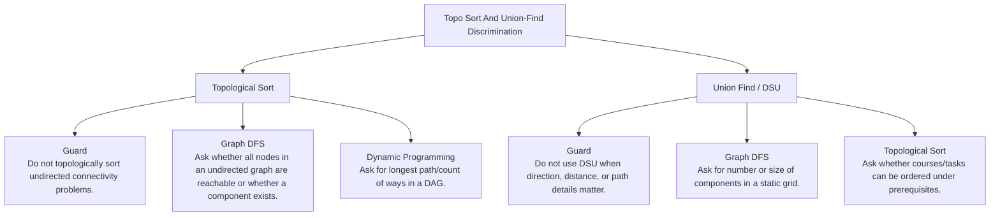

# Topo Sort And Union-Find Discrimination

Directed dependency unlocking versus undirected component merging.

Study goal: recognize when this family is the winner, reject the nearest wrong alternatives, and know the smallest requirement change that would switch the pattern.

## Switch Map

## Problems

| Rank | Problem | Winner | Why winner | Near-miss mutation | Wrong-pattern guard | Java | LeetCode |
|---:|---|---|---|---|---|---|---|
| 19 | Course Schedule | Topological Sort | Plain traversal can process a course before prerequisites; indegree is the remaining-lock count. | Graph DFS: Ask whether all nodes in an undirected graph are reachable or whether a component exists. Dynamic Programming: Ask for longest path/count of ways in a DAG. | Do not topologically sort undirected connectivity problems. | [Java](../../src/main/java/org/chijai/day8/graph/session2/CourseSchedule.java) | [LC](https://leetcode.com/problems/course-schedule/) |
| 20 | Course Schedule II | Topological Sort | Plain traversal can violate prerequisites; indegree tracks the remaining unmet prerequisites. | Graph DFS: Ask whether all nodes in an undirected graph are reachable or whether a component exists. Dynamic Programming: Ask for longest path/count of ways in a DAG. | Do not topologically sort undirected connectivity problems. | [Java](../../src/main/java/org/chijai/day8/graph/session2/CourseSchedule.java) | [LC](https://leetcode.com/problems/course-schedule-ii/) |
| 71 | Accounts Merge | Union Find / DSU | Repeated graph searches are expensive; union-find maintains components incrementally. | Graph DFS: Ask for number or size of components in a static grid. Topological Sort: Ask whether courses/tasks can be ordered under prerequisites. | Do not use DSU when direction, distance, or path details matter. | [Java](../../src/main/java/org/chijai/day8/graph/session3/AccountsMerge.java) | [LC](https://leetcode.com/problems/accounts-merge/) |
| 72 | Minimum Height Trees | Topological Sort | Trying every root is O(n^2); leaves can never be optimal centers after each layer. | Graph DFS: Ask whether all nodes in an undirected graph are reachable or whether a component exists. Dynamic Programming: Ask for longest path/count of ways in a DAG. | Do not topologically sort undirected connectivity problems. | [Java](../../src/main/java/org/chijai/day8/graph/session3/MinHTree.java) | [LC](https://leetcode.com/problems/minimum-height-trees/) |
| 147 | Parallel Courses | Topological Sort | Brute force dependency checks loop; topo processes nodes only when prerequisites are done. | Graph DFS: Ask whether all nodes in an undirected graph are reachable or whether a component exists. Dynamic Programming: Ask for longest path/count of ways in a DAG. | Do not topologically sort undirected connectivity problems. | [Java](../../src/main/java/org/chijai/day8/graph/session2/CourseSchedule.java) | [LC](https://leetcode.com/problems/parallel-courses/) |
| 148 | Alien Dictionary | Topological Sort | Brute force dependency checks loop; topo processes nodes only when prerequisites are done. | Graph DFS: Ask whether all nodes in an undirected graph are reachable or whether a component exists. Dynamic Programming: Ask for longest path/count of ways in a DAG. | Do not topologically sort undirected connectivity problems. | [Java](../../src/main/java/org/chijai/day8/graph/session2/CourseSchedule.java) | [LC](https://leetcode.com/problems/alien-dictionary/) |
| 149 | Find Eventual Safe States | Topological Sort | Brute force dependency checks loop; topo processes nodes only when prerequisites are done. | Graph DFS: Ask whether all nodes in an undirected graph are reachable or whether a component exists. Dynamic Programming: Ask for longest path/count of ways in a DAG. | Do not topologically sort undirected connectivity problems. | [Java](../../src/main/java/org/chijai/day8/graph/session2/CourseSchedule.java) | [LC](https://leetcode.com/problems/find-eventual-safe-states/) |
| 150 | Sequence Reconstruction | Topological Sort | Brute force dependency checks loop; topo processes nodes only when prerequisites are done. | Graph DFS: Ask whether all nodes in an undirected graph are reachable or whether a component exists. Dynamic Programming: Ask for longest path/count of ways in a DAG. | Do not topologically sort undirected connectivity problems. | [Java](../../src/main/java/org/chijai/day8/graph/session2/CourseSchedule.java) | [LC](https://leetcode.com/problems/sequence-reconstruction/) |
| 151 | Sort Items by Groups Respecting Dependencies | Topological Sort | Brute force dependency checks loop; topo processes nodes only when prerequisites are done. | Graph DFS: Ask whether all nodes in an undirected graph are reachable or whether a component exists. Dynamic Programming: Ask for longest path/count of ways in a DAG. | Do not topologically sort undirected connectivity problems. | [Java](../../src/main/java/org/chijai/day8/graph/session2/CourseSchedule.java) | [LC](https://leetcode.com/problems/sort-items-by-groups-respecting-dependencies/) |
| 197 | Course Schedule IV | Topological Sort | Brute force dependency checks loop; topo processes nodes only when prerequisites are done. | Graph DFS: Ask whether all nodes in an undirected graph are reachable or whether a component exists. Dynamic Programming: Ask for longest path/count of ways in a DAG. | Do not topologically sort undirected connectivity problems. | [Java](../../src/main/java/org/chijai/day8/graph/session2/CourseSchedule.java) | [LC](https://leetcode.com/problems/course-schedule-iv/) |

## Drill

For each row, speak: required output -> structure -> constraint/workload -> winner -> why not nearest alternative -> minimal mutation -> new winner.

Rows in this file: 10