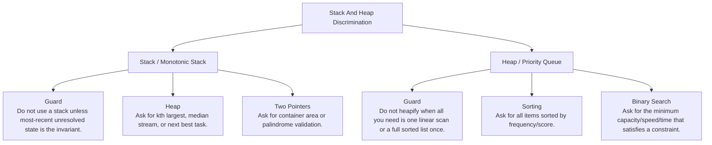

# Stack And Heap Discrimination

Most-recent unresolved candidate versus global priority frontier.

Study goal: recognize when this family is the winner, reject the nearest wrong alternatives, and know the smallest requirement change that would switch the pattern.

## Switch Map

## Problems

| Rank | Problem | Winner | Why winner | Near-miss mutation | Wrong-pattern guard | Java | LeetCode |
|---:|---|---|---|---|---|---|---|
| 11 | Merge K Sorted Lists | Heap / Priority Queue | Repeatedly scanning k heads costs O(kN); heap reduces selection to O(log k). | Linked List Pointers: Reduce k lists to exactly two sorted lists. Divide And Conquer: Ask for pairwise merging with recursion or no priority queue. | Do not label this as pure linked-list merge; the hard part is selecting the minimum among k heads. | [Java](../../src/main/java/org/chijai/day4/LinkedList/session4/MergeKSortedLists.java) | [LC](https://leetcode.com/problems/merge-k-sorted-lists/) |
| 35 | Valid Parentheses | Stack / Monotonic Stack | Counting brackets is not enough because nesting order matters. | Heap: Ask for kth largest, median stream, or next best task. Two Pointers: Ask for container area or palindrome validation. | Do not use a stack unless most-recent unresolved state is the invariant. | [Java](../../src/main/java/org/chijai/day5/stack/session3/ValidParentheses.java) | [LC](https://leetcode.com/problems/valid-parentheses/) |
| 36 | Top K Frequent Elements | Heap / Priority Queue | Sorting all unique values works but costs more than keeping a size-k heap or buckets. | Sorting: Ask for all items sorted by frequency/score. Binary Search: Ask for the minimum capacity/speed/time that satisfies a constraint. | Do not heapify when all you need is one linear scan or a full sorted list once. | [Java](../../src/main/java/org/chijai/day7/session1/heap/TopKFrequentElements.java) | [LC](https://leetcode.com/problems/top-k-frequent-elements/) |
| 37 | Daily Temperatures | Stack / Monotonic Stack | Scanning forward from every day is O(n^2); a decreasing stack resolves each day once. | Heap: Ask for kth largest, median stream, or next best task. Two Pointers: Ask for container area or palindrome validation. | Do not use a stack unless most-recent unresolved state is the invariant. | [Java](../../src/main/java/org/chijai/day5/stack/session1/monotonic/DailyTemperatures.java) | [LC](https://leetcode.com/problems/daily-temperatures/) |
| 38 | Meeting Rooms II | Heap / Priority Queue | Need the earliest finishing active meeting to decide whether a room can be reused. | Intervals / Sorting Greedy: Ask whether a person can attend all meetings. Sweep Line: Represent every start as +1 and every end as -1. | Do not stop at sorted intervals; minimum rooms requires tracking active end times. | [Java](../../src/main/java/org/chijai/day1/Arrays/session4/Intervals/IntervalActiveMinHeap.java) | [LC](https://leetcode.com/problems/meeting-rooms-ii/) |
| 49 | Find Median From Data Stream | Heap / Priority Queue | Sorting the stream after every insert is too slow. | Sorting: Ask for all items sorted by frequency/score. Binary Search: Ask for the minimum capacity/speed/time that satisfies a constraint. | Do not heapify when all you need is one linear scan or a full sorted list once. | [Java](../../src/main/java/org/chijai/day7/session1/heap/Median.java) | [LC](https://leetcode.com/problems/find-median-from-data-stream/) |
| 90 | Sliding Window Maximum | Stack / Monotonic Stack | Recomputing max for each window is O(nk); the deque removes dominated elements once. | Heap: Ask for kth largest, median stream, or next best task. Two Pointers: Ask for container area or palindrome validation. | Do not use a stack unless most-recent unresolved state is the invariant. | [Java](../../src/main/java/org/chijai/day5/stack/session2/StackQueue.java) | [LC](https://leetcode.com/problems/sliding-window-maximum/) |
| 95 | Task Scheduler | Heap / Priority Queue | Simulating every schedule is unnecessary; max frequency defines the minimum frame. | Sorting: Ask for all items sorted by frequency/score. Binary Search: Ask for the minimum capacity/speed/time that satisfies a constraint. | Do not heapify when all you need is one linear scan or a full sorted list once. | [Java](../../src/main/java/org/chijai/day7/session1/heap/TaskScheduler.java) | [LC](https://leetcode.com/problems/task-scheduler/) |
| 96 | Kth Largest Element In An Array | Heap / Priority Queue | Full sorting is O(n log n) when only one order statistic is needed. | Sorting: Ask for all items sorted by frequency/score. Binary Search: Ask for the minimum capacity/speed/time that satisfies a constraint. | Do not heapify when all you need is one linear scan or a full sorted list once. | [Java](../../src/main/java/org/chijai/day7/session1/heap/KthLargestInStream.java) | [LC](https://leetcode.com/problems/kth-largest-element-in-an-array/) |
| 97 | Kth Largest Element In A Stream | Heap / Priority Queue | Resorting all stream values after every add is too slow. | Sorting: Ask for all items sorted by frequency/score. Binary Search: Ask for the minimum capacity/speed/time that satisfies a constraint. | Do not heapify when all you need is one linear scan or a full sorted list once. | [Java](../../src/main/java/org/chijai/day7/session1/heap/KthLargestInStream.java) | [LC](https://leetcode.com/problems/kth-largest-element-in-a-stream/) |
| 100 | Next Greater Element II | Stack / Monotonic Stack | Naive circular scans repeat work; stack resolves each index when the next greater appears. | Heap: Ask for kth largest, median stream, or next best task. Two Pointers: Ask for container area or palindrome validation. | Do not use a stack unless most-recent unresolved state is the invariant. | [Java](../../src/main/java/org/chijai/day5/stack/session1/monotonic/NextGreaterElement.java) | [LC](https://leetcode.com/problems/next-greater-element-ii/) |
| 101 | Evaluate Reverse Polish Notation | Stack / Monotonic Stack | Parentheses/precedence disappear in RPN; the only state needed is operand stack. | Heap: Ask for kth largest, median stream, or next best task. Two Pointers: Ask for container area or palindrome validation. | Do not use a stack unless most-recent unresolved state is the invariant. | [Java](../../src/main/java/org/chijai/day5/stack/session3/EvalRPN.java) | [LC](https://leetcode.com/problems/evaluate-reverse-polish-notation/) |
| 103 | Basic Calculator | Stack / Monotonic Stack | Direct left-to-right evaluation breaks when parentheses change the active sign context. | Heap: Ask for kth largest, median stream, or next best task. Two Pointers: Ask for container area or palindrome validation. | Do not use a stack unless most-recent unresolved state is the invariant. | [Java](../../src/main/java/org/chijai/day5/stack/session3/BasicCalculator.java) | [LC](https://leetcode.com/problems/basic-calculator/) |
| 128 | Largest Rectangle | Stack / Monotonic Stack | Brute force searches previous/next matches; stack keeps unresolved candidates in useful order. | Heap: Ask for kth largest, median stream, or next best task. Two Pointers: Ask for container area or palindrome validation. | Do not use a stack unless most-recent unresolved state is the invariant. | [Java](../../src/main/java/org/chijai/day5/stack/session1/monotonic/LargestRectangle.java) | - |
| 129 | Min Stack | Stack / Monotonic Stack | Scanning stack on getMin makes the required O(1) operation impossible. | Heap: Ask for kth largest, median stream, or next best task. Two Pointers: Ask for container area or palindrome validation. | Do not use a stack unless most-recent unresolved state is the invariant. | [Java](../../src/main/java/org/chijai/day5/stack/session2/MinStackDesign.java) | [LC](https://leetcode.com/problems/min-stack/) |
| 130 | Max Stack | Stack / Monotonic Stack | A plain stack gives pop order but cannot remove max efficiently. | Heap: Ask for kth largest, median stream, or next best task. Two Pointers: Ask for container area or palindrome validation. | Do not use a stack unless most-recent unresolved state is the invariant. | [Java](../../src/main/java/org/chijai/day5/stack/session2/MinStackDesign.java) | [LC](https://leetcode.com/problems/max-stack/) |
| 131 | Implement Queue Using Stacks | Stack / Monotonic Stack | Moving elements on every operation repeats work; lazy transfer amortizes the reversal. | Heap: Ask for kth largest, median stream, or next best task. Two Pointers: Ask for container area or palindrome validation. | Do not use a stack unless most-recent unresolved state is the invariant. | [Java](../../src/main/java/org/chijai/day5/stack/session2/StackQueue.java) | [LC](https://leetcode.com/problems/implement-queue-using-stacks/) |
| 132 | Implement Stack Using Queues | Stack / Monotonic Stack | Queue order is FIFO; rotation restores LIFO behavior. | Heap: Ask for kth largest, median stream, or next best task. Two Pointers: Ask for container area or palindrome validation. | Do not use a stack unless most-recent unresolved state is the invariant. | [Java](../../src/main/java/org/chijai/day5/stack/session2/StackQueue.java) | [LC](https://leetcode.com/problems/implement-stack-using-queues/) |
| 133 | Next Greater Element I | Stack / Monotonic Stack | Searching nums2 for every nums1 value repeats the same next-greater work. | Heap: Ask for kth largest, median stream, or next best task. Two Pointers: Ask for container area or palindrome validation. | Do not use a stack unless most-recent unresolved state is the invariant. | [Java](../../src/main/java/org/chijai/day5/stack/session2/MinStackDesign.java) | [LC](https://leetcode.com/problems/next-greater-element-i/) |
| 134 | Online Stock Span | Stack / Monotonic Stack | Scanning backward repeats work; collapsed spans let each price enter and leave once. | Heap: Ask for kth largest, median stream, or next best task. Two Pointers: Ask for container area or palindrome validation. | Do not use a stack unless most-recent unresolved state is the invariant. | [Java](../../src/main/java/org/chijai/day5/stack/session2/MinStackDesign.java) | [LC](https://leetcode.com/problems/online-stock-span/) |
| 135 | K Closest Points To Origin | Heap / Priority Queue | Sorting all points is unnecessary when only k closest are needed. | Sorting: Ask for all items sorted by frequency/score. Binary Search: Ask for the minimum capacity/speed/time that satisfies a constraint. | Do not heapify when all you need is one linear scan or a full sorted list once. | [Java](../../src/main/java/org/chijai/day7/session1/heap/KClosestPointsToOrigin.java) | [LC](https://leetcode.com/problems/k-closest-points-to-origin/) |
| 136 | Top K Frequent Words | Heap / Priority Queue | Sorting everything is wasteful; a heap keeps only the next best or top K frontier. | Sorting: Ask for all items sorted by frequency/score. Binary Search: Ask for the minimum capacity/speed/time that satisfies a constraint. | Do not heapify when all you need is one linear scan or a full sorted list once. | [Java](../../src/main/java/org/chijai/day7/session1/heap/TopKFrequentElements.java) | [LC](https://leetcode.com/problems/top-k-frequent-words/) |
| 137 | H-Index | Heap / Priority Queue | Sorting everything is wasteful; a heap keeps only the next best or top K frontier. | Sorting: Ask for all items sorted by frequency/score. Binary Search: Ask for the minimum capacity/speed/time that satisfies a constraint. | Do not heapify when all you need is one linear scan or a full sorted list once. | [Java](../../src/main/java/org/chijai/day7/session1/heap/TopKFrequentElements.java) | [LC](https://leetcode.com/problems/h-index/) |
| 138 | Sort Characters By Frequency | Heap / Priority Queue | Comparator sorting every character occurrence is wasteful; sort unique chars by counts. | Sorting: Ask for all items sorted by frequency/score. Binary Search: Ask for the minimum capacity/speed/time that satisfies a constraint. | Do not heapify when all you need is one linear scan or a full sorted list once. | [Java](../../src/main/java/org/chijai/day7/session1/heap/TopKFrequentElements.java) | [LC](https://leetcode.com/problems/sort-characters-by-frequency/) |
| 154 | Design A Stack With Increment Operation | Stack / Monotonic Stack | Incrementing bottom k elements directly makes increment O(k). | Heap: Ask for kth largest, median stream, or next best task. Two Pointers: Ask for container area or palindrome validation. | Do not use a stack unless most-recent unresolved state is the invariant. | [Java](../../src/main/java/org/chijai/day5/stack/session2/MinStackDesign.java) | [LC](https://leetcode.com/problems/design-a-stack-with-increment-operation/) |
| 188 | Award Top K Hotels | Heap / Priority Queue | Repeated text scans and full sorting can be avoided with maps and top-k selection. | Sorting: Ask for all items sorted by frequency/score. Binary Search: Ask for the minimum capacity/speed/time that satisfies a constraint. | Do not heapify when all you need is one linear scan or a full sorted list once. | [Java](../../src/main/java/org/chijai/day7/session1/heap/AwardTopKHotels.java) | - |

## Drill

For each row, speak: required output -> structure -> constraint/workload -> winner -> why not nearest alternative -> minimal mutation -> new winner.

Rows in this file: 26