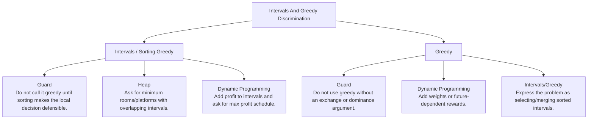

# Intervals And Greedy Discrimination

Sorted interval decisions, local-choice proof, and weighted-counterexample boundaries.

Study goal: recognize when this family is the winner, reject the nearest wrong alternatives, and know the smallest requirement change that would switch the pattern.

## Switch Map

## Problems

| Rank | Problem | Winner | Why winner | Near-miss reasoning | Wrong-pattern guard | Java | LeetCode |
|---:|---|---|---|---|---|---|---|
| 42 | Minimum Number Of Arrows To Burst Balloons | Intervals / Sorting Greedy | This is greedy endpoint selection, not overlap counting like meeting rooms. | Heap: Why not now - Greedy endpoint selection works when one sorted pass makes the choice safe.; Missing - Need active interval with earliest finishing resource.; Minimal change - Ask for minimum rooms/platforms with overlapping intervals.; Now works - A min-heap of end times represents currently occupied resources. Dynamic Programming: Why not now - Greedy fails when local choice can block a better weighted future.; Missing - Weights/profits or incompatible choices requiring optimal value.; Minimal change - Add profit to intervals and ask for max profit schedule.; Now works - Choosing or skipping an interval creates repeated optimal subproblems. | Do not call it greedy until sorting makes the local decision defensible. | [Java](../../src/main/java/org/chijai/day1/Arrays/session4/Intervals/IntervalGreedyByEnd.java) | [LC](https://leetcode.com/problems/minimum-number-of-arrows-to-burst-balloons/) |
| 72 | Best Time to Buy and Sell Stock | Greedy | Trying all buy/sell pairs repeats the same prefix minimum search. | Dynamic Programming: Why not now - No table is needed; all previous days collapse to the cheapest buy so far.; Missing - Multiple transactions, cooldown, fee, or transaction count state.; Minimal change - Allow at most k transactions or add cooldown/fee.; Now works - Hold/cash or transaction-layer state becomes necessary. Two Pointers: Why not now - The two days are ordered by time, not a sorted value array with eliminable ends.; Missing - Sorted values and a target relation.; Minimal change - Ask for two sorted prices that sum to target.; Now works - Left/right movement can discard impossible sums. | Do not allocate DP state; one running minimum is the whole legal buy history. | [Java](../../src/main/java/org/chijai/day1/Arrays/session3/StockSeries1.java) | [LC](https://leetcode.com/problems/best-time-to-buy-and-sell-stock/) |
| 76 | Gas Station | Greedy | Trying every start repeats failed prefixes; greedy skips the whole impossible range. | Dynamic Programming: Why not now - No repeated subproblem needs caching; a failed tank invalidates a whole candidate range.; Missing - Independent choices whose future values must be compared.; Minimal change - Ask for maximum profit route with rewards/costs and optional skips.; Now works - Choose/skip states become real and repeated. Prefix Sum: Why not now - Prefix sums expose total feasibility but not the candidate reset rule.; Missing - Only range balance queries, not a start index after failure.; Minimal change - Ask many net-gas range sum queries.; Now works - Cumulative net answers each range in O(1). | Do not call this DP; prefix failure eliminates whole start ranges without cached states. | [Java](../../src/main/java/org/chijai/day9/dp/session1/GasStation.java) | [LC](https://leetcode.com/problems/gas-station/) |
| 78 | Jump Game | Greedy | DP reachability is unnecessary; farthest reach dominates all earlier reachable choices. | Dynamic Programming: Why not now - Reachability states collapse to one farthest reachable index.; Missing - Need minimum jumps or path reconstruction.; Minimal change - Ask for the minimum number of jumps.; Now works - Layered greedy/BFS-style ranges or DP must distinguish jump counts. Backtracking: Why not now - Trying jumps enumerates many dominated paths.; Missing - Need to list all valid jump sequences.; Minimal change - Ask to output every path from start to end.; Now works - The concrete path becomes the answer. | Do not build a reachability DP table when one farthest reachable index proves the answer. | [Java](../../src/main/java/org/chijai/day9/dp/session1/GasStation.java) | [LC](https://leetcode.com/problems/jump-game/) |
| 80 | Best Time to Buy and Sell Stock II | Greedy | State-machine DP collapses because every rising edge is independently safe to take. | Dynamic Programming: Why not now - Hold/cash DP collapses because unlimited transactions let every positive edge be taken.; Missing - Constraint that couples today's sell to tomorrow's buy.; Minimal change - Add cooldown, fee, or at most k transactions.; Now works - State must remember hold/cash/cooldown or remaining transactions. Single Transaction Running Min: Why not now - One min-buy is too restrictive when multiple profitable rises are allowed.; Missing - At most one buy/sell pair.; Minimal change - Allow only one transaction.; Now works - Best sell today only needs the minimum earlier price. | Do not use stock DP unless a fee, cooldown, or transaction limit couples choices. | [Java](../../src/main/java/org/chijai/day1/Arrays/session3/StockSeries1.java) | [LC](https://leetcode.com/problems/best-time-to-buy-and-sell-stock-ii/) |
| 92 | Meeting Rooms | Intervals / Sorting Greedy | Unsorted pair checks are noisy; sorting makes the only dangerous interval the previous one. | Heap: Why not now - No need to track all active meetings when the output is only conflict existence.; Missing - Minimum number of simultaneous rooms/resources.; Minimal change - Ask for minimum meeting rooms.; Now works - Earliest finishing active meeting determines room reuse. Sweep Line: Why not now - Event counting is overkill for a yes/no overlap check.; Missing - Need maximum overlap count.; Minimal change - Ask for the maximum number of concurrent meetings.; Now works - Peak event balance gives overlap count. | Do not heap this unless the output asks for room count or active resources. | [Java](../../src/main/java/org/chijai/day1/Arrays/session4/Intervals/IntervalSortByStart.java) | [LC](https://leetcode.com/problems/meeting-rooms/) |
| 142 | Insert Interval | Intervals / Sorting Greedy | Unsorted comparisons are noisy; sorting makes overlap or greedy choice local. | Heap: Why not now - Greedy endpoint selection works when one sorted pass makes the choice safe.; Missing - Need active interval with earliest finishing resource.; Minimal change - Ask for minimum rooms/platforms with overlapping intervals.; Now works - A min-heap of end times represents currently occupied resources. Dynamic Programming: Why not now - Greedy fails when local choice can block a better weighted future.; Missing - Weights/profits or incompatible choices requiring optimal value.; Minimal change - Add profit to intervals and ask for max profit schedule.; Now works - Choosing or skipping an interval creates repeated optimal subproblems. | Do not call it greedy until sorting makes the local decision defensible. | [Java](../../src/main/java/org/chijai/day1/Arrays/session4/Intervals/IntervalSortByStart.java) | [LC](https://leetcode.com/problems/insert-interval/) |
| 143 | Merge Intervals | Intervals / Sorting Greedy | Unsorted comparisons are noisy; sorting makes overlap or greedy choice local. | Heap: Why not now - Greedy endpoint selection works when one sorted pass makes the choice safe.; Missing - Need active interval with earliest finishing resource.; Minimal change - Ask for minimum rooms/platforms with overlapping intervals.; Now works - A min-heap of end times represents currently occupied resources. Dynamic Programming: Why not now - Greedy fails when local choice can block a better weighted future.; Missing - Weights/profits or incompatible choices requiring optimal value.; Minimal change - Add profit to intervals and ask for max profit schedule.; Now works - Choosing or skipping an interval creates repeated optimal subproblems. | Do not call it greedy until sorting makes the local decision defensible. | [Java](../../src/main/java/org/chijai/day1/Arrays/session4/Intervals/IntervalSortByStart.java) | [LC](https://leetcode.com/problems/merge-intervals/) |
| 144 | Non Overlapping Intervals | Intervals / Sorting Greedy | Unsorted comparisons are noisy; sorting makes overlap or greedy choice local. | Heap: Why not now - Greedy endpoint selection works when one sorted pass makes the choice safe.; Missing - Need active interval with earliest finishing resource.; Minimal change - Ask for minimum rooms/platforms with overlapping intervals.; Now works - A min-heap of end times represents currently occupied resources. Dynamic Programming: Why not now - Greedy fails when local choice can block a better weighted future.; Missing - Weights/profits or incompatible choices requiring optimal value.; Minimal change - Add profit to intervals and ask for max profit schedule.; Now works - Choosing or skipping an interval creates repeated optimal subproblems. | Do not call it greedy until sorting makes the local decision defensible. | [Java](../../src/main/java/org/chijai/day1/Arrays/session4/Intervals/IntervalGreedyByEnd.java) | [LC](https://leetcode.com/problems/non-overlapping-intervals/) |
| 145 | Partition Labels | Intervals / Sorting Greedy | Brute force checks future conflicts repeatedly; last-occurrence boundaries reveal exactly when a safe partition can close. | Heap: Why not now - Greedy endpoint selection works when one sorted pass makes the choice safe.; Missing - Need active interval with earliest finishing resource.; Minimal change - Ask for minimum rooms/platforms with overlapping intervals.; Now works - A min-heap of end times represents currently occupied resources. Dynamic Programming: Why not now - Greedy fails when local choice can block a better weighted future.; Missing - Weights/profits or incompatible choices requiring optimal value.; Minimal change - Add profit to intervals and ask for max profit schedule.; Now works - Choosing or skipping an interval creates repeated optimal subproblems. | Do not call it greedy until sorting makes the local decision defensible. | [Java](../../src/main/java/org/chijai/day10/session2/CountUniqueChars.java) | [LC](https://leetcode.com/problems/partition-labels/) |
| 206 | Maximum Length of Pair Chain | Intervals / Sorting Greedy | LIS-style DP works, but earliest finishing pair leaves maximum room for the future. | Dynamic Programming: Why not now - DP works, but earliest end has an exchange proof and avoids O(n^2).; Missing - Weights/profits or non-greedy compatibility.; Minimal change - Add profit to every pair and ask maximum profit chain.; Now works - Choosing fewer intervals can earn more, so choose/skip DP is needed. LIS: Why not now - Pair compatibility is interval-like; sorting by end directly proves the next safe choice.; Missing - One-dimensional increasing sequence after sorting.; Minimal change - Ask for longest increasing subsequence of numbers.; Now works - Previous smaller value extension becomes the natural state. | Do not default to LIS DP; earliest finishing pair has the greedy exchange proof. | [Java](../../src/main/java/org/chijai/day9/dp/session2/LIS.java) | [LC](https://leetcode.com/problems/maximum-length-of-pair-chain/) |

## Drill

For each row, speak: required output -> structure -> constraint/workload -> winner -> why not nearest alternative -> minimal mutation -> new winner.

Rows in this file: 11