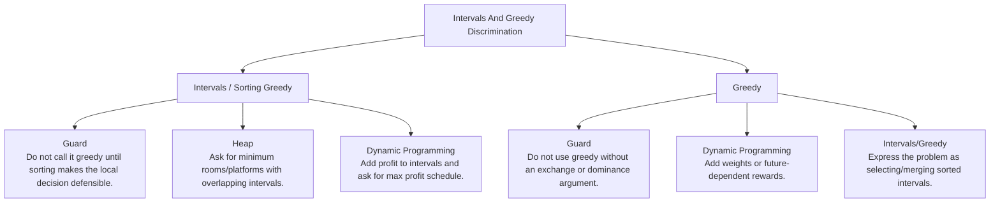

# Intervals And Greedy Discrimination

Sorted interval decisions, local-choice proof, and weighted-counterexample boundaries.

Study goal: recognize when this family is the winner, reject the nearest wrong alternatives, and know the smallest requirement change that would switch the pattern.

## Switch Map

## Problems

| Rank | Problem | Winner | Why winner | Near-miss mutation | Wrong-pattern guard | Java | LeetCode |
|---:|---|---|---|---|---|---|---|
| 42 | Minimum Number Of Arrows To Burst Balloons | Intervals / Sorting Greedy | This is greedy endpoint selection, not overlap counting like meeting rooms. | Heap: Ask for minimum rooms/platforms with overlapping intervals. Dynamic Programming: Add profit to intervals and ask for max profit schedule. | Do not call it greedy until sorting makes the local decision defensible. | [Java](../../src/main/java/org/chijai/day1/Arrays/session4/Intervals/IntervalGreedyByEnd.java) | [LC](https://leetcode.com/problems/minimum-number-of-arrows-to-burst-balloons/) |
| 89 | Meeting Rooms | Intervals / Sorting Greedy | Unsorted pair checks are noisy; sorting makes the only dangerous interval the previous one. | Heap: Ask for minimum meeting rooms. Sweep Line: Ask for the maximum number of concurrent meetings. | Do not heap this unless the output asks for room count or active resources. | [Java](../../src/main/java/org/chijai/day1/Arrays/session4/Intervals/IntervalSortByStart.java) | [LC](https://leetcode.com/problems/meeting-rooms/) |
| 139 | Insert Interval | Intervals / Sorting Greedy | Unsorted comparisons are noisy; sorting makes overlap or greedy choice local. | Heap: Ask for minimum rooms/platforms with overlapping intervals. Dynamic Programming: Add profit to intervals and ask for max profit schedule. | Do not call it greedy until sorting makes the local decision defensible. | [Java](../../src/main/java/org/chijai/day1/Arrays/session4/Intervals/IntervalSortByStart.java) | [LC](https://leetcode.com/problems/insert-interval/) |
| 140 | Merge Intervals | Intervals / Sorting Greedy | Unsorted comparisons are noisy; sorting makes overlap or greedy choice local. | Heap: Ask for minimum rooms/platforms with overlapping intervals. Dynamic Programming: Add profit to intervals and ask for max profit schedule. | Do not call it greedy until sorting makes the local decision defensible. | [Java](../../src/main/java/org/chijai/day1/Arrays/session4/Intervals/IntervalSortByStart.java) | [LC](https://leetcode.com/problems/merge-intervals/) |
| 141 | Non Overlapping Intervals | Intervals / Sorting Greedy | Unsorted comparisons are noisy; sorting makes overlap or greedy choice local. | Heap: Ask for minimum rooms/platforms with overlapping intervals. Dynamic Programming: Add profit to intervals and ask for max profit schedule. | Do not call it greedy until sorting makes the local decision defensible. | [Java](../../src/main/java/org/chijai/day1/Arrays/session4/Intervals/IntervalGreedyByEnd.java) | [LC](https://leetcode.com/problems/non-overlapping-intervals/) |
| 142 | Partition Labels | Intervals / Sorting Greedy | Brute force checks future conflicts repeatedly; last-occurrence boundaries reveal exactly when a safe partition can close. | Heap: Ask for minimum rooms/platforms with overlapping intervals. Dynamic Programming: Add profit to intervals and ask for max profit schedule. | Do not call it greedy until sorting makes the local decision defensible. | [Java](../../src/main/java/org/chijai/day10/session2/CountUniqueChars.java) | [LC](https://leetcode.com/problems/partition-labels/) |

## Drill

For each row, speak: required output -> structure -> constraint/workload -> winner -> why not nearest alternative -> minimal mutation -> new winner.

Rows in this file: 6