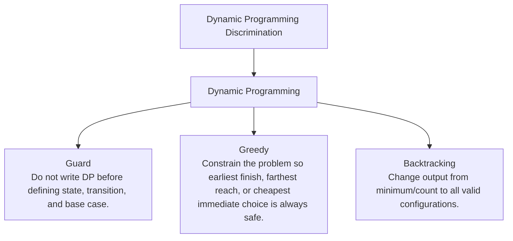

# Dynamic Programming Discrimination

Repeated states plus choices: state, transition, base case, fill order.

Study goal: recognize when this family is the winner, reject the nearest wrong alternatives, and know the smallest requirement change that would switch the pattern.

## Switch Map

## Problems

| Rank | Problem | Winner | Why winner | Near-miss mutation | Wrong-pattern guard | Java | LeetCode |
|---:|---|---|---|---|---|---|---|
| 32 | House Robber | Dynamic Programming | Naive recursion repeats suffix decisions; two rolling states capture all history needed. | Greedy: Constrain the problem so earliest finish, farthest reach, or cheapest immediate choice is always safe. Backtracking: Change output from minimum/count to all valid configurations. | Do not write DP before defining state, transition, and base case. | [Java](../../src/main/java/org/chijai/day9/dp/session1/HouseRobber.java) | [LC](https://leetcode.com/problems/house-robber/) |
| 33 | Coin Change | Dynamic Programming | Recursive choice tree repeats the same remaining amounts. | Greedy: Constrain the problem so earliest finish, farthest reach, or cheapest immediate choice is always safe. Backtracking: Change output from minimum/count to all valid configurations. | Do not write DP before defining state, transition, and base case. | [Java](../../src/main/java/org/chijai/day9/dp/session2/CoinChange.java) | [LC](https://leetcode.com/problems/coin-change/) |
| 43 | Unique Paths | Dynamic Programming | Naive recursion recomputes the same grid cells exponentially. | Greedy: Constrain the problem so earliest finish, farthest reach, or cheapest immediate choice is always safe. Backtracking: Change output from minimum/count to all valid configurations. | Do not write DP before defining state, transition, and base case. | [Java](../../src/main/java/org/chijai/day9/dp/session1/UniquePaths.java) | [LC](https://leetcode.com/problems/unique-paths/) |
| 44 | Partition Equal Subset Sum | Dynamic Programming | Trying all subsets repeats sums; 0/1 knapsack tracks reachable sums once. | Greedy: Constrain the problem so earliest finish, farthest reach, or cheapest immediate choice is always safe. Backtracking: Change output from minimum/count to all valid configurations. | Do not write DP before defining state, transition, and base case. | [Java](../../src/main/java/org/chijai/day9/dp/session2/PartitionEqualSubsetSum.java) | [LC](https://leetcode.com/problems/partition-equal-subset-sum/) |
| 45 | Longest Increasing Subsequence | Dynamic Programming | O(n^2) DP works, but binary-search tails gives faster length tracking. | Greedy: Constrain the problem so earliest finish, farthest reach, or cheapest immediate choice is always safe. Backtracking: Change output from minimum/count to all valid configurations. | Do not write DP before defining state, transition, and base case. | [Java](../../src/main/java/org/chijai/day9/dp/session2/LIS.java) | [LC](https://leetcode.com/problems/longest-increasing-subsequence/) |
| 83 | Maximum Profit In Job Scheduling | Dynamic Programming | Trying all subsets repeats compatibility checks; DP plus sorted end times reuses optimal prefixes. | Greedy: Constrain the problem so earliest finish, farthest reach, or cheapest immediate choice is always safe. Backtracking: Change output from minimum/count to all valid configurations. | Do not write DP before defining state, transition, and base case. | [Java](../../src/main/java/org/chijai/day2/session3/MaximumProfitInJobScheduling.java) | [LC](https://leetcode.com/problems/maximum-profit-in-job-scheduling/) |
| 84 | Kadane Max Sub Array | Dynamic Programming | Checking all subarrays is O(n^2); local ending-best captures the only needed history. | Greedy: Constrain the problem so earliest finish, farthest reach, or cheapest immediate choice is always safe. Backtracking: Change output from minimum/count to all valid configurations. | Do not write DP before defining state, transition, and base case. | [Java](../../src/main/java/org/chijai/day9/dp/session1/KadaneMaxSubArray.java) | - |
| 85 | Best Time to Buy and Sell Stock | Dynamic Programming | Trying all buy/sell pairs repeats the same prefix minimum search. | Greedy: Constrain the problem so earliest finish, farthest reach, or cheapest immediate choice is always safe. Backtracking: Change output from minimum/count to all valid configurations. | Do not write DP before defining state, transition, and base case. | [Java](../../src/main/java/org/chijai/day1/Arrays/session3/StockSeries1.java) | [LC](https://leetcode.com/problems/best-time-to-buy-and-sell-stock/) |
| 165 | Climbing Stairs Fib | Dynamic Programming | Recursive Fibonacci repeats the same smaller step counts. | Greedy: Constrain the problem so earliest finish, farthest reach, or cheapest immediate choice is always safe. Backtracking: Change output from minimum/count to all valid configurations. | Do not write DP before defining state, transition, and base case. | [Java](../../src/main/java/org/chijai/day9/dp/session1/ClimbingStairsFib.java) | - |
| 166 | Gas Station | Dynamic Programming | Naive recursion repeats states; DP caches each state and reuses transitions. | Greedy: Constrain the problem so earliest finish, farthest reach, or cheapest immediate choice is always safe. Backtracking: Change output from minimum/count to all valid configurations. | Do not write DP before defining state, transition, and base case. | [Java](../../src/main/java/org/chijai/day9/dp/session1/GasStation.java) | [LC](https://leetcode.com/problems/gas-station/) |
| 167 | Edit Distance | Dynamic Programming | Naive recursion branches into insert/delete/replace repeatedly for same prefixes. | Greedy: Constrain the problem so earliest finish, farthest reach, or cheapest immediate choice is always safe. Backtracking: Change output from minimum/count to all valid configurations. | Do not write DP before defining state, transition, and base case. | [Java](../../src/main/java/org/chijai/day9/dp/session2/EditDistance.java) | [LC](https://leetcode.com/problems/edit-distance/) |
| 168 | Best Time to Buy and Sell Stock with Cooldown | Dynamic Programming | Naive recursion repeats states; DP caches each state and reuses transitions. | Greedy: Constrain the problem so earliest finish, farthest reach, or cheapest immediate choice is always safe. Backtracking: Change output from minimum/count to all valid configurations. | Do not write DP before defining state, transition, and base case. | [Java](../../src/main/java/org/chijai/day1/Arrays/session3/StockSeries1.java) | [LC](https://leetcode.com/problems/best-time-to-buy-and-sell-stock-with-cooldown/) |
| 169 | Best Time to Buy and Sell Stock with Transaction Fee | Dynamic Programming | Naive recursion repeats states; DP caches each state and reuses transitions. | Greedy: Constrain the problem so earliest finish, farthest reach, or cheapest immediate choice is always safe. Backtracking: Change output from minimum/count to all valid configurations. | Do not write DP before defining state, transition, and base case. | [Java](../../src/main/java/org/chijai/day1/Arrays/session3/StockSeries1.java) | [LC](https://leetcode.com/problems/best-time-to-buy-and-sell-stock-with-transaction-fee/) |
| 170 | Jump Game | Dynamic Programming | Naive recursion repeats states; DP caches each state and reuses transitions. | Greedy: Constrain the problem so earliest finish, farthest reach, or cheapest immediate choice is always safe. Backtracking: Change output from minimum/count to all valid configurations. | Do not write DP before defining state, transition, and base case. | [Java](../../src/main/java/org/chijai/day9/dp/session1/GasStation.java) | [LC](https://leetcode.com/problems/jump-game/) |
| 171 | Climbing Stairs | Dynamic Programming | Naive recursion repeats states; DP caches each state and reuses transitions. | Greedy: Constrain the problem so earliest finish, farthest reach, or cheapest immediate choice is always safe. Backtracking: Change output from minimum/count to all valid configurations. | Do not write DP before defining state, transition, and base case. | [Java](../../src/main/java/org/chijai/day9/dp/session2/CoinChange.java) | [LC](https://leetcode.com/problems/climbing-stairs/) |
| 172 | Min Cost Climbing Stairs | Dynamic Programming | Naive recursion repeats states; DP caches each state and reuses transitions. | Greedy: Constrain the problem so earliest finish, farthest reach, or cheapest immediate choice is always safe. Backtracking: Change output from minimum/count to all valid configurations. | Do not write DP before defining state, transition, and base case. | [Java](../../src/main/java/org/chijai/day9/dp/session2/CoinChange.java) | [LC](https://leetcode.com/problems/min-cost-climbing-stairs/) |
| 173 | Perfect Squares | Dynamic Programming | Naive recursion repeats states; DP caches each state and reuses transitions. | Greedy: Constrain the problem so earliest finish, farthest reach, or cheapest immediate choice is always safe. Backtracking: Change output from minimum/count to all valid configurations. | Do not write DP before defining state, transition, and base case. | [Java](../../src/main/java/org/chijai/day9/dp/session2/CoinChange.java) | [LC](https://leetcode.com/problems/perfect-squares/) |
| 174 | Word Break | Dynamic Programming | Naive recursion repeats states; DP caches each state and reuses transitions. | Greedy: Constrain the problem so earliest finish, farthest reach, or cheapest immediate choice is always safe. Backtracking: Change output from minimum/count to all valid configurations. | Do not write DP before defining state, transition, and base case. | [Java](../../src/main/java/org/chijai/day9/dp/session2/CoinChange.java) | [LC](https://leetcode.com/problems/word-break/) |
| 175 | Delete Operation for Two Strings | Dynamic Programming | Naive recursion repeats states; DP caches each state and reuses transitions. | Greedy: Constrain the problem so earliest finish, farthest reach, or cheapest immediate choice is always safe. Backtracking: Change output from minimum/count to all valid configurations. | Do not write DP before defining state, transition, and base case. | [Java](../../src/main/java/org/chijai/day9/dp/session2/EditDistance.java) | [LC](https://leetcode.com/problems/delete-operation-for-two-strings/) |
| 176 | Distinct Subsequences | Dynamic Programming | Naive recursion repeats states; DP caches each state and reuses transitions. | Greedy: Constrain the problem so earliest finish, farthest reach, or cheapest immediate choice is always safe. Backtracking: Change output from minimum/count to all valid configurations. | Do not write DP before defining state, transition, and base case. | [Java](../../src/main/java/org/chijai/day9/dp/session2/EditDistance.java) | [LC](https://leetcode.com/problems/distinct-subsequences/) |
| 177 | Interleaving String | Dynamic Programming | Naive recursion repeats states; DP caches each state and reuses transitions. | Greedy: Constrain the problem so earliest finish, farthest reach, or cheapest immediate choice is always safe. Backtracking: Change output from minimum/count to all valid configurations. | Do not write DP before defining state, transition, and base case. | [Java](../../src/main/java/org/chijai/day9/dp/session2/EditDistance.java) | [LC](https://leetcode.com/problems/interleaving-string/) |
| 178 | Longest Common Subsequence | Dynamic Programming | Naive recursion repeats states; DP caches each state and reuses transitions. | Greedy: Constrain the problem so earliest finish, farthest reach, or cheapest immediate choice is always safe. Backtracking: Change output from minimum/count to all valid configurations. | Do not write DP before defining state, transition, and base case. | [Java](../../src/main/java/org/chijai/day9/dp/session2/EditDistance.java) | [LC](https://leetcode.com/problems/longest-common-subsequence/) |
| 179 | Longest Palindromic Subsequence | Dynamic Programming | Naive recursion repeats states; DP caches each state and reuses transitions. | Greedy: Constrain the problem so earliest finish, farthest reach, or cheapest immediate choice is always safe. Backtracking: Change output from minimum/count to all valid configurations. | Do not write DP before defining state, transition, and base case. | [Java](../../src/main/java/org/chijai/day9/dp/session2/EditDistance.java) | [LC](https://leetcode.com/problems/longest-palindromic-subsequence/) |
| 180 | Minimum ASCII Delete Sum for Two Strings | Dynamic Programming | Naive recursion repeats states; DP caches each state and reuses transitions. | Greedy: Constrain the problem so earliest finish, farthest reach, or cheapest immediate choice is always safe. Backtracking: Change output from minimum/count to all valid configurations. | Do not write DP before defining state, transition, and base case. | [Java](../../src/main/java/org/chijai/day9/dp/session2/EditDistance.java) | [LC](https://leetcode.com/problems/minimum-ascii-delete-sum-for-two-strings/) |
| 181 | Longest Continuous Increasing Subsequence | Dynamic Programming | Naive recursion repeats states; DP caches each state and reuses transitions. | Greedy: Constrain the problem so earliest finish, farthest reach, or cheapest immediate choice is always safe. Backtracking: Change output from minimum/count to all valid configurations. | Do not write DP before defining state, transition, and base case. | [Java](../../src/main/java/org/chijai/day9/dp/session2/LIS.java) | [LC](https://leetcode.com/problems/longest-continuous-increasing-subsequence/) |
| 182 | Maximum Length of Pair Chain | Dynamic Programming | Naive recursion repeats states; DP caches each state and reuses transitions. | Greedy: Constrain the problem so earliest finish, farthest reach, or cheapest immediate choice is always safe. Backtracking: Change output from minimum/count to all valid configurations. | Do not write DP before defining state, transition, and base case. | [Java](../../src/main/java/org/chijai/day9/dp/session2/LIS.java) | [LC](https://leetcode.com/problems/maximum-length-of-pair-chain/) |
| 183 | Number of Longest Increasing Subsequence | Dynamic Programming | Naive recursion repeats states; DP caches each state and reuses transitions. | Greedy: Constrain the problem so earliest finish, farthest reach, or cheapest immediate choice is always safe. Backtracking: Change output from minimum/count to all valid configurations. | Do not write DP before defining state, transition, and base case. | [Java](../../src/main/java/org/chijai/day9/dp/session2/LIS.java) | [LC](https://leetcode.com/problems/number-of-longest-increasing-subsequence/) |
| 184 | Russian Doll Envelopes | Dynamic Programming | Naive recursion repeats states; DP caches each state and reuses transitions. | Greedy: Constrain the problem so earliest finish, farthest reach, or cheapest immediate choice is always safe. Backtracking: Change output from minimum/count to all valid configurations. | Do not write DP before defining state, transition, and base case. | [Java](../../src/main/java/org/chijai/day9/dp/session2/LIS.java) | [LC](https://leetcode.com/problems/russian-doll-envelopes/) |
| 205 | Best Time to Buy and Sell Stock II | Dynamic Programming | Naive recursion repeats states; DP caches each state and reuses transitions. | Greedy: Constrain the problem so earliest finish, farthest reach, or cheapest immediate choice is always safe. Backtracking: Change output from minimum/count to all valid configurations. | Do not write DP before defining state, transition, and base case. | [Java](../../src/main/java/org/chijai/day1/Arrays/session3/StockSeries1.java) | [LC](https://leetcode.com/problems/best-time-to-buy-and-sell-stock-ii/) |
| 206 | Best Time to Buy and Sell Stock III | Dynamic Programming | Naive recursion repeats states; DP caches each state and reuses transitions. | Greedy: Constrain the problem so earliest finish, farthest reach, or cheapest immediate choice is always safe. Backtracking: Change output from minimum/count to all valid configurations. | Do not write DP before defining state, transition, and base case. | [Java](../../src/main/java/org/chijai/day1/Arrays/session3/StockSeries1.java) | [LC](https://leetcode.com/problems/best-time-to-buy-and-sell-stock-iii/) |
| 207 | Best Time to Buy and Sell Stock IV | Dynamic Programming | Naive recursion repeats states; DP caches each state and reuses transitions. | Greedy: Constrain the problem so earliest finish, farthest reach, or cheapest immediate choice is always safe. Backtracking: Change output from minimum/count to all valid configurations. | Do not write DP before defining state, transition, and base case. | [Java](../../src/main/java/org/chijai/day1/Arrays/session3/StockSeries1.java) | [LC](https://leetcode.com/problems/best-time-to-buy-and-sell-stock-iv/) |

## Drill

For each row, speak: required output -> structure -> constraint/workload -> winner -> why not nearest alternative -> minimal mutation -> new winner.

Rows in this file: 31