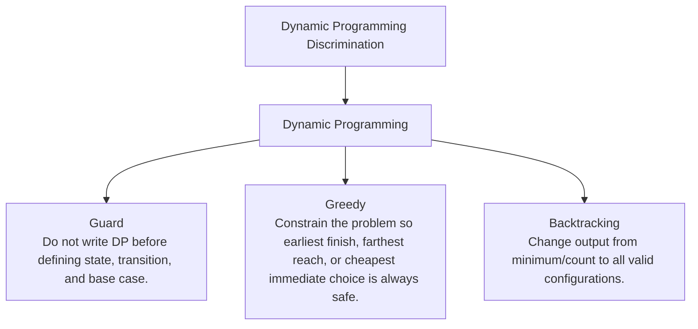

# Dynamic Programming Discrimination

Repeated states plus choices: state, transition, base case, fill order.

Study goal: recognize when this family is the winner, reject the nearest wrong alternatives, and know the smallest requirement change that would switch the pattern.

## Switch Map

## Problems

| Rank | Problem | Winner | Why winner | Near-miss reasoning | Wrong-pattern guard | Java | LeetCode |
|---:|---|---|---|---|---|---|---|
| 32 | House Robber | Dynamic Programming | Naive recursion repeats suffix decisions; two rolling states capture all history needed. | Greedy: Why not now - DP is needed when a local choice can harm a future state.; Missing - A proof that the locally best choice remains globally safe.; Minimal change - Constrain the problem so earliest finish, farthest reach, or cheapest immediate choice is always safe.; Now works - The state collapse becomes a local invariant. Backtracking: Why not now - DP returns an optimal/count value; backtracking is needed when every concrete solution must be emitted.; Missing - Output requires listing all paths/combinations/permutations.; Minimal change - Change output from minimum/count to all valid configurations.; Now works - The path itself becomes part of the answer. | Do not write DP before defining state, transition, and base case. | [Java](../../src/main/java/org/chijai/day9/dp/session1/HouseRobber.java) | [LC](https://leetcode.com/problems/house-robber/) |
| 33 | Coin Change | Dynamic Programming | Recursive choice tree repeats the same remaining amounts. | Greedy: Why not now - DP is needed when a local choice can harm a future state.; Missing - A proof that the locally best choice remains globally safe.; Minimal change - Constrain the problem so earliest finish, farthest reach, or cheapest immediate choice is always safe.; Now works - The state collapse becomes a local invariant. Backtracking: Why not now - DP returns an optimal/count value; backtracking is needed when every concrete solution must be emitted.; Missing - Output requires listing all paths/combinations/permutations.; Minimal change - Change output from minimum/count to all valid configurations.; Now works - The path itself becomes part of the answer. | Do not write DP before defining state, transition, and base case. | [Java](../../src/main/java/org/chijai/day9/dp/session2/CoinChange.java) | [LC](https://leetcode.com/problems/coin-change/) |
| 43 | Unique Paths | Dynamic Programming | Naive recursion recomputes the same grid cells exponentially. | Greedy: Why not now - DP is needed when a local choice can harm a future state.; Missing - A proof that the locally best choice remains globally safe.; Minimal change - Constrain the problem so earliest finish, farthest reach, or cheapest immediate choice is always safe.; Now works - The state collapse becomes a local invariant. Backtracking: Why not now - DP returns an optimal/count value; backtracking is needed when every concrete solution must be emitted.; Missing - Output requires listing all paths/combinations/permutations.; Minimal change - Change output from minimum/count to all valid configurations.; Now works - The path itself becomes part of the answer. | Do not write DP before defining state, transition, and base case. | [Java](../../src/main/java/org/chijai/day9/dp/session1/UniquePaths.java) | [LC](https://leetcode.com/problems/unique-paths/) |
| 44 | Partition Equal Subset Sum | Dynamic Programming | Trying all subsets repeats sums; 0/1 knapsack tracks reachable sums once. | Greedy: Why not now - DP is needed when a local choice can harm a future state.; Missing - A proof that the locally best choice remains globally safe.; Minimal change - Constrain the problem so earliest finish, farthest reach, or cheapest immediate choice is always safe.; Now works - The state collapse becomes a local invariant. Backtracking: Why not now - DP returns an optimal/count value; backtracking is needed when every concrete solution must be emitted.; Missing - Output requires listing all paths/combinations/permutations.; Minimal change - Change output from minimum/count to all valid configurations.; Now works - The path itself becomes part of the answer. | Do not write DP before defining state, transition, and base case. | [Java](../../src/main/java/org/chijai/day9/dp/session2/PartitionEqualSubsetSum.java) | [LC](https://leetcode.com/problems/partition-equal-subset-sum/) |
| 45 | Longest Increasing Subsequence | Dynamic Programming | O(n^2) DP works, but binary-search tails gives faster length tracking. | Greedy: Why not now - DP is needed when a local choice can harm a future state.; Missing - A proof that the locally best choice remains globally safe.; Minimal change - Constrain the problem so earliest finish, farthest reach, or cheapest immediate choice is always safe.; Now works - The state collapse becomes a local invariant. Backtracking: Why not now - DP returns an optimal/count value; backtracking is needed when every concrete solution must be emitted.; Missing - Output requires listing all paths/combinations/permutations.; Minimal change - Change output from minimum/count to all valid configurations.; Now works - The path itself becomes part of the answer. | Do not write DP before defining state, transition, and base case. | [Java](../../src/main/java/org/chijai/day9/dp/session2/LIS.java) | [LC](https://leetcode.com/problems/longest-increasing-subsequence/) |
| 87 | Maximum Profit In Job Scheduling | Dynamic Programming | Trying all subsets repeats compatibility checks; DP plus sorted end times reuses optimal prefixes. | Greedy: Why not now - DP is needed when a local choice can harm a future state.; Missing - A proof that the locally best choice remains globally safe.; Minimal change - Constrain the problem so earliest finish, farthest reach, or cheapest immediate choice is always safe.; Now works - The state collapse becomes a local invariant. Backtracking: Why not now - DP returns an optimal/count value; backtracking is needed when every concrete solution must be emitted.; Missing - Output requires listing all paths/combinations/permutations.; Minimal change - Change output from minimum/count to all valid configurations.; Now works - The path itself becomes part of the answer. | Do not write DP before defining state, transition, and base case. | [Java](../../src/main/java/org/chijai/day2/session3/MaximumProfitInJobScheduling.java) | [LC](https://leetcode.com/problems/maximum-profit-in-job-scheduling/) |
| 88 | Kadane Max Sub Array | Dynamic Programming | Checking all subarrays is O(n^2); local ending-best captures the only needed history. | Greedy: Why not now - DP is needed when a local choice can harm a future state.; Missing - A proof that the locally best choice remains globally safe.; Minimal change - Constrain the problem so earliest finish, farthest reach, or cheapest immediate choice is always safe.; Now works - The state collapse becomes a local invariant. Backtracking: Why not now - DP returns an optimal/count value; backtracking is needed when every concrete solution must be emitted.; Missing - Output requires listing all paths/combinations/permutations.; Minimal change - Change output from minimum/count to all valid configurations.; Now works - The path itself becomes part of the answer. | Do not write DP before defining state, transition, and base case. | [Java](../../src/main/java/org/chijai/day9/dp/session1/KadaneMaxSubArray.java) | - |
| 168 | Climbing Stairs Fib | Dynamic Programming | Recursive Fibonacci repeats the same smaller step counts. | Greedy: Why not now - DP is needed when a local choice can harm a future state.; Missing - A proof that the locally best choice remains globally safe.; Minimal change - Constrain the problem so earliest finish, farthest reach, or cheapest immediate choice is always safe.; Now works - The state collapse becomes a local invariant. Backtracking: Why not now - DP returns an optimal/count value; backtracking is needed when every concrete solution must be emitted.; Missing - Output requires listing all paths/combinations/permutations.; Minimal change - Change output from minimum/count to all valid configurations.; Now works - The path itself becomes part of the answer. | Do not write DP before defining state, transition, and base case. | [Java](../../src/main/java/org/chijai/day9/dp/session1/ClimbingStairsFib.java) | - |
| 169 | Edit Distance | Dynamic Programming | Naive recursion branches into insert/delete/replace repeatedly for same prefixes. | Greedy: Why not now - DP is needed when a local choice can harm a future state.; Missing - A proof that the locally best choice remains globally safe.; Minimal change - Constrain the problem so earliest finish, farthest reach, or cheapest immediate choice is always safe.; Now works - The state collapse becomes a local invariant. Backtracking: Why not now - DP returns an optimal/count value; backtracking is needed when every concrete solution must be emitted.; Missing - Output requires listing all paths/combinations/permutations.; Minimal change - Change output from minimum/count to all valid configurations.; Now works - The path itself becomes part of the answer. | Do not write DP before defining state, transition, and base case. | [Java](../../src/main/java/org/chijai/day9/dp/session2/EditDistance.java) | [LC](https://leetcode.com/problems/edit-distance/) |
| 170 | Distinct Subsequences | Dynamic Programming | Include/skip choices revisit the same source-target prefix pairs. | Greedy: Why not now - DP is needed when a local choice can harm a future state.; Missing - A proof that the locally best choice remains globally safe.; Minimal change - Constrain the problem so earliest finish, farthest reach, or cheapest immediate choice is always safe.; Now works - The state collapse becomes a local invariant. Backtracking: Why not now - DP returns an optimal/count value; backtracking is needed when every concrete solution must be emitted.; Missing - Output requires listing all paths/combinations/permutations.; Minimal change - Change output from minimum/count to all valid configurations.; Now works - The path itself becomes part of the answer. | Do not write DP before defining state, transition, and base case. | [Java](../../src/main/java/org/chijai/day9/dp/session2/EditDistance.java) | [LC](https://leetcode.com/problems/distinct-subsequences/) |
| 190 | Best Time to Buy and Sell Stock with Transaction Fee | Dynamic Programming | Local rising edges are not enough when each completed transaction pays a fee. | Greedy: Why not now - Every small positive edge may be erased by the fee.; Missing - No per-transaction fixed cost.; Minimal change - Set fee to zero.; Now works - Every positive rise is profitable. Single Transaction Running Min: Why not now - Multiple transactions are still allowed; fee only changes sell profitability.; Missing - At most one transaction.; Minimal change - Limit to one buy/sell.; Now works - A running minimum plus fee-adjusted profit is enough. | Do not harvest every positive edge; each transaction must overcome the fee. | [Java](../../src/main/java/org/chijai/day1/Arrays/session3/StockSeries2.java) | [LC](https://leetcode.com/problems/best-time-to-buy-and-sell-stock-with-transaction-fee/) |
| 191 | Best Time to Buy and Sell Stock with Cooldown | Dynamic Programming | Greedy cannot sell and immediately rebuy; the cooldown day must be encoded in state. | Greedy: Why not now - Selling today blocks buying tomorrow, so local positive edges are not independent.; Missing - No cooldown coupling across days.; Minimal change - Remove the cooldown rule.; Now works - The problem collapses to summing positive differences. Plain Hold/Cash DP: Why not now - Two states cannot distinguish sold-today from rest.; Missing - A cooldown/rest state.; Minimal change - Remove the one-day cooldown.; Now works - hold and cash are enough. | Do not greedily harvest adjacent rises; selling today blocks buying tomorrow. | [Java](../../src/main/java/org/chijai/day1/Arrays/session3/StockSeries2.java) | [LC](https://leetcode.com/problems/best-time-to-buy-and-sell-stock-with-cooldown/) |
| 192 | Best Time to Buy and Sell Stock III | Dynamic Programming | Greedy rising edges fail with at most two transactions; holding/sold states preserve constraints. | Greedy: Why not now - Adding all positive edges can exceed the two-transaction limit.; Missing - Unlimited transactions.; Minimal change - Remove the two-transaction limit.; Now works - Each rising edge can be harvested independently. Single Transaction Running Min: Why not now - One buy/sell pair misses the second independent profit segment.; Missing - Only one transaction allowed.; Minimal change - Restrict to at most one transaction.; Now works - A prefix minimum is enough. | Do not sum all positive edges; at most two transactions requires buy/sell states. | [Java](../../src/main/java/org/chijai/day1/Arrays/session3/StockSeries1.java) | [LC](https://leetcode.com/problems/best-time-to-buy-and-sell-stock-iii/) |
| 193 | Best Time to Buy and Sell Stock IV | Dynamic Programming | Enumerating transaction boundaries repeats choices; DP compresses day and transaction count. | Greedy: Why not now - Greedy is valid only when k is large enough to behave like unlimited transactions.; Missing - k >= n/2 or no transaction limit.; Minimal change - Make k unlimited or at least n/2.; Now works - All positive edges can be taken. Stock III Four-State DP: Why not now - Hardcoding two transactions breaks when k varies.; Missing - Fixed k = 2.; Minimal change - Set k exactly to 2.; Now works - The generic transaction layers reduce to buy1/sell1/buy2/sell2. | Do not hardcode two transactions; k requires layered hold/cash states. | [Java](../../src/main/java/org/chijai/day1/Arrays/session3/StockSeries2.java) | [LC](https://leetcode.com/problems/best-time-to-buy-and-sell-stock-iv/) |
| 194 | Distinct Subsequences II | Dynamic Programming | A set of all subsequences explodes; last contribution per character removes duplicates compactly. | Backtracking: Why not now - Generating all subsequences is exponential and duplicates collide.; Missing - Tiny input or requirement to list subsequences.; Minimal change - Ask to print every distinct subsequence for n <= 20.; Now works - The concrete subsequences become the output. HashSet: Why not now - A set can deduplicate strings but cannot survive large n.; Missing - Small enough output size.; Minimal change - Constrain n so total subsequences fit memory.; Now works - Explicit generation plus set dedup is acceptable. | Do not enumerate subsequences; duplicate removal needs last contribution per character. | [Java](../../src/main/java/org/chijai/day10/session2/CountUniqueChars.java) | [LC](https://leetcode.com/problems/distinct-subsequences-ii/) |
| 195 | Word Break | Dynamic Programming | Recursive cuts retry the same suffixes; prefix validity caches reusable split points. | Trie: Why not now - Trie speeds word lookup but does not remember which prefixes are segmentable.; Missing - Only prefix membership queries, no full segmentation decision.; Minimal change - Ask whether any dictionary word starts at each index.; Now works - Trie traversal is the core operation. Backtracking: Why not now - Backtracking enumerates cuts and repeats the same suffixes.; Missing - Need to output all valid segmentations.; Minimal change - Ask for every possible sentence.; Now works - The chosen word path must be emitted. | Do not just build a Trie; the decisive state is whether each prefix can be segmented. | [Java](../../src/main/java/org/chijai/day9/dp/session2/CoinChange.java) | [LC](https://leetcode.com/problems/word-break/) |
| 196 | Interleaving String | Dynamic Programming | Greedy picking from either string fails when equal chars create ambiguous futures. | Greedy: Why not now - When both source chars match, picking one can make the future impossible.; Missing - A deterministic tie-breaker that is always safe.; Minimal change - Guarantee no position has both s1[i] and s2[j] matching s3.; Now works - The next source is forced. Backtracking: Why not now - Backtracking repeats the same i,j prefix states.; Missing - Need all interleavings, not just existence.; Minimal change - Ask to generate every valid interleaving.; Now works - The path choices are the answer. | Do not choose greedily on equal chars; cache the pair of consumed prefix lengths. | [Java](../../src/main/java/org/chijai/day9/dp/session2/EditDistance.java) | [LC](https://leetcode.com/problems/interleaving-string/) |
| 197 | Longest Common Subsequence | Dynamic Programming | Subsequence matching branches repeatedly on the same prefix pairs. | Two Pointers: Why not now - Skipping a char from either string is a choice; local pointer movement can discard the optimum.; Missing - One string must be checked as a subsequence of the other.; Minimal change - Ask only whether s is a subsequence of t.; Now works - A single forward scan is enough. Edit Distance: Why not now - LCS maximizes kept matches; edit distance minimizes operation cost.; Missing - Insert/delete/replace costs.; Minimal change - Ask for minimum operations to convert one string to another.; Now works - Operation transitions define the DP. | Do not use sliding window; subsequence order allows skips, not contiguity. | [Java](../../src/main/java/org/chijai/day9/dp/session2/EditDistance.java) | [LC](https://leetcode.com/problems/longest-common-subsequence/) |
| 198 | Delete Operation for Two Strings | Dynamic Programming | Direct delete recursion repeats prefix pairs; LCS preserves the shared subsequence once. | Greedy: Why not now - DP is needed when a local choice can harm a future state.; Missing - A proof that the locally best choice remains globally safe.; Minimal change - Constrain the problem so earliest finish, farthest reach, or cheapest immediate choice is always safe.; Now works - The state collapse becomes a local invariant. Backtracking: Why not now - DP returns an optimal/count value; backtracking is needed when every concrete solution must be emitted.; Missing - Output requires listing all paths/combinations/permutations.; Minimal change - Change output from minimum/count to all valid configurations.; Now works - The path itself becomes part of the answer. | Do not write DP before defining state, transition, and base case. | [Java](../../src/main/java/org/chijai/day9/dp/session2/EditDistance.java) | [LC](https://leetcode.com/problems/delete-operation-for-two-strings/) |
| 199 | Longest Palindromic Subsequence | Dynamic Programming | Subsequence choices overlap heavily; interval DP reuses inner ranges. | Greedy: Why not now - DP is needed when a local choice can harm a future state.; Missing - A proof that the locally best choice remains globally safe.; Minimal change - Constrain the problem so earliest finish, farthest reach, or cheapest immediate choice is always safe.; Now works - The state collapse becomes a local invariant. Backtracking: Why not now - DP returns an optimal/count value; backtracking is needed when every concrete solution must be emitted.; Missing - Output requires listing all paths/combinations/permutations.; Minimal change - Change output from minimum/count to all valid configurations.; Now works - The path itself becomes part of the answer. | Do not write DP before defining state, transition, and base case. | [Java](../../src/main/java/org/chijai/day9/dp/session2/EditDistance.java) | [LC](https://leetcode.com/problems/longest-palindromic-subsequence/) |
| 200 | Minimum ASCII Delete Sum for Two Strings | Dynamic Programming | LCS length is insufficient because deleted characters have different costs. | Greedy: Why not now - DP is needed when a local choice can harm a future state.; Missing - A proof that the locally best choice remains globally safe.; Minimal change - Constrain the problem so earliest finish, farthest reach, or cheapest immediate choice is always safe.; Now works - The state collapse becomes a local invariant. Backtracking: Why not now - DP returns an optimal/count value; backtracking is needed when every concrete solution must be emitted.; Missing - Output requires listing all paths/combinations/permutations.; Minimal change - Change output from minimum/count to all valid configurations.; Now works - The path itself becomes part of the answer. | Do not write DP before defining state, transition, and base case. | [Java](../../src/main/java/org/chijai/day9/dp/session2/EditDistance.java) | [LC](https://leetcode.com/problems/minimum-ascii-delete-sum-for-two-strings/) |
| 201 | Climbing Stairs | Dynamic Programming | The recursion tree repeats the same step count states. | Greedy: Why not now - DP is needed when a local choice can harm a future state.; Missing - A proof that the locally best choice remains globally safe.; Minimal change - Constrain the problem so earliest finish, farthest reach, or cheapest immediate choice is always safe.; Now works - The state collapse becomes a local invariant. Backtracking: Why not now - DP returns an optimal/count value; backtracking is needed when every concrete solution must be emitted.; Missing - Output requires listing all paths/combinations/permutations.; Minimal change - Change output from minimum/count to all valid configurations.; Now works - The path itself becomes part of the answer. | Do not write DP before defining state, transition, and base case. | [Java](../../src/main/java/org/chijai/day9/dp/session2/CoinChange.java) | [LC](https://leetcode.com/problems/climbing-stairs/) |
| 202 | Min Cost Climbing Stairs | Dynamic Programming | Choosing the cheaper immediate next step can block a cheaper total suffix. | Greedy: Why not now - DP is needed when a local choice can harm a future state.; Missing - A proof that the locally best choice remains globally safe.; Minimal change - Constrain the problem so earliest finish, farthest reach, or cheapest immediate choice is always safe.; Now works - The state collapse becomes a local invariant. Backtracking: Why not now - DP returns an optimal/count value; backtracking is needed when every concrete solution must be emitted.; Missing - Output requires listing all paths/combinations/permutations.; Minimal change - Change output from minimum/count to all valid configurations.; Now works - The path itself becomes part of the answer. | Do not write DP before defining state, transition, and base case. | [Java](../../src/main/java/org/chijai/day9/dp/session2/CoinChange.java) | [LC](https://leetcode.com/problems/min-cost-climbing-stairs/) |
| 203 | Perfect Squares | Dynamic Programming | Greedy largest-square choice fails on cases where smaller squares combine better. | Greedy: Why not now - DP is needed when a local choice can harm a future state.; Missing - A proof that the locally best choice remains globally safe.; Minimal change - Constrain the problem so earliest finish, farthest reach, or cheapest immediate choice is always safe.; Now works - The state collapse becomes a local invariant. Backtracking: Why not now - DP returns an optimal/count value; backtracking is needed when every concrete solution must be emitted.; Missing - Output requires listing all paths/combinations/permutations.; Minimal change - Change output from minimum/count to all valid configurations.; Now works - The path itself becomes part of the answer. | Do not write DP before defining state, transition, and base case. | [Java](../../src/main/java/org/chijai/day9/dp/session2/CoinChange.java) | [LC](https://leetcode.com/problems/perfect-squares/) |
| 204 | Number of Longest Increasing Subsequence | Dynamic Programming | tails gives length only; counting needs ownership of every ending index. | Binary Search Tails: Why not now - tails stores representative values, not counts for all ending positions.; Missing - Only LIS length, not number of LIS.; Minimal change - Ask only for the length of LIS.; Now works - Minimal tails are enough. Backtracking: Why not now - Enumerating all subsequences is exponential.; Missing - Need to print every LIS.; Minimal change - Ask to output all longest increasing subsequences for small n.; Now works - The actual paths become required output. | Do not use tails alone; counting LIS needs length and count per ending index. | [Java](../../src/main/java/org/chijai/day9/dp/session2/LIS.java) | [LC](https://leetcode.com/problems/number-of-longest-increasing-subsequence/) |
| 205 | Russian Doll Envelopes | Dynamic Programming | Plain 2D sorting can wrongly nest equal-width envelopes. | Plain LIS: Why not now - Equal-width envelopes cannot nest, so sorting heights naively overcounts.; Missing - One-dimensional sequence without equal-width conflict.; Minimal change - Remove width or guarantee all widths are unique and sorted.; Now works - Height LIS alone is valid. 2D Dynamic Programming: Why not now - O(n^2) DP works, but sorted heights plus binary search is faster.; Missing - Small n or need reconstruction/proof clarity.; Minimal change - Constrain n to a few thousand and ask for the actual chain.; Now works - DP parent pointers are practical. | Do not nest equal widths; sort equal width by descending height before LIS. | [Java](../../src/main/java/org/chijai/day9/dp/session2/LIS.java) | [LC](https://leetcode.com/problems/russian-doll-envelopes/) |

## Drill

For each row, speak: required output -> structure -> constraint/workload -> winner -> why not nearest alternative -> minimal mutation -> new winner.

Rows in this file: 26