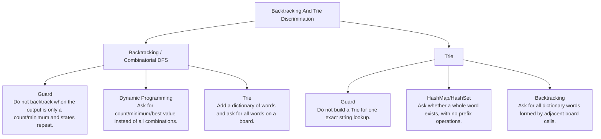

# Backtracking And Trie Discrimination

Generate/try/undo versus prefix-indexed pruning.

Study goal: recognize when this family is the winner, reject the nearest wrong alternatives, and know the smallest requirement change that would switch the pattern.

## Switch Map

## Problems

| Rank | Problem | Winner | Why winner | Near-miss reasoning | Wrong-pattern guard | Java | LeetCode |
|---:|---|---|---|---|---|---|---|
| 34 | Subsets | Backtracking / Combinatorial DFS | A used array is unnecessary because increasing start already prevents reuse and reorder duplicates. | Dynamic Programming: Why not now - Backtracking enumerates outputs; DP collapses repeated states when only an optimum/count is needed.; Missing - Repeated state identity and no need to list every solution.; Minimal change - Ask for count/minimum/best value instead of all combinations.; Now works - Memoized state replaces explicit path enumeration. Trie: Why not now - Backtracking alone does not share dictionary prefixes.; Missing - Many word-prefix lookups while exploring characters.; Minimal change - Add a dictionary of words and ask for all words on a board.; Now works - Trie prunes impossible prefixes early. | Do not backtrack when the output is only a count/minimum and states repeat. | [Java](../../src/main/java/org/chijai/day11/backtracking/session1/Subsets.java) | [LC](https://leetcode.com/problems/subsets/) |
| 39 | Implement Trie (Prefix Tree) | Trie | HashSet handles exact lookup, but prefix queries need shared character paths. | HashMap/HashSet: Why not now - A set handles exact words, but not efficient shared prefix traversal.; Missing - Only exact membership, no prefix/wildcard/character path.; Minimal change - Ask whether a whole word exists, with no prefix operations.; Now works - Hash lookup is simpler and cheaper to code. Backtracking: Why not now - Trie is the dictionary accelerator; search still needs DFS only when paths are generated.; Missing - Need to try/undo board paths or wildcard branches.; Minimal change - Ask for all dictionary words formed by adjacent board cells.; Now works - DFS explores paths while Trie rejects dead prefixes. | Do not build a Trie for one exact string lookup. | [Java](../../src/main/java/org/chijai/day10/session1/trie/TriePrefix.java) | [LC](https://leetcode.com/problems/implement-trie-prefix-tree/) |
| 46 | Combination Sum | Backtracking / Combinatorial DFS | Advancing past the chosen index would incorrectly prohibit unlimited reuse. | Dynamic Programming: Why not now - Backtracking enumerates outputs; DP collapses repeated states when only an optimum/count is needed.; Missing - Repeated state identity and no need to list every solution.; Minimal change - Ask for count/minimum/best value instead of all combinations.; Now works - Memoized state replaces explicit path enumeration. Trie: Why not now - Backtracking alone does not share dictionary prefixes.; Missing - Many word-prefix lookups while exploring characters.; Minimal change - Add a dictionary of words and ask for all words on a board.; Now works - Trie prunes impossible prefixes early. | Do not backtrack when the output is only a count/minimum and states repeat. | [Java](../../src/main/java/org/chijai/day11/backtracking/session1/CombinationSum.java) | [LC](https://leetcode.com/problems/combination-sum/) |
| 48 | Word Search | Backtracking / Combinatorial DFS | Global visited is wrong because another starting path may reuse the same cell. | Dynamic Programming: Why not now - Backtracking enumerates outputs; DP collapses repeated states when only an optimum/count is needed.; Missing - Repeated state identity and no need to list every solution.; Minimal change - Ask for count/minimum/best value instead of all combinations.; Now works - Memoized state replaces explicit path enumeration. Trie: Why not now - Backtracking alone does not share dictionary prefixes.; Missing - Many word-prefix lookups while exploring characters.; Minimal change - Add a dictionary of words and ask for all words on a board.; Now works - Trie prunes impossible prefixes early. | Do not backtrack when the output is only a count/minimum and states repeat. | [Java](../../src/main/java/org/chijai/day8/graph/session1/WordSearch.java) | [LC](https://leetcode.com/problems/word-search/) |
| 96 | Design Add and Search Words Data Structure | Trie | Wildcard lookup cannot be solved by one HashSet lookup; branching is limited by trie prefixes. | HashMap/HashSet: Why not now - A set handles exact words, but not efficient shared prefix traversal.; Missing - Only exact membership, no prefix/wildcard/character path.; Minimal change - Ask whether a whole word exists, with no prefix operations.; Now works - Hash lookup is simpler and cheaper to code. Backtracking: Why not now - Trie is the dictionary accelerator; search still needs DFS only when paths are generated.; Missing - Need to try/undo board paths or wildcard branches.; Minimal change - Ask for all dictionary words formed by adjacent board cells.; Now works - DFS explores paths while Trie rejects dead prefixes. | Do not build a Trie for one exact string lookup. | [Java](../../src/main/java/org/chijai/day10/session1/trie/TriePrefix.java) | [LC](https://leetcode.com/problems/design-add-and-search-words-data-structure/) |
| 103 | Word Search II | Trie | Running Word Search for every word repeats prefix work; trie shares the dictionary search. | HashMap/HashSet: Why not now - A set handles exact words, but not efficient shared prefix traversal.; Missing - Only exact membership, no prefix/wildcard/character path.; Minimal change - Ask whether a whole word exists, with no prefix operations.; Now works - Hash lookup is simpler and cheaper to code. Backtracking: Why not now - Trie is the dictionary accelerator; search still needs DFS only when paths are generated.; Missing - Need to try/undo board paths or wildcard branches.; Minimal change - Ask for all dictionary words formed by adjacent board cells.; Now works - DFS explores paths while Trie rejects dead prefixes. | Do not build a Trie for one exact string lookup. | [Java](../../src/main/java/org/chijai/day10/session1/trie/WordSearchII.java) | [LC](https://leetcode.com/problems/word-search-ii/) |
| 145 | Letter Combinations Of A Phone Number | Backtracking / Combinatorial DFS | Each digit contributes a small independent branch; the concrete strings are the output. | Dynamic Programming: Why not now - Backtracking enumerates outputs; DP collapses repeated states when only an optimum/count is needed.; Missing - Repeated state identity and no need to list every solution.; Minimal change - Ask for count/minimum/best value instead of all combinations.; Now works - Memoized state replaces explicit path enumeration. Trie: Why not now - Backtracking alone does not share dictionary prefixes.; Missing - Many word-prefix lookups while exploring characters.; Minimal change - Add a dictionary of words and ask for all words on a board.; Now works - Trie prunes impossible prefixes early. | Do not backtrack when the output is only a count/minimum and states repeat. | [Java](../../src/main/java/org/chijai/day11/backtracking/session1/LetterCombinationsOfAPhoneNumber.java) | [LC](https://leetcode.com/problems/letter-combinations-of-a-phone-number/) |
| 146 | Permutations | Backtracking / Combinatorial DFS | A start index would miss valid reorderings because every unused value may occupy every position. | Dynamic Programming: Why not now - Backtracking enumerates outputs; DP collapses repeated states when only an optimum/count is needed.; Missing - Repeated state identity and no need to list every solution.; Minimal change - Ask for count/minimum/best value instead of all combinations.; Now works - Memoized state replaces explicit path enumeration. Trie: Why not now - Backtracking alone does not share dictionary prefixes.; Missing - Many word-prefix lookups while exploring characters.; Minimal change - Add a dictionary of words and ask for all words on a board.; Now works - Trie prunes impossible prefixes early. | Do not backtrack when the output is only a count/minimum and states repeat. | [Java](../../src/main/java/org/chijai/day11/backtracking/session1/Permutations.java) | [LC](https://leetcode.com/problems/permutations/) |
| 156 | Maximum XOR of Two Numbers in an Array | Trie | Checking all pairs is O(n^2); bitwise trie preserves candidate prefixes cheaply. | HashSet Prefix Greedy: Why not now - It is a valid alternative, but it hides the candidate structure compared with bitwise trie.; Missing - Need only feasibility of each candidate prefix, not explicit partner walk.; Minimal change - Ask for a proof-focused O(n) prefix-set solution.; Now works - Testing candidate XOR prefixes proves whether the bit can be set. Brute Force: Why not now - All pairs are clear but O(n^2).; Missing - Small n or no performance pressure.; Minimal change - Constrain n to a few hundred.; Now works - Pair enumeration becomes acceptable. | Do not use word-prefix Trie language; this is a bitwise prefix decision from high bit to low bit. | [Java](../../src/main/java/org/chijai/day10/session1/trie/MaximumXOR.java) | [LC](https://leetcode.com/problems/maximum-xor-of-two-numbers-in-an-array/) |
| 159 | Longest Common Prefix | Trie | A branch means strings disagree; a terminal means one string has already ended. | HashMap/HashSet: Why not now - A set handles exact words, but not efficient shared prefix traversal.; Missing - Only exact membership, no prefix/wildcard/character path.; Minimal change - Ask whether a whole word exists, with no prefix operations.; Now works - Hash lookup is simpler and cheaper to code. Backtracking: Why not now - Trie is the dictionary accelerator; search still needs DFS only when paths are generated.; Missing - Need to try/undo board paths or wildcard branches.; Minimal change - Ask for all dictionary words formed by adjacent board cells.; Now works - DFS explores paths while Trie rejects dead prefixes. | Do not build a Trie for one exact string lookup. | [Java](../../src/main/java/org/chijai/day10/session1/trie/TriePrefix.java) | [LC](https://leetcode.com/problems/longest-common-prefix/) |
| 160 | Longest Word in Dictionary | Trie | Normal trie membership validates only the complete word, not all intermediate prefixes. | HashMap/HashSet: Why not now - A set handles exact words, but not efficient shared prefix traversal.; Missing - Only exact membership, no prefix/wildcard/character path.; Minimal change - Ask whether a whole word exists, with no prefix operations.; Now works - Hash lookup is simpler and cheaper to code. Backtracking: Why not now - Trie is the dictionary accelerator; search still needs DFS only when paths are generated.; Missing - Need to try/undo board paths or wildcard branches.; Minimal change - Ask for all dictionary words formed by adjacent board cells.; Now works - DFS explores paths while Trie rejects dead prefixes. | Do not build a Trie for one exact string lookup. | [Java](../../src/main/java/org/chijai/day10/session1/trie/TrieWordDictionary.java) | [LC](https://leetcode.com/problems/longest-word-in-dictionary/) |
| 161 | Replace Words | Trie | Continuing after the first terminal returns a longer root and violates the objective. | HashMap/HashSet: Why not now - A set handles exact words, but not efficient shared prefix traversal.; Missing - Only exact membership, no prefix/wildcard/character path.; Minimal change - Ask whether a whole word exists, with no prefix operations.; Now works - Hash lookup is simpler and cheaper to code. Backtracking: Why not now - Trie is the dictionary accelerator; search still needs DFS only when paths are generated.; Missing - Need to try/undo board paths or wildcard branches.; Minimal change - Ask for all dictionary words formed by adjacent board cells.; Now works - DFS explores paths while Trie rejects dead prefixes. | Do not build a Trie for one exact string lookup. | [Java](../../src/main/java/org/chijai/day10/session1/trie/TriePrefix.java) | [LC](https://leetcode.com/problems/replace-words/) |
| 162 | Search Suggestions System | Trie | Exact trie search finds the prefix node but does not rank descendants. | HashMap/HashSet: Why not now - A set handles exact words, but not efficient shared prefix traversal.; Missing - Only exact membership, no prefix/wildcard/character path.; Minimal change - Ask whether a whole word exists, with no prefix operations.; Now works - Hash lookup is simpler and cheaper to code. Backtracking: Why not now - Trie is the dictionary accelerator; search still needs DFS only when paths are generated.; Missing - Need to try/undo board paths or wildcard branches.; Minimal change - Ask for all dictionary words formed by adjacent board cells.; Now works - DFS explores paths while Trie rejects dead prefixes. | Do not build a Trie for one exact string lookup. | [Java](../../src/main/java/org/chijai/day10/session1/trie/TriePrefix.java) | [LC](https://leetcode.com/problems/search-suggestions-system/) |
| 163 | Short Encoding of Words | Trie | Reversing words turns shared suffixes into shared trie prefixes. | HashMap/HashSet: Why not now - A set handles exact words, but not efficient shared prefix traversal.; Missing - Only exact membership, no prefix/wildcard/character path.; Minimal change - Ask whether a whole word exists, with no prefix operations.; Now works - Hash lookup is simpler and cheaper to code. Backtracking: Why not now - Trie is the dictionary accelerator; search still needs DFS only when paths are generated.; Missing - Need to try/undo board paths or wildcard branches.; Minimal change - Ask for all dictionary words formed by adjacent board cells.; Now works - DFS explores paths while Trie rejects dead prefixes. | Do not build a Trie for one exact string lookup. | [Java](../../src/main/java/org/chijai/day10/session1/trie/TriePrefix.java) | [LC](https://leetcode.com/problems/short-encoding-of-words/) |
| 164 | Map Sum Pairs | Trie | Adding the full replacement value double-counts the key's old contribution. | HashMap/HashSet: Why not now - A set handles exact words, but not efficient shared prefix traversal.; Missing - Only exact membership, no prefix/wildcard/character path.; Minimal change - Ask whether a whole word exists, with no prefix operations.; Now works - Hash lookup is simpler and cheaper to code. Backtracking: Why not now - Trie is the dictionary accelerator; search still needs DFS only when paths are generated.; Missing - Need to try/undo board paths or wildcard branches.; Minimal change - Ask for all dictionary words formed by adjacent board cells.; Now works - DFS explores paths while Trie rejects dead prefixes. | Do not build a Trie for one exact string lookup. | [Java](../../src/main/java/org/chijai/day10/session1/trie/TrieWordDictionary.java) | [LC](https://leetcode.com/problems/map-sum-pairs/) |
| 165 | Maximum XOR With an Element From Array | Trie | A plain trie over all numbers violates the limit; sorting queries makes eligibility monotonic. | Plain Bitwise Trie: Why not now - Using all nums violates each query's mi limit.; Missing - Eligibility filter for nums <= mi.; Minimal change - Remove the per-query limit.; Now works - Every number is always eligible for trie lookup. Sorting / Offline Queries: Why not now - Sorting alone orders eligibility but cannot maximize XOR.; Missing - Bitwise opposite-bit search among eligible values.; Minimal change - Ask only for count of eligible values per query.; Now works - Sorted pointer scan is enough. | Do not put every number in the trie; each query can use only nums <= mi. | [Java](../../src/main/java/org/chijai/day10/session1/trie/MaximumXOR.java) | [LC](https://leetcode.com/problems/maximum-xor-with-an-element-from-array/) |
| 166 | Maximum Genetic Difference Query | Trie | Query candidates are ancestors only, so a global trie includes invalid values. | Plain Bitwise Trie: Why not now - A global trie includes non-ancestor nodes.; Missing - Current root-to-node path membership.; Minimal change - Ask maximum XOR with any node value in the whole tree.; Now works - Global trie membership is valid. Tree DFS: Why not now - DFS gives the active ancestor path but not fast XOR maximization.; Missing - Opposite-bit lookup over active ancestors.; Minimal change - Ask only whether an ancestor with value x exists.; Now works - A set on the DFS path is enough. | Do not use a global trie; only current ancestors are valid candidates. | [Java](../../src/main/java/org/chijai/day10/session1/trie/MaximumXOR.java) | [LC](https://leetcode.com/problems/maximum-genetic-difference-query/) |
| 167 | Count Pairs With XOR in a Range | Trie | All-pairs XOR is O(n^2); bitwise prefixes count valid partners per bit. | Brute Force: Why not now - All pairs are easy to test but O(n^2).; Missing - Small input or no pair-count workload pressure.; Minimal change - Constrain n to a few hundred.; Now works - Direct pair enumeration is acceptable. HashMap/HashSet: Why not now - Exact complement lookup does not count all XOR values in a range.; Missing - Prefix counts by bit to count less-than bounds.; Minimal change - Ask for pairs with XOR exactly k.; Now works - Each number has one target partner value. | Do not use exact-complement lookup; range XOR needs less-than counts by bit. | [Java](../../src/main/java/org/chijai/day10/session1/trie/MaximumXOR.java) | [LC](https://leetcode.com/problems/count-pairs-with-xor-in-a-range/) |
| 181 | Permutations II | Backtracking / Combinatorial DFS | Skipping every equal neighbor loses valid permutations; only an unused equal predecessor proves this branch is a duplicate. | Dynamic Programming: Why not now - Backtracking enumerates outputs; DP collapses repeated states when only an optimum/count is needed.; Missing - Repeated state identity and no need to list every solution.; Minimal change - Ask for count/minimum/best value instead of all combinations.; Now works - Memoized state replaces explicit path enumeration. Trie: Why not now - Backtracking alone does not share dictionary prefixes.; Missing - Many word-prefix lookups while exploring characters.; Minimal change - Add a dictionary of words and ask for all words on a board.; Now works - Trie prunes impossible prefixes early. | Do not backtrack when the output is only a count/minimum and states repeat. | [Java](../../src/main/java/org/chijai/day11/backtracking/session1/Permutations.java) | [LC](https://leetcode.com/problems/permutations-ii/) |
| 184 | Hotel Reviews | Trie | Repeated string matching for every keyword wastes prefix/lookup work. | HashMap/HashSet: Why not now - A set handles exact words, but not efficient shared prefix traversal.; Missing - Only exact membership, no prefix/wildcard/character path.; Minimal change - Ask whether a whole word exists, with no prefix operations.; Now works - Hash lookup is simpler and cheaper to code. Backtracking: Why not now - Trie is the dictionary accelerator; search still needs DFS only when paths are generated.; Missing - Need to try/undo board paths or wildcard branches.; Minimal change - Ask for all dictionary words formed by adjacent board cells.; Now works - DFS explores paths while Trie rejects dead prefixes. | Do not build a Trie for one exact string lookup. | [Java](../../src/main/java/org/chijai/day10/session1/trie/HotelReviews.java) | - |

## Drill

For each row, speak: required output -> structure -> constraint/workload -> winner -> why not nearest alternative -> minimal mutation -> new winner.

Rows in this file: 20