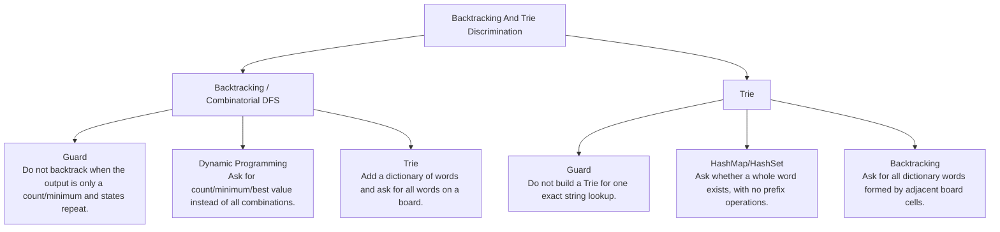

# Backtracking And Trie Discrimination

Generate/try/undo versus prefix-indexed pruning.

Study goal: recognize when this family is the winner, reject the nearest wrong alternatives, and know the smallest requirement change that would switch the pattern.

## Switch Map

## Problems

| Rank | Problem | Winner | Why winner | Near-miss mutation | Wrong-pattern guard | Java | LeetCode |
|---:|---|---|---|---|---|---|---|
| 34 | Subsets | Backtracking / Combinatorial DFS | Brute force generates blindly; backtracking prunes invalid decision paths early. | Dynamic Programming: Ask for count/minimum/best value instead of all combinations. Trie: Add a dictionary of words and ask for all words on a board. | Do not backtrack when the output is only a count/minimum and states repeat. | [Java](../../src/main/java/org/chijai/day11/backtracking/session1/Subsets.java) | [LC](https://leetcode.com/problems/subsets/) |
| 39 | Implement Trie (Prefix Tree) | Trie | HashSet handles exact lookup, but prefix queries need shared character paths. | HashMap/HashSet: Ask whether a whole word exists, with no prefix operations. Backtracking: Ask for all dictionary words formed by adjacent board cells. | Do not build a Trie for one exact string lookup. | [Java](../../src/main/java/org/chijai/day10/session1/trie/TriePrefix.java) | [LC](https://leetcode.com/problems/implement-trie-prefix-tree/) |
| 46 | Combination Sum | Backtracking / Combinatorial DFS | Brute force generates blindly; backtracking prunes invalid decision paths early. | Dynamic Programming: Ask for count/minimum/best value instead of all combinations. Trie: Add a dictionary of words and ask for all words on a board. | Do not backtrack when the output is only a count/minimum and states repeat. | [Java](../../src/main/java/org/chijai/day11/backtracking/session1/CombinationSum.java) | [LC](https://leetcode.com/problems/combination-sum/) |
| 48 | Word Search | Backtracking / Combinatorial DFS | Brute force generates blindly; backtracking prunes invalid decision paths early. | Dynamic Programming: Ask for count/minimum/best value instead of all combinations. Trie: Add a dictionary of words and ask for all words on a board. | Do not backtrack when the output is only a count/minimum and states repeat. | [Java](../../src/main/java/org/chijai/day8/graph/session1/WordSearch.java) | [LC](https://leetcode.com/problems/word-search/) |
| 91 | Design Add and Search Words Data Structure | Trie | Wildcard lookup cannot be solved by one HashSet lookup; branching is limited by trie prefixes. | HashMap/HashSet: Ask whether a whole word exists, with no prefix operations. Backtracking: Ask for all dictionary words formed by adjacent board cells. | Do not build a Trie for one exact string lookup. | [Java](../../src/main/java/org/chijai/day10/session1/trie/TriePrefix.java) | [LC](https://leetcode.com/problems/design-add-and-search-words-data-structure/) |
| 98 | Word Search Ii | Trie | Running Word Search for every word repeats prefix work; trie shares the dictionary search. | HashMap/HashSet: Ask whether a whole word exists, with no prefix operations. Backtracking: Ask for all dictionary words formed by adjacent board cells. | Do not build a Trie for one exact string lookup. | [Java](../../src/main/java/org/chijai/day10/session1/trie/WordSearchII.java) | [LC](https://leetcode.com/problems/word-search-ii/) |
| 145 | Letter Combinations Of A Phone Number | Backtracking / Combinatorial DFS | Brute force generates blindly; backtracking prunes invalid decision paths early. | Dynamic Programming: Ask for count/minimum/best value instead of all combinations. Trie: Add a dictionary of words and ask for all words on a board. | Do not backtrack when the output is only a count/minimum and states repeat. | [Java](../../src/main/java/org/chijai/day11/backtracking/session1/LetterCombinationsOfAPhoneNumber.java) | [LC](https://leetcode.com/problems/letter-combinations-of-a-phone-number/) |
| 146 | Permutations | Backtracking / Combinatorial DFS | Brute force generates blindly; backtracking prunes invalid decision paths early. | Dynamic Programming: Ask for count/minimum/best value instead of all combinations. Trie: Add a dictionary of words and ask for all words on a board. | Do not backtrack when the output is only a count/minimum and states repeat. | [Java](../../src/main/java/org/chijai/day11/backtracking/session1/Permutations.java) | [LC](https://leetcode.com/problems/permutations/) |
| 155 | Maximum XOR of Two Numbers in an Array | Trie | Checking all pairs is O(n^2); bitwise trie preserves candidate prefixes cheaply. | HashMap/HashSet: Ask whether a whole word exists, with no prefix operations. Backtracking: Ask for all dictionary words formed by adjacent board cells. | Do not build a Trie for one exact string lookup. | [Java](../../src/main/java/org/chijai/day10/session1/trie/MaximumXOR.java) | [LC](https://leetcode.com/problems/maximum-xor-of-two-numbers-in-an-array/) |
| 159 | Longest Common Prefix | Trie | Repeated string scans waste prefix work; trie shares prefixes across words. | HashMap/HashSet: Ask whether a whole word exists, with no prefix operations. Backtracking: Ask for all dictionary words formed by adjacent board cells. | Do not build a Trie for one exact string lookup. | [Java](../../src/main/java/org/chijai/day10/session1/trie/TriePrefix.java) | [LC](https://leetcode.com/problems/longest-common-prefix/) |
| 160 | Longest Word in Dictionary | Trie | Repeated string scans waste prefix work; trie shares prefixes across words. | HashMap/HashSet: Ask whether a whole word exists, with no prefix operations. Backtracking: Ask for all dictionary words formed by adjacent board cells. | Do not build a Trie for one exact string lookup. | [Java](../../src/main/java/org/chijai/day10/session1/trie/TrieWordDictionary.java) | [LC](https://leetcode.com/problems/longest-word-in-dictionary/) |
| 161 | Replace Words | Trie | Repeated string scans waste prefix work; trie shares prefixes across words. | HashMap/HashSet: Ask whether a whole word exists, with no prefix operations. Backtracking: Ask for all dictionary words formed by adjacent board cells. | Do not build a Trie for one exact string lookup. | [Java](../../src/main/java/org/chijai/day10/session1/trie/TriePrefix.java) | [LC](https://leetcode.com/problems/replace-words/) |
| 162 | Search Suggestions System | Trie | Repeated string scans waste prefix work; trie shares prefixes across words. | HashMap/HashSet: Ask whether a whole word exists, with no prefix operations. Backtracking: Ask for all dictionary words formed by adjacent board cells. | Do not build a Trie for one exact string lookup. | [Java](../../src/main/java/org/chijai/day10/session1/trie/TriePrefix.java) | [LC](https://leetcode.com/problems/search-suggestions-system/) |
| 163 | Short Encoding of Words | Trie | Repeated string scans waste prefix work; trie shares prefixes across words. | HashMap/HashSet: Ask whether a whole word exists, with no prefix operations. Backtracking: Ask for all dictionary words formed by adjacent board cells. | Do not build a Trie for one exact string lookup. | [Java](../../src/main/java/org/chijai/day10/session1/trie/TriePrefix.java) | [LC](https://leetcode.com/problems/short-encoding-of-words/) |
| 164 | Map Sum Pairs | Trie | Repeated string scans waste prefix work; trie shares prefixes across words. | HashMap/HashSet: Ask whether a whole word exists, with no prefix operations. Backtracking: Ask for all dictionary words formed by adjacent board cells. | Do not build a Trie for one exact string lookup. | [Java](../../src/main/java/org/chijai/day10/session1/trie/TrieWordDictionary.java) | [LC](https://leetcode.com/problems/map-sum-pairs/) |
| 165 | Maximum XOR With an Element From Array | Trie | Repeated string scans waste prefix work; trie shares prefixes across words. | HashMap/HashSet: Ask whether a whole word exists, with no prefix operations. Backtracking: Ask for all dictionary words formed by adjacent board cells. | Do not build a Trie for one exact string lookup. | [Java](../../src/main/java/org/chijai/day10/session1/trie/MaximumXOR.java) | [LC](https://leetcode.com/problems/maximum-xor-with-an-element-from-array/) |
| 166 | Maximum Genetic Difference Query | Trie | Repeated string scans waste prefix work; trie shares prefixes across words. | HashMap/HashSet: Ask whether a whole word exists, with no prefix operations. Backtracking: Ask for all dictionary words formed by adjacent board cells. | Do not build a Trie for one exact string lookup. | [Java](../../src/main/java/org/chijai/day10/session1/trie/MaximumXOR.java) | [LC](https://leetcode.com/problems/maximum-genetic-difference-query/) |
| 167 | Count Pairs With XOR in a Range | Trie | Repeated string scans waste prefix work; trie shares prefixes across words. | HashMap/HashSet: Ask whether a whole word exists, with no prefix operations. Backtracking: Ask for all dictionary words formed by adjacent board cells. | Do not build a Trie for one exact string lookup. | [Java](../../src/main/java/org/chijai/day10/session1/trie/MaximumXOR.java) | [LC](https://leetcode.com/problems/count-pairs-with-xor-in-a-range/) |
| 196 | Permutations Ii | Backtracking / Combinatorial DFS | Brute force generates blindly; backtracking prunes invalid decision paths early. | Dynamic Programming: Ask for count/minimum/best value instead of all combinations. Trie: Add a dictionary of words and ask for all words on a board. | Do not backtrack when the output is only a count/minimum and states repeat. | [Java](../../src/main/java/org/chijai/day11/backtracking/session1/Permutations.java) | [LC](https://leetcode.com/problems/permutations-ii/) |
| 200 | Hotel Reviews | Trie | Repeated string matching for every keyword wastes prefix/lookup work. | HashMap/HashSet: Ask whether a whole word exists, with no prefix operations. Backtracking: Ask for all dictionary words formed by adjacent board cells. | Do not build a Trie for one exact string lookup. | [Java](../../src/main/java/org/chijai/day10/session1/trie/HotelReviews.java) | - |

## Drill

For each row, speak: required output -> structure -> constraint/workload -> winner -> why not nearest alternative -> minimal mutation -> new winner.

Rows in this file: 20