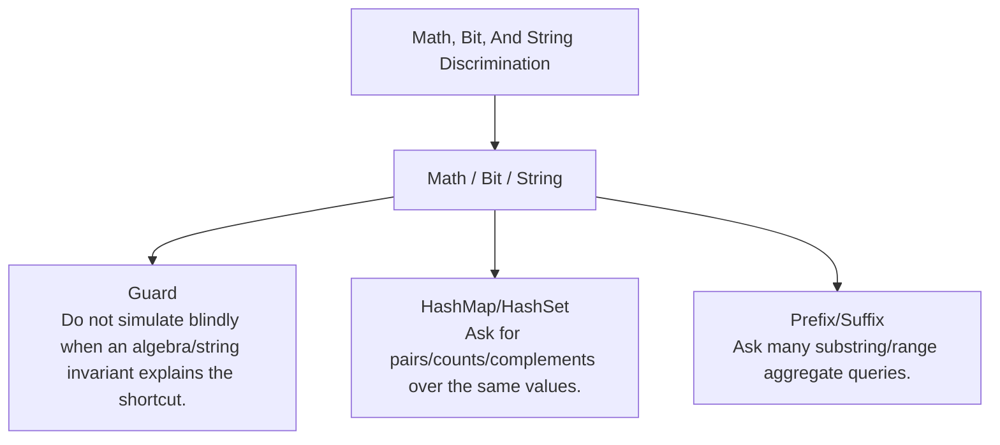

# Math, Bit, And String Discrimination

Hidden algebra, bit, KMP/Z, and string contribution invariants.

Study goal: recognize when this family is the winner, reject the nearest wrong alternatives, and know the smallest requirement change that would switch the pattern.

## Switch Map

## Problems

| Rank | Problem | Winner | Why winner | Near-miss reasoning | Wrong-pattern guard | Java | LeetCode |
|---:|---|---|---|---|---|---|---|
| 106 | Find The Index Of The First Occurrence In A String | Math / Bit / String | Naive matching restarts too far; LPS tells how much matched work remains valid. | HashMap/HashSet: Why not now - The hidden invariant is numeric/string structure, not just lookup.; Missing - Repeated membership/frequency queries.; Minimal change - Ask for pairs/counts/complements over the same values.; Now works - Lookup becomes the dominant operation. Prefix/Suffix: Why not now - Prefix helps range aggregates, but not every string/bit invariant is a range sum.; Missing - Reusable cumulative aggregate over prefixes/suffixes.; Minimal change - Ask many substring/range aggregate queries.; Now works - Cumulative state answers each range cheaply. | Do not simulate blindly when an algebra/string invariant explains the shortcut. | [Java](../../src/main/java/org/chijai/day7/session2/KmpPatterns.java) | [LC](https://leetcode.com/problems/find-the-index-of-the-first-occurrence-in-a-string/) |
| 155 | Repeated Substring Pattern | Math / Bit / String | Testing every divisor naively repeats string comparisons; KMP exposes the repeated border. | HashMap/HashSet: Why not now - The hidden invariant is numeric/string structure, not just lookup.; Missing - Repeated membership/frequency queries.; Minimal change - Ask for pairs/counts/complements over the same values.; Now works - Lookup becomes the dominant operation. Prefix/Suffix: Why not now - Prefix helps range aggregates, but not every string/bit invariant is a range sum.; Missing - Reusable cumulative aggregate over prefixes/suffixes.; Minimal change - Ask many substring/range aggregate queries.; Now works - Cumulative state answers each range cheaply. | Do not simulate blindly when an algebra/string invariant explains the shortcut. | [Java](../../src/main/java/org/chijai/day7/session2/KmpPatterns.java) | [LC](https://leetcode.com/problems/repeated-substring-pattern/) |
| 158 | Longest Happy Prefix | Math / Bit / String | Trying every prefix repeats comparisons; KMP prefix table stores reusable border lengths. | HashMap/HashSet: Why not now - The hidden invariant is numeric/string structure, not just lookup.; Missing - Repeated membership/frequency queries.; Minimal change - Ask for pairs/counts/complements over the same values.; Now works - Lookup becomes the dominant operation. Prefix/Suffix: Why not now - Prefix helps range aggregates, but not every string/bit invariant is a range sum.; Missing - Reusable cumulative aggregate over prefixes/suffixes.; Minimal change - Ask many substring/range aggregate queries.; Now works - Cumulative state answers each range cheaply. | Do not simulate blindly when an algebra/string invariant explains the shortcut. | [Java](../../src/main/java/org/chijai/day7/session2/LongestHappyPrefix.java) | [LC](https://leetcode.com/problems/longest-happy-prefix/) |
| 171 | Add Binary | Math / Bit / String | Converting to integer can overflow and hides the carry invariant. | HashMap/HashSet: Why not now - The hidden invariant is numeric/string structure, not just lookup.; Missing - Repeated membership/frequency queries.; Minimal change - Ask for pairs/counts/complements over the same values.; Now works - Lookup becomes the dominant operation. Prefix/Suffix: Why not now - Prefix helps range aggregates, but not every string/bit invariant is a range sum.; Missing - Reusable cumulative aggregate over prefixes/suffixes.; Minimal change - Ask many substring/range aggregate queries.; Now works - Cumulative state answers each range cheaply. | Do not simulate blindly when an algebra/string invariant explains the shortcut. | [Java](../../src/main/java/org/chijai/day10/session2/AddBinary.java) | [LC](https://leetcode.com/problems/add-binary/) |
| 172 | Count Primes | Math / Bit / String | Testing every number by trial division repeats divisibility work. | HashMap/HashSet: Why not now - The hidden invariant is numeric/string structure, not just lookup.; Missing - Repeated membership/frequency queries.; Minimal change - Ask for pairs/counts/complements over the same values.; Now works - Lookup becomes the dominant operation. Prefix/Suffix: Why not now - Prefix helps range aggregates, but not every string/bit invariant is a range sum.; Missing - Reusable cumulative aggregate over prefixes/suffixes.; Minimal change - Ask many substring/range aggregate queries.; Now works - Cumulative state answers each range cheaply. | Do not simulate blindly when an algebra/string invariant explains the shortcut. | [Java](../../src/main/java/org/chijai/day10/session2/CountPrimes.java) | [LC](https://leetcode.com/problems/count-primes/) |
| 173 | Count Unique Characters of All Substrings of a Given String | Math / Bit / String | Contribution counting avoids enumerating all substrings. | HashMap/HashSet: Why not now - The hidden invariant is numeric/string structure, not just lookup.; Missing - Repeated membership/frequency queries.; Minimal change - Ask for pairs/counts/complements over the same values.; Now works - Lookup becomes the dominant operation. Prefix/Suffix: Why not now - Prefix helps range aggregates, but not every string/bit invariant is a range sum.; Missing - Reusable cumulative aggregate over prefixes/suffixes.; Minimal change - Ask many substring/range aggregate queries.; Now works - Cumulative state answers each range cheaply. | Do not simulate blindly when an algebra/string invariant explains the shortcut. | [Java](../../src/main/java/org/chijai/day10/session2/CountUniqueChars.java) | [LC](https://leetcode.com/problems/count-unique-characters-of-all-substrings-of-a-given-string/) |
| 175 | Shortest Palindrome | Math / Bit / String | Expanding every prefix is expensive; KMP on s + # + reverse(s) finds the prefix length. | HashMap/HashSet: Why not now - The hidden invariant is numeric/string structure, not just lookup.; Missing - Repeated membership/frequency queries.; Minimal change - Ask for pairs/counts/complements over the same values.; Now works - Lookup becomes the dominant operation. Prefix/Suffix: Why not now - Prefix helps range aggregates, but not every string/bit invariant is a range sum.; Missing - Reusable cumulative aggregate over prefixes/suffixes.; Minimal change - Ask many substring/range aggregate queries.; Now works - Cumulative state answers each range cheaply. | Do not simulate blindly when an algebra/string invariant explains the shortcut. | [Java](../../src/main/java/org/chijai/day7/session2/KmpPatterns.java) | [LC](https://leetcode.com/problems/shortest-palindrome/) |

## Drill

For each row, speak: required output -> structure -> constraint/workload -> winner -> why not nearest alternative -> minimal mutation -> new winner.

Rows in this file: 7