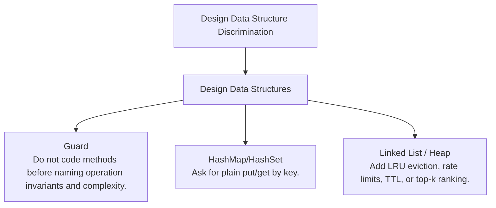

# Design Data Structure Discrimination

Operation contracts, object invariants, and backing-structure choice.

Study goal: recognize when this family is the winner, reject the nearest wrong alternatives, and know the smallest requirement change that would switch the pattern.

## Switch Map

## Problems

| Rank | Problem | Winner | Why winner | Near-miss reasoning | Wrong-pattern guard | Java | LeetCode |
|---:|---|---|---|---|---|---|---|
| 89 | First Unique Number | Design Data Structures | Scanning every query is slow; counts plus ordered candidates make showFirstUnique cheap. | HashMap/HashSet: Why not now - Counts alone cannot answer first-in-order unique.; Missing - Arrival order among still-unique candidates.; Minimal change - Ask only whether a value is unique at the end.; Now works - Frequency count is enough when order is not queried online. Queue / LinkedHashSet: Why not now - This is the backing structure, not the whole API design.; Missing - Operation contract for add and showFirstUnique.; Minimal change - Make it a single batch query instead of a streaming object.; Now works - The design collapses to count then scan. | Do not use counts alone; the query asks for first unique in arrival order. | [Java](../../src/main/java/org/chijai/day4/LinkedList/session3/LruCache.java) | [LC](https://leetcode.com/problems/first-unique-number/) |
| 183 | Encode And Decode Tinyurl | Design Data Structures | The core invariant is key uniqueness and persistence, not string shortening alone. | HashMap/HashSet: Why not now - A single map is usually only one component of the object invariant.; Missing - Only exact key lookup without eviction, order, expiry, or API contract.; Minimal change - Ask for plain put/get by key.; Now works - The design collapses to direct map state. Linked List / Heap: Why not now - The backing data structure depends on the operation contract.; Missing - Recency order or priority/expiry behavior.; Minimal change - Add LRU eviction, rate limits, TTL, or top-k ranking.; Now works - The secondary structure maintains the required operation invariant. | Do not code methods before naming operation invariants and complexity. | [Java](../../src/main/java/org/chijai/design/lld/DesignUrlShortner.java) | [LC](https://leetcode.com/problems/encode-and-decode-tinyurl/) |
| 184 | Design Circular Queue | Design Data Structures | Shifting array elements on enqueue/dequeue is unnecessary and slow. | Stack: Why not now - Queue order is FIFO, not most-recent-first.; Missing - LIFO operation contract.; Minimal change - Ask for stack using queues instead of circular queue.; Now works - Rotation/lazy transfer restores LIFO behavior. Linked List: Why not now - A linked list works, but fixed capacity asks for reusable slots.; Missing - Unbounded capacity or frequent middle removal.; Minimal change - Remove fixed capacity and ask for a general queue.; Now works - Head/tail nodes avoid modulo arithmetic. | Do not use stack reasoning; this is fixed-capacity FIFO with modulo head/tail arithmetic. | [Java](../../src/main/java/org/chijai/day5/stack/session2/StackQueue.java) | [LC](https://leetcode.com/problems/design-circular-queue/) |
| 186 | Design Fraud Pattern Detection | Design Data Structures | Without explicit time-window and identity keys, the detector becomes vague and untestable. | HashMap/HashSet: Why not now - A single map is usually only one component of the object invariant.; Missing - Only exact key lookup without eviction, order, expiry, or API contract.; Minimal change - Ask for plain put/get by key.; Now works - The design collapses to direct map state. Linked List / Heap: Why not now - The backing data structure depends on the operation contract.; Missing - Recency order or priority/expiry behavior.; Minimal change - Add LRU eviction, rate limits, TTL, or top-k ranking.; Now works - The secondary structure maintains the required operation invariant. | Do not code methods before naming operation invariants and complexity. | [Java](../../src/main/java/org/chijai/design/lld/DesignFraudPatternDetection.java) | - |
| 187 | Api Integration Example | Design Data Structures | Integration code fails interviews when error handling and contracts are implicit. | HashMap/HashSet: Why not now - A single map is usually only one component of the object invariant.; Missing - Only exact key lookup without eviction, order, expiry, or API contract.; Minimal change - Ask for plain put/get by key.; Now works - The design collapses to direct map state. Linked List / Heap: Why not now - The backing data structure depends on the operation contract.; Missing - Recency order or priority/expiry behavior.; Minimal change - Add LRU eviction, rate limits, TTL, or top-k ranking.; Now works - The secondary structure maintains the required operation invariant. | Do not code methods before naming operation invariants and complexity. | [Java](../../src/main/java/org/chijai/design/lld/ApiIntegrationExample.java) | - |
| 188 | Design Redis | Design Data Structures | A map alone misses TTL semantics and memory-pressure behavior. | HashMap/HashSet: Why not now - A single map is usually only one component of the object invariant.; Missing - Only exact key lookup without eviction, order, expiry, or API contract.; Minimal change - Ask for plain put/get by key.; Now works - The design collapses to direct map state. Linked List / Heap: Why not now - The backing data structure depends on the operation contract.; Missing - Recency order or priority/expiry behavior.; Minimal change - Add LRU eviction, rate limits, TTL, or top-k ranking.; Now works - The secondary structure maintains the required operation invariant. | Do not code methods before naming operation invariants and complexity. | [Java](../../src/main/java/org/chijai/design/lld/DesignRedis.java) | - |
| 189 | Design Token Bucket Rate Limiter | Design Data Structures | Fixed counters burst badly at window boundaries; token bucket smooths rate with bounded burst. | HashMap/HashSet: Why not now - A single map is usually only one component of the object invariant.; Missing - Only exact key lookup without eviction, order, expiry, or API contract.; Minimal change - Ask for plain put/get by key.; Now works - The design collapses to direct map state. Linked List / Heap: Why not now - The backing data structure depends on the operation contract.; Missing - Recency order or priority/expiry behavior.; Minimal change - Add LRU eviction, rate limits, TTL, or top-k ranking.; Now works - The secondary structure maintains the required operation invariant. | Do not code methods before naming operation invariants and complexity. | [Java](../../src/main/java/org/chijai/design/lld/DesignTokenBucketRateLimiter.java) | - |

## Drill

For each row, speak: required output -> structure -> constraint/workload -> winner -> why not nearest alternative -> minimal mutation -> new winner.

Rows in this file: 7