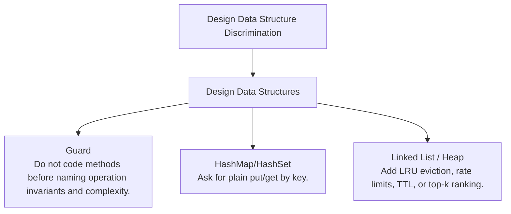

# Design Data Structure Discrimination

Operation contracts, object invariants, and backing-structure choice.

Study goal: recognize when this family is the winner, reject the nearest wrong alternatives, and know the smallest requirement change that would switch the pattern.

## Switch Map

## Problems

| Rank | Problem | Winner | Why winner | Near-miss mutation | Wrong-pattern guard | Java | LeetCode |
|---:|---|---|---|---|---|---|---|
| 199 | Encode And Decode Tinyurl | Design Data Structures | The core invariant is key uniqueness and persistence, not string shortening alone. | HashMap/HashSet: Ask for plain put/get by key. Linked List / Heap: Add LRU eviction, rate limits, TTL, or top-k ranking. | Do not code methods before naming operation invariants and complexity. | [Java](../../src/main/java/org/chijai/design/lld/DesignUrlShortner.java) | [LC](https://leetcode.com/problems/encode-and-decode-tinyurl/) |
| 201 | Design Fraud Pattern Detection | Design Data Structures | Without explicit time-window and identity keys, the detector becomes vague and untestable. | HashMap/HashSet: Ask for plain put/get by key. Linked List / Heap: Add LRU eviction, rate limits, TTL, or top-k ranking. | Do not code methods before naming operation invariants and complexity. | [Java](../../src/main/java/org/chijai/design/lld/DesignFraudPatternDetection.java) | - |
| 202 | Api Integration Example | Design Data Structures | Integration code fails interviews when error handling and contracts are implicit. | HashMap/HashSet: Ask for plain put/get by key. Linked List / Heap: Add LRU eviction, rate limits, TTL, or top-k ranking. | Do not code methods before naming operation invariants and complexity. | [Java](../../src/main/java/org/chijai/design/lld/ApiIntegrationExample.java) | - |
| 203 | Design Redis | Design Data Structures | A map alone misses TTL semantics and memory-pressure behavior. | HashMap/HashSet: Ask for plain put/get by key. Linked List / Heap: Add LRU eviction, rate limits, TTL, or top-k ranking. | Do not code methods before naming operation invariants and complexity. | [Java](../../src/main/java/org/chijai/design/lld/DesignRedis.java) | - |
| 204 | Design Token Bucket Rate Limiter | Design Data Structures | Fixed counters burst badly at window boundaries; token bucket smooths rate with bounded burst. | HashMap/HashSet: Ask for plain put/get by key. Linked List / Heap: Add LRU eviction, rate limits, TTL, or top-k ranking. | Do not code methods before naming operation invariants and complexity. | [Java](../../src/main/java/org/chijai/design/lld/DesignTokenBucketRateLimiter.java) | - |

## Drill

For each row, speak: required output -> structure -> constraint/workload -> winner -> why not nearest alternative -> minimal mutation -> new winner.

Rows in this file: 5