# DSA Master Mind Map

Generated from the same ranked metadata as the interview cockpit. Use it to visualize topic -> sub-pattern -> anchor problem without moving Java source files.

Java source of truth remains `../../src/main/java/org/chijai`; this file is the pattern-tree interface.

```mermaid
flowchart TD
  Root["DSA Interview Retrieval Tree"]
  Solve["Solve rhythm<br/>brute force -> bottleneck -> pattern -> invariant -> code -> dry run"]
  Root --> Solve
  Root --> C01["HashMap / Frequency / Set<br/>5 ranked entries<br/>first rank 1"]
  C01 --> C01P01["Boyer-Moore / frequency<br/>1 problem(s)"]
  C01P01 --> C01P01A["Anchor rank 55<br/>Majority Element"]
  C01 --> C01P02["Frequency count<br/>1 problem(s)"]
  C01P02 --> C01P02A["Anchor rank 9<br/>Valid Anagram"]
  C01 --> C01P03["Hash/frequency<br/>1 problem(s)"]
  C01P03 --> C01P03A["Anchor rank 111<br/>Longest Palindrome"]
  C01 --> C01P04["HashMap/frequency<br/>1 problem(s)"]
  C01P04 --> C01P04A["Anchor rank 57<br/>Ransom Note"]
  C01 --> C01P05["Two pointers / hash<br/>1 problem(s)"]
  C01P05 --> C01P05A["Anchor rank 1<br/>Two Sum"]
  Root --> C02["Binary Search / Answer Search<br/>13 ranked entries<br/>first rank 2"]
  C02 --> C02P01["Binary search boundary<br/>5 problem(s)"]
  C02P01 --> C02P01A["Anchor rank 23<br/>Search In Rotated Sorted Array"]
  C02 --> C02P02["Binary search invariant<br/>3 problem(s)"]
  C02P02 --> C02P02A["Anchor rank 2<br/>Binary Search"]
  C02 --> C02P03["Binary search on answer<br/>4 problem(s)"]
  C02P03 --> C02P03A["Anchor rank 22<br/>Koko Eating Bananas"]
  C02 --> C02P04["HashMap + binary search<br/>1 problem(s)"]
  C02P04 --> C02P04A["Anchor rank 104<br/>Time Based Key Value Store"]
  Root --> C03["Sliding Window<br/>9 ranked entries<br/>first rank 3"]
  C03 --> C03P01["Prefix/window counting<br/>1 problem(s)"]
  C03P01 --> C03P01A["Anchor rank 113<br/>Count Number Of Nice Subarrays"]
  C03 --> C03P02["Sliding window<br/>1 problem(s)"]
  C03P02 --> C03P02A["Anchor rank 49<br/>Longest Substring With At Most K Distinct Characters"]
  C03 --> C03P03["Sliding window / need-have<br/>5 problem(s)"]
  C03P03 --> C03P03A["Anchor rank 5<br/>Minimum Window Substring"]
  C03 --> C03P04["Sliding window / set<br/>1 problem(s)"]
  C03P04 --> C03P04A["Anchor rank 3<br/>Longest Substring Without Repeating Characters"]
  C03 --> C03P05["Sliding window frequency<br/>1 problem(s)"]
  C03P05 --> C03P05A["Anchor rank 56<br/>Find All Anagrams In A String"]
  Root --> C04["Prefix Sum / Prefix-Suffix<br/>2 ranked entries<br/>first rank 4"]
  C04 --> C04P01["Prefix/suffix<br/>1 problem(s)"]
  C04P01 --> C04P01A["Anchor rank 4<br/>Product Of Array Except Self"]
  C04 --> C04P02["Prefix/window counting<br/>1 problem(s)"]
  C04P02 --> C04P02A["Anchor rank 53<br/>Binary Subarrays With Sum"]
  Root --> C05["Linked List Pointers<br/>17 ranked entries<br/>first rank 6"]
  C05 --> C05P01["Fast/slow pointers<br/>2 problem(s)"]
  C05P01 --> C05P01A["Anchor rank 7<br/>Linked List Cycle"]
  C05 --> C05P02["Floyd cycle entry<br/>1 problem(s)"]
  C05P02 --> C05P02A["Anchor rank 59<br/>Linked List Cycle Ii"]
  C05 --> C05P03["HashMap / interleaving copy<br/>1 problem(s)"]
  C05P03 --> C05P03A["Anchor rank 26<br/>Copy List With Random Pointer"]
  C05 --> C05P04["HashMap + doubly linked list<br/>4 problem(s)"]
  C05P04 --> C05P04A["Anchor rank 25<br/>LRU Cache"]
  C05 --> C05P05["Heap / divide and conquer<br/>1 problem(s)"]
  C05P05 --> C05P05A["Anchor rank 11<br/>Merge K Sorted Lists"]
  C05 --> C05P06["Linked list two pointers<br/>1 problem(s)"]
  C05P06 --> C05P06A["Anchor rank 58<br/>Intersection Of Two Linked Lists"]
  C05 --> C05P07["Linked-list reversal groups<br/>5 problem(s)"]
  C05P07 --> C05P07A["Anchor rank 60<br/>Reverse Nodes in k-Group"]
  C05 --> C05P08["Merge / dummy node<br/>1 problem(s)"]
  C05P08 --> C05P08A["Anchor rank 8<br/>Merge Two Sorted Lists"]
  C05 --> C05P09["Pointer reversal<br/>1 problem(s)"]
  C05P09 --> C05P09A["Anchor rank 6<br/>Reverse Linked List"]
  Root --> C06["Two Pointers<br/>6 ranked entries<br/>first rank 10"]
  C06 --> C06P01["Expand around center<br/>1 problem(s)"]
  C06P01 --> C06P01A["Anchor rank 112<br/>Longest Palindromic Substring"]
  C06 --> C06P02["Partition / Dutch flag<br/>1 problem(s)"]
  C06P02 --> C06P02A["Anchor rank 63<br/>Sort Colors"]
  C06 --> C06P03["Two pointers<br/>2 problem(s)"]
  C06P03 --> C06P03A["Anchor rank 10<br/>Valid Palindrome"]
  C06 --> C06P04["Two pointers / hash<br/>1 problem(s)"]
  C06P04 --> C06P04A["Anchor rank 12<br/>Two Sum II - Input Array Is Sorted"]
  C06 --> C06P05["Two pointers / stack<br/>1 problem(s)"]
  C06P05 --> C06P05A["Anchor rank 14<br/>Trapping Rain Water"]
  Root --> C07["Tree BFS / Level Order<br/>2 ranked entries<br/>first rank 15"]
  C07 --> C07P01["Tree BFS / DFS<br/>1 problem(s)"]
  C07P01 --> C07P01A["Anchor rank 62<br/>Binary Tree Right Side View"]
  C07 --> C07P02["Tree traversal<br/>1 problem(s)"]
  C07P02 --> C07P02A["Anchor rank 15<br/>Binary Tree Level Order Traversal"]
  Root --> C08["Tree DFS / Recursion<br/>33 ranked entries<br/>first rank 16"]
  C08 --> C08P01["BST inorder<br/>4 problem(s)"]
  C08P01 --> C08P01A["Anchor rank 27<br/>Kth Smallest Element In A BST"]
  C08 --> C08P02["BST property<br/>5 problem(s)"]
  C08P02 --> C08P02A["Anchor rank 61<br/>Lowest Common Ancestor Of A Binary Search Tree"]
  C08 --> C08P03["Core tree patterns<br/>3 problem(s)"]
  C08P03 --> C08P03A["Anchor rank 28<br/>Balanced Binary Tree"]
  C08 --> C08P04["Tree + graph BFS<br/>2 problem(s)"]
  C08P04 --> C08P04A["Anchor rank 122<br/>All Nodes Distance K in Binary Tree"]
  C08 --> C08P05["Tree BFS/DFS serialization<br/>1 problem(s)"]
  C08P05 --> C08P05A["Anchor rank 78<br/>Serialize And Deserialize Binary Tree"]
  C08 --> C08P06["Tree DFS / stack<br/>4 problem(s)"]
  C08P06 --> C08P06A["Anchor rank 16<br/>Validate Binary Search Tree"]
  C08 --> C08P07["Tree DFS return contract<br/>4 problem(s)"]
  C08P07 --> C08P07A["Anchor rank 17<br/>Lowest Common Ancestor Of A Binary Tree"]
  C08 --> C08P08["Tree DFS/BFS<br/>1 problem(s)"]
  C08P08 --> C08P08A["Anchor rank 70<br/>Invert Binary Tree"]
  C08 --> C08P09["Tree path DFS / global answer<br/>5 problem(s)"]
  C08P09 --> C08P09A["Anchor rank 30<br/>Path Sum Iii"]
  C08 --> C08P10["Tree recursion / hashmap index<br/>4 problem(s)"]
  C08P10 --> C08P10A["Anchor rank 71<br/>Construct Binary Search Tree From Preorder Traversal"]
  Root --> C09["Graph DFS / Components<br/>12 ranked entries<br/>first rank 18"]
  C09 --> C09P01["BFS/DFS coloring<br/>4 problem(s)"]
  C09P01 --> C09P01A["Anchor rank 42<br/>Is Graph Bipartite?"]
  C09 --> C09P02["Graph DFS/BFS clone<br/>1 problem(s)"]
  C09P02 --> C09P02A["Anchor rank 82<br/>Clone Graph"]
  C09 --> C09P03["Matrix DFS<br/>1 problem(s)"]
  C09P03 --> C09P03A["Anchor rank 133<br/>Coloring A Border"]
  C09 --> C09P04["Matrix DFS/BFS<br/>1 problem(s)"]
  C09P04 --> C09P04A["Anchor rank 41<br/>Flood Fill"]
  C09 --> C09P05["Matrix DFS/BFS components<br/>5 problem(s)"]
  C09P05 --> C09P05A["Anchor rank 18<br/>Number Of Islands"]
  Root --> C10["Topological Sort<br/>9 ranked entries<br/>first rank 19"]
  C10 --> C10P01["Topological sort / cycle<br/>8 problem(s)"]
  C10P01 --> C10P01A["Anchor rank 19<br/>Course Schedule"]
  C10 --> C10P02["Topological trimming<br/>1 problem(s)"]
  C10P02 --> C10P02A["Anchor rank 77<br/>Minimum Height Trees"]
  Root --> C11["Graph BFS / Shortest Path<br/>6 ranked entries<br/>first rank 21"]
  C11 --> C11P01["BFS + sorting<br/>1 problem(s)"]
  C11P01 --> C11P01A["Anchor rank 127<br/>K Highest Ranked Items Within A Price Range"]
  C11 --> C11P02["BFS shortest path<br/>1 problem(s)"]
  C11P02 --> C11P02A["Anchor rank 21<br/>Word Ladder"]
  C11 --> C11P03["Dijkstra / graph<br/>1 problem(s)"]
  C11P03 --> C11P03A["Anchor rank 73<br/>Network Delay Time"]
  C11 --> C11P04["Matrix DFS/BFS components<br/>1 problem(s)"]
  C11P04 --> C11P04A["Anchor rank 81<br/>Number Of Provinces"]
  C11 --> C11P05["Multi-source BFS<br/>2 problem(s)"]
  C11P05 --> C11P05A["Anchor rank 31<br/>Rotting Oranges"]
  Root --> C12["Dynamic Programming<br/>32 ranked entries<br/>first rank 33"]
  C12 --> C12P01["0/1 knapsack DP<br/>1 problem(s)"]
  C12P01 --> C12P01A["Anchor rank 45<br/>Partition Equal Subset Sum"]
  C12 --> C12P02["1D DP<br/>2 problem(s)"]
  C12P02 --> C12P02A["Anchor rank 33<br/>House Robber"]
  C12 --> C12P03["2D DP<br/>7 problem(s)"]
  C12P03 --> C12P03A["Anchor rank 175<br/>Edit Distance"]
  C12 --> C12P04["Contribution counting<br/>1 problem(s)"]
  C12P04 --> C12P04A["Anchor rank 194<br/>Partition Labels"]
  C12 --> C12P05["DP / patience sorting<br/>5 problem(s)"]
  C12P05 --> C12P05A["Anchor rank 46<br/>Longest Increasing Subsequence"]
  C12 --> C12P06["DP + binary search<br/>1 problem(s)"]
  C12P06 --> C12P06A["Anchor rank 91<br/>Maximum Profit In Job Scheduling"]
  C12 --> C12P07["Greedy / DP states<br/>6 problem(s)"]
  C12P07 --> C12P07A["Anchor rank 92<br/>Best Time to Buy and Sell Stock"]
  C12 --> C12P08["Grid DP<br/>1 problem(s)"]
  C12P08 --> C12P08A["Anchor rank 44<br/>Unique Paths"]
  C12 --> C12P09["Kadane / DP<br/>1 problem(s)"]
  C12P09 --> C12P09A["Anchor rank 90<br/>Kadane Max Sub Array"]
  C12 --> C12P10["Partition / Dutch flag<br/>2 problem(s)"]
  C12P10 --> C12P10A["Anchor rank 176<br/>Sort Array By Parity"]
  C12 --> C12P11["Unbounded knapsack DP<br/>5 problem(s)"]
  C12P11 --> C12P11A["Anchor rank 34<br/>Coin Change"]
  Root --> C13["Backtracking / Combinatorial DFS<br/>6 ranked entries<br/>first rank 35"]
  C13 --> C13P01["Backtracking / mapping<br/>1 problem(s)"]
  C13P01 --> C13P01A["Anchor rank 151<br/>Letter Combinations Of A Phone Number"]
  C13 --> C13P02["Backtracking permutations<br/>2 problem(s)"]
  C13P02 --> C13P02A["Anchor rank 152<br/>Permutations"]
  C13 --> C13P03["Backtracking reuse<br/>1 problem(s)"]
  C13P03 --> C13P03A["Anchor rank 48<br/>Combination Sum"]
  C13 --> C13P04["Backtracking subsets<br/>1 problem(s)"]
  C13P04 --> C13P04A["Anchor rank 35<br/>Subsets"]
  C13 --> C13P05["DFS backtracking<br/>1 problem(s)"]
  C13P05 --> C13P05A["Anchor rank 50<br/>Word Search"]
  Root --> C14["Stack / Monotonic Stack<br/>17 ranked entries<br/>first rank 36"]
  C14 --> C14P01["Monotonic stack<br/>5 problem(s)"]
  C14P01 --> C14P01A["Anchor rank 38<br/>Daily Temperatures"]
  C14 --> C14P02["Stack<br/>2 problem(s)"]
  C14P02 --> C14P02A["Anchor rank 36<br/>Valid Parentheses"]
  C14 --> C14P03["Stack / expression parsing<br/>1 problem(s)"]
  C14P03 --> C14P03A["Anchor rank 110<br/>Basic Calculator"]
  C14 --> C14P04["Stack design<br/>5 problem(s)"]
  C14P04 --> C14P04A["Anchor rank 136<br/>Min Stack"]
  C14 --> C14P05["Stack/queue design<br/>4 problem(s)"]
  C14P05 --> C14P05A["Anchor rank 96<br/>Sliding Window Maximum"]
  Root --> C15["Heap / Priority Queue<br/>11 ranked entries<br/>first rank 37"]
  C15 --> C15P01["Frequency + heap/bucket<br/>4 problem(s)"]
  C15P01 --> C15P01A["Anchor rank 37<br/>Top K Frequent Elements"]
  C15 --> C15P02["Greedy / heap<br/>1 problem(s)"]
  C15P02 --> C15P02A["Anchor rank 101<br/>Task Scheduler"]
  C15 --> C15P03["Heap / quickselect<br/>1 problem(s)"]
  C15P03 --> C15P03A["Anchor rank 143<br/>K Closest Points To Origin"]
  C15 --> C15P04["Heap / ranking<br/>1 problem(s)"]
  C15P04 --> C15P04A["Anchor rank 198<br/>Award Top K Hotels"]
  C15 --> C15P05["Intervals / heap<br/>1 problem(s)"]
  C15P05 --> C15P05A["Anchor rank 142<br/>Meeting Room"]
  C15 --> C15P06["Min-heap size K<br/>2 problem(s)"]
  C15P06 --> C15P06A["Anchor rank 102<br/>Kth Largest Element In An Array"]
  C15 --> C15P07["Two heaps<br/>1 problem(s)"]
  C15P07 --> C15P07A["Anchor rank 52<br/>Find Median From Data Stream"]
  Root --> C16["Intervals / Sorting Greedy<br/>6 ranked entries<br/>first rank 39"]
  C16 --> C16P01["Greedy<br/>2 problem(s)"]
  C16P01 --> C16P01A["Anchor rank 148<br/>Gas Station"]
  C16 --> C16P02["Intervals / merge<br/>1 problem(s)"]
  C16P02 --> C16P02A["Anchor rank 147<br/>Intervals"]
  C16 --> C16P03["Intervals / sorting<br/>3 problem(s)"]
  C16P03 --> C16P03A["Anchor rank 39<br/>Meeting Rooms Ii"]
  Root --> C17["Trie<br/>14 ranked entries<br/>first rank 40"]
  C17 --> C17P01["Binary trie / bit<br/>4 problem(s)"]
  C17P01 --> C17P01A["Anchor rank 161<br/>Maximum XOR of Two Numbers in an Array"]
  C17 --> C17P02["Trie<br/>6 problem(s)"]
  C17P02 --> C17P02A["Anchor rank 40<br/>Implement Trie (Prefix Tree)"]
  C17 --> C17P03["Trie / ranking<br/>1 problem(s)"]
  C17P03 --> C17P03A["Anchor rank 209<br/>Hotel Reviews"]
  C17 --> C17P04["Trie + backtracking<br/>1 problem(s)"]
  C17P04 --> C17P04A["Anchor rank 105<br/>Word Search Ii"]
  C17 --> C17P05["Trie + DFS wildcard<br/>2 problem(s)"]
  C17P05 --> C17P05A["Anchor rank 166<br/>Longest Word in Dictionary"]
  Root --> C18["Union Find / DSU<br/>1 ranked entries<br/>first rank 76"]
  C18 --> C18P01["Union Find / graph<br/>1 problem(s)"]
  C18P01 --> C18P01A["Anchor rank 76<br/>Accounts Merge"]
  Root --> C19["Math / Bit / String<br/>7 ranked entries<br/>first rank 109"]
  C19 --> C19P01["Bit/string addition<br/>1 problem(s)"]
  C19P01 --> C19P01A["Anchor rank 195<br/>Add Binary"]
  C19 --> C19P02["Contribution counting<br/>1 problem(s)"]
  C19P02 --> C19P02A["Anchor rank 197<br/>Count Unique Characters of All Substrings of a Given String"]
  C19 --> C19P03["KMP / rolling hash<br/>1 problem(s)"]
  C19P03 --> C19P03A["Anchor rank 164<br/>Longest Happy Prefix"]
  C19 --> C19P04["KMP string matching<br/>3 problem(s)"]
  C19P04 --> C19P04A["Anchor rank 109<br/>Find The Index Of The First Occurrence In A String"]
  C19 --> C19P05["Math / sieve<br/>1 problem(s)"]
  C19P05 --> C19P05A["Anchor rank 196<br/>Count Primes"]
  Root --> C20["Basics / Implementation<br/>3 ranked entries<br/>first rank 158"]
  C20 --> C20P01["Contribution counting<br/>1 problem(s)"]
  C20P01 --> C20P01A["Anchor rank 207<br/>Distinct Subsequences II"]
  C20 --> C20P02["Matrix boundary traversal<br/>1 problem(s)"]
  C20P02 --> C20P02A["Anchor rank 158<br/>Spiral Matrix"]
  C20 --> C20P03["Parsing / edge cases<br/>1 problem(s)"]
  C20P03 --> C20P03A["Anchor rank 159<br/>String To Integer Atoi"]
  Root --> C21["Design Data Structures<br/>5 ranked entries<br/>first rank 208"]
  C21 --> C21P01["LLD / data structures<br/>1 problem(s)"]
  C21P01 --> C21P01A["Anchor rank 212<br/>Design Redis"]
  C21 --> C21P02["LLD / domain modeling<br/>1 problem(s)"]
  C21P02 --> C21P02A["Anchor rank 210<br/>Design Fraud Pattern Detection"]
  C21 --> C21P03["LLD / rate limiting<br/>1 problem(s)"]
  C21P03 --> C21P03A["Anchor rank 213<br/>Design Token Bucket Rate Limiter"]
  C21 --> C21P04["LLD / URL shortener<br/>1 problem(s)"]
  C21P04 --> C21P04A["Anchor rank 208<br/>Encode And Decode Tinyurl"]
  C21 --> C21P05["LLD/API integration<br/>1 problem(s)"]
  C21P05 --> C21P05A["Anchor rank 211<br/>Api Integration Example"]
```

## How To Use

1. Start at the problem signal and pick the likely pattern branch.
2. Speak the invariant before coding.
3. Use the anchor problem as the mental template.
4. Open the linked pattern file when a branch feels weak.

## Pattern Files

| Pattern | Problems | First rank | File |
|---|---:|---:|---|
| HashMap / Frequency / Set | 5 | 1 | [01_hashmap_hashset.md](patterns/01_hashmap_hashset.md) |
| Binary Search / Answer Search | 13 | 2 | [02_binary_search.md](patterns/02_binary_search.md) |
| Sliding Window | 9 | 3 | [03_sliding_window.md](patterns/03_sliding_window.md) |
| Prefix Sum / Prefix-Suffix | 2 | 4 | [04_prefix_suffix.md](patterns/04_prefix_suffix.md) |
| Linked List Pointers | 17 | 6 | [05_linked_list.md](patterns/05_linked_list.md) |
| Two Pointers | 6 | 10 | [06_two_pointers.md](patterns/06_two_pointers.md) |
| Tree BFS / Level Order | 2 | 15 | [07_tree_bfs.md](patterns/07_tree_bfs.md) |
| Tree DFS / Recursion | 33 | 16 | [08_tree_dfs.md](patterns/08_tree_dfs.md) |
| Graph DFS / Components | 12 | 18 | [09_graph_dfs.md](patterns/09_graph_dfs.md) |
| Topological Sort | 9 | 19 | [10_topological_sort.md](patterns/10_topological_sort.md) |
| Graph BFS / Shortest Path | 6 | 21 | [11_graph_bfs.md](patterns/11_graph_bfs.md) |
| Dynamic Programming | 32 | 33 | [12_dynamic_programming.md](patterns/12_dynamic_programming.md) |
| Backtracking / Combinatorial DFS | 6 | 35 | [13_backtracking.md](patterns/13_backtracking.md) |
| Stack / Monotonic Stack | 17 | 36 | [14_stack.md](patterns/14_stack.md) |
| Heap / Priority Queue | 11 | 37 | [15_heap.md](patterns/15_heap.md) |
| Intervals / Sorting Greedy | 6 | 39 | [16_intervals_greedy.md](patterns/16_intervals_greedy.md) |
| Trie | 14 | 40 | [17_trie.md](patterns/17_trie.md) |
| Union Find / DSU | 1 | 76 | [18_union_find.md](patterns/18_union_find.md) |
| Math / Bit / String | 7 | 109 | [19_math_bit_string.md](patterns/19_math_bit_string.md) |
| Basics / Implementation | 3 | 158 | [20_core_basics.md](patterns/20_core_basics.md) |
| Design Data Structures | 5 | 208 | [21_design_lld.md](patterns/21_design_lld.md) |

Total ranked entries: 216