# DSA Master Mind Map

Generated from the same ranked metadata as the interview cockpit. Use it to visualize topic -> sub-pattern -> anchor problem without moving Java source files.

Java source of truth remains `../../src/main/java/org/chijai`; this file is the pattern-tree interface.

```mermaid
flowchart TD
  Root["DSA Interview Retrieval Tree"]
  Solve["Solve rhythm<br/>brute force -> bottleneck -> pattern -> invariant -> code -> dry run"]
  Root --> Solve
  Root --> C01["HashMap / Frequency / Set<br/>5 ranked entries<br/>first rank 1"]
  C01 --> C01P01["Boyer-Moore / frequency<br/>1 problem(s)"]
  C01P01 --> C01P01A["Anchor rank 51<br/>Majority Element"]
  C01 --> C01P02["Frequency count<br/>1 problem(s)"]
  C01P02 --> C01P02A["Anchor rank 9<br/>Valid Anagram"]
  C01 --> C01P03["Hash/frequency<br/>1 problem(s)"]
  C01P03 --> C01P03A["Anchor rank 107<br/>Longest Palindrome"]
  C01 --> C01P04["HashMap/frequency<br/>1 problem(s)"]
  C01P04 --> C01P04A["Anchor rank 53<br/>Ransom Note"]
  C01 --> C01P05["Two pointers / hash<br/>1 problem(s)"]
  C01P05 --> C01P05A["Anchor rank 1<br/>Two Sum"]
  Root --> C02["Binary Search / Answer Search<br/>13 ranked entries<br/>first rank 2"]
  C02 --> C02P01["Binary search boundary<br/>5 problem(s)"]
  C02P01 --> C02P01A["Anchor rank 23<br/>Search In Rotated Sorted Array"]
  C02 --> C02P02["Binary search invariant<br/>3 problem(s)"]
  C02P02 --> C02P02A["Anchor rank 2<br/>Binary Search"]
  C02 --> C02P03["Binary search on answer<br/>4 problem(s)"]
  C02P03 --> C02P03A["Anchor rank 22<br/>Koko Eating Bananas"]
  C02 --> C02P04["HashMap + binary search<br/>1 problem(s)"]
  C02P04 --> C02P04A["Anchor rank 101<br/>Time Based Key Value Store"]
  Root --> C03["Sliding Window<br/>7 ranked entries<br/>first rank 3"]
  C03 --> C03P01["DP / patience sorting<br/>1 problem(s)"]
  C03P01 --> C03P01A["Anchor rank 207<br/>Longest Continuous Increasing Subsequence"]
  C03 --> C03P02["Prefix/window counting<br/>1 problem(s)"]
  C03P02 --> C03P02A["Anchor rank 109<br/>Count Number Of Nice Subarrays"]
  C03 --> C03P03["Queue / stream<br/>1 problem(s)"]
  C03P03 --> C03P03A["Anchor rank 81<br/>Moving Average From Data Stream"]
  C03 --> C03P04["Sliding window<br/>1 problem(s)"]
  C03P04 --> C03P04A["Anchor rank 47<br/>Longest Substring With At Most K Distinct Characters"]
  C03 --> C03P05["Sliding window / need-have<br/>1 problem(s)"]
  C03P05 --> C03P05A["Anchor rank 5<br/>Minimum Window Substring"]
  C03 --> C03P06["Sliding window / set<br/>1 problem(s)"]
  C03P06 --> C03P06A["Anchor rank 3<br/>Longest Substring Without Repeating Characters"]
  C03 --> C03P07["Sliding window frequency<br/>1 problem(s)"]
  C03P07 --> C03P07A["Anchor rank 52<br/>Find All Anagrams In A String"]
  Root --> C04["Prefix Sum / Prefix-Suffix<br/>2 ranked entries<br/>first rank 4"]
  C04 --> C04P01["Prefix/suffix<br/>1 problem(s)"]
  C04P01 --> C04P01A["Anchor rank 4<br/>Product Of Array Except Self"]
  C04 --> C04P02["Prefix/window counting<br/>1 problem(s)"]
  C04P02 --> C04P02A["Anchor rank 50<br/>Binary Subarrays With Sum"]
  Root --> C05["Linked List Pointers<br/>14 ranked entries<br/>first rank 6"]
  C05 --> C05P01["Fast/slow pointers<br/>2 problem(s)"]
  C05P01 --> C05P01A["Anchor rank 7<br/>Linked List Cycle"]
  C05 --> C05P02["Floyd cycle entry<br/>1 problem(s)"]
  C05P02 --> C05P02A["Anchor rank 55<br/>Linked List Cycle II"]
  C05 --> C05P03["HashMap / interleaving copy<br/>1 problem(s)"]
  C05P03 --> C05P03A["Anchor rank 26<br/>Copy List With Random Pointer"]
  C05 --> C05P04["HashMap + doubly linked list<br/>2 problem(s)"]
  C05P04 --> C05P04A["Anchor rank 25<br/>LRU Cache"]
  C05 --> C05P05["Linked list two pointers<br/>1 problem(s)"]
  C05P05 --> C05P05A["Anchor rank 54<br/>Intersection Of Two Linked Lists"]
  C05 --> C05P06["Linked-list reversal groups<br/>5 problem(s)"]
  C05P06 --> C05P06A["Anchor rank 56<br/>Reverse Nodes in k-Group"]
  C05 --> C05P07["Merge / dummy node<br/>1 problem(s)"]
  C05P07 --> C05P07A["Anchor rank 8<br/>Merge Two Sorted Lists"]
  C05 --> C05P08["Pointer reversal<br/>1 problem(s)"]
  C05P08 --> C05P08A["Anchor rank 6<br/>Reverse Linked List"]
  Root --> C06["Two Pointers<br/>6 ranked entries<br/>first rank 10"]
  C06 --> C06P01["Expand around center<br/>1 problem(s)"]
  C06P01 --> C06P01A["Anchor rank 108<br/>Longest Palindromic Substring"]
  C06 --> C06P02["Partition / Dutch flag<br/>1 problem(s)"]
  C06P02 --> C06P02A["Anchor rank 59<br/>Sort Colors"]
  C06 --> C06P03["Two pointers<br/>2 problem(s)"]
  C06P03 --> C06P03A["Anchor rank 10<br/>Valid Palindrome"]
  C06 --> C06P04["Two pointers / hash<br/>1 problem(s)"]
  C06P04 --> C06P04A["Anchor rank 12<br/>Two Sum II - Input Array Is Sorted"]
  C06 --> C06P05["Two pointers / stack<br/>1 problem(s)"]
  C06P05 --> C06P05A["Anchor rank 14<br/>Trapping Rain Water"]
  Root --> C07["Heap / Priority Queue<br/>12 ranked entries<br/>first rank 11"]
  C07 --> C07P01["Frequency + heap/bucket<br/>4 problem(s)"]
  C07P01 --> C07P01A["Anchor rank 36<br/>Top K Frequent Elements"]
  C07 --> C07P02["Greedy / heap<br/>1 problem(s)"]
  C07P02 --> C07P02A["Anchor rank 98<br/>Task Scheduler"]
  C07 --> C07P03["Heap / divide and conquer<br/>1 problem(s)"]
  C07P03 --> C07P03A["Anchor rank 11<br/>Merge K Sorted Lists"]
  C07 --> C07P04["Heap / quickselect<br/>1 problem(s)"]
  C07P04 --> C07P04A["Anchor rank 138<br/>K Closest Points To Origin"]
  C07 --> C07P05["Heap / ranking<br/>1 problem(s)"]
  C07P05 --> C07P05A["Anchor rank 174<br/>Award Top K Hotels"]
  C07 --> C07P06["Intervals / heap<br/>1 problem(s)"]
  C07P06 --> C07P06A["Anchor rank 38<br/>Meeting Rooms II"]
  C07 --> C07P07["Min-heap size K<br/>2 problem(s)"]
  C07P07 --> C07P07A["Anchor rank 99<br/>Kth Largest Element In An Array"]
  C07 --> C07P08["Two heaps<br/>1 problem(s)"]
  C07P08 --> C07P08A["Anchor rank 49<br/>Find Median From Data Stream"]
  Root --> C08["Tree BFS / Level Order<br/>2 ranked entries<br/>first rank 15"]
  C08 --> C08P01["Tree BFS / DFS<br/>1 problem(s)"]
  C08P01 --> C08P01A["Anchor rank 58<br/>Binary Tree Right Side View"]
  C08 --> C08P02["Tree traversal<br/>1 problem(s)"]
  C08P02 --> C08P02A["Anchor rank 15<br/>Binary Tree Level Order Traversal"]
  Root --> C09["Tree DFS / Recursion<br/>31 ranked entries<br/>first rank 16"]
  C09 --> C09P01["BST inorder<br/>4 problem(s)"]
  C09P01 --> C09P01A["Anchor rank 27<br/>Kth Smallest Element in a BST"]
  C09 --> C09P02["BST property<br/>5 problem(s)"]
  C09P02 --> C09P02A["Anchor rank 57<br/>Lowest Common Ancestor Of A Binary Search Tree"]
  C09 --> C09P03["Core tree patterns<br/>1 problem(s)"]
  C09P03 --> C09P03A["Anchor rank 28<br/>Diameter of Binary Tree"]
  C09 --> C09P04["Tree + graph BFS<br/>2 problem(s)"]
  C09P04 --> C09P04A["Anchor rank 118<br/>All Nodes Distance K in Binary Tree"]
  C09 --> C09P05["Tree BFS/DFS serialization<br/>1 problem(s)"]
  C09P05 --> C09P05A["Anchor rank 73<br/>Serialize And Deserialize Binary Tree"]
  C09 --> C09P06["Tree DFS / stack<br/>4 problem(s)"]
  C09P06 --> C09P06A["Anchor rank 16<br/>Validate Binary Search Tree"]
  C09 --> C09P07["Tree DFS return contract<br/>4 problem(s)"]
  C09P07 --> C09P07A["Anchor rank 17<br/>Lowest Common Ancestor Of A Binary Tree"]
  C09 --> C09P08["Tree DFS/BFS<br/>1 problem(s)"]
  C09P08 --> C09P08A["Anchor rank 64<br/>Invert Binary Tree"]
  C09 --> C09P09["Tree path DFS / global answer<br/>5 problem(s)"]
  C09P09 --> C09P09A["Anchor rank 29<br/>Path Sum III"]
  C09 --> C09P10["Tree recursion / hashmap index<br/>4 problem(s)"]
  C09P10 --> C09P10A["Anchor rank 65<br/>Construct Binary Search Tree From Preorder Traversal"]
  Root --> C10["Graph DFS / Components<br/>12 ranked entries<br/>first rank 18"]
  C10 --> C10P01["BFS/DFS coloring<br/>4 problem(s)"]
  C10P01 --> C10P01A["Anchor rank 41<br/>Is Graph Bipartite?"]
  C10 --> C10P02["Graph DFS/BFS clone<br/>1 problem(s)"]
  C10P02 --> C10P02A["Anchor rank 77<br/>Clone Graph"]
  C10 --> C10P03["Matrix DFS<br/>1 problem(s)"]
  C10P03 --> C10P03A["Anchor rank 129<br/>Coloring A Border"]
  C10 --> C10P04["Matrix DFS/BFS<br/>1 problem(s)"]
  C10P04 --> C10P04A["Anchor rank 40<br/>Flood Fill"]
  C10 --> C10P05["Matrix DFS/BFS components<br/>5 problem(s)"]
  C10P05 --> C10P05A["Anchor rank 18<br/>Number Of Islands"]
  Root --> C11["Topological Sort<br/>9 ranked entries<br/>first rank 19"]
  C11 --> C11P01["Topological sort / cycle<br/>8 problem(s)"]
  C11P01 --> C11P01A["Anchor rank 19<br/>Course Schedule"]
  C11 --> C11P02["Topological trimming<br/>1 problem(s)"]
  C11P02 --> C11P02A["Anchor rank 71<br/>Minimum Height Trees"]
  Root --> C12["Graph BFS / Shortest Path<br/>6 ranked entries<br/>first rank 21"]
  C12 --> C12P01["BFS + sorting<br/>1 problem(s)"]
  C12P01 --> C12P01A["Anchor rank 123<br/>K Highest Ranked Items Within A Price Range"]
  C12 --> C12P02["BFS shortest path<br/>1 problem(s)"]
  C12P02 --> C12P02A["Anchor rank 21<br/>Word Ladder"]
  C12 --> C12P03["Dijkstra / graph<br/>1 problem(s)"]
  C12P03 --> C12P03A["Anchor rank 67<br/>Network Delay Time"]
  C12 --> C12P04["Matrix DFS/BFS components<br/>1 problem(s)"]
  C12P04 --> C12P04A["Anchor rank 75<br/>Number Of Provinces"]
  C12 --> C12P05["Multi-source BFS<br/>2 problem(s)"]
  C12P05 --> C12P05A["Anchor rank 30<br/>Rotting Oranges"]
  Root --> C13["Dynamic Programming<br/>26 ranked entries<br/>first rank 32"]
  C13 --> C13P01["0/1 knapsack DP<br/>1 problem(s)"]
  C13P01 --> C13P01A["Anchor rank 44<br/>Partition Equal Subset Sum"]
  C13 --> C13P02["1D DP<br/>2 problem(s)"]
  C13P02 --> C13P02A["Anchor rank 32<br/>House Robber"]
  C13 --> C13P03["2D DP<br/>7 problem(s)"]
  C13P03 --> C13P03A["Anchor rank 169<br/>Edit Distance"]
  C13 --> C13P04["Contribution counting<br/>1 problem(s)"]
  C13P04 --> C13P04A["Anchor rank 194<br/>Distinct Subsequences II"]
  C13 --> C13P05["DP / patience sorting<br/>3 problem(s)"]
  C13P05 --> C13P05A["Anchor rank 45<br/>Longest Increasing Subsequence"]
  C13 --> C13P06["DP + binary search<br/>1 problem(s)"]
  C13P06 --> C13P06A["Anchor rank 87<br/>Maximum Profit In Job Scheduling"]
  C13 --> C13P07["Greedy / DP states<br/>1 problem(s)"]
  C13P07 --> C13P07A["Anchor rank 192<br/>Best Time to Buy and Sell Stock III"]
  C13 --> C13P08["Grid DP<br/>1 problem(s)"]
  C13P08 --> C13P08A["Anchor rank 43<br/>Unique Paths"]
  C13 --> C13P09["Kadane / DP<br/>1 problem(s)"]
  C13P09 --> C13P09A["Anchor rank 88<br/>Kadane Max Sub Array"]
  C13 --> C13P10["Stock DP variants<br/>3 problem(s)"]
  C13P10 --> C13P10A["Anchor rank 190<br/>Best Time to Buy and Sell Stock with Transaction Fee"]
  C13 --> C13P11["Unbounded knapsack DP<br/>5 problem(s)"]
  C13P11 --> C13P11A["Anchor rank 33<br/>Coin Change"]
  Root --> C14["Backtracking / Combinatorial DFS<br/>6 ranked entries<br/>first rank 34"]
  C14 --> C14P01["Backtracking / mapping<br/>1 problem(s)"]
  C14P01 --> C14P01A["Anchor rank 146<br/>Letter Combinations Of A Phone Number"]
  C14 --> C14P02["Backtracking permutations<br/>2 problem(s)"]
  C14P02 --> C14P02A["Anchor rank 147<br/>Permutations"]
  C14 --> C14P03["Backtracking reuse<br/>1 problem(s)"]
  C14P03 --> C14P03A["Anchor rank 46<br/>Combination Sum"]
  C14 --> C14P04["Backtracking subsets<br/>1 problem(s)"]
  C14P04 --> C14P04A["Anchor rank 34<br/>Subsets"]
  C14 --> C14P05["DFS backtracking<br/>1 problem(s)"]
  C14P05 --> C14P05A["Anchor rank 48<br/>Word Search"]
  Root --> C15["Stack / Monotonic Stack<br/>14 ranked entries<br/>first rank 35"]
  C15 --> C15P01["Monotonic stack<br/>3 problem(s)"]
  C15P01 --> C15P01A["Anchor rank 37<br/>Daily Temperatures"]
  C15 --> C15P02["Stack<br/>2 problem(s)"]
  C15P02 --> C15P02A["Anchor rank 35<br/>Valid Parentheses"]
  C15 --> C15P03["Stack / expression parsing<br/>1 problem(s)"]
  C15P03 --> C15P03A["Anchor rank 106<br/>Basic Calculator"]
  C15 --> C15P04["Stack design<br/>5 problem(s)"]
  C15P04 --> C15P04A["Anchor rank 132<br/>Min Stack"]
  C15 --> C15P05["Stack/queue design<br/>3 problem(s)"]
  C15P05 --> C15P05A["Anchor rank 93<br/>Sliding Window Maximum"]
  Root --> C16["Trie<br/>14 ranked entries<br/>first rank 39"]
  C16 --> C16P01["Binary trie / bit<br/>4 problem(s)"]
  C16P01 --> C16P01A["Anchor rank 156<br/>Maximum XOR of Two Numbers in an Array"]
  C16 --> C16P02["Trie<br/>6 problem(s)"]
  C16P02 --> C16P02A["Anchor rank 39<br/>Implement Trie (Prefix Tree)"]
  C16 --> C16P03["Trie / ranking<br/>1 problem(s)"]
  C16P03 --> C16P03A["Anchor rank 185<br/>Hotel Reviews"]
  C16 --> C16P04["Trie + backtracking<br/>1 problem(s)"]
  C16P04 --> C16P04A["Anchor rank 102<br/>Word Search II"]
  C16 --> C16P05["Trie + DFS wildcard<br/>2 problem(s)"]
  C16P05 --> C16P05A["Anchor rank 160<br/>Longest Word in Dictionary"]
  Root --> C17["Intervals / Sorting Greedy<br/>7 ranked entries<br/>first rank 42"]
  C17 --> C17P01["DP / patience sorting<br/>1 problem(s)"]
  C17P01 --> C17P01A["Anchor rank 206<br/>Maximum Length of Pair Chain"]
  C17 --> C17P02["Greedy last-occurrence boundary<br/>1 problem(s)"]
  C17P02 --> C17P02A["Anchor rank 145<br/>Partition Labels"]
  C17 --> C17P03["Intervals / merge<br/>3 problem(s)"]
  C17P03 --> C17P03A["Anchor rank 92<br/>Meeting Rooms"]
  C17 --> C17P04["Intervals / sorting<br/>2 problem(s)"]
  C17P04 --> C17P04A["Anchor rank 42<br/>Minimum Number Of Arrows To Burst Balloons"]
  Root --> C18["Union Find / DSU<br/>1 ranked entries<br/>first rank 70"]
  C18 --> C18P01["Union Find / graph<br/>1 problem(s)"]
  C18P01 --> C18P01A["Anchor rank 70<br/>Accounts Merge"]
  Root --> C19["Greedy<br/>4 ranked entries<br/>first rank 72"]
  C19 --> C19P01["Greedy<br/>2 problem(s)"]
  C19P01 --> C19P01A["Anchor rank 76<br/>Gas Station"]
  C19 --> C19P02["Greedy / DP states<br/>2 problem(s)"]
  C19P02 --> C19P02A["Anchor rank 72<br/>Best Time to Buy and Sell Stock"]
  Root --> C20["Design Data Structures<br/>7 ranked entries<br/>first rank 89"]
  C20 --> C20P01["HashMap + doubly linked list<br/>1 problem(s)"]
  C20P01 --> C20P01A["Anchor rank 89<br/>First Unique Number"]
  C20 --> C20P02["LLD / data structures<br/>1 problem(s)"]
  C20P02 --> C20P02A["Anchor rank 188<br/>Design Redis"]
  C20 --> C20P03["LLD / domain modeling<br/>1 problem(s)"]
  C20P03 --> C20P03A["Anchor rank 186<br/>Design Fraud Pattern Detection"]
  C20 --> C20P04["LLD / rate limiting<br/>1 problem(s)"]
  C20P04 --> C20P04A["Anchor rank 189<br/>Design Token Bucket Rate Limiter"]
  C20 --> C20P05["LLD / URL shortener<br/>1 problem(s)"]
  C20P05 --> C20P05A["Anchor rank 183<br/>Encode And Decode Tinyurl"]
  C20 --> C20P06["LLD/API integration<br/>1 problem(s)"]
  C20P06 --> C20P06A["Anchor rank 187<br/>Api Integration Example"]
  C20 --> C20P07["Stack/queue design<br/>1 problem(s)"]
  C20P07 --> C20P07A["Anchor rank 184<br/>Design Circular Queue"]
  Root --> C21["Math / Bit / String<br/>7 ranked entries<br/>first rank 105"]
  C21 --> C21P01["Bit/string addition<br/>1 problem(s)"]
  C21P01 --> C21P01A["Anchor rank 171<br/>Add Binary"]
  C21 --> C21P02["Contribution counting<br/>1 problem(s)"]
  C21P02 --> C21P02A["Anchor rank 173<br/>Count Unique Characters of All Substrings of a Given String"]
  C21 --> C21P03["KMP / rolling hash<br/>1 problem(s)"]
  C21P03 --> C21P03A["Anchor rank 158<br/>Longest Happy Prefix"]
  C21 --> C21P04["KMP string matching<br/>3 problem(s)"]
  C21P04 --> C21P04A["Anchor rank 105<br/>Find The Index Of The First Occurrence In A String"]
  C21 --> C21P05["Math / sieve<br/>1 problem(s)"]
  C21P05 --> C21P05A["Anchor rank 172<br/>Count Primes"]
  Root --> C22["Basics / Implementation<br/>2 ranked entries<br/>first rank 153"]
  C22 --> C22P01["Matrix boundary traversal<br/>1 problem(s)"]
  C22P01 --> C22P01A["Anchor rank 153<br/>Spiral Matrix"]
  C22 --> C22P02["Parsing / edge cases<br/>1 problem(s)"]
  C22P02 --> C22P02A["Anchor rank 154<br/>String To Integer Atoi"]
```

## How To Use

1. Start at the problem signal and pick the likely pattern branch.
2. Speak the invariant before coding.
3. Use the anchor problem as the mental template.
4. Open the linked pattern file when a branch feels weak.

## Pattern Files

| Pattern | Problems | First rank | File |
|---|---:|---:|---|
| HashMap / Frequency / Set | 5 | 1 | [01_hashmap_hashset.md](patterns/01_hashmap_hashset.md) |
| Binary Search / Answer Search | 13 | 2 | [02_binary_search.md](patterns/02_binary_search.md) |
| Sliding Window | 7 | 3 | [03_sliding_window.md](patterns/03_sliding_window.md) |
| Prefix Sum / Prefix-Suffix | 2 | 4 | [04_prefix_suffix.md](patterns/04_prefix_suffix.md) |
| Linked List Pointers | 14 | 6 | [05_linked_list.md](patterns/05_linked_list.md) |
| Two Pointers | 6 | 10 | [06_two_pointers.md](patterns/06_two_pointers.md) |
| Heap / Priority Queue | 12 | 11 | [07_heap.md](patterns/07_heap.md) |
| Tree BFS / Level Order | 2 | 15 | [08_tree_bfs.md](patterns/08_tree_bfs.md) |
| Tree DFS / Recursion | 31 | 16 | [09_tree_dfs.md](patterns/09_tree_dfs.md) |
| Graph DFS / Components | 12 | 18 | [10_graph_dfs.md](patterns/10_graph_dfs.md) |
| Topological Sort | 9 | 19 | [11_topological_sort.md](patterns/11_topological_sort.md) |
| Graph BFS / Shortest Path | 6 | 21 | [12_graph_bfs.md](patterns/12_graph_bfs.md) |
| Dynamic Programming | 26 | 32 | [13_dynamic_programming.md](patterns/13_dynamic_programming.md) |
| Backtracking / Combinatorial DFS | 6 | 34 | [14_backtracking.md](patterns/14_backtracking.md) |
| Stack / Monotonic Stack | 14 | 35 | [15_stack.md](patterns/15_stack.md) |
| Trie | 14 | 39 | [16_trie.md](patterns/16_trie.md) |
| Intervals / Sorting Greedy | 7 | 42 | [17_intervals_greedy.md](patterns/17_intervals_greedy.md) |
| Union Find / DSU | 1 | 70 | [18_union_find.md](patterns/18_union_find.md) |
| Greedy | 4 | 72 | [22_greedy.md](patterns/22_greedy.md) |
| Design Data Structures | 7 | 89 | [19_design_lld.md](patterns/19_design_lld.md) |
| Math / Bit / String | 7 | 105 | [20_math_bit_string.md](patterns/20_math_bit_string.md) |
| Basics / Implementation | 2 | 153 | [21_core_basics.md](patterns/21_core_basics.md) |

Total ranked entries: 207