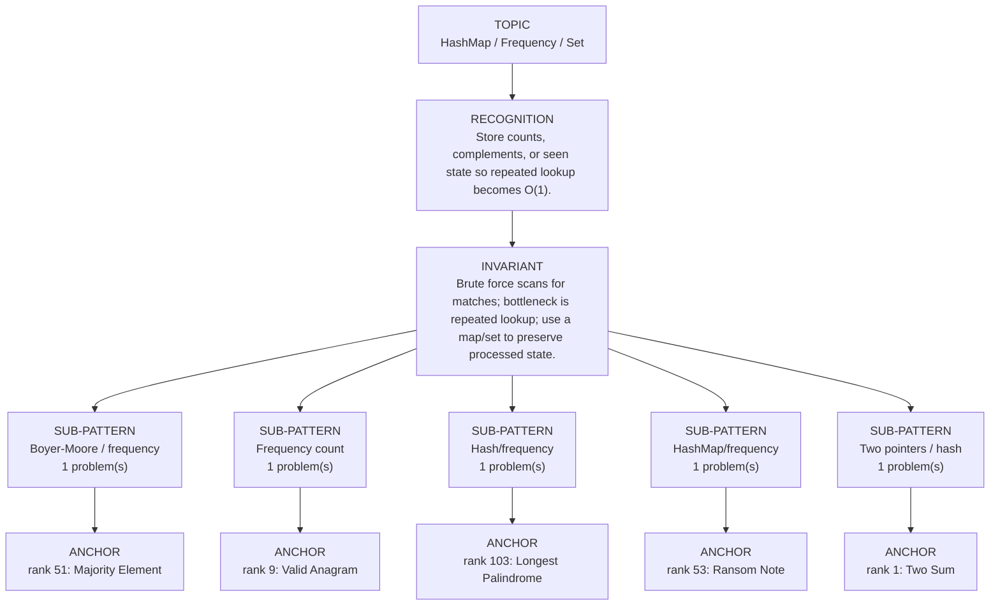

# HashMap / Frequency / Set

Focused pattern pass. Keep the global rank order inside this file; lower rank means a higher score in the current interview-ROI heuristic.

## Recognition Signal

Store counts, complements, or seen state so repeated lookup becomes O(1).

## Interview Move

Brute force scans for matches; bottleneck is repeated lookup; use a map/set to preserve processed state.

## Pattern Taxonomy Map

## Problems

| Global Rank | Phase | Problem | Pattern | Java | LeetCode | One-line recall | Crisp code idea |
|---:|---|---|---|---|---|---|---|
| 1 | Phase 1 - No Red Flags | Two Sum | Two pointers / hash | [Java](../../../src/main/java/org/chijai/day1/Arrays/session2/Three3Sum2Sum.java) | [LC](https://leetcode.com/problems/two-sum/) | Use a HashMap from value to index; each number asks whether its complement was seen. | Scan left to right, if target - nums[i] exists return indices, otherwise store nums[i] -> i. |
| 9 | Phase 1 - No Red Flags | Valid Anagram | Frequency count | [Java](../../../src/main/java/org/chijai/day3/session3/ValidAnagram.java) | [LC](https://leetcode.com/problems/valid-anagram/) | Two strings are anagrams when every character count nets to zero. | Reject different lengths, increment for s and decrement for t, then verify all counts zero. |
| 51 | Phase 2 - Strong Core | Majority Element | Boyer-Moore / frequency | [Java](../../../src/main/java/org/chijai/day1/Arrays/session2/MajorityElement.java) | [LC](https://leetcode.com/problems/majority-element/) | Boyer-Moore cancels different values; surviving candidate is majority after optional verification. | Track candidate and count; reset at zero, increment on match, decrement otherwise. |
| 53 | Phase 2 - Strong Core | Ransom Note | HashMap/frequency | [Java](../../../src/main/java/org/chijai/day1/Arrays/session1/RansomNote.java) | [LC](https://leetcode.com/problems/ransom-note/) | Count magazine chars, then spend counts for ransom; fail when a needed char is missing. | Build int[26] or map from magazine, decrement while scanning ransomNote, return false below zero. |
| 103 | Phase 3 - Important | Longest Palindrome | Hash/frequency | [Java](../../../src/main/java/org/chijai/day3/session3/LongestPalindrome.java) | [LC](https://leetcode.com/problems/longest-palindrome/) | At most one character may have an odd count; pairs from all counts build the longest palindrome. | Count chars, add count / 2 * 2, and allow one odd center if any count is odd. |

## Drill

1. Read only the problem title.
2. Say brute force, bottleneck, pattern, invariant, code idea, dry run.
3. Open Java only after the spoken answer is complete.
4. Code one missed problem from blank before moving to another pattern.