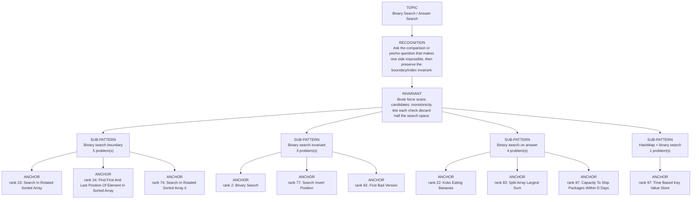

# Binary Search / Answer Search

Focused pattern pass. Keep the global rank order inside this file; lower rank means a higher score in the current interview-ROI heuristic.

## Recognition Signal

Ask the comparison or yes/no question that makes one side impossible, then preserve the boundary/index invariant.

## Interview Move

Brute force scans candidates; monotonicity lets each check discard half the search space.

## Pattern Taxonomy Map

## Problems

| Global Rank | Phase | Problem | Pattern | Java | LeetCode | One-line recall | Crisp code idea |
|---:|---|---|---|---|---|---|---|
| 2 | Phase 1 - No Red Flags | Binary Search | Binary search invariant | [Java](../../../src/main/java/org/chijai/day2/session1/BinarySearch.java) | [LC](https://leetcode.com/problems/binary-search/) | Sorted order plus mid comparison proves which half cannot contain the target. | While left <= right, compare nums[mid] to target; move left/right, return index or -1. |
| 22 | Phase 1 - No Red Flags | Koko Eating Bananas | Binary search on answer | [Java](../../../src/main/java/org/chijai/day2/session2/KokoBananas.java) | [LC](https://leetcode.com/problems/koko-eating-bananas/) | Binary search the minimum speed; if speed k works, every higher speed also works. | Search speed 1..maxPile, compute total ceil(pile/speed) hours, keep smaller working speed. |
| 23 | Phase 1 - No Red Flags | Search In Rotated Sorted Array | Binary search boundary | [Java](../../../src/main/java/org/chijai/day2/session1/SearchRange.java) | [LC](https://leetcode.com/problems/search-in-rotated-sorted-array/) | At every step one half is sorted; keep it only if target lies inside its bounds. | Compare nums[left] and nums[mid] to identify sorted half, then discard the half that cannot contain target. |
| 24 | Phase 1 - No Red Flags | Find First And Last Position Of Element In Sorted Array | Binary search boundary | [Java](../../../src/main/java/org/chijai/day2/session1/SearchRange.java) | [LC](https://leetcode.com/problems/find-first-and-last-position-of-element-in-sorted-array/) | Run boundary binary search twice: first index >= target, and last index <= target. | findFirst moves left on nums[mid] >= target; findLast moves right on nums[mid] <= target. |
| 74 | Phase 3 - Important | Search In Rotated Sorted Array Ii | Binary search boundary | [Java](../../../src/main/java/org/chijai/day2/session1/SearchRange.java) | [LC](https://leetcode.com/problems/search-in-rotated-sorted-array-ii/) | With duplicates, shrink both ends only when left, mid, and right are equal and ordering is ambiguous. | If nums[left]==nums[mid]==nums[right], left++ and right--; otherwise reuse sorted-half logic. |
| 77 | Phase 3 - Important | Search Insert Position | Binary search invariant | [Java](../../../src/main/java/org/chijai/day2/session1/BinarySearch.java) | [LC](https://leetcode.com/problems/search-insert-position/) | Find the first index whose value is >= target; if none, insert at n. | Binary search with answer initialized to n; when nums[mid] >= target save mid and move right left. |
| 81 | Phase 3 - Important | Find Peak Element | Binary search boundary | [Java](../../../src/main/java/org/chijai/day2/session1/SearchRange.java) | [LC](https://leetcode.com/problems/find-peak-element/) | Compare mid with mid+1; the rising side must contain a peak. | If nums[mid] > nums[mid+1], move right to mid; else move left to mid+1 until left == right. |
| 82 | Phase 3 - Important | First Bad Version | Binary search invariant | [Java](../../../src/main/java/org/chijai/day2/session1/BinarySearch.java) | [LC](https://leetcode.com/problems/first-bad-version/) | Find the first true in a false...false,true...true version predicate. | If isBadVersion(mid), save mid and search left; otherwise search right. |
| 83 | Phase 3 - Important | Split Array Largest Sum | Binary search on answer | [Java](../../../src/main/java/org/chijai/day2/session2/AGGRCOW.java) | [LC](https://leetcode.com/problems/split-array-largest-sum/) | Binary search the smallest allowed subarray sum that can split into at most m pieces. | Search max(nums)..sum(nums), greedily count pieces when current sum would exceed mid. |
| 87 | Phase 3 - Important | Capacity To Ship Packages Within D Days | Binary search on answer | [Java](../../../src/main/java/org/chijai/day2/session2/KokoBananas.java) | [LC](https://leetcode.com/problems/capacity-to-ship-packages-within-d-days/) | Binary search minimum capacity; capacity works if one pass ships within D days. | Search maxWeight..sumWeight, count days by accumulating load until capacity would overflow. |
| 88 | Phase 3 - Important | Minimum Number Of Days To Make M Bouquets | Binary search on answer | [Java](../../../src/main/java/org/chijai/day2/session2/KokoBananas.java) | [LC](https://leetcode.com/problems/minimum-number-of-days-to-make-m-bouquets/) | Binary search days; by a given day, consecutive bloomed flowers form bouquets greedily. | Reject if m*k > n; for each day mid, count adjacent bloomed streaks of length k. |
| 97 | Phase 3 - Important | Time Based Key Value Store | HashMap + binary search | [Java](../../../src/main/java/org/chijai/day2/session3/TimeBasedKeyValueStore.java) | [LC](https://leetcode.com/problems/time-based-key-value-store/) | Map each key to timestamped values in order; binary search finds latest timestamp <= query. | Append on set; on get binary search the key's list for rightmost timestamp <= target. |
| 127 | Phase 4 - Secondary | Sqrtx | Binary search boundary | [Java](../../../src/main/java/org/chijai/day2/session1/SearchRange.java) | [LC](https://leetcode.com/problems/sqrtx/) | Find the largest integer mid whose square is <= x. | Binary search 0..x, cast mid*mid to long, save mid when square <= x. |

## Drill

1. Read only the problem title.
2. Say brute force, bottleneck, pattern, invariant, code idea, dry run.
3. Open Java only after the spoken answer is complete.
4. Code one missed problem from blank before moving to another pattern.