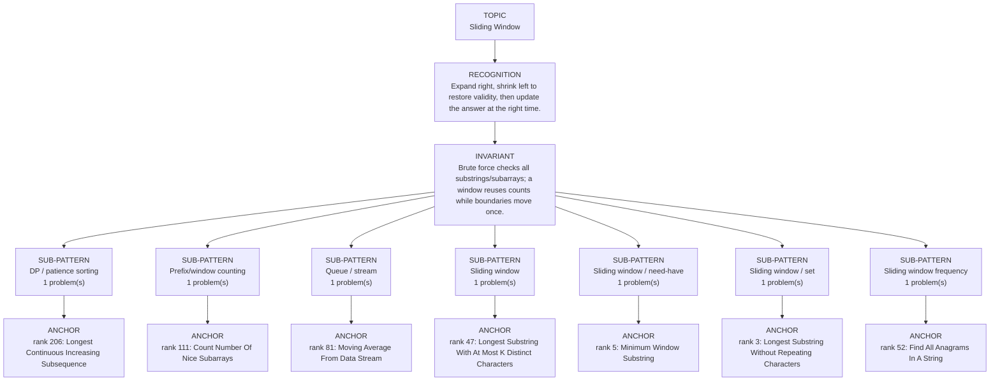

# Sliding Window

Focused pattern pass. Keep the global rank order inside this file; lower rank means a higher score in the current interview-ROI heuristic.

## Recognition Signal

Expand right, shrink left to restore validity, then update the answer at the right time.

## Interview Move

Brute force checks all substrings/subarrays; a window reuses counts while boundaries move once.

## Pattern Taxonomy Map

## Problems

| Global Rank | Phase | Problem | Pattern | Java | LeetCode | One-line recall | Crisp code idea |
|---:|---|---|---|---|---|---|---|
| 3 | Phase 1 - No Red Flags | Longest Substring Without Repeating Characters | Sliding window / set | [Java](../../../src/main/java/org/chijai/day3/session1/LongestSubString.java) | [LC](https://leetcode.com/problems/longest-substring-without-repeating-characters/) | Window must contain unique chars; move left past duplicates. | Expand right, while duplicate exists remove left, then update max. |
| 5 | Phase 1 - No Red Flags | Minimum Window Substring | Sliding window / need-have | [Java](../../../src/main/java/org/chijai/day3/session1/MinimumWindowSubstring.java) | [LC](https://leetcode.com/problems/minimum-window-substring/) | Expand until all needed chars are covered, then shrink while still valid. | Build need map, update have on right, while have == needCount update best and remove left. |
| 47 | Phase 2 - Strong Core | Longest Substring With At Most K Distinct Characters | Sliding window | [Java](../../../src/main/java/org/chijai/day3/session1/AtMostKDistinct.java) | [LC](https://leetcode.com/problems/longest-substring-with-at-most-k-distinct-characters/) | Keep a frequency map with at most k distinct chars; shrink until valid. | Expand right count, while distinct > k decrement/remove left, update max length. |
| 52 | Phase 2 - Strong Core | Find All Anagrams In A String | Sliding window frequency | [Java](../../../src/main/java/org/chijai/day3/session1/FindAllAnagramsInAString.java) | - | Slide a fixed-size frequency window and record starts where counts match p. | Maintain difference counts or match count across a window of length p. |
| 81 | Phase 3 - Important | Moving Average From Data Stream | Queue / stream | [Java](../../../src/main/java/org/chijai/day7/session1/heap/MovingAverage.java) | [LC](https://leetcode.com/problems/moving-average-from-data-stream/) | Queue last size values and running sum; average is sum divided by queue size. | Offer val, add to sum, if queue too large poll and subtract, return sum/count. |
| 111 | Phase 4 - Secondary | Count Number Of Nice Subarrays | Prefix/window counting | [Java](../../../src/main/java/org/chijai/day3/session2/prefix/suffix/NiceSubArrays.java) | [LC](https://leetcode.com/problems/count-number-of-nice-subarrays/) | Exactly k odds equals atMost(k) minus atMost(k-1), or prefix count of odd count. | Count subarrays with at most k odd numbers using a sliding left pointer, subtract atMost(k-1). |
| 206 | Phase 5 - If Time | Longest Continuous Increasing Subsequence | DP / patience sorting | [Java](../../../src/main/java/org/chijai/day9/dp/session2/LIS.java) | [LC](https://leetcode.com/problems/longest-continuous-increasing-subsequence/) | Continuous means subarray, so reset the current streak whenever nums[i] <= nums[i-1]. | Scan once, current = nums[i] > nums[i-1] ? current + 1 : 1, update best. |

## Drill

1. Read only the problem title.
2. Say brute force, bottleneck, pattern, invariant, code idea, dry run.
3. Open Java only after the spoken answer is complete.
4. Code one missed problem from blank before moving to another pattern.