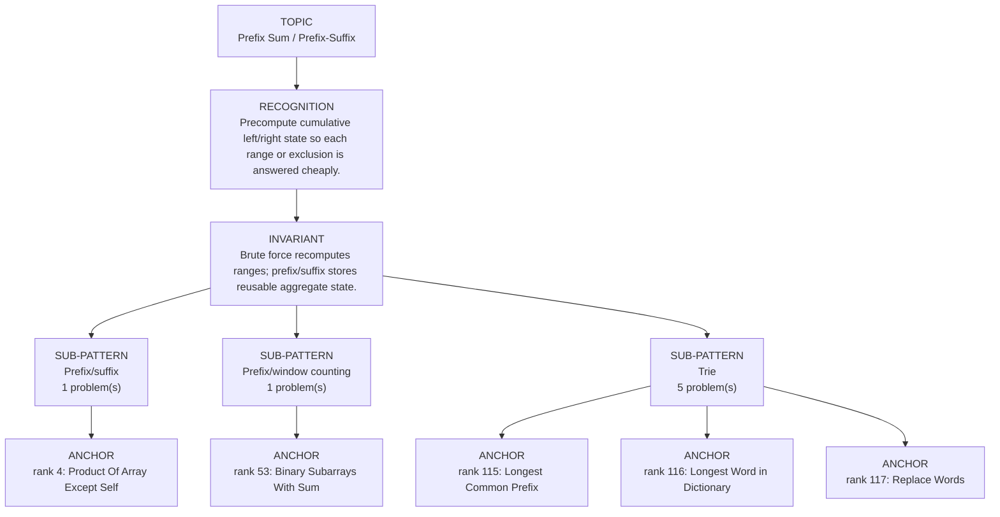

# Prefix Sum / Prefix-Suffix

Focused pattern pass. Keep the global rank order inside this file; lower rank means a higher score in the current interview-ROI heuristic.

## Recognition Signal

Precompute cumulative left/right state so each range or exclusion is answered cheaply.

## Interview Move

Brute force recomputes ranges; prefix/suffix stores reusable aggregate state.

## Pattern Taxonomy Map

## Problems

| Global Rank | Phase | Problem | Pattern | Java | LeetCode | One-line recall | Crisp code idea |
|---:|---|---|---|---|---|---|---|
| 4 | Phase 1 - No Red Flags | Product Of Array Except Self | Prefix/suffix | [Java](../../../src/main/java/org/chijai/day3/session2/prefix/suffix/ProductOfArrayExceptSelf.java) | [LC](https://leetcode.com/problems/product-of-array-except-self/) | Answer is product of everything left times everything right, no division needed. | Fill answer with left products, then multiply by running right product from the end. |
| 53 | Phase 2 - Strong Core | Binary Subarrays With Sum | Prefix/window counting | [Java](../../../src/main/java/org/chijai/day3/session2/prefix/suffix/NiceSubArrays.java) | [LC](https://leetcode.com/problems/binary-subarrays-with-sum/) | For binary arrays, exact goal count can be atMost(goal) - atMost(goal-1). | Implement atMost(sum): expand right, shrink while sum > goal, add window length. |
| 115 | Phase 4 - Secondary | Longest Common Prefix | Trie | [Java](../../../src/main/java/org/chijai/day10/session1/trie/TriePrefix.java) | [LC](https://leetcode.com/problems/longest-common-prefix/) | Precompute cumulative left/right state so each range or exclusion is answered cheaply. | Build prefix/suffix arrays or running aggregates, then combine in O(1) per query/index. |
| 116 | Phase 4 - Secondary | Longest Word in Dictionary | Trie | [Java](../../../src/main/java/org/chijai/day10/session1/trie/TriePrefix.java) | [LC](https://leetcode.com/problems/longest-word-in-dictionary/) | Precompute cumulative left/right state so each range or exclusion is answered cheaply. | Build prefix/suffix arrays or running aggregates, then combine in O(1) per query/index. |
| 117 | Phase 4 - Secondary | Replace Words | Trie | [Java](../../../src/main/java/org/chijai/day10/session1/trie/TriePrefix.java) | [LC](https://leetcode.com/problems/replace-words/) | Precompute cumulative left/right state so each range or exclusion is answered cheaply. | Build prefix/suffix arrays or running aggregates, then combine in O(1) per query/index. |
| 118 | Phase 4 - Secondary | Search Suggestions System | Trie | [Java](../../../src/main/java/org/chijai/day10/session1/trie/TriePrefix.java) | [LC](https://leetcode.com/problems/search-suggestions-system/) | Precompute cumulative left/right state so each range or exclusion is answered cheaply. | Build prefix/suffix arrays or running aggregates, then combine in O(1) per query/index. |
| 119 | Phase 4 - Secondary | Short Encoding of Words | Trie | [Java](../../../src/main/java/org/chijai/day10/session1/trie/TriePrefix.java) | [LC](https://leetcode.com/problems/short-encoding-of-words/) | Precompute cumulative left/right state so each range or exclusion is answered cheaply. | Build prefix/suffix arrays or running aggregates, then combine in O(1) per query/index. |

## Drill

1. Read only the problem title.
2. Say brute force, bottleneck, pattern, invariant, code idea, dry run.
3. Open Java only after the spoken answer is complete.
4. Code one missed problem from blank before moving to another pattern.