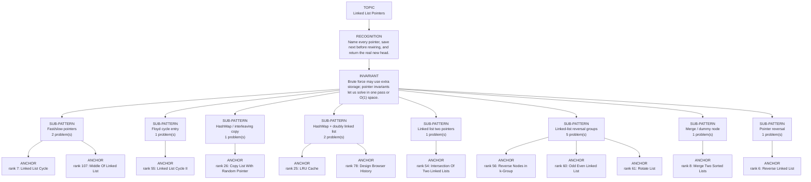

# Linked List Pointers

Focused pattern pass. Keep the global rank order inside this file; lower rank means a higher score in the current interview-ROI heuristic.

## Recognition Signal

Name every pointer, save next before rewiring, and return the real new head.

## Interview Move

Brute force may use extra storage; pointer invariants let us solve in one pass or O(1) space.

## Pattern Taxonomy Map

## Problems

| Global Rank | Phase | Problem | Pattern | Java | LeetCode | One-line recall | Crisp code idea |
|---:|---|---|---|---|---|---|---|
| 6 | Phase 1 - No Red Flags | Reverse Linked List | Pointer reversal | [Java](../../../src/main/java/org/chijai/day4/LinkedList/session1/ReverseLinkedList.java) | [LC](https://leetcode.com/problems/reverse-linked-list/) | Reverse one edge at a time after saving next. | Keep prev, curr, next; curr.next = prev; advance; return prev. |
| 7 | Phase 1 - No Red Flags | Linked List Cycle | Fast/slow pointers | [Java](../../../src/main/java/org/chijai/day4/LinkedList/session1/LinkedListCycle.java) | [LC](https://leetcode.com/problems/linked-list-cycle/) | Slow and fast meet only if a cycle exists. | Move slow one, fast two while fast and fast.next exist; meeting means cycle. |
| 8 | Phase 1 - No Red Flags | Merge Two Sorted Lists | Merge / dummy node | [Java](../../../src/main/java/org/chijai/day4/LinkedList/session4/Merge2SortedLists.java) | [LC](https://leetcode.com/problems/merge-two-sorted-lists/) | Dummy tail repeatedly takes the smaller current node. | Compare l1/l2, append smaller to tail, advance, then attach remainder. |
| 25 | Phase 1 - No Red Flags | LRU Cache | HashMap + doubly linked list | [Java](../../../src/main/java/org/chijai/day4/LinkedList/session3/LruCache.java) | [LC](https://leetcode.com/problems/lru-cache/) | HashMap gives O(1) lookup; doubly linked list keeps recency order. | On get/put move node to front; if over capacity remove tail and map entry. |
| 26 | Phase 1 - No Red Flags | Copy List With Random Pointer | HashMap / interleaving copy | [Java](../../../src/main/java/org/chijai/day4/LinkedList/session2/CopyListWithRandomPointer.java) | - | Clone nodes then connect next/random using old-to-new mapping or interleaving. | First create clones in map, second assign clone.next and clone.random from mapped nodes. |
| 54 | Phase 2 - Strong Core | Intersection Of Two Linked Lists | Linked list two pointers | [Java](../../../src/main/java/org/chijai/day4/LinkedList/session1/Intersection.java) | [LC](https://leetcode.com/problems/intersection-of-two-linked-lists/) | Switch heads at null; equal path lengths make pointers meet at intersection or null. | Move a and b one step; when null redirect to other head; return when a == b. |
| 55 | Phase 2 - Strong Core | Linked List Cycle II | Floyd cycle entry | [Java](../../../src/main/java/org/chijai/day4/LinkedList/session4/LinkedListCycleII.java) | - | After slow/fast meet, move one pointer from head and both one step to find entry. | Detect meeting, reset one pointer to head, move both until equal. |
| 56 | Phase 2 - Strong Core | Reverse Nodes in k-Group | Linked-list reversal groups | [Java](../../../src/main/java/org/chijai/day4/LinkedList/session2/ReverseLinkedListNodesK.java) | [LC](https://leetcode.com/problems/reverse-nodes-in-k-group/) | Only reverse a group after confirming k nodes exist. | Use dummy/groupPrev, locate kth, reverse group, reconnect, advance groupPrev. |
| 60 | Phase 2 - Strong Core | Odd Even Linked List | Linked-list reversal groups | [Java](../../../src/main/java/org/chijai/day4/LinkedList/session2/ReverseLinkedListNodesK.java) | [LC](https://leetcode.com/problems/odd-even-linked-list/) | Keep odd and even chains separately, then attach even head after odd tail. | Move odd to even.next and even to odd.next until even chain ends, then connect. |
| 61 | Phase 2 - Strong Core | Rotate List | Linked-list reversal groups | [Java](../../../src/main/java/org/chijai/day4/LinkedList/session2/ReverseLinkedListNodesK.java) | [LC](https://leetcode.com/problems/rotate-list/) | Make the list circular, then break at length - k % length. | Count length and tail, connect tail to head, move to new tail, break circle. |
| 62 | Phase 2 - Strong Core | Swap Nodes In Pairs | Linked-list reversal groups | [Java](../../../src/main/java/org/chijai/day4/LinkedList/session2/ReverseLinkedListNodesK.java) | [LC](https://leetcode.com/problems/swap-nodes-in-pairs/) | Dummy node lets you swap each adjacent pair without special-casing head. | For each pair, rewire prev->second, first->second.next, second->first. |
| 78 | Phase 3 - Important | Design Browser History | HashMap + doubly linked list | [Java](../../../src/main/java/org/chijai/day4/LinkedList/session3/LruCache.java) | [LC](https://leetcode.com/problems/design-browser-history/) | Back/forward are pointer moves over a history chain; visit drops forward history. | Maintain current node; visit creates current.next and clears forward branch. |
| 107 | Phase 3 - Important | Middle Of Linked List | Fast/slow pointers | [Java](../../../src/main/java/org/chijai/day4/LinkedList/session4/MiddleOfLinkedList.java) | - | Name every pointer, save next before rewiring, and return the real new head. | Use dummy when head can change; update prev/current/next in a fixed order. |
| 190 | Phase 5 - If Time | Reverse Linked List II | Linked-list reversal groups | [Java](../../../src/main/java/org/chijai/day4/LinkedList/session2/ReverseLinkedListNodesK.java) | [LC](https://leetcode.com/problems/reverse-linked-list-ii/) | Use a dummy and reverse exactly the sublist between left and right. | Find node before left, then head-insert nodes from the sublist for right-left steps. |

## Drill

1. Read only the problem title.
2. Say brute force, bottleneck, pattern, invariant, code idea, dry run.
3. Open Java only after the spoken answer is complete.
4. Code one missed problem from blank before moving to another pattern.