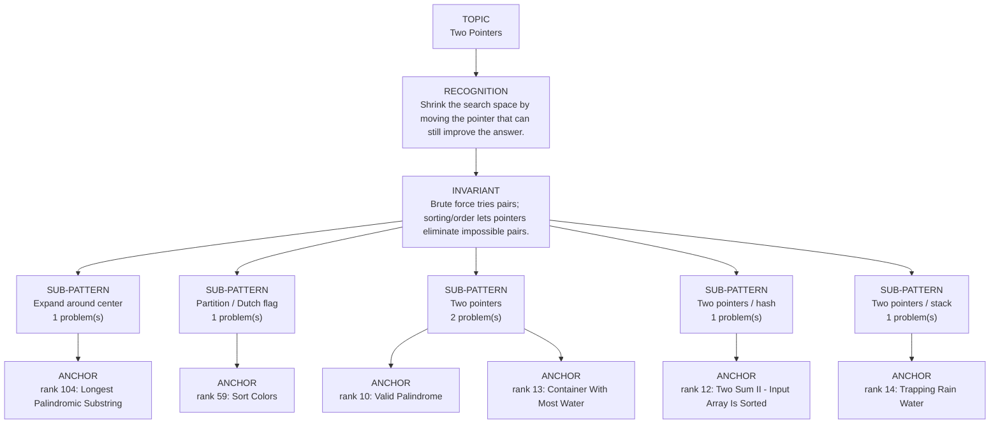

# Two Pointers

Focused pattern pass. Keep the global rank order inside this file; lower rank means a higher score in the current interview-ROI heuristic.

## Recognition Signal

Shrink the search space by moving the pointer that can still improve the answer.

## Interview Move

Brute force tries pairs; sorting/order lets pointers eliminate impossible pairs.

## Pattern Taxonomy Map

## Problems

| Global Rank | Phase | Problem | Pattern | Java | LeetCode | One-line recall | Crisp code idea |
|---:|---|---|---|---|---|---|---|
| 10 | Phase 1 - No Red Flags | Valid Palindrome | Two pointers | [Java](../../../src/main/java/org/chijai/day3/session3/ValidPalindrome.java) | - | Skip non-alphanumeric chars and compare normalized ends while pointers move inward. | Advance left/right past invalid chars, compare lowercase chars, stop when pointers cross. |
| 12 | Phase 1 - No Red Flags | Two Sum II - Input Array Is Sorted | Two pointers / hash | [Java](../../../src/main/java/org/chijai/day1/Arrays/session2/Three3Sum2Sum.java) | [LC](https://leetcode.com/problems/two-sum-ii-input-array-is-sorted/) | Sorted input lets left/right shrink toward the target sum. | Compare nums[left] + nums[right] with target; move left if small, right if large. |
| 13 | Phase 1 - No Red Flags | Container With Most Water | Two pointers | [Java](../../../src/main/java/org/chijai/day1/Arrays/session2/ContainerWithMostWater.java) | - | Area is limited by shorter wall, so move the shorter side inward. | Compute area at left/right, update max, move pointer with smaller height. |
| 14 | Phase 1 - No Red Flags | Trapping Rain Water | Two pointers / stack | [Java](../../../src/main/java/org/chijai/day3/session2/prefix/suffix/TrappingRainwater.java) | [LC](https://leetcode.com/problems/trapping-rain-water/) | Water at a side depends on the smaller max boundary seen so far. | Move the side with lower height, update max, add max-height when bounded. |
| 59 | Phase 2 - Strong Core | Sort Colors | Partition / Dutch flag | [Java](../../../src/main/java/org/chijai/day1/Arrays/session1/SortColors.java) | [LC](https://leetcode.com/problems/sort-colors/) | Dutch flag keeps < pivot, unknown, and > pivot regions with three pointers. | Use low, mid, high; swap 0 to low, 2 to high, advance mid on 1. |
| 104 | Phase 3 - Important | Longest Palindromic Substring | Expand around center | [Java](../../../src/main/java/org/chijai/day3/session3/LongestPalindromicSubstring.java) | [LC](https://leetcode.com/problems/longest-palindromic-substring/) | Expand around every odd and even center and keep the longest span. | For each index, expand(i,i) and expand(i,i+1), update best start/length. |

## Drill

1. Read only the problem title.
2. Say brute force, bottleneck, pattern, invariant, code idea, dry run.
3. Open Java only after the spoken answer is complete.
4. Code one missed problem from blank before moving to another pattern.