# Tree DFS / Recursion

Focused pattern pass. Keep the global rank order inside this file; lower rank means a higher score in the current interview-ROI heuristic.

## Recognition Signal

Define exactly what the helper returns, combine left/right, and update global answer separately if needed.

## Interview Move

Brute force revisits subtrees; helper return contracts summarize each subtree once.

## Pattern Taxonomy Map

```mermaid
flowchart TD
  Topic["TOPIC<br/>Tree DFS / Recursion"]
  Recognition["RECOGNITION<br/>Define exactly what the helper returns, combine left/right, and update global answer separately if needed."]
  Invariant["INVARIANT<br/>Brute force revisits subtrees; helper return contracts summarize each subtree once."]
  Topic --> Recognition --> Invariant
  Invariant --> Sub01["SUB-PATTERN<br/>BST inorder<br/>4 problem(s)"]
  Sub01 --> Sub01A01["ANCHOR<br/>rank 27: Kth Smallest Element in a BST"]
  Sub01 --> Sub01A02["ANCHOR<br/>rank 117: Recover Binary Search Tree"]
  Sub01 --> Sub01A03["ANCHOR<br/>rank 118: Binary Search Tree Iterator"]
  Invariant --> Sub02["SUB-PATTERN<br/>BST property<br/>5 problem(s)"]
  Sub02 --> Sub02A01["ANCHOR<br/>rank 57: Lowest Common Ancestor Of A Binary Search Tree"]
  Sub02 --> Sub02A02["ANCHOR<br/>rank 111: Insert Into A Binary Search Tree"]
  Sub02 --> Sub02A03["ANCHOR<br/>rank 112: Minimum Absolute Difference In BST"]
  Invariant --> Sub03["SUB-PATTERN<br/>Core tree patterns<br/>1 problem(s)"]
  Sub03 --> Sub03A01["ANCHOR<br/>rank 28: Diameter of Binary Tree"]
  Invariant --> Sub04["SUB-PATTERN<br/>Tree + graph BFS<br/>2 problem(s)"]
  Sub04 --> Sub04A01["ANCHOR<br/>rank 115: All Nodes Distance K in Binary Tree"]
  Sub04 --> Sub04A02["ANCHOR<br/>rank 116: Amount of Time for Binary Tree to Be Infected"]
  Invariant --> Sub05["SUB-PATTERN<br/>Tree BFS/DFS serialization<br/>1 problem(s)"]
  Sub05 --> Sub05A01["ANCHOR<br/>rank 72: Serialize And Deserialize Binary Tree"]
  Invariant --> Sub06["SUB-PATTERN<br/>Tree DFS / stack<br/>4 problem(s)"]
  Sub06 --> Sub06A01["ANCHOR<br/>rank 16: Validate Binary Search Tree"]
  Sub06 --> Sub06A02["ANCHOR<br/>rank 63: Binary Tree Inorder Traversal"]
  Sub06 --> Sub06A03["ANCHOR<br/>rank 109: Binary Tree Postorder Traversal"]
  Invariant --> Sub07["SUB-PATTERN<br/>Tree DFS return contract<br/>4 problem(s)"]
  Sub07 --> Sub07A01["ANCHOR<br/>rank 17: Lowest Common Ancestor Of A Binary Tree"]
  Sub07 --> Sub07A02["ANCHOR<br/>rank 192: Lowest Common Ancestor Of A Binary Tree II"]
  Sub07 --> Sub07A03["ANCHOR<br/>rank 193: Lowest Common Ancestor Of A Binary Tree III"]
  Invariant --> Sub08["SUB-PATTERN<br/>Tree DFS/BFS<br/>1 problem(s)"]
  Sub08 --> Sub08A01["ANCHOR<br/>rank 64: Invert Binary Tree"]
  Invariant --> Sub09["SUB-PATTERN<br/>Tree path DFS / global answer<br/>5 problem(s)"]
  Sub09 --> Sub09A01["ANCHOR<br/>rank 29: Path Sum III"]
  Sub09 --> Sub09A02["ANCHOR<br/>rank 66: Sum Root To Leaf Numbers"]
  Sub09 --> Sub09A03["ANCHOR<br/>rank 94: Binary Tree Maximum Path Sum"]
  Invariant --> Sub10["SUB-PATTERN<br/>Tree recursion / hashmap index<br/>4 problem(s)"]
  Sub10 --> Sub10A01["ANCHOR<br/>rank 65: Construct Binary Search Tree From Preorder Traversal"]
  Sub10 --> Sub10A02["ANCHOR<br/>rank 79: Verify Preorder Serialization Of A Binary Tree"]
  Sub10 --> Sub10A03["ANCHOR<br/>rank 91: Construct Binary Tree From Inorder And Postorder Traversal"]
```

## Problems

| Global Rank | Phase | Problem | Pattern | Java | LeetCode | One-line recall | Crisp code idea |
|---:|---|---|---|---|---|---|---|
| 16 | Phase 1 - No Red Flags | Validate Binary Search Tree | Tree DFS / stack | [Java](../../../src/main/java/org/chijai/day6/trees/session1/BinaryTreeInorderTraversal.java) | [LC](https://leetcode.com/problems/validate-binary-search-tree/) | Every node must stay inside strict min/max bounds inherited from ancestors. | DFS with low/high bounds, reject value <= low or >= high, recurse tightened bounds. |
| 17 | Phase 1 - No Red Flags | Lowest Common Ancestor Of A Binary Tree | Tree DFS return contract | [Java](../../../src/main/java/org/chijai/day6/trees/session1/LCA.java) | [LC](https://leetcode.com/problems/lowest-common-ancestor-of-a-binary-tree/) | If left and right both return a target, current node is the split point. | Return node if null/p/q; ask left/right; if both non-null return root else non-null side. |
| 27 | Phase 1 - No Red Flags | Kth Smallest Element in a BST | BST inorder | [Java](../../../src/main/java/org/chijai/day6/trees/session3/KthSmallestElementInBST.java) | [LC](https://leetcode.com/problems/kth-smallest-element-in-a-bst/) | BST inorder gives ascending values; kth visited is the answer. | Iterative inorder with stack, decrement k on visit, return when k hits zero. |
| 28 | Phase 1 - No Red Flags | Diameter of Binary Tree | Core tree patterns | [Java](../../../src/main/java/org/chijai/day6/trees/session3/BinaryTree.java) | [LC](https://leetcode.com/problems/diameter-of-binary-tree/) | Diameter through a node is left height plus right height; return height upward. | Postorder compute heights, update max diameter with left+right, return max height+1. |
| 29 | Phase 1 - No Red Flags | Path Sum III | Tree path DFS / global answer | [Java](../../../src/main/java/org/chijai/day6/trees/session4/BinaryTreePathProblems.java) | [LC](https://leetcode.com/problems/path-sum-iii/) | Use prefix sums on the root-to-current path to count paths ending at this node. | DFS with running sum, add count[sum-target], increment before children, decrement on backtrack. |
| 57 | Phase 2 - Strong Core | Lowest Common Ancestor Of A Binary Search Tree | BST property | [Java](../../../src/main/java/org/chijai/day6/trees/session1/LCA_BST.java) | [LC](https://leetcode.com/problems/lowest-common-ancestor-of-a-binary-search-tree/) | If both targets are smaller go left, if both are larger go right, else current node is the split. | Loop from root; compare p and q to node.val and move left/right until they diverge. |
| 63 | Phase 2 - Strong Core | Binary Tree Inorder Traversal | Tree DFS / stack | [Java](../../../src/main/java/org/chijai/day6/trees/session1/BinaryTreeInorderTraversal.java) | [LC](https://leetcode.com/problems/binary-tree-inorder-traversal/) | Inorder is left, node, right; for BST it yields sorted order. | Push left chain, pop node, visit, then go right. |
| 64 | Phase 2 - Strong Core | Invert Binary Tree | Tree DFS/BFS | [Java](../../../src/main/java/org/chijai/day6/trees/session3/InvertBinaryTree.java) | [LC](https://leetcode.com/problems/invert-binary-tree/) | Swap left and right at every node. | DFS or BFS each node, swap children, continue. |
| 65 | Phase 2 - Strong Core | Construct Binary Search Tree From Preorder Traversal | Tree recursion / hashmap index | [Java](../../../src/main/java/org/chijai/day6/trees/session2/ConstructTree.java) | [LC](https://leetcode.com/problems/construct-binary-search-tree-from-preorder-traversal/) | Preorder root plus BST bounds tells where each next value belongs. | Use index over preorder and recursive upper/lower bounds to build nodes. |
| 66 | Phase 2 - Strong Core | Sum Root To Leaf Numbers | Tree path DFS / global answer | [Java](../../../src/main/java/org/chijai/day6/trees/session4/BinaryTreePathProblems.java) | [LC](https://leetcode.com/problems/sum-root-to-leaf-numbers/) | Carry the number formed so far; at a leaf, add it to the total. | DFS with value = value * 10 + node.val; return value at leaves, sum children otherwise. |
| 72 | Phase 3 - Important | Serialize And Deserialize Binary Tree | Tree BFS/DFS serialization | [Java](../../../src/main/java/org/chijai/day6/trees/session2/SerializeAndDeserializeBinaryTree.java) | [LC](https://leetcode.com/problems/serialize-and-deserialize-binary-tree/) | Include null markers so structure can be reconstructed unambiguously. | Preorder/BFS serialize with # for null; deserialize by consuming tokens in same order. |
| 79 | Phase 3 - Important | Verify Preorder Serialization Of A Binary Tree | Tree recursion / hashmap index | [Java](../../../src/main/java/org/chijai/day6/trees/session2/ConstructTree.java) | [LC](https://leetcode.com/problems/verify-preorder-serialization-of-a-binary-tree/) | Slots start at one; every node consumes a slot, non-null nodes create two. | For each token decrement slots, fail below zero, add two slots if token is not #. |
| 91 | Phase 3 - Important | Construct Binary Tree From Inorder And Postorder Traversal | Tree recursion / hashmap index | [Java](../../../src/main/java/org/chijai/day6/trees/session2/ConstructTree.java) | [LC](https://leetcode.com/problems/construct-binary-tree-from-inorder-and-postorder-traversal/) | Postorder last is root; inorder index splits left and right subtrees. | Pop root from postorder end, build right then left using inorder bounds. |
| 93 | Phase 3 - Important | Construct Binary Tree From Preorder And Inorder Traversal | Tree recursion / hashmap index | [Java](../../../src/main/java/org/chijai/day6/trees/session2/ConstructTree.java) | [LC](https://leetcode.com/problems/construct-binary-tree-from-preorder-and-inorder-traversal/) | Preorder first is root; inorder index splits left and right subtrees. | Read preorder index, split by inorder map, recursively build left and right ranges. |
| 94 | Phase 3 - Important | Binary Tree Maximum Path Sum | Tree path DFS / global answer | [Java](../../../src/main/java/org/chijai/day6/trees/session4/BinaryTreePathProblems.java) | [LC](https://leetcode.com/problems/binary-tree-maximum-path-sum/) | Helper returns best non-splitting gain; global answer may split through node. | Clamp child gains at zero, update global with node+left+right, return node+max(left,right). |
| 108 | Phase 3 - Important | Path Sum | Tree path DFS / global answer | [Java](../../../src/main/java/org/chijai/day6/trees/session4/BinaryTreePathProblems.java) | [LC](https://leetcode.com/problems/path-sum/) | Subtract node values along root-to-leaf paths and check target at leaf. | DFS with remaining sum; at leaf return remaining == node.val. |
| 109 | Phase 3 - Important | Binary Tree Postorder Traversal | Tree DFS / stack | [Java](../../../src/main/java/org/chijai/day6/trees/session1/BinaryTreeInorderTraversal.java) | [LC](https://leetcode.com/problems/binary-tree-postorder-traversal/) | Postorder visits children before the node, useful when parent depends on subtree results. | Use recursion or stack with last-visited tracking; visit after left and right. |
| 110 | Phase 3 - Important | Binary Tree Preorder Traversal | Tree DFS / stack | [Java](../../../src/main/java/org/chijai/day6/trees/session1/BinaryTreeInorderTraversal.java) | [LC](https://leetcode.com/problems/binary-tree-preorder-traversal/) | Preorder visits node before children, useful for serialization and copying structure. | Visit node, then left, then right; iterative stack pushes right before left. |
| 111 | Phase 4 - Secondary | Insert Into A Binary Search Tree | BST property | [Java](../../../src/main/java/org/chijai/day6/trees/session1/LCA_BST.java) | [LC](https://leetcode.com/problems/insert-into-a-binary-search-tree/) | Use BST ordering to walk one branch until a null child is found, then insert there. | Iterate or recurse: if val < node.val go left, else go right; attach new node at null. |
| 112 | Phase 4 - Secondary | Minimum Absolute Difference In BST | BST property | [Java](../../../src/main/java/org/chijai/day6/trees/session1/LCA_BST.java) | [LC](https://leetcode.com/problems/minimum-absolute-difference-in-bst/) | BST inorder is sorted, so minimum difference is between adjacent inorder values. | Inorder traverse, track previous value and best difference. |
| 113 | Phase 4 - Secondary | Range Sum Of BST | BST property | [Java](../../../src/main/java/org/chijai/day6/trees/session1/LCA_BST.java) | [LC](https://leetcode.com/problems/range-sum-of-bst/) | BST ordering lets you prune subtrees outside [low, high]. | If node < low go right, if node > high go left, else add node and both sides. |
| 114 | Phase 4 - Secondary | Search In A Binary Search Tree | BST property | [Java](../../../src/main/java/org/chijai/day6/trees/session1/LCA_BST.java) | [LC](https://leetcode.com/problems/search-in-a-binary-search-tree/) | Compare target with node value and move only to the branch that can still contain it. | While node != null and node.val != val, move left if val < node.val else right. |
| 115 | Phase 4 - Secondary | All Nodes Distance K in Binary Tree | Tree + graph BFS | [Java](../../../src/main/java/org/chijai/day6/trees/session2/BurnBinaryTree.java) | [LC](https://leetcode.com/problems/all-nodes-distance-k-in-binary-tree/) | Define exactly what the helper returns, combine left/right, and update global answer separately if needed. | Base case null, recurse left/right, compute local result, return contract. |
| 116 | Phase 4 - Secondary | Amount of Time for Binary Tree to Be Infected | Tree + graph BFS | [Java](../../../src/main/java/org/chijai/day6/trees/session2/BurnBinaryTree.java) | [LC](https://leetcode.com/problems/amount-of-time-for-binary-tree-to-be-infected/) | Define exactly what the helper returns, combine left/right, and update global answer separately if needed. | Base case null, recurse left/right, compute local result, return contract. |
| 117 | Phase 4 - Secondary | Recover Binary Search Tree | BST inorder | [Java](../../../src/main/java/org/chijai/day6/trees/session2/RecoverBST.java) | [LC](https://leetcode.com/problems/recover-binary-search-tree/) | Inorder traversal should be sorted; the two broken nodes appear at one or two inversions. | Track prev, first, second during inorder; after traversal swap first.val and second.val. |
| 118 | Phase 4 - Secondary | Binary Search Tree Iterator | BST inorder | [Java](../../../src/main/java/org/chijai/day6/trees/session2/RecoverBST.java) | [LC](https://leetcode.com/problems/binary-search-tree-iterator/) | Maintain a stack of the current left spine so next() returns the next inorder value lazily. | pushLeft(root); next() pops, then pushLeft(node.right); hasNext() checks stack. |
| 119 | Phase 4 - Secondary | Convert BST To Greater Tree | BST inorder | [Java](../../../src/main/java/org/chijai/day6/trees/session2/RecoverBST.java) | [LC](https://leetcode.com/problems/convert-bst-to-greater-tree/) | Reverse inorder visits larger values first, so a running sum can rewrite each node. | Traverse right, add node.val into running sum, rewrite node.val, then traverse left. |
| 191 | Phase 5 - If Time | Path Sum II | Tree path DFS / global answer | [Java](../../../src/main/java/org/chijai/day6/trees/session4/BinaryTreePathProblems.java) | [LC](https://leetcode.com/problems/path-sum-ii/) | Backtrack the current root-to-leaf path and copy it when the target is hit. | Add node, recurse children with remaining sum, copy on valid leaf, remove node. |
| 192 | Phase 5 - If Time | Lowest Common Ancestor Of A Binary Tree II | Tree DFS return contract | [Java](../../../src/main/java/org/chijai/day6/trees/session1/LCA.java) | [LC](https://leetcode.com/problems/lowest-common-ancestor-of-a-binary-tree-ii/) | Same split-point idea, but verify both targets actually exist. | DFS returns found node/count flags; only accept LCA when both p and q are found. |
| 193 | Phase 5 - If Time | Lowest Common Ancestor Of A Binary Tree III | Tree DFS return contract | [Java](../../../src/main/java/org/chijai/day6/trees/session1/LCA.java) | [LC](https://leetcode.com/problems/lowest-common-ancestor-of-a-binary-tree-iii/) | With parent pointers, walk ancestors or switch pointers like linked-list intersection. | Move a and b upward; when null redirect to the other node; meeting is LCA. |
| 194 | Phase 5 - If Time | Lowest Common Ancestor Of A Binary Tree IV | Tree DFS return contract | [Java](../../../src/main/java/org/chijai/day6/trees/session1/LCA.java) | [LC](https://leetcode.com/problems/lowest-common-ancestor-of-a-binary-tree-iv/) | For many target nodes, current node is answer when multiple target paths meet. | Return root if in target set; combine child returns and current membership. |

## Drill

1. Read only the problem title.
2. Say brute force, bottleneck, pattern, invariant, code idea, dry run.
3. Open Java only after the spoken answer is complete.
4. Code one missed problem from blank before moving to another pattern.