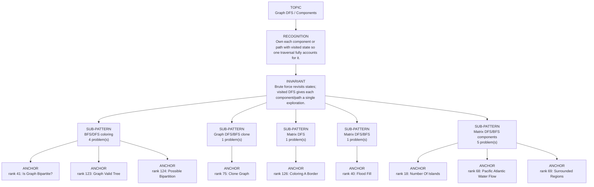

# Graph DFS / Components

Focused pattern pass. Keep the global rank order inside this file; lower rank means a higher score in the current interview-ROI heuristic.

## Recognition Signal

Own each component or path with visited state so one traversal fully accounts for it.

## Interview Move

Brute force revisits states; visited DFS gives each component/path a single exploration.

## Pattern Taxonomy Map

## Problems

| Global Rank | Phase | Problem | Pattern | Java | LeetCode | One-line recall | Crisp code idea |
|---:|---|---|---|---|---|---|---|
| 18 | Phase 1 - No Red Flags | Number Of Islands | Matrix DFS/BFS components | [Java](../../../src/main/java/org/chijai/day8/graph/session1/Islands.java) | [LC](https://leetcode.com/problems/number-of-islands/) | Every time you find unvisited land, sink its whole connected component and count one island. | Scan grid; on '1', increment count and DFS/BFS four directions marking visited/water. |
| 40 | Phase 2 - Strong Core | Flood Fill | Matrix DFS/BFS | [Java](../../../src/main/java/org/chijai/day8/graph/session1/FloodFill.java) | [LC](https://leetcode.com/problems/flood-fill/) | Recolor only the connected component matching the starting color. | If oldColor == newColor return; DFS/BFS neighbors with oldColor and recolor them. |
| 41 | Phase 2 - Strong Core | Is Graph Bipartite? | BFS/DFS coloring | [Java](../../../src/main/java/org/chijai/day8/graph/session2/GraphBipartite.java) | [LC](https://leetcode.com/problems/is-graph-bipartite/) | A graph is bipartite if every edge connects opposite colors. | For each uncolored node, BFS/DFS assign colors and fail on same-color neighbor. |
| 68 | Phase 2 - Strong Core | Pacific Atlantic Water Flow | Matrix DFS/BFS components | [Java](../../../src/main/java/org/chijai/day8/graph/session1/Islands.java) | [LC](https://leetcode.com/problems/pacific-atlantic-water-flow/) | Reverse the flow: start from both oceans and move to equal-or-higher neighboring cells. | Mark cells reachable from Pacific border and Atlantic border; answer intersection. |
| 69 | Phase 2 - Strong Core | Surrounded Regions | Matrix DFS/BFS components | [Java](../../../src/main/java/org/chijai/day8/graph/session1/Islands.java) | [LC](https://leetcode.com/problems/surrounded-regions/) | Only O-regions connected to the border survive; all other O cells are captured. | DFS/BFS border O cells as safe, flip remaining O to X, restore safe marks. |
| 75 | Phase 3 - Important | Clone Graph | Graph DFS/BFS clone | [Java](../../../src/main/java/org/chijai/day8/graph/session2/CloneGraph.java) | [LC](https://leetcode.com/problems/clone-graph/) | Map original node to cloned node before cloning neighbors to handle cycles. | DFS/BFS: create clone if absent, then connect cloned neighbors from the map. |
| 121 | Phase 4 - Secondary | Number Of Closed Islands | Matrix DFS/BFS components | [Java](../../../src/main/java/org/chijai/day8/graph/session1/Islands.java) | [LC](https://leetcode.com/problems/number-of-closed-islands/) | A closed island is a land component that never touches the grid boundary. | DFS each land component, return false if any cell touches border, mark visited. |
| 122 | Phase 4 - Secondary | Max Area Of Island | Matrix DFS/BFS components | [Java](../../../src/main/java/org/chijai/day8/graph/session1/Islands.java) | [LC](https://leetcode.com/problems/max-area-of-island/) | DFS each land component and return its cell count; keep the maximum. | On each unvisited land cell, DFS four directions accumulating area. |
| 123 | Phase 4 - Secondary | Graph Valid Tree | BFS/DFS coloring | [Java](../../../src/main/java/org/chijai/day8/graph/session2/GraphBipartite.java) | [LC](https://leetcode.com/problems/graph-valid-tree/) | Own each component or path with visited state so one traversal fully accounts for it. | Mark visited, recursively explore neighbors, carry parent/state when cycles matter. |
| 124 | Phase 4 - Secondary | Possible Bipartition | BFS/DFS coloring | [Java](../../../src/main/java/org/chijai/day8/graph/session2/GraphBipartite.java) | [LC](https://leetcode.com/problems/possible-bipartition/) | Own each component or path with visited state so one traversal fully accounts for it. | Mark visited, recursively explore neighbors, carry parent/state when cycles matter. |
| 125 | Phase 4 - Secondary | Redundant Connection | BFS/DFS coloring | [Java](../../../src/main/java/org/chijai/day8/graph/session2/GraphBipartite.java) | [LC](https://leetcode.com/problems/redundant-connection/) | Own each component or path with visited state so one traversal fully accounts for it. | Mark visited, recursively explore neighbors, carry parent/state when cycles matter. |
| 126 | Phase 4 - Secondary | Coloring A Border | Matrix DFS | [Java](../../../src/main/java/org/chijai/day8/graph/session1/ColoringABorder.java) | [LC](https://leetcode.com/problems/coloring-a-border/) | Only cells on the component boundary get recolored; interior cells keep original color. | DFS component, mark a cell as border if it touches outside grid or different color. |

## Drill

1. Read only the problem title.
2. Say brute force, bottleneck, pattern, invariant, code idea, dry run.
3. Open Java only after the spoken answer is complete.
4. Code one missed problem from blank before moving to another pattern.