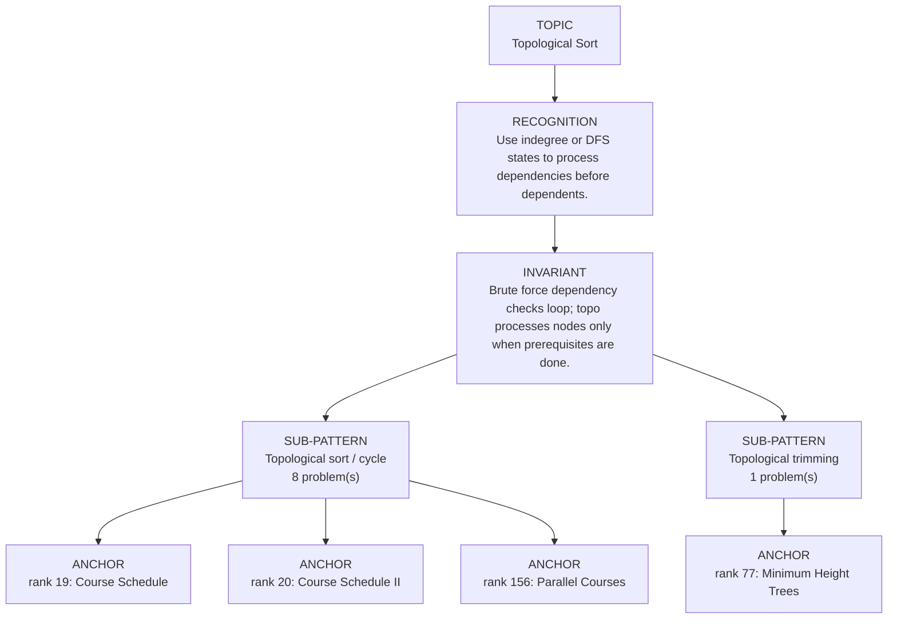

# Topological Sort

Focused pattern pass. Keep the global rank order inside this file; lower rank means a higher score in the current interview-ROI heuristic.

## Recognition Signal

Use indegree or DFS states to process dependencies before dependents.

## Interview Move

Brute force dependency checks loop; topo processes nodes only when prerequisites are done.

## Pattern Taxonomy Map

## Problems

| Global Rank | Phase | Problem | Pattern | Java | LeetCode | One-line recall | Crisp code idea |
|---:|---|---|---|---|---|---|---|
| 19 | Phase 1 - No Red Flags | Course Schedule | Topological sort / cycle | [Java](../../../src/main/java/org/chijai/day8/graph/session2/CourseSchedule.java) | [LC](https://leetcode.com/problems/course-schedule/) | A course is unlocked only when its indegree becomes zero. | Build prerequisite->course graph, queue indegree-zero courses, decrement neighbors, compare processed count. |
| 20 | Phase 1 - No Red Flags | Course Schedule II | Topological sort / cycle | [Java](../../../src/main/java/org/chijai/day8/graph/session2/CourseSchedule.java) | [LC](https://leetcode.com/problems/course-schedule-ii/) | A course enters the order only when its indegree drops to zero. | Build prerequisite->course graph, queue indegree-zero courses, append order, fail if processed < n. |
| 77 | Phase 3 - Important | Minimum Height Trees | Topological trimming | [Java](../../../src/main/java/org/chijai/day8/graph/session3/MinHTree.java) | [LC](https://leetcode.com/problems/minimum-height-trees/) | Peel all current leaves together until one or two centroid roots remain. | Build graph/degrees, queue degree-1 leaves, remove layers while remainingNodes > 2. |
| 156 | Phase 5 - If Time | Parallel Courses | Topological sort / cycle | [Java](../../../src/main/java/org/chijai/day8/graph/session2/CourseSchedule.java) | [LC](https://leetcode.com/problems/parallel-courses/) | Use indegree or DFS states to process dependencies before dependents. | Build graph and indegrees, queue zero-indegree nodes, process order. |
| 157 | Phase 5 - If Time | Alien Dictionary | Topological sort / cycle | [Java](../../../src/main/java/org/chijai/day8/graph/session2/CourseSchedule.java) | [LC](https://leetcode.com/problems/alien-dictionary/) | Use indegree or DFS states to process dependencies before dependents. | Build graph and indegrees, queue zero-indegree nodes, process order. |
| 158 | Phase 5 - If Time | Find Eventual Safe States | Topological sort / cycle | [Java](../../../src/main/java/org/chijai/day8/graph/session2/CourseSchedule.java) | [LC](https://leetcode.com/problems/find-eventual-safe-states/) | Use indegree or DFS states to process dependencies before dependents. | Build graph and indegrees, queue zero-indegree nodes, process order. |
| 159 | Phase 5 - If Time | Sequence Reconstruction | Topological sort / cycle | [Java](../../../src/main/java/org/chijai/day8/graph/session2/CourseSchedule.java) | [LC](https://leetcode.com/problems/sequence-reconstruction/) | Use indegree or DFS states to process dependencies before dependents. | Build graph and indegrees, queue zero-indegree nodes, process order. |
| 160 | Phase 5 - If Time | Sort Items by Groups Respecting Dependencies | Topological sort / cycle | [Java](../../../src/main/java/org/chijai/day8/graph/session2/CourseSchedule.java) | [LC](https://leetcode.com/problems/sort-items-by-groups-respecting-dependencies/) | Use indegree or DFS states to process dependencies before dependents. | Build graph and indegrees, queue zero-indegree nodes, process order. |
| 206 | Phase 5 - If Time | Course Schedule IV | Topological sort / cycle | [Java](../../../src/main/java/org/chijai/day8/graph/session2/CourseSchedule.java) | [LC](https://leetcode.com/problems/course-schedule-iv/) | Use indegree or DFS states to process dependencies before dependents. | Build graph and indegrees, queue zero-indegree nodes, process order. |

## Drill

1. Read only the problem title.
2. Say brute force, bottleneck, pattern, invariant, code idea, dry run.
3. Open Java only after the spoken answer is complete.
4. Code one missed problem from blank before moving to another pattern.