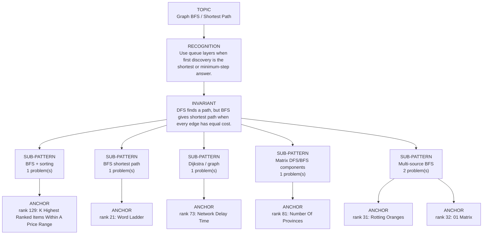

# Graph BFS / Shortest Path

Focused pattern pass. Keep the global rank order inside this file; lower rank means a higher score in the current interview-ROI heuristic.

## Recognition Signal

Use queue layers when first discovery is the shortest or minimum-step answer.

## Interview Move

DFS finds a path, but BFS gives shortest path when every edge has equal cost.

## Pattern Taxonomy Map

## Problems

| Global Rank | Phase | Problem | Pattern | Java | LeetCode | One-line recall | Crisp code idea |
|---:|---|---|---|---|---|---|---|
| 21 | Phase 1 - No Red Flags | Word Ladder | BFS shortest path | [Java](../../../src/main/java/org/chijai/day8/graph/session3/WordLadder.java) | [LC](https://leetcode.com/problems/word-ladder/) | BFS words level by level; first time reaching endWord is the shortest transformation length. | Queue begin word, generate one-letter mutations, visit dictionary words once per level. |
| 31 | Phase 2 - Strong Core | Rotting Oranges | Multi-source BFS | [Java](../../../src/main/java/org/chijai/day8/graph/session1/RottenOranges.java) | [LC](https://leetcode.com/problems/rotting-oranges/) | All initially rotten oranges start a multi-source BFS; each level is one minute. | Queue all rotten cells, count fresh, process BFS levels, decrement fresh on infection. |
| 32 | Phase 2 - Strong Core | 01 Matrix | Multi-source BFS | [Java](../../../src/main/java/org/chijai/day8/graph/session1/Matrix01.java) | [LC](https://leetcode.com/problems/01-matrix/) | Start BFS from all zero cells; first visit gives nearest-zero distance. | Queue every zero with distance 0, then relax unvisited neighbors to dist+1. |
| 73 | Phase 3 - Important | Network Delay Time | Dijkstra / graph | [Java](../../../src/main/java/org/chijai/day8/graph/session2/NetworkDelayTime.java) | [LC](https://leetcode.com/problems/network-delay-time/) | Dijkstra keeps the next shortest unsettled node in a min-heap. | Build adjacency, push source distance 0, relax neighbors when a smaller distance is found. |
| 81 | Phase 3 - Important | Number Of Provinces | Matrix DFS/BFS components | [Java](../../../src/main/java/org/chijai/day8/graph/session1/Islands.java) | [LC](https://leetcode.com/problems/number-of-provinces/) | Each DFS/BFS from an unvisited city marks one connected province. | Scan cities; when unvisited, count province and traverse connected cities from adjacency matrix. |
| 129 | Phase 4 - Secondary | K Highest Ranked Items Within A Price Range | BFS + sorting | [Java](../../../src/main/java/org/chijai/day8/graph/session3/KHighestRankedItemsWithinAPriceRange.java) | [LC](https://leetcode.com/problems/k-highest-ranked-items-within-a-price-range/) | BFS by distance, collecting valid items and sorting tie-breaks by price,row,col. | BFS from start through passable cells; collect price-in-range items with distance and sort ranking. |

## Drill

1. Read only the problem title.
2. Say brute force, bottleneck, pattern, invariant, code idea, dry run.
3. Open Java only after the spoken answer is complete.
4. Code one missed problem from blank before moving to another pattern.