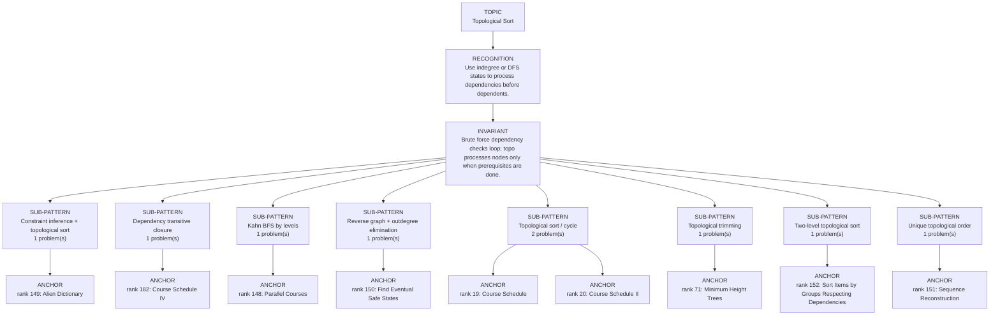

# Topological Sort

Focused pattern pass. Keep the global rank order inside this file; lower rank means a higher score in the current interview-ROI heuristic.

## Recognition Signal

Use indegree or DFS states to process dependencies before dependents.

## Interview Move

Brute force dependency checks loop; topo processes nodes only when prerequisites are done.

## Pattern Taxonomy Map

## Problems

| Global Rank | Phase | Problem | Pattern | Java | LeetCode | One-line recall | Crisp code idea |
|---:|---|---|---|---|---|---|---|
| 19 | Phase 1 - No Red Flags | Course Schedule | Topological sort / cycle | [Java](../../../src/main/java/org/chijai/day8/graph/session2/CourseSchedule.java) | [LC](https://leetcode.com/problems/course-schedule/) | A course is unlocked only when its indegree becomes zero. | Build prerequisite->course graph, queue indegree-zero courses, decrement neighbors, compare processed count. |
| 20 | Phase 1 - No Red Flags | Course Schedule II | Topological sort / cycle | [Java](../../../src/main/java/org/chijai/day8/graph/session2/CourseSchedule.java) | [LC](https://leetcode.com/problems/course-schedule-ii/) | A course enters the order only when its indegree drops to zero. | Build prerequisite->course graph, queue indegree-zero courses, append order, fail if processed < n. |
| 71 | Phase 3 - Important | Minimum Height Trees | Topological trimming | [Java](../../../src/main/java/org/chijai/day8/graph/session3/MinHTree.java) | [LC](https://leetcode.com/problems/minimum-height-trees/) | Peel all current leaves together until one or two centroid roots remain. | Build graph/degrees, queue degree-1 leaves, remove layers while remainingNodes > 2. |
| 148 | Phase 4 - Secondary | Parallel Courses | Kahn BFS by levels | [Java](../../../src/main/java/org/chijai/day8/graph/session2/CourseSchedule.java) | [LC](https://leetcode.com/problems/parallel-courses/) | The queue at a semester boundary contains every course currently unlocked; one complete Kahn level is one semester. | Queue all indegree-zero courses, process exactly queue.size() per semester, unlock dependents, and return -1 unless all courses were processed. |
| 149 | Phase 4 - Secondary | Alien Dictionary | Constraint inference + topological sort | [Java](../../../src/main/java/org/chijai/day8/graph/session2/CourseSchedule.java) | [LC](https://leetcode.com/problems/alien-dictionary/) | Only the first differing characters in adjacent sorted words create an ordering edge; every distinct character is still a graph node. | Reject a longer word before its exact prefix, deduplicate first-difference edges, then Kahn-sort all characters; return empty on a cycle. |
| 150 | Phase 4 - Secondary | Find Eventual Safe States | Reverse graph + outdegree elimination | [Java](../../../src/main/java/org/chijai/day8/graph/session2/CourseSchedule.java) | [LC](https://leetcode.com/problems/find-eventual-safe-states/) | outdegree[x] counts outgoing choices not yet proved safe; terminal nodes start safe with outdegree 0. | Reverse every edge, queue terminal nodes, decrement predecessor outdegrees, enqueue a predecessor at zero, then sort the safe nodes. |
| 151 | Phase 5 - If Time | Sequence Reconstruction | Unique topological order | [Java](../../../src/main/java/org/chijai/day8/graph/session2/CourseSchedule.java) | [LC](https://leetcode.com/problems/sequence-reconstruction/) | The target is uniquely reconstructible only when Kahn's frontier has exactly one node and that node equals nums[index] at every step. | Build deduplicated edges, require every target value to appear, reject queue.size() != 1 or a mismatched pop, and consume all target values. |
| 152 | Phase 5 - If Time | Sort Items by Groups Respecting Dependencies | Two-level topological sort | [Java](../../../src/main/java/org/chijai/day8/graph/session2/CourseSchedule.java) | [LC](https://leetcode.com/problems/sort-items-by-groups-respecting-dependencies/) | VERIFY FROM SOURCE - the local chapter records that item and group dependencies require two coordinated topological orders, but it does not provide a complete accepted implementation. | VERIFY FROM SOURCE - confirm ungrouped-item normalization, item graph, group graph, and contiguous emission order before memorizing transitions. |
| 182 | Phase 5 - If Time | Course Schedule IV | Dependency transitive closure | [Java](../../../src/main/java/org/chijai/day8/graph/session2/CourseSchedule.java) | [LC](https://leetcode.com/problems/course-schedule-iv/) | reachable[a][b] means course a is a direct or indirect prerequisite of course b. | Seed direct prerequisite edges, compute transitive closure through every intermediate course, then answer each query from reachable[from][to]. |

## Drill

1. Read only the problem title.
2. Say brute force, bottleneck, pattern, invariant, code idea, dry run.
3. Open Java only after the spoken answer is complete.
4. Code one missed problem from blank before moving to another pattern.