# Dynamic Programming

Focused pattern pass. Keep the global rank order inside this file; lower rank means a higher score in the current interview-ROI heuristic.

## Recognition Signal

Name the state, base case, transition, and iteration order before writing loops.

## Interview Move

Naive recursion repeats states; DP caches each state and reuses transitions.

## Pattern Taxonomy Map

```mermaid
flowchart TD
  Topic["TOPIC<br/>Dynamic Programming"]
  Recognition["RECOGNITION<br/>Name the state, base case, transition, and iteration order before writing loops."]
  Invariant["INVARIANT<br/>Naive recursion repeats states; DP caches each state and reuses transitions."]
  Topic --> Recognition --> Invariant
  Invariant --> Sub01["SUB-PATTERN<br/>0/1 knapsack DP<br/>1 problem(s)"]
  Sub01 --> Sub01A01["ANCHOR<br/>rank 44: Partition Equal Subset Sum"]
  Invariant --> Sub02["SUB-PATTERN<br/>1D DP<br/>2 problem(s)"]
  Sub02 --> Sub02A01["ANCHOR<br/>rank 32: House Robber"]
  Sub02 --> Sub02A02["ANCHOR<br/>rank 168: Climbing Stairs Fib"]
  Invariant --> Sub03["SUB-PATTERN<br/>2D DP<br/>7 problem(s)"]
  Sub03 --> Sub03A01["ANCHOR<br/>rank 169: Edit Distance"]
  Sub03 --> Sub03A02["ANCHOR<br/>rank 176: Delete Operation for Two Strings"]
  Sub03 --> Sub03A03["ANCHOR<br/>rank 177: Distinct Subsequences"]
  Invariant --> Sub04["SUB-PATTERN<br/>DP / patience sorting<br/>5 problem(s)"]
  Sub04 --> Sub04A01["ANCHOR<br/>rank 45: Longest Increasing Subsequence"]
  Sub04 --> Sub04A02["ANCHOR<br/>rank 182: Longest Continuous Increasing Subsequence"]
  Sub04 --> Sub04A03["ANCHOR<br/>rank 183: Maximum Length of Pair Chain"]
  Invariant --> Sub05["SUB-PATTERN<br/>DP + binary search<br/>1 problem(s)"]
  Sub05 --> Sub05A01["ANCHOR<br/>rank 84: Maximum Profit In Job Scheduling"]
  Invariant --> Sub06["SUB-PATTERN<br/>Greedy / DP states<br/>6 problem(s)"]
  Sub06 --> Sub06A01["ANCHOR<br/>rank 86: Best Time to Buy and Sell Stock"]
  Sub06 --> Sub06A02["ANCHOR<br/>rank 170: Best Time to Buy and Sell Stock with Cooldown"]
  Sub06 --> Sub06A03["ANCHOR<br/>rank 171: Best Time to Buy and Sell Stock with Transaction Fee"]
  Invariant --> Sub07["SUB-PATTERN<br/>Grid DP<br/>1 problem(s)"]
  Sub07 --> Sub07A01["ANCHOR<br/>rank 43: Unique Paths"]
  Invariant --> Sub08["SUB-PATTERN<br/>Kadane / DP<br/>1 problem(s)"]
  Sub08 --> Sub08A01["ANCHOR<br/>rank 85: Kadane Max Sub Array"]
  Invariant --> Sub09["SUB-PATTERN<br/>Unbounded knapsack DP<br/>5 problem(s)"]
  Sub09 --> Sub09A01["ANCHOR<br/>rank 33: Coin Change"]
  Sub09 --> Sub09A02["ANCHOR<br/>rank 172: Climbing Stairs"]
  Sub09 --> Sub09A03["ANCHOR<br/>rank 173: Min Cost Climbing Stairs"]
```

## Problems

| Global Rank | Phase | Problem | Pattern | Java | LeetCode | One-line recall | Crisp code idea |
|---:|---|---|---|---|---|---|---|
| 32 | Phase 2 - Strong Core | House Robber | 1D DP | [Java](../../../src/main/java/org/chijai/day9/dp/session1/HouseRobber.java) | [LC](https://leetcode.com/problems/house-robber/) | At each house choose max(skip current, rob current plus best before previous). | For each money, next = max(prev1, prev2 + money); shift prev2=prev1, prev1=next. |
| 33 | Phase 2 - Strong Core | Coin Change | Unbounded knapsack DP | [Java](../../../src/main/java/org/chijai/day9/dp/session2/CoinChange.java) | [LC](https://leetcode.com/problems/coin-change/) | dp[amount] is the fewest coins needed; each coin relaxes reachable amounts. | Initialize dp[0]=0 and others INF; for amount 1..target, try every coin. |
| 43 | Phase 2 - Strong Core | Unique Paths | Grid DP | [Java](../../../src/main/java/org/chijai/day9/dp/session1/UniquePaths.java) | [LC](https://leetcode.com/problems/unique-paths/) | Ways to a cell equal ways from top plus ways from left. | Initialize first row/column to 1, fill dp[r][c] = dp[r-1][c] + dp[r][c-1]. |
| 44 | Phase 2 - Strong Core | Partition Equal Subset Sum | 0/1 knapsack DP | [Java](../../../src/main/java/org/chijai/day9/dp/session2/PartitionEqualSubsetSum.java) | [LC](https://leetcode.com/problems/partition-equal-subset-sum/) | Partition is possible only if some subset reaches total/2. | If total odd return false; update boolean dp from target down to num for each num. |
| 45 | Phase 2 - Strong Core | Longest Increasing Subsequence | DP / patience sorting | [Java](../../../src/main/java/org/chijai/day9/dp/session2/LIS.java) | [LC](https://leetcode.com/problems/longest-increasing-subsequence/) | tails[len] stores the smallest possible tail for an increasing subsequence of that length. | For each x, lower_bound in tails and replace; answer is tails size. |
| 84 | Phase 3 - Important | Maximum Profit In Job Scheduling | DP + binary search | [Java](../../../src/main/java/org/chijai/day2/session3/MaximumProfitInJobScheduling.java) | [LC](https://leetcode.com/problems/maximum-profit-in-job-scheduling/) | Sort jobs by end time; dp[i] is best profit up to i, with binary search for compatible previous job. | Sort by end, for each job compute max(skip, profit + dp[lastNonOverlapping]). |
| 85 | Phase 3 - Important | Kadane Max Sub Array | Kadane / DP | [Java](../../../src/main/java/org/chijai/day9/dp/session1/KadaneMaxSubArray.java) | - | Best subarray ending here is either current alone or previous best ending here plus current. | cur = max(x, cur + x); best = max(best, cur) for every element. |
| 86 | Phase 3 - Important | Best Time to Buy and Sell Stock | Greedy / DP states | [Java](../../../src/main/java/org/chijai/day1/Arrays/session3/StockSeries1.java) | [LC](https://leetcode.com/problems/best-time-to-buy-and-sell-stock/) | Track the lowest price so far; today's profit is price minus that minimum. | For each price, update minPrice, then best = max(best, price - minPrice). |
| 168 | Phase 5 - If Time | Climbing Stairs Fib | 1D DP | [Java](../../../src/main/java/org/chijai/day9/dp/session1/ClimbingStairsFib.java) | - | Ways to step n equals ways to n-1 plus ways to n-2. | Iterate two rolling values for ways to previous one and two steps. |
| 169 | Phase 5 - If Time | Edit Distance | 2D DP | [Java](../../../src/main/java/org/chijai/day9/dp/session2/EditDistance.java) | [LC](https://leetcode.com/problems/edit-distance/) | dp[i][j] is edits to convert first i chars of word1 to first j chars of word2. | Initialize empty-string row/column; if chars equal copy diagonal else 1 + min(insert, delete, replace). |
| 170 | Phase 5 - If Time | Best Time to Buy and Sell Stock with Cooldown | Greedy / DP states | [Java](../../../src/main/java/org/chijai/day1/Arrays/session3/StockSeries1.java) | [LC](https://leetcode.com/problems/best-time-to-buy-and-sell-stock-with-cooldown/) | Name the state, base case, transition, and iteration order before writing loops. | Initialize base states, fill states in dependency order, return target state. |
| 171 | Phase 5 - If Time | Best Time to Buy and Sell Stock with Transaction Fee | Greedy / DP states | [Java](../../../src/main/java/org/chijai/day1/Arrays/session3/StockSeries1.java) | [LC](https://leetcode.com/problems/best-time-to-buy-and-sell-stock-with-transaction-fee/) | Name the state, base case, transition, and iteration order before writing loops. | Initialize base states, fill states in dependency order, return target state. |
| 172 | Phase 5 - If Time | Climbing Stairs | Unbounded knapsack DP | [Java](../../../src/main/java/org/chijai/day9/dp/session2/CoinChange.java) | [LC](https://leetcode.com/problems/climbing-stairs/) | Name the state, base case, transition, and iteration order before writing loops. | Initialize base states, fill states in dependency order, return target state. |
| 173 | Phase 5 - If Time | Min Cost Climbing Stairs | Unbounded knapsack DP | [Java](../../../src/main/java/org/chijai/day9/dp/session2/CoinChange.java) | [LC](https://leetcode.com/problems/min-cost-climbing-stairs/) | Name the state, base case, transition, and iteration order before writing loops. | Initialize base states, fill states in dependency order, return target state. |
| 174 | Phase 5 - If Time | Perfect Squares | Unbounded knapsack DP | [Java](../../../src/main/java/org/chijai/day9/dp/session2/CoinChange.java) | [LC](https://leetcode.com/problems/perfect-squares/) | Name the state, base case, transition, and iteration order before writing loops. | Initialize base states, fill states in dependency order, return target state. |
| 175 | Phase 5 - If Time | Word Break | Unbounded knapsack DP | [Java](../../../src/main/java/org/chijai/day9/dp/session2/CoinChange.java) | [LC](https://leetcode.com/problems/word-break/) | Name the state, base case, transition, and iteration order before writing loops. | Initialize base states, fill states in dependency order, return target state. |
| 176 | Phase 5 - If Time | Delete Operation for Two Strings | 2D DP | [Java](../../../src/main/java/org/chijai/day9/dp/session2/EditDistance.java) | [LC](https://leetcode.com/problems/delete-operation-for-two-strings/) | Name the state, base case, transition, and iteration order before writing loops. | Initialize base states, fill states in dependency order, return target state. |
| 177 | Phase 5 - If Time | Distinct Subsequences | 2D DP | [Java](../../../src/main/java/org/chijai/day9/dp/session2/EditDistance.java) | [LC](https://leetcode.com/problems/distinct-subsequences/) | Name the state, base case, transition, and iteration order before writing loops. | Initialize base states, fill states in dependency order, return target state. |
| 178 | Phase 5 - If Time | Interleaving String | 2D DP | [Java](../../../src/main/java/org/chijai/day9/dp/session2/EditDistance.java) | [LC](https://leetcode.com/problems/interleaving-string/) | Name the state, base case, transition, and iteration order before writing loops. | Initialize base states, fill states in dependency order, return target state. |
| 179 | Phase 5 - If Time | Longest Common Subsequence | 2D DP | [Java](../../../src/main/java/org/chijai/day9/dp/session2/EditDistance.java) | [LC](https://leetcode.com/problems/longest-common-subsequence/) | Name the state, base case, transition, and iteration order before writing loops. | Initialize base states, fill states in dependency order, return target state. |
| 180 | Phase 5 - If Time | Longest Palindromic Subsequence | 2D DP | [Java](../../../src/main/java/org/chijai/day9/dp/session2/EditDistance.java) | [LC](https://leetcode.com/problems/longest-palindromic-subsequence/) | Name the state, base case, transition, and iteration order before writing loops. | Initialize base states, fill states in dependency order, return target state. |
| 181 | Phase 5 - If Time | Minimum ASCII Delete Sum for Two Strings | 2D DP | [Java](../../../src/main/java/org/chijai/day9/dp/session2/EditDistance.java) | [LC](https://leetcode.com/problems/minimum-ascii-delete-sum-for-two-strings/) | Name the state, base case, transition, and iteration order before writing loops. | Initialize base states, fill states in dependency order, return target state. |
| 182 | Phase 5 - If Time | Longest Continuous Increasing Subsequence | DP / patience sorting | [Java](../../../src/main/java/org/chijai/day9/dp/session2/LIS.java) | [LC](https://leetcode.com/problems/longest-continuous-increasing-subsequence/) | Name the state, base case, transition, and iteration order before writing loops. | Initialize base states, fill states in dependency order, return target state. |
| 183 | Phase 5 - If Time | Maximum Length of Pair Chain | DP / patience sorting | [Java](../../../src/main/java/org/chijai/day9/dp/session2/LIS.java) | [LC](https://leetcode.com/problems/maximum-length-of-pair-chain/) | Name the state, base case, transition, and iteration order before writing loops. | Initialize base states, fill states in dependency order, return target state. |
| 184 | Phase 5 - If Time | Number of Longest Increasing Subsequence | DP / patience sorting | [Java](../../../src/main/java/org/chijai/day9/dp/session2/LIS.java) | [LC](https://leetcode.com/problems/number-of-longest-increasing-subsequence/) | Name the state, base case, transition, and iteration order before writing loops. | Initialize base states, fill states in dependency order, return target state. |
| 185 | Phase 5 - If Time | Russian Doll Envelopes | DP / patience sorting | [Java](../../../src/main/java/org/chijai/day9/dp/session2/LIS.java) | [LC](https://leetcode.com/problems/russian-doll-envelopes/) | Name the state, base case, transition, and iteration order before writing loops. | Initialize base states, fill states in dependency order, return target state. |
| 205 | Phase 5 - If Time | Best Time to Buy and Sell Stock II | Greedy / DP states | [Java](../../../src/main/java/org/chijai/day1/Arrays/session3/StockSeries1.java) | [LC](https://leetcode.com/problems/best-time-to-buy-and-sell-stock-ii/) | Name the state, base case, transition, and iteration order before writing loops. | Initialize base states, fill states in dependency order, return target state. |
| 206 | Phase 5 - If Time | Best Time to Buy and Sell Stock III | Greedy / DP states | [Java](../../../src/main/java/org/chijai/day1/Arrays/session3/StockSeries1.java) | [LC](https://leetcode.com/problems/best-time-to-buy-and-sell-stock-iii/) | Name the state, base case, transition, and iteration order before writing loops. | Initialize base states, fill states in dependency order, return target state. |
| 207 | Phase 5 - If Time | Best Time to Buy and Sell Stock IV | Greedy / DP states | [Java](../../../src/main/java/org/chijai/day1/Arrays/session3/StockSeries1.java) | [LC](https://leetcode.com/problems/best-time-to-buy-and-sell-stock-iv/) | Name the state, base case, transition, and iteration order before writing loops. | Initialize base states, fill states in dependency order, return target state. |

## Drill

1. Read only the problem title.
2. Say brute force, bottleneck, pattern, invariant, code idea, dry run.
3. Open Java only after the spoken answer is complete.
4. Code one missed problem from blank before moving to another pattern.