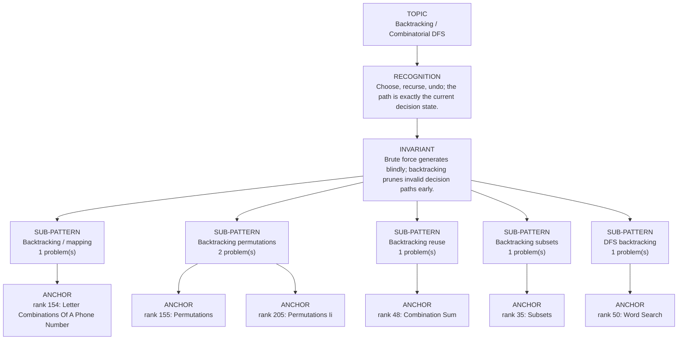

# Backtracking / Combinatorial DFS

Focused pattern pass. Keep the global rank order inside this file; lower rank means a higher score in the current interview-ROI heuristic.

## Recognition Signal

Choose, recurse, undo; the path is exactly the current decision state.

## Interview Move

Brute force generates blindly; backtracking prunes invalid decision paths early.

## Pattern Taxonomy Map

## Problems

| Global Rank | Phase | Problem | Pattern | Java | LeetCode | One-line recall | Crisp code idea |
|---:|---|---|---|---|---|---|---|
| 35 | Phase 2 - Strong Core | Subsets | Backtracking subsets | [Java](../../../src/main/java/org/chijai/day11/backtracking/session1/Subsets.java) | [LC](https://leetcode.com/problems/subsets/) | Choose, recurse, undo; the path is exactly the current decision state. | Loop candidates, choose, recurse, undo, and skip duplicates/prune invalid paths. |
| 48 | Phase 2 - Strong Core | Combination Sum | Backtracking reuse | [Java](../../../src/main/java/org/chijai/day11/backtracking/session1/CombinationSum.java) | [LC](https://leetcode.com/problems/combination-sum/) | Choose, recurse, undo; the path is exactly the current decision state. | Loop candidates, choose, recurse, undo, and skip duplicates/prune invalid paths. |
| 50 | Phase 2 - Strong Core | Word Search | DFS backtracking | [Java](../../../src/main/java/org/chijai/day8/graph/session1/WordSearch.java) | [LC](https://leetcode.com/problems/word-search/) | Choose, recurse, undo; the path is exactly the current decision state. | Loop candidates, choose, recurse, undo, and skip duplicates/prune invalid paths. |
| 154 | Phase 5 - If Time | Letter Combinations Of A Phone Number | Backtracking / mapping | [Java](../../../src/main/java/org/chijai/day11/backtracking/session1/LetterCombinationsOfAPhoneNumber.java) | [LC](https://leetcode.com/problems/letter-combinations-of-a-phone-number/) | Choose, recurse, undo; the path is exactly the current decision state. | Loop candidates, choose, recurse, undo, and skip duplicates/prune invalid paths. |
| 155 | Phase 5 - If Time | Permutations | Backtracking permutations | [Java](../../../src/main/java/org/chijai/day11/backtracking/session1/Permutations.java) | [LC](https://leetcode.com/problems/permutations/) | Choose, recurse, undo; the path is exactly the current decision state. | Loop candidates, choose, recurse, undo, and skip duplicates/prune invalid paths. |
| 205 | Phase 5 - If Time | Permutations Ii | Backtracking permutations | [Java](../../../src/main/java/org/chijai/day11/backtracking/session1/Permutations.java) | [LC](https://leetcode.com/problems/permutations-ii/) | Choose, recurse, undo; the path is exactly the current decision state. | Loop candidates, choose, recurse, undo, and skip duplicates/prune invalid paths. |

## Drill

1. Read only the problem title.
2. Say brute force, bottleneck, pattern, invariant, code idea, dry run.
3. Open Java only after the spoken answer is complete.
4. Code one missed problem from blank before moving to another pattern.