# Dynamic Programming

Focused pattern pass. Keep the global rank order inside this file; lower rank means a higher score in the current interview-ROI heuristic.

## Recognition Signal

Name the state, base case, transition, and iteration order before writing loops.

## Interview Move

Naive recursion repeats states; DP caches each state and reuses transitions.

## Pattern Taxonomy Map

```mermaid
flowchart TD
  Topic["TOPIC<br/>Dynamic Programming"]
  Recognition["RECOGNITION<br/>Name the state, base case, transition, and iteration order before writing loops."]
  Invariant["INVARIANT<br/>Naive recursion repeats states; DP caches each state and reuses transitions."]
  Topic --> Recognition --> Invariant
  Invariant --> Sub01["SUB-PATTERN<br/>0/1 knapsack DP<br/>1 problem(s)"]
  Sub01 --> Sub01A01["ANCHOR<br/>rank 44: Partition Equal Subset Sum"]
  Invariant --> Sub02["SUB-PATTERN<br/>1D DP<br/>2 problem(s)"]
  Sub02 --> Sub02A01["ANCHOR<br/>rank 32: House Robber"]
  Sub02 --> Sub02A02["ANCHOR<br/>rank 168: Climbing Stairs Fib"]
  Invariant --> Sub03["SUB-PATTERN<br/>2D DP<br/>7 problem(s)"]
  Sub03 --> Sub03A01["ANCHOR<br/>rank 169: Edit Distance"]
  Sub03 --> Sub03A02["ANCHOR<br/>rank 170: Distinct Subsequences"]
  Sub03 --> Sub03A03["ANCHOR<br/>rank 195: Interleaving String"]
  Invariant --> Sub04["SUB-PATTERN<br/>Contribution counting<br/>1 problem(s)"]
  Sub04 --> Sub04A01["ANCHOR<br/>rank 193: Distinct Subsequences II"]
  Invariant --> Sub05["SUB-PATTERN<br/>DP / patience sorting<br/>3 problem(s)"]
  Sub05 --> Sub05A01["ANCHOR<br/>rank 45: Longest Increasing Subsequence"]
  Sub05 --> Sub05A02["ANCHOR<br/>rank 203: Number of Longest Increasing Subsequence"]
  Sub05 --> Sub05A03["ANCHOR<br/>rank 204: Russian Doll Envelopes"]
  Invariant --> Sub06["SUB-PATTERN<br/>DP + binary search<br/>1 problem(s)"]
  Sub06 --> Sub06A01["ANCHOR<br/>rank 87: Maximum Profit In Job Scheduling"]
  Invariant --> Sub07["SUB-PATTERN<br/>Greedy / DP states<br/>1 problem(s)"]
  Sub07 --> Sub07A01["ANCHOR<br/>rank 191: Best Time to Buy and Sell Stock III"]
  Invariant --> Sub08["SUB-PATTERN<br/>Grid DP<br/>1 problem(s)"]
  Sub08 --> Sub08A01["ANCHOR<br/>rank 43: Unique Paths"]
  Invariant --> Sub09["SUB-PATTERN<br/>Kadane / DP<br/>1 problem(s)"]
  Sub09 --> Sub09A01["ANCHOR<br/>rank 88: Kadane Max Sub Array"]
  Invariant --> Sub10["SUB-PATTERN<br/>Stock DP variants<br/>3 problem(s)"]
  Sub10 --> Sub10A01["ANCHOR<br/>rank 189: Best Time to Buy and Sell Stock with Transaction Fee"]
  Sub10 --> Sub10A02["ANCHOR<br/>rank 190: Best Time to Buy and Sell Stock with Cooldown"]
  Sub10 --> Sub10A03["ANCHOR<br/>rank 192: Best Time to Buy and Sell Stock IV"]
  Invariant --> Sub11["SUB-PATTERN<br/>Unbounded knapsack DP<br/>5 problem(s)"]
  Sub11 --> Sub11A01["ANCHOR<br/>rank 33: Coin Change"]
  Sub11 --> Sub11A02["ANCHOR<br/>rank 194: Word Break"]
  Sub11 --> Sub11A03["ANCHOR<br/>rank 200: Climbing Stairs"]
```

## Problems

| Global Rank | Phase | Problem | Pattern | Java | LeetCode | One-line recall | Crisp code idea |
|---:|---|---|---|---|---|---|---|
| 32 | Phase 2 - Strong Core | House Robber | 1D DP | [Java](../../../src/main/java/org/chijai/day9/dp/session1/HouseRobber.java) | [LC](https://leetcode.com/problems/house-robber/) | At each house choose max(skip current, rob current plus best before previous). | For each money, next = max(prev1, prev2 + money); shift prev2=prev1, prev1=next. |
| 33 | Phase 2 - Strong Core | Coin Change | Unbounded knapsack DP | [Java](../../../src/main/java/org/chijai/day9/dp/session2/CoinChange.java) | [LC](https://leetcode.com/problems/coin-change/) | dp[amount] is the fewest coins needed; each coin relaxes reachable amounts. | Initialize dp[0]=0 and others INF; for amount 1..target, try every coin. |
| 43 | Phase 2 - Strong Core | Unique Paths | Grid DP | [Java](../../../src/main/java/org/chijai/day9/dp/session1/UniquePaths.java) | [LC](https://leetcode.com/problems/unique-paths/) | Ways to a cell equal ways from top plus ways from left. | Initialize first row/column to 1, fill dp[r][c] = dp[r-1][c] + dp[r][c-1]. |
| 44 | Phase 2 - Strong Core | Partition Equal Subset Sum | 0/1 knapsack DP | [Java](../../../src/main/java/org/chijai/day9/dp/session2/PartitionEqualSubsetSum.java) | - | Partition is possible only if some subset reaches total/2. | If total odd return false; update boolean dp from target down to num for each num. |
| 45 | Phase 2 - Strong Core | Longest Increasing Subsequence | DP / patience sorting | [Java](../../../src/main/java/org/chijai/day9/dp/session2/LIS.java) | [LC](https://leetcode.com/problems/longest-increasing-subsequence/) | tails[len] stores the smallest possible tail for an increasing subsequence of that length. | For each x, lower_bound in tails and replace; answer is tails size. |
| 87 | Phase 3 - Important | Maximum Profit In Job Scheduling | DP + binary search | [Java](../../../src/main/java/org/chijai/day2/session3/MaximumProfitInJobScheduling.java) | [LC](https://leetcode.com/problems/maximum-profit-in-job-scheduling/) | Sort jobs by end time; dp[i] is best profit up to i, with binary search for compatible previous job. | Sort by end, for each job compute max(skip, profit + dp[lastNonOverlapping]). |
| 88 | Phase 3 - Important | Kadane Max Sub Array | Kadane / DP | [Java](../../../src/main/java/org/chijai/day9/dp/session1/KadaneMaxSubArray.java) | - | Best subarray ending here is either current alone or previous best ending here plus current. | cur = max(x, cur + x); best = max(best, cur) for every element. |
| 168 | Phase 5 - If Time | Climbing Stairs Fib | 1D DP | [Java](../../../src/main/java/org/chijai/day9/dp/session1/ClimbingStairsFib.java) | - | Ways to step n equals ways to n-1 plus ways to n-2. | Iterate two rolling values for ways to previous one and two steps. |
| 169 | Phase 5 - If Time | Edit Distance | 2D DP | [Java](../../../src/main/java/org/chijai/day9/dp/session2/EditDistance.java) | [LC](https://leetcode.com/problems/edit-distance/) | dp[i][j] is edits to convert first i chars of word1 to first j chars of word2. | Initialize empty-string row/column; if chars equal copy diagonal else 1 + min(insert, delete, replace). |
| 170 | Phase 5 - If Time | Distinct Subsequences | 2D DP | [Java](../../../src/main/java/org/chijai/day9/dp/session2/EditDistance.java) | [LC](https://leetcode.com/problems/distinct-subsequences/) | dp[i][j] counts ways first i source chars form first j target chars. | If chars match add skip and take counts; otherwise carry skip count. |
| 189 | Phase 5 - If Time | Best Time to Buy and Sell Stock with Transaction Fee | Stock DP variants | [Java](../../../src/main/java/org/chijai/day1/Arrays/session3/StockSeries2.java) | [LC](https://leetcode.com/problems/best-time-to-buy-and-sell-stock-with-transaction-fee/) | Fee changes the sell transition; hold/cash states prevent double-counting fees. | For each price: cash = max(cash, hold + price - fee); hold = max(hold, cash - price). |
| 190 | Phase 5 - If Time | Best Time to Buy and Sell Stock with Cooldown | Stock DP variants | [Java](../../../src/main/java/org/chijai/day1/Arrays/session3/StockSeries2.java) | [LC](https://leetcode.com/problems/best-time-to-buy-and-sell-stock-with-cooldown/) | Cooldown creates three states: hold, sold today, and rest. | For each price update sold = hold + price, hold = max(hold, rest - price), rest = max(rest, oldSold). |
| 191 | Phase 5 - If Time | Best Time to Buy and Sell Stock III | Greedy / DP states | [Java](../../../src/main/java/org/chijai/day1/Arrays/session3/StockSeries1.java) | [LC](https://leetcode.com/problems/best-time-to-buy-and-sell-stock-iii/) | Four states track first buy, first sell, second buy, second sell. | Update buy1, sell1, buy2, sell2 for each price and return sell2. |
| 192 | Phase 5 - If Time | Best Time to Buy and Sell Stock IV | Stock DP variants | [Java](../../../src/main/java/org/chijai/day1/Arrays/session3/StockSeries2.java) | [LC](https://leetcode.com/problems/best-time-to-buy-and-sell-stock-iv/) | For k transactions, each transaction layer has a hold and cash state. | If k is large use stock II; otherwise update hold[t] and cash[t] for t = 1..k. |
| 193 | Phase 5 - If Time | Distinct Subsequences II | Contribution counting | [Java](../../../src/main/java/org/chijai/day10/session2/CountUniqueChars.java) | [LC](https://leetcode.com/problems/distinct-subsequences-ii/) | Each char doubles subsequences, then subtracts subsequences counted before its previous occurrence. | Maintain total distinct subsequences and lastContribution[char], updating total by new unique additions. |
| 194 | Phase 5 - If Time | Word Break | Unbounded knapsack DP | [Java](../../../src/main/java/org/chijai/day9/dp/session2/CoinChange.java) | [LC](https://leetcode.com/problems/word-break/) | dp[i] means prefix s[0..i) can be segmented into dictionary words. | For each end i, set dp[i] if some dp[j] and s[j..i) is in the dictionary. |
| 195 | Phase 5 - If Time | Interleaving String | 2D DP | [Java](../../../src/main/java/org/chijai/day9/dp/session2/EditDistance.java) | [LC](https://leetcode.com/problems/interleaving-string/) | dp[i][j] says s3 prefix i+j can be formed by prefixes of s1 and s2. | Fill dp by taking next char from s1 or s2 when it matches s3[i+j-1]. |
| 196 | Phase 5 - If Time | Longest Common Subsequence | 2D DP | [Java](../../../src/main/java/org/chijai/day9/dp/session2/EditDistance.java) | [LC](https://leetcode.com/problems/longest-common-subsequence/) | dp[i][j] is the best subsequence length between two prefixes. | If chars match use 1 + diagonal; otherwise max(top,left). |
| 197 | Phase 5 - If Time | Delete Operation for Two Strings | 2D DP | [Java](../../../src/main/java/org/chijai/day9/dp/session2/EditDistance.java) | [LC](https://leetcode.com/problems/delete-operation-for-two-strings/) | Minimum deletions equals removing everything not in the LCS. | Compute LCS length, return word1.length + word2.length - 2 * lcs. |
| 198 | Phase 5 - If Time | Longest Palindromic Subsequence | 2D DP | [Java](../../../src/main/java/org/chijai/day9/dp/session2/EditDistance.java) | [LC](https://leetcode.com/problems/longest-palindromic-subsequence/) | dp[l][r] is best palindrome subsequence inside s[l..r]. | Fill by increasing length: equal ends use 2 + dp[l+1][r-1], else max(drop left, drop right). |
| 199 | Phase 5 - If Time | Minimum ASCII Delete Sum for Two Strings | 2D DP | [Java](../../../src/main/java/org/chijai/day9/dp/session2/EditDistance.java) | [LC](https://leetcode.com/problems/minimum-ascii-delete-sum-for-two-strings/) | dp[i][j] is minimum ASCII deletion cost to make two prefixes equal. | If chars match take diagonal; otherwise delete one side and add its ASCII cost. |
| 200 | Phase 5 - If Time | Climbing Stairs | Unbounded knapsack DP | [Java](../../../src/main/java/org/chijai/day9/dp/session2/CoinChange.java) | [LC](https://leetcode.com/problems/climbing-stairs/) | Ways to reach n comes from n-1 plus n-2, with two rolling counts. | Start ways(0)=1, ways(1)=1, then iterate next = oneBack + twoBack. |
| 201 | Phase 5 - If Time | Min Cost Climbing Stairs | Unbounded knapsack DP | [Java](../../../src/main/java/org/chijai/day9/dp/session2/CoinChange.java) | [LC](https://leetcode.com/problems/min-cost-climbing-stairs/) | Cost to stand on step i is cost[i] plus min(previous one, previous two). | Iterate two rolling minimum costs and return min(cost to last, cost to second last). |
| 202 | Phase 5 - If Time | Perfect Squares | Unbounded knapsack DP | [Java](../../../src/main/java/org/chijai/day9/dp/session2/CoinChange.java) | [LC](https://leetcode.com/problems/perfect-squares/) | dp[x] is the fewest square numbers summing to x; try each square as the last move. | Initialize dp[0]=0; for x=1..n, dp[x]=1+min(dp[x-square]). |
| 203 | Phase 5 - If Time | Number of Longest Increasing Subsequence | DP / patience sorting | [Java](../../../src/main/java/org/chijai/day9/dp/session2/LIS.java) | [LC](https://leetcode.com/problems/number-of-longest-increasing-subsequence/) | Track both LIS length ending at i and how many ways achieve that length. | For each i, scan previous smaller j and update len[i] plus count[i]. |
| 204 | Phase 5 - If Time | Russian Doll Envelopes | DP / patience sorting | [Java](../../../src/main/java/org/chijai/day9/dp/session2/LIS.java) | [LC](https://leetcode.com/problems/russian-doll-envelopes/) | Sort width ascending, height descending for equal width, then LIS on heights. | Sort by width asc and height desc, then lower_bound heights to get LIS length. |

## Drill

1. Read only the problem title.
2. Say brute force, bottleneck, pattern, invariant, code idea, dry run.
3. Open Java only after the spoken answer is complete.
4. Code one missed problem from blank before moving to another pattern.