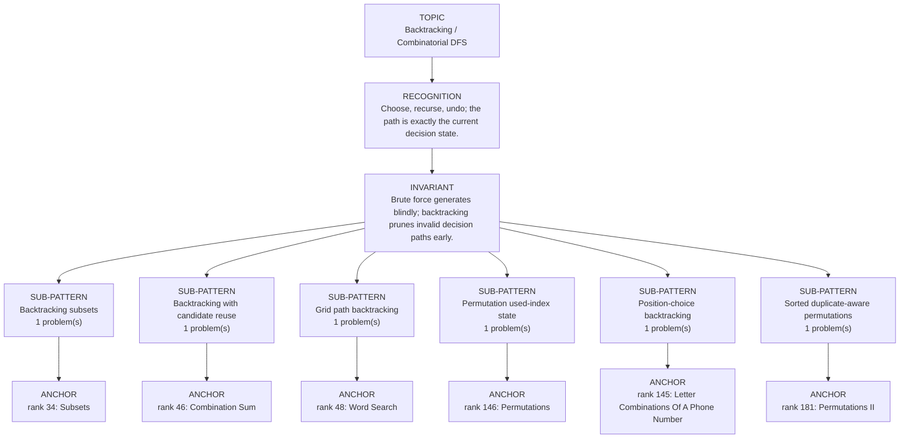

# Backtracking / Combinatorial DFS

Focused pattern pass. Keep the global rank order inside this file; lower rank means a higher score in the current interview-ROI heuristic.

## Recognition Signal

Choose, recurse, undo; the path is exactly the current decision state.

## Interview Move

Brute force generates blindly; backtracking prunes invalid decision paths early.

## Pattern Taxonomy Map

## Problems

| Global Rank | Phase | Problem | Pattern | Java | LeetCode | One-line recall | Crisp code idea |
|---:|---|---|---|---|---|---|---|
| 34 | Phase 2 - Strong Core | Subsets | Backtracking subsets | [Java](../../../src/main/java/org/chijai/day11/backtracking/session1/Subsets.java) | [LC](https://leetcode.com/problems/subsets/) | path is one subset formed from indices before start; every recursion state itself is a valid answer. | Copy path on entry; for i from start, choose nums[i], recurse with i + 1, then remove the choice. |
| 46 | Phase 2 - Strong Core | Combination Sum | Backtracking with candidate reuse | [Java](../../../src/main/java/org/chijai/day11/backtracking/session1/CombinationSum.java) | [LC](https://leetcode.com/problems/combination-sum/) | remaining is the target still unpaid and start prevents permutation duplicates; the same candidate may be reused. | When remaining == 0 copy path; choose candidate i <= remaining, recurse with i, then undo; prune larger sorted candidates. |
| 48 | Phase 2 - Strong Core | Word Search | Grid path backtracking | [Java](../../../src/main/java/org/chijai/day8/graph/session1/WordSearch.java) | [LC](https://leetcode.com/problems/word-search/) | index is the next word character to match and the current DFS path temporarily owns each board cell at most once. | Match board[r][c] to word[index], mark it for this path, recurse four directions with index + 1, then restore the cell. |
| 145 | Phase 4 - Secondary | Letter Combinations Of A Phone Number | Position-choice backtracking | [Java](../../../src/main/java/org/chijai/day11/backtracking/session1/LetterCombinationsOfAPhoneNumber.java) | [LC](https://leetcode.com/problems/letter-combinations-of-a-phone-number/) | index is the next digit to expand and path contains exactly one mapped letter for every earlier digit. | For each letter mapped from digits[index], append, recurse with index + 1, then delete; emit only when index == digits.length. |
| 146 | Phase 4 - Secondary | Permutations | Permutation used-index state | [Java](../../../src/main/java/org/chijai/day11/backtracking/session1/Permutations.java) | [LC](https://leetcode.com/problems/permutations/) | used[i] means index i is already owned by the current ordering; path length is the next permutation position. | Loop all indices, choose only !used[i], mark and append, recurse, then remove and unmark; copy at size n. |
| 181 | Phase 5 - If Time | Permutations II | Sorted duplicate-aware permutations | [Java](../../../src/main/java/org/chijai/day11/backtracking/session1/Permutations.java) | [LC](https://leetcode.com/problems/permutations-ii/) | used[i] owns an index on the current path; after sorting, equal values are tried in a fixed same-depth order. | Skip used indices and skip i > 0 && nums[i] == nums[i - 1] && !used[i - 1]; otherwise choose, recurse, and undo. |

## Drill

1. Read only the problem title.
2. Say brute force, bottleneck, pattern, invariant, code idea, dry run.
3. Open Java only after the spoken answer is complete.
4. Code one missed problem from blank before moving to another pattern.