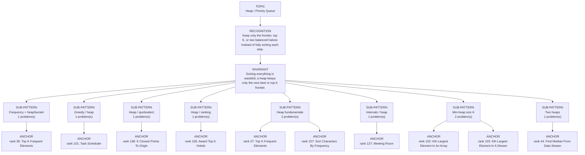

# Heap / Priority Queue

Focused pattern pass. Keep the global rank order inside this file; lower rank means a higher score in the current interview-ROI heuristic.

## Recognition Signal

Keep only the frontier, top K, or two balanced halves instead of fully sorting each step.

## Interview Move

Sorting everything is wasteful; a heap keeps only the next best or top K frontier.

## Pattern Taxonomy Map

## Problems

| Global Rank | Phase | Problem | Pattern | Java | LeetCode | One-line recall | Crisp code idea |
|---:|---|---|---|---|---|---|---|
| 36 | Phase 2 - Strong Core | Top K Frequent Elements | Frequency + heap/bucket | [Java](../../../src/main/java/org/chijai/day7/session1/heap/TopKFrequentElements.java) | - | Count frequencies, then keep only the k highest-frequency entries. | Build frequency map, then use bucket lists by frequency or a min-heap of size k. |
| 37 | Phase 2 - Strong Core | Top K Frequent Elements | Heap fundamentals | [Java](../../../src/main/java/org/chijai/day7/session1/heap/HeapSort.java) | [LC](https://leetcode.com/problems/top-k-frequent-elements/) | Count frequencies, then keep only the k highest-frequency entries. | Build frequency map, then use bucket lists by frequency or a min-heap of size k. |
| 44 | Phase 2 - Strong Core | Find Median From Data Stream | Two heaps | [Java](../../../src/main/java/org/chijai/day7/session1/heap/Median.java) | [LC](https://leetcode.com/problems/find-median-from-data-stream/) | Two heaps split lower and upper halves; median comes from heap tops. | Push into maxHeap/minHeap, rebalance sizes, median is top or average of tops. |
| 101 | Phase 3 - Important | Task Scheduler | Greedy / heap | [Java](../../../src/main/java/org/chijai/day7/session1/heap/TaskScheduler.java) | [LC](https://leetcode.com/problems/task-scheduler/) | CPU idles only when the most frequent tasks cannot be spaced by cooldown gaps. | Use maxFreq and countMax: max(tasks.length, (maxFreq-1)*(n+1)+countMax). |
| 102 | Phase 3 - Important | Kth Largest Element In An Array | Min-heap size K | [Java](../../../src/main/java/org/chijai/day7/session1/heap/KthLargestInStream.java) | [LC](https://leetcode.com/problems/kth-largest-element-in-an-array/) | A size-k min-heap keeps the k largest seen so far; top is kth largest. | Push each number, pop when heap size > k, return heap top. |
| 103 | Phase 3 - Important | Kth Largest Element In A Stream | Min-heap size K | [Java](../../../src/main/java/org/chijai/day7/session1/heap/KthLargestInStream.java) | [LC](https://leetcode.com/problems/kth-largest-element-in-a-stream/) | Maintain a size-k min-heap after every add; top is the kth largest in the stream. | On add, push value, trim heap to k, return heap.peek(). |
| 137 | Phase 4 - Secondary | Meeting Room | Intervals / heap | [Java](../../../src/main/java/org/chijai/day1/Arrays/session4/Intervals/MeetingRoom.java) | - | Keep only the frontier, top K, or two balanced halves instead of fully sorting each step. | Push candidates with comparator; poll when size or frontier rules require it. |
| 138 | Phase 4 - Secondary | K Closest Points To Origin | Heap / quickselect | [Java](../../../src/main/java/org/chijai/day7/session1/heap/KClosestPointsToOrigin.java) | [LC](https://leetcode.com/problems/k-closest-points-to-origin/) | Keep the k smallest squared distances; compare without taking square roots. | Use max-heap of size k by distance, or quickselect by squared distance. |
| 156 | Phase 5 - If Time | Award Top K Hotels | Heap / ranking | [Java](../../../src/main/java/org/chijai/day7/session1/heap/AwardTopKHotels.java) | - | Score each hotel by keyword hits, then rank by score and tie-breaker. | Build keyword set, count matches per hotel review, then sort or heap by score/id. |
| 157 | Phase 5 - If Time | Sort Characters By Frequency | Heap fundamentals | [Java](../../../src/main/java/org/chijai/day7/session1/heap/HeapSort.java) | [LC](https://leetcode.com/problems/sort-characters-by-frequency/) | Frequency map plus bucket/heap outputs characters from highest count to lowest. | Count chars, bucket by frequency or heap entries, append char repeated count times. |

## Drill

1. Read only the problem title.
2. Say brute force, bottleneck, pattern, invariant, code idea, dry run.
3. Open Java only after the spoken answer is complete.
4. Code one missed problem from blank before moving to another pattern.