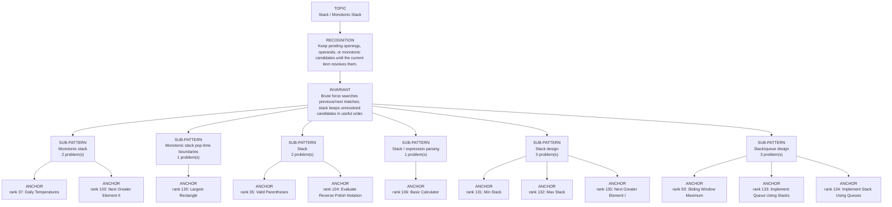

# Stack / Monotonic Stack

Focused pattern pass. Keep the global rank order inside this file; lower rank means a higher score in the current interview-ROI heuristic.

## Recognition Signal

Keep pending openings, operands, or monotonic candidates until the current item resolves them.

## Interview Move

Brute force searches previous/next matches; stack keeps unresolved candidates in useful order.

## Pattern Taxonomy Map

## Problems

| Global Rank | Phase | Problem | Pattern | Java | LeetCode | One-line recall | Crisp code idea |
|---:|---|---|---|---|---|---|---|
| 35 | Phase 2 - Strong Core | Valid Parentheses | Stack | [Java](../../../src/main/java/org/chijai/day5/stack/session3/ValidParentheses.java) | [LC](https://leetcode.com/problems/valid-parentheses/) | Every closing bracket must match the most recent unmatched opening bracket. | Push opening brackets; on closing, fail if stack empty or top is not its matching opener. |
| 37 | Phase 2 - Strong Core | Daily Temperatures | Monotonic stack | [Java](../../../src/main/java/org/chijai/day5/stack/session1/monotonic/DailyTemperatures.java) | [LC](https://leetcode.com/problems/daily-temperatures/) | Keep indices of days waiting for a warmer temperature; current day resolves colder previous days. | While current temp is warmer than stack top, pop index and set answer to current - popped. |
| 93 | Phase 3 - Important | Sliding Window Maximum | Stack/queue design | [Java](../../../src/main/java/org/chijai/day5/stack/session2/StackQueue.java) | [LC](https://leetcode.com/problems/sliding-window-maximum/) | A decreasing deque stores candidate indices; front is always the current window maximum. | Drop out-of-window front, pop smaller/equal from back, push index, read front after first window. |
| 103 | Phase 3 - Important | Next Greater Element II | Monotonic stack | [Java](../../../src/main/java/org/chijai/day5/stack/session1/monotonic/NextGreaterElement.java) | [LC](https://leetcode.com/problems/next-greater-element-ii/) | Loop twice over the circular array while a decreasing stack waits for next greater values. | For i in 0..2n-1, resolve stack with nums[i % n], push i only during first pass. |
| 104 | Phase 3 - Important | Evaluate Reverse Polish Notation | Stack | [Java](../../../src/main/java/org/chijai/day5/stack/session3/EvalRPN.java) | [LC](https://leetcode.com/problems/evaluate-reverse-polish-notation/) | Postfix expression evaluates when each operator consumes the latest two operands from a stack. | Push numbers; on operator pop b then a, compute a op b, push result. |
| 106 | Phase 3 - Important | Basic Calculator | Stack / expression parsing | [Java](../../../src/main/java/org/chijai/day5/stack/session3/BasicCalculator.java) | [LC](https://leetcode.com/problems/basic-calculator/) | Use sign and stack to preserve the expression value before each parenthesis. | Track result, sign, number; on '(' push result/sign and reset; on ')' fold into previous context. |
| 130 | Phase 4 - Secondary | Largest Rectangle | Monotonic stack pop-time boundaries | [Java](../../../src/main/java/org/chijai/day5/stack/session1/monotonic/LargestRectangle.java) | - | The increasing stack holds bar indices whose maximal right boundary is not known; a lower current bar closes every taller pending rectangle. | Scan through a final height-0 sentinel; while currentHeight < height[top], pop h, use current i as right boundary and new top as left boundary, width = right - left - 1. |
| 131 | Phase 4 - Secondary | Min Stack | Stack design | [Java](../../../src/main/java/org/chijai/day5/stack/session2/MinStackDesign.java) | [LC](https://leetcode.com/problems/min-stack/) | Store the current minimum with each push, or keep a second stack of minimums. | Push value and min(value,currentMin); pop both together; getMin reads min top. |
| 132 | Phase 4 - Secondary | Max Stack | Stack design | [Java](../../../src/main/java/org/chijai/day5/stack/session2/MinStackDesign.java) | [LC](https://leetcode.com/problems/max-stack/) | Maintain stack order plus a way to locate/remove the current maximum. | Use stack plus max tracking, or doubly linked list plus TreeMap for O(log n) popMax. |
| 133 | Phase 4 - Secondary | Implement Queue Using Stacks | Stack/queue design | [Java](../../../src/main/java/org/chijai/day5/stack/session2/StackQueue.java) | [LC](https://leetcode.com/problems/implement-queue-using-stacks/) | Use input stack for pushes and output stack for pops; transfer only when output is empty. | push -> in.push; pop/peek -> if out empty move all in to out, then read out. |
| 134 | Phase 4 - Secondary | Implement Stack Using Queues | Stack/queue design | [Java](../../../src/main/java/org/chijai/day5/stack/session2/StackQueue.java) | [LC](https://leetcode.com/problems/implement-stack-using-queues/) | After each push, rotate the queue so the newest element is at the front. | Offer x, then rotate size-1 older elements behind it; pop removes queue front. |
| 135 | Phase 4 - Secondary | Next Greater Element I | Stack design | [Java](../../../src/main/java/org/chijai/day5/stack/session2/MinStackDesign.java) | [LC](https://leetcode.com/problems/next-greater-element-i/) | Precompute next greater for nums2 with a decreasing stack, then answer nums1 by map lookup. | Scan nums2, pop smaller values and map them to current, then lookup each nums1 value. |
| 136 | Phase 4 - Secondary | Online Stock Span | Stack design | [Java](../../../src/main/java/org/chijai/day5/stack/session2/MinStackDesign.java) | [LC](https://leetcode.com/problems/online-stock-span/) | A decreasing stack of price/span pairs merges all previous prices <= current price. | Start span=1, while stack top price <= current add its span and pop, then push current/span. |
| 157 | Phase 5 - If Time | Design A Stack With Increment Operation | Stack design | [Java](../../../src/main/java/org/chijai/day5/stack/session2/MinStackDesign.java) | [LC](https://leetcode.com/problems/design-a-stack-with-increment-operation/) | Lazy increment stores pending additions at the boundary index instead of touching k items. | Keep stack plus inc array; on pop carry inc[i] to inc[i-1] and return value + inc[i]. |

## Drill

1. Read only the problem title.
2. Say brute force, bottleneck, pattern, invariant, code idea, dry run.
3. Open Java only after the spoken answer is complete.
4. Code one missed problem from blank before moving to another pattern.