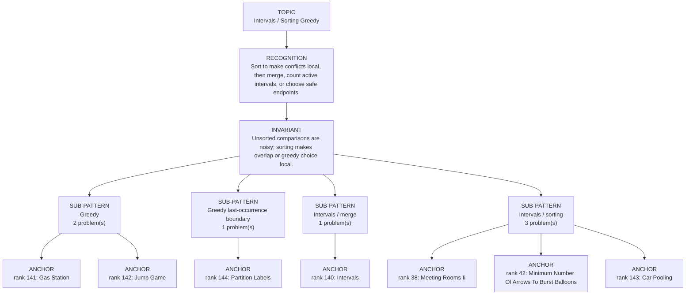

# Intervals / Sorting Greedy

Focused pattern pass. Keep the global rank order inside this file; lower rank means a higher score in the current interview-ROI heuristic.

## Recognition Signal

Sort to make conflicts local, then merge, count active intervals, or choose safe endpoints.

## Interview Move

Unsorted comparisons are noisy; sorting makes overlap or greedy choice local.

## Pattern Taxonomy Map

## Problems

| Global Rank | Phase | Problem | Pattern | Java | LeetCode | One-line recall | Crisp code idea |
|---:|---|---|---|---|---|---|---|
| 38 | Phase 2 - Strong Core | Meeting Rooms Ii | Intervals / sorting | [Java](../../../src/main/java/org/chijai/day1/Arrays/session4/Intervals/MinimumPlatforms.java) | [LC](https://leetcode.com/problems/meeting-rooms-ii/) | Sort meetings by start; a min-heap of end times counts active rooms. | Sort intervals, pop heap while end <= start, push current end, track max heap size. |
| 42 | Phase 2 - Strong Core | Minimum Number Of Arrows To Burst Balloons | Intervals / sorting | [Java](../../../src/main/java/org/chijai/day1/Arrays/session4/Intervals/MinimumPlatforms.java) | [LC](https://leetcode.com/problems/minimum-number-of-arrows-to-burst-balloons/) | Sort balloons by end; shoot at current end and start a new arrow only after it is missed. | Sort by end, keep currentArrowEnd, increment arrows when next.start > currentArrowEnd. |
| 140 | Phase 4 - Secondary | Intervals | Intervals / merge | [Java](../../../src/main/java/org/chijai/day1/Arrays/session4/Intervals/Intervals.java) | - | Sort to make conflicts local, then merge, count active intervals, or choose safe endpoints. | Sort by start/end, then merge/count/select with one pass or heap. |
| 141 | Phase 4 - Secondary | Gas Station | Greedy | [Java](../../../src/main/java/org/chijai/day1/Arrays/session4/Intervals/GasStation.java) | [LC](https://leetcode.com/problems/gas-station/) | Sort to make conflicts local, then merge, count active intervals, or choose safe endpoints. | Sort by start/end, then merge/count/select with one pass or heap. |
| 142 | Phase 4 - Secondary | Jump Game | Greedy | [Java](../../../src/main/java/org/chijai/day1/Arrays/session4/Intervals/GasStation.java) | [LC](https://leetcode.com/problems/jump-game/) | Sort to make conflicts local, then merge, count active intervals, or choose safe endpoints. | Sort by start/end, then merge/count/select with one pass or heap. |
| 143 | Phase 4 - Secondary | Car Pooling | Intervals / sorting | [Java](../../../src/main/java/org/chijai/day1/Arrays/session4/Intervals/MinimumPlatforms.java) | [LC](https://leetcode.com/problems/car-pooling/) | Treat each pickup/dropoff as passenger-count delta and ensure capacity is never exceeded. | Use difference array or sorted events: add passengers at start, subtract at end, track running load. |
| 144 | Phase 4 - Secondary | Partition Labels | Greedy last-occurrence boundary | [Java](../../../src/main/java/org/chijai/day10/session2/CountUniqueChars.java) | [LC](https://leetcode.com/problems/partition-labels/) | Close a partition only when the current index reaches the farthest last occurrence of all chars seen so far. | Sort by start/end, then merge/count/select with one pass or heap. |

## Drill

1. Read only the problem title.
2. Say brute force, bottleneck, pattern, invariant, code idea, dry run.
3. Open Java only after the spoken answer is complete.
4. Code one missed problem from blank before moving to another pattern.