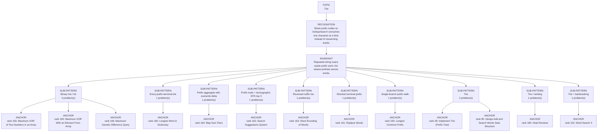

# Trie

Focused pattern pass. Keep the global rank order inside this file; lower rank means a higher score in the current interview-ROI heuristic.

## Recognition Signal

Share prefix nodes so lookup/search consumes one character at a time instead of rescanning words.

## Interview Move

Repeated string scans waste prefix work; trie shares prefixes across words.

## Pattern Taxonomy Map

## Problems

| Global Rank | Phase | Problem | Pattern | Java | LeetCode | One-line recall | Crisp code idea |
|---:|---|---|---|---|---|---|---|
| 39 | Phase 2 - Strong Core | Implement Trie (Prefix Tree) | Trie | [Java](../../../src/main/java/org/chijai/day10/session1/trie/TriePrefix.java) | [LC](https://leetcode.com/problems/implement-trie-prefix-tree/) | Each trie node represents one prefix; terminal marks distinguish full words from prefixes. | For insert/search/startsWith, walk chars through children; create on insert, fail on missing child. |
| 95 | Phase 3 - Important | Design Add and Search Words Data Structure | Trie | [Java](../../../src/main/java/org/chijai/day10/session1/trie/TriePrefix.java) | [LC](https://leetcode.com/problems/design-add-and-search-words-data-structure/) | Trie search branches only on '.', otherwise it follows exactly one child. | DFS over trie and word index; on '.', try every child, otherwise follow the matching child. |
| 102 | Phase 3 - Important | Word Search II | Trie + backtracking | [Java](../../../src/main/java/org/chijai/day10/session1/trie/WordSearchII.java) | [LC](https://leetcode.com/problems/word-search-ii/) | Trie prunes dictionary prefixes while board DFS chooses, marks, explores, and unmarks cells. | Build trie, DFS board paths, stop when prefix missing, collect terminal words, mark cells in-place. |
| 156 | Phase 5 - If Time | Maximum XOR of Two Numbers in an Array | Binary trie / bit | [Java](../../../src/main/java/org/chijai/day10/session1/trie/MaximumXOR.java) | [LC](https://leetcode.com/problems/maximum-xor-of-two-numbers-in-an-array/) | Binary trie chooses the opposite bit greedily to maximize each XOR bit from high to low. | Insert numbers by bits, then for each number walk preferred opposite bits and update max. |
| 159 | Phase 5 - If Time | Longest Common Prefix | Single-branch prefix walk | [Java](../../../src/main/java/org/chijai/day10/session1/trie/TriePrefix.java) | [LC](https://leetcode.com/problems/longest-common-prefix/) | The common prefix continues only while the trie path has exactly one child and the current node is not terminal. | Insert all strings, walk the sole child while childCount == 1 && !isWord, append that edge, and stop at branch or terminal. |
| 160 | Phase 5 - If Time | Longest Word in Dictionary | Every-prefix-terminal trie | [Java](../../../src/main/java/org/chijai/day10/session1/trie/TrieWordDictionary.java) | [LC](https://leetcode.com/problems/longest-word-in-dictionary/) | A candidate is legal only if every trie node on its path is terminal, meaning every prefix is also a word. | Insert all words, validate terminal after every consumed character, and choose greatest length with lexicographically smallest tie. |
| 161 | Phase 5 - If Time | Replace Words | Shortest terminal prefix | [Java](../../../src/main/java/org/chijai/day10/session1/trie/TriePrefix.java) | [LC](https://leetcode.com/problems/replace-words/) | While scanning a sentence word, the first terminal trie node is its shortest dictionary root. | Walk characters until a child is missing or terminal is reached; replace only on the first terminal, otherwise keep the original word. |
| 162 | Phase 5 - If Time | Search Suggestions System | Prefix node + lexicographic DFS top 3 | [Java](../../../src/main/java/org/chijai/day10/session1/trie/TriePrefix.java) | [LC](https://leetcode.com/problems/search-suggestions-system/) | For each typed prefix, suggestions are the first at most three terminal words below that prefix in lexicographic DFS order. | Locate each prefix node; DFS children 0..25, append terminal words, backtrack the path, and stop that search at three results. |
| 163 | Phase 5 - If Time | Short Encoding of Words | Reversed suffix trie | [Java](../../../src/main/java/org/chijai/day10/session1/trie/TriePrefix.java) | [LC](https://leetcode.com/problems/short-encoding-of-words/) | Only words that are not suffixes of a longer encoded word add word.length + 1 characters. | Deduplicate words, process longer words first or insert reversed words, and add length + 1 only when the word creates a new terminal leaf contribution. |
| 164 | Phase 5 - If Time | Map Sum Pairs | Prefix aggregate with overwrite delta | [Java](../../../src/main/java/org/chijai/day10/session1/trie/TrieWordDictionary.java) | [LC](https://leetcode.com/problems/map-sum-pairs/) | node.sum is the total current value of every key passing through that prefix; updating an existing key changes each prefix by delta only. | Compute delta = newValue - oldValue, store the new key value, add delta along root and every key edge, and return the reached prefix node's sum. |
| 165 | Phase 5 - If Time | Maximum XOR With an Element From Array | Binary trie / bit | [Java](../../../src/main/java/org/chijai/day10/session1/trie/MaximumXOR.java) | [LC](https://leetcode.com/problems/maximum-xor-with-an-element-from-array/) | Offline sort queries by limit; insert eligible numbers into a bitwise trie before maximizing XOR. | Sort nums and queries by mi, insert nums <= mi, answer each query by opposite-bit trie walk. |
| 166 | Phase 5 - If Time | Maximum Genetic Difference Query | Binary trie / bit | [Java](../../../src/main/java/org/chijai/day10/session1/trie/MaximumXOR.java) | [LC](https://leetcode.com/problems/maximum-genetic-difference-query/) | DFS the tree while the current root-to-node path is stored in a bitwise trie. | On entering node insert value, answer attached queries, DFS children, then remove value. |
| 167 | Phase 5 - If Time | Count Pairs With XOR in a Range | Binary trie / bit | [Java](../../../src/main/java/org/chijai/day10/session1/trie/MaximumXOR.java) | [LC](https://leetcode.com/problems/count-pairs-with-xor-in-a-range/) | Count pairs with XOR < bound using bitwise trie prefixes, then subtract low from high+1. | For each num, add countLessThan(high+1) - countLessThan(low), then insert num. |
| 185 | Phase 5 - If Time | Hotel Reviews | Trie / ranking | [Java](../../../src/main/java/org/chijai/day10/session1/trie/HotelReviews.java) | - | Use trie or keyword set to count good words per review, then rank hotels by score. | Normalize review words, count keyword hits, aggregate per hotel, sort by score and id. |

## Drill

1. Read only the problem title.
2. Say brute force, bottleneck, pattern, invariant, code idea, dry run.
3. Open Java only after the spoken answer is complete.
4. Code one missed problem from blank before moving to another pattern.