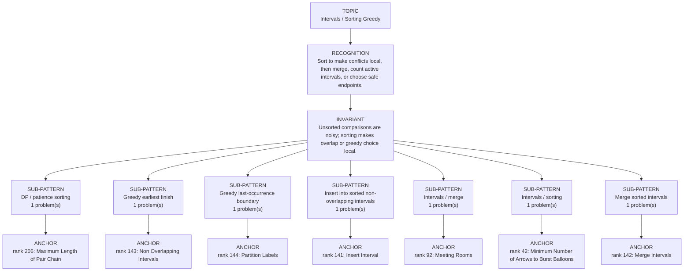

# Intervals / Sorting Greedy

Focused pattern pass. Keep the global rank order inside this file; lower rank means a higher score in the current interview-ROI heuristic.

## Recognition Signal

Sort to make conflicts local, then merge, count active intervals, or choose safe endpoints.

## Interview Move

Unsorted comparisons are noisy; sorting makes overlap or greedy choice local.

## Pattern Taxonomy Map

## Problems

| Global Rank | Phase | Problem | Pattern | Java | LeetCode | One-line recall | Crisp code idea |
|---:|---|---|---|---|---|---|---|
| 42 | Phase 2 - Strong Core | Minimum Number of Arrows to Burst Balloons | Intervals / sorting | [Java](../../../src/main/java/org/chijai/day1/Arrays/session4/Intervals/IntervalGreedyByEnd.java) | [LC](https://leetcode.com/problems/minimum-number-of-arrows-to-burst-balloons/) | Sort balloons by end; shoot at current end and start a new arrow only after it is missed. | Sort by end, keep currentArrowEnd, increment arrows when next.start > currentArrowEnd. |
| 92 | Phase 3 - Important | Meeting Rooms | Intervals / merge | [Java](../../../src/main/java/org/chijai/day1/Arrays/session4/Intervals/IntervalSortByStart.java) | [LC](https://leetcode.com/problems/meeting-rooms/) | After sorting intervals by start, any overlap with the previous end means a conflict. | Sort by start, scan adjacent intervals, return false if current.start < previous.end. |
| 141 | Phase 4 - Secondary | Insert Interval | Insert into sorted non-overlapping intervals | [Java](../../../src/main/java/org/chijai/day1/Arrays/session4/Intervals/IntervalSortByStart.java) | [LC](https://leetcode.com/problems/insert-interval/) | newInterval is the not-yet-emitted merged interval; existing intervals are already sorted and non-overlapping. | Emit intervals ending < new.start, merge while current.start <= new.end, emit the merged interval once, then append the untouched suffix. |
| 142 | Phase 4 - Secondary | Merge Intervals | Merge sorted intervals | [Java](../../../src/main/java/org/chijai/day1/Arrays/session4/Intervals/IntervalSortByStart.java) | [LC](https://leetcode.com/problems/merge-intervals/) | activeStart..activeEnd is the union of every sorted interval not yet flushed to output. | If current.start <= activeEnd, extend activeEnd = max(activeEnd, current.end); otherwise flush active and replace it with current; flush once after the loop. |
| 143 | Phase 4 - Secondary | Non Overlapping Intervals | Greedy earliest finish | [Java](../../../src/main/java/org/chijai/day1/Arrays/session4/Intervals/IntervalGreedyByEnd.java) | [LC](https://leetcode.com/problems/non-overlapping-intervals/) | lastFinish is the end of the last kept interval; earliest finish leaves maximal room for every future interval. | Sort by end; keep current when current.start >= lastFinish and move lastFinish to current.end, otherwise remove it; answer is n - kept. |
| 144 | Phase 4 - Secondary | Partition Labels | Greedy last-occurrence boundary | [Java](../../../src/main/java/org/chijai/day10/session2/CountUniqueChars.java) | [LC](https://leetcode.com/problems/partition-labels/) | Close a partition only when the current index reaches the farthest last occurrence of all chars seen so far. | Sort by start/end, then merge/count/select with one pass or heap. |
| 206 | Phase 5 - If Time | Maximum Length of Pair Chain | DP / patience sorting | [Java](../../../src/main/java/org/chijai/day9/dp/session2/LIS.java) | [LC](https://leetcode.com/problems/maximum-length-of-pair-chain/) | Sort pairs by end and take the next pair whose start is after the current end. | Sort by pair[1], keep currentEnd, count pair when pair[0] > currentEnd. |

## Drill

1. Read only the problem title.
2. Say brute force, bottleneck, pattern, invariant, code idea, dry run.
3. Open Java only after the spoken answer is complete.
4. Code one missed problem from blank before moving to another pattern.