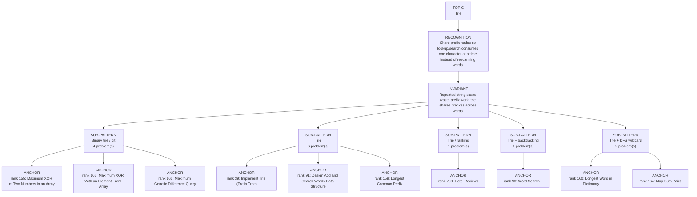

# Trie

Focused pattern pass. Keep the global rank order inside this file; lower rank means a higher score in the current interview-ROI heuristic.

## Recognition Signal

Share prefix nodes so lookup/search consumes one character at a time instead of rescanning words.

## Interview Move

Repeated string scans waste prefix work; trie shares prefixes across words.

## Pattern Taxonomy Map

## Problems

| Global Rank | Phase | Problem | Pattern | Java | LeetCode | One-line recall | Crisp code idea |
|---:|---|---|---|---|---|---|---|
| 39 | Phase 2 - Strong Core | Implement Trie (Prefix Tree) | Trie | [Java](../../../src/main/java/org/chijai/day10/session1/trie/TriePrefix.java) | [LC](https://leetcode.com/problems/implement-trie-prefix-tree/) | Each trie node represents one prefix; terminal marks distinguish full words from prefixes. | For insert/search/startsWith, walk chars through children; create on insert, fail on missing child. |
| 91 | Phase 3 - Important | Design Add and Search Words Data Structure | Trie | [Java](../../../src/main/java/org/chijai/day10/session1/trie/TriePrefix.java) | [LC](https://leetcode.com/problems/design-add-and-search-words-data-structure/) | Trie search branches only on '.', otherwise it follows exactly one child. | DFS over trie and word index; on '.', try every child, otherwise follow the matching child. |
| 98 | Phase 3 - Important | Word Search Ii | Trie + backtracking | [Java](../../../src/main/java/org/chijai/day10/session1/trie/WordSearchII.java) | [LC](https://leetcode.com/problems/word-search-ii/) | Trie prunes dictionary prefixes while board DFS chooses, marks, explores, and unmarks cells. | Build trie, DFS board paths, stop when prefix missing, collect terminal words, mark cells in-place. |
| 155 | Phase 5 - If Time | Maximum XOR of Two Numbers in an Array | Binary trie / bit | [Java](../../../src/main/java/org/chijai/day10/session1/trie/MaximumXOR.java) | [LC](https://leetcode.com/problems/maximum-xor-of-two-numbers-in-an-array/) | Binary trie chooses the opposite bit greedily to maximize each XOR bit from high to low. | Insert numbers by bits, then for each number walk preferred opposite bits and update max. |
| 159 | Phase 5 - If Time | Longest Common Prefix | Trie | [Java](../../../src/main/java/org/chijai/day10/session1/trie/TriePrefix.java) | [LC](https://leetcode.com/problems/longest-common-prefix/) | Share prefix nodes so lookup/search consumes one character at a time instead of rescanning words. | Insert words by characters; search follows children and DFS branches on wildcard/board. |
| 160 | Phase 5 - If Time | Longest Word in Dictionary | Trie + DFS wildcard | [Java](../../../src/main/java/org/chijai/day10/session1/trie/TrieWordDictionary.java) | [LC](https://leetcode.com/problems/longest-word-in-dictionary/) | Share prefix nodes so lookup/search consumes one character at a time instead of rescanning words. | Insert words by characters; search follows children and DFS branches on wildcard/board. |
| 161 | Phase 5 - If Time | Replace Words | Trie | [Java](../../../src/main/java/org/chijai/day10/session1/trie/TriePrefix.java) | [LC](https://leetcode.com/problems/replace-words/) | Share prefix nodes so lookup/search consumes one character at a time instead of rescanning words. | Insert words by characters; search follows children and DFS branches on wildcard/board. |
| 162 | Phase 5 - If Time | Search Suggestions System | Trie | [Java](../../../src/main/java/org/chijai/day10/session1/trie/TriePrefix.java) | [LC](https://leetcode.com/problems/search-suggestions-system/) | Share prefix nodes so lookup/search consumes one character at a time instead of rescanning words. | Insert words by characters; search follows children and DFS branches on wildcard/board. |
| 163 | Phase 5 - If Time | Short Encoding of Words | Trie | [Java](../../../src/main/java/org/chijai/day10/session1/trie/TriePrefix.java) | [LC](https://leetcode.com/problems/short-encoding-of-words/) | Share prefix nodes so lookup/search consumes one character at a time instead of rescanning words. | Insert words by characters; search follows children and DFS branches on wildcard/board. |
| 164 | Phase 5 - If Time | Map Sum Pairs | Trie + DFS wildcard | [Java](../../../src/main/java/org/chijai/day10/session1/trie/TrieWordDictionary.java) | [LC](https://leetcode.com/problems/map-sum-pairs/) | Share prefix nodes so lookup/search consumes one character at a time instead of rescanning words. | Insert words by characters; search follows children and DFS branches on wildcard/board. |
| 165 | Phase 5 - If Time | Maximum XOR With an Element From Array | Binary trie / bit | [Java](../../../src/main/java/org/chijai/day10/session1/trie/MaximumXOR.java) | [LC](https://leetcode.com/problems/maximum-xor-with-an-element-from-array/) | Share prefix nodes so lookup/search consumes one character at a time instead of rescanning words. | Insert words by characters; search follows children and DFS branches on wildcard/board. |
| 166 | Phase 5 - If Time | Maximum Genetic Difference Query | Binary trie / bit | [Java](../../../src/main/java/org/chijai/day10/session1/trie/MaximumXOR.java) | [LC](https://leetcode.com/problems/maximum-genetic-difference-query/) | Share prefix nodes so lookup/search consumes one character at a time instead of rescanning words. | Insert words by characters; search follows children and DFS branches on wildcard/board. |
| 167 | Phase 5 - If Time | Count Pairs With XOR in a Range | Binary trie / bit | [Java](../../../src/main/java/org/chijai/day10/session1/trie/MaximumXOR.java) | [LC](https://leetcode.com/problems/count-pairs-with-xor-in-a-range/) | Share prefix nodes so lookup/search consumes one character at a time instead of rescanning words. | Insert words by characters; search follows children and DFS branches on wildcard/board. |
| 200 | Phase 5 - If Time | Hotel Reviews | Trie / ranking | [Java](../../../src/main/java/org/chijai/day10/session1/trie/HotelReviews.java) | - | Use trie or keyword set to count good words per review, then rank hotels by score. | Normalize review words, count keyword hits, aggregate per hotel, sort by score and id. |

## Drill

1. Read only the problem title.
2. Say brute force, bottleneck, pattern, invariant, code idea, dry run.
3. Open Java only after the spoken answer is complete.
4. Code one missed problem from blank before moving to another pattern.