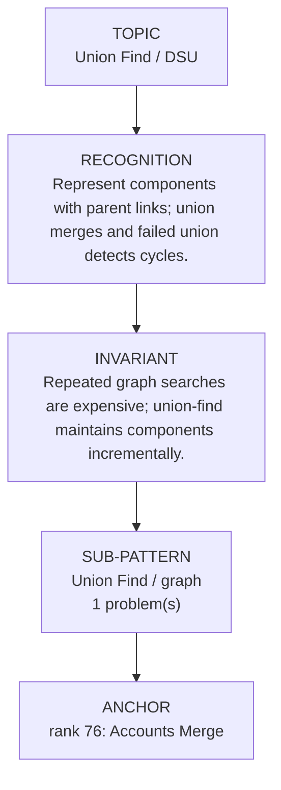

# Union Find / DSU

Focused pattern pass. Keep the global rank order inside this file; lower rank means a higher score in the current interview-ROI heuristic.

## Recognition Signal

Represent components with parent links; union merges and failed union detects cycles.

## Interview Move

Repeated graph searches are expensive; union-find maintains components incrementally.

## Pattern Taxonomy Map

## Problems

| Global Rank | Phase | Problem | Pattern | Java | LeetCode | One-line recall | Crisp code idea |
|---:|---|---|---|---|---|---|---|
| 76 | Phase 3 - Important | Accounts Merge | Union Find / graph | [Java](../../../src/main/java/org/chijai/day8/graph/session3/AccountsMerge.java) | [LC](https://leetcode.com/problems/accounts-merge/) | Represent components with parent links; union merges and failed union detects cycles. | Initialize parent/rank, find with compression, union by rank/size. |

## Drill

1. Read only the problem title.
2. Say brute force, bottleneck, pattern, invariant, code idea, dry run.
3. Open Java only after the spoken answer is complete.
4. Code one missed problem from blank before moving to another pattern.