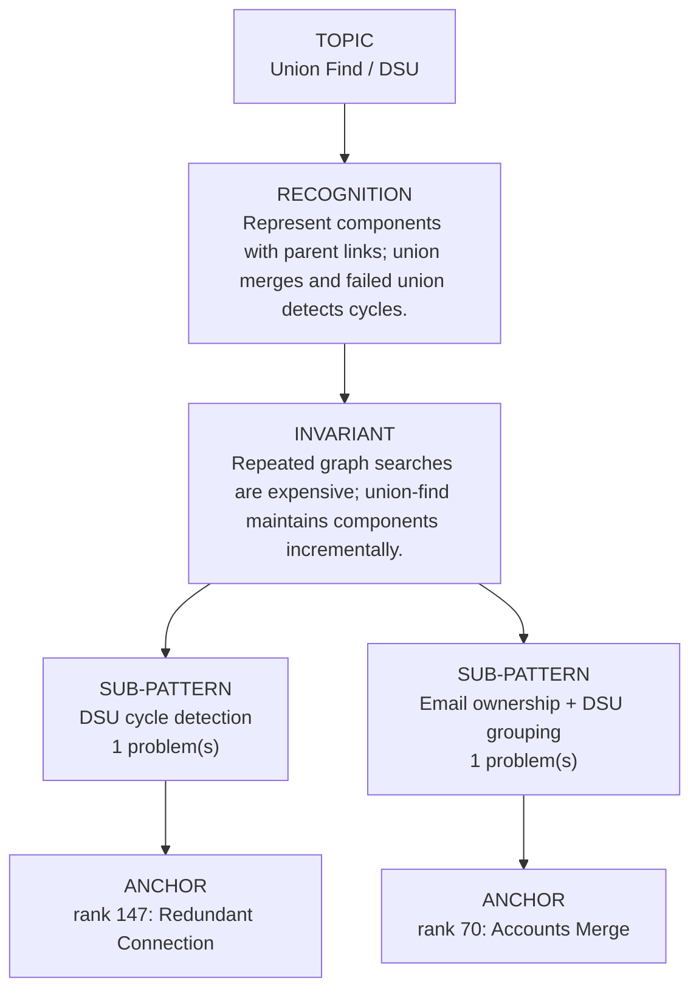

# Union Find / DSU

Focused pattern pass. Keep the global rank order inside this file; lower rank means a higher score in the current interview-ROI heuristic.

## Recognition Signal

Represent components with parent links; union merges and failed union detects cycles.

## Interview Move

Repeated graph searches are expensive; union-find maintains components incrementally.

## Pattern Taxonomy Map

## Problems

| Global Rank | Phase | Problem | Pattern | Java | LeetCode | One-line recall | Crisp code idea |
|---:|---|---|---|---|---|---|---|
| 70 | Phase 2 - Strong Core | Accounts Merge | Email ownership + DSU grouping | [Java](../../../src/main/java/org/chijai/day8/graph/session3/AccountsMerge.java) | [LC](https://leetcode.com/problems/accounts-merge/) | emailToFirstAccount owns the first account index for each email; a repeated email proves those account indices belong to one DSU component. | Union account roots on repeated emails, then find each account root, collect unique emails under that root, sort them, and prefix the representative name. |
| 147 | Phase 4 - Secondary | Redundant Connection | DSU cycle detection | [Java](../../../src/main/java/org/chijai/day8/graph/session2/GraphBipartite.java) | [LC](https://leetcode.com/problems/redundant-connection/) | DSU represents the forest formed by accepted edges; an edge is redundant exactly when both endpoints already have the same root. | Initialize one parent per 1-based node; for each edge union roots, and return the edge whose roots were already equal. |

## Drill

1. Read only the problem title.
2. Say brute force, bottleneck, pattern, invariant, code idea, dry run.
3. Open Java only after the spoken answer is complete.
4. Code one missed problem from blank before moving to another pattern.