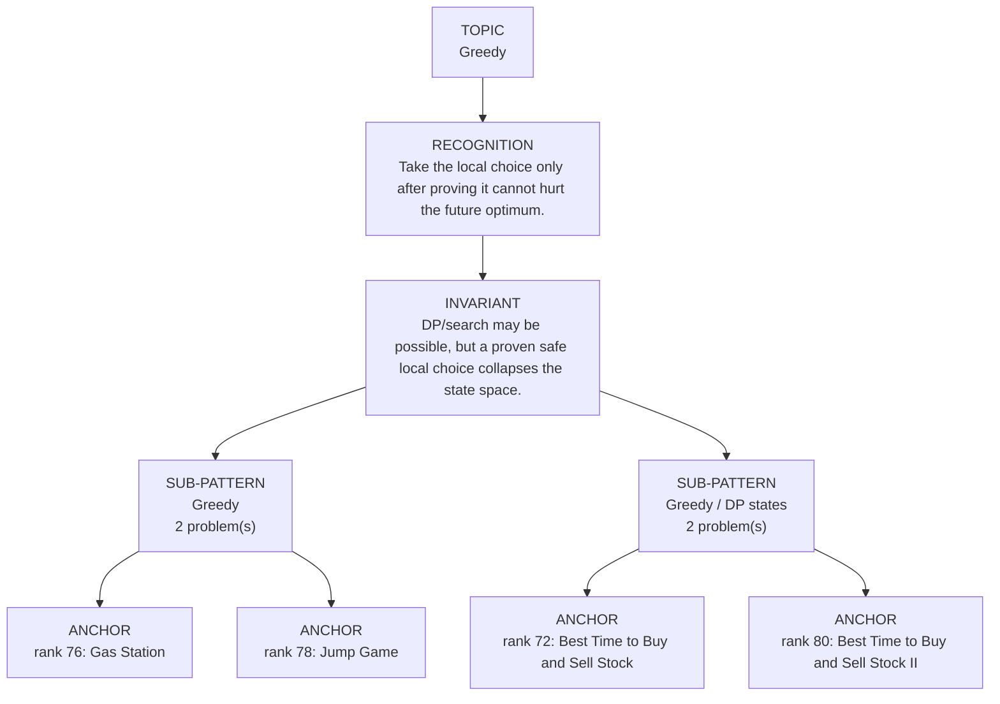

# Greedy

Focused pattern pass. Keep the global rank order inside this file; lower rank means a higher score in the current interview-ROI heuristic.

## Recognition Signal

Take the local choice only after proving it cannot hurt the future optimum.

## Interview Move

DP/search may be possible, but a proven safe local choice collapses the state space.

## Pattern Taxonomy Map

## Problems

| Global Rank | Phase | Problem | Pattern | Java | LeetCode | One-line recall | Crisp code idea |
|---:|---|---|---|---|---|---|---|
| 72 | Phase 3 - Important | Best Time to Buy and Sell Stock | Greedy / DP states | [Java](../../../src/main/java/org/chijai/day1/Arrays/session3/StockSeries1.java) | [LC](https://leetcode.com/problems/best-time-to-buy-and-sell-stock/) | Track the lowest price so far; today's profit is price minus that minimum. | For each price, update minPrice, then best = max(best, price - minPrice). |
| 76 | Phase 3 - Important | Gas Station | Greedy | [Java](../../../src/main/java/org/chijai/day9/dp/session1/GasStation.java) | [LC](https://leetcode.com/problems/gas-station/) | If tank goes negative at i, every start since the candidate is impossible. | Track totalNet, tank, and start; when tank < 0 set start = i + 1 and reset tank. |
| 78 | Phase 3 - Important | Jump Game | Greedy | [Java](../../../src/main/java/org/chijai/day9/dp/session1/GasStation.java) | [LC](https://leetcode.com/problems/jump-game/) | Track the farthest reachable index; failure happens only when i passes reach. | Scan i, fail if i > reach, otherwise reach = max(reach, i + nums[i]). |
| 80 | Phase 3 - Important | Best Time to Buy and Sell Stock II | Greedy / DP states | [Java](../../../src/main/java/org/chijai/day1/Arrays/session3/StockSeries1.java) | [LC](https://leetcode.com/problems/best-time-to-buy-and-sell-stock-ii/) | Unlimited transactions means every positive day-to-day increase can be harvested. | For i from 1, add prices[i] - prices[i-1] whenever the difference is positive. |

## Drill

1. Read only the problem title.
2. Say brute force, bottleneck, pattern, invariant, code idea, dry run.
3. Open Java only after the spoken answer is complete.
4. Code one missed problem from blank before moving to another pattern.