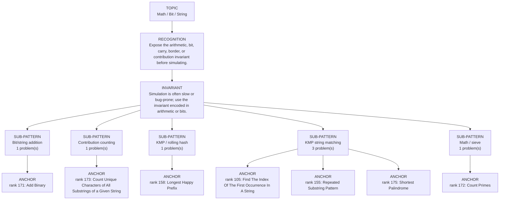

# Math / Bit / String

Focused pattern pass. Keep the global rank order inside this file; lower rank means a higher score in the current interview-ROI heuristic.

## Recognition Signal

Expose the arithmetic, bit, carry, border, or contribution invariant before simulating.

## Interview Move

Simulation is often slow or bug-prone; use the invariant encoded in arithmetic or bits.

## Pattern Taxonomy Map

## Problems

| Global Rank | Phase | Problem | Pattern | Java | LeetCode | One-line recall | Crisp code idea |
|---:|---|---|---|---|---|---|---|
| 105 | Phase 3 - Important | Find The Index Of The First Occurrence In A String | KMP string matching | [Java](../../../src/main/java/org/chijai/day7/session2/KmpPatterns.java) | [LC](https://leetcode.com/problems/find-the-index-of-the-first-occurrence-in-a-string/) | KMP reuses the longest proper prefix that is also a suffix after a mismatch. | Build LPS for needle, scan haystack with i/j, and fallback j = lps[j - 1] on mismatch. |
| 155 | Phase 5 - If Time | Repeated Substring Pattern | KMP string matching | [Java](../../../src/main/java/org/chijai/day7/session2/KmpPatterns.java) | [LC](https://leetcode.com/problems/repeated-substring-pattern/) | A repeated pattern exists when the final LPS leaves a block length that divides n. | Let len = lps[n - 1]; return len > 0 and n % (n - len) == 0. |
| 158 | Phase 5 - If Time | Longest Happy Prefix | KMP / rolling hash | [Java](../../../src/main/java/org/chijai/day7/session2/LongestHappyPrefix.java) | [LC](https://leetcode.com/problems/longest-happy-prefix/) | The answer is the final LPS value: longest proper prefix that is also suffix. | Build LPS over the string and return substring(0, lps[n - 1]). |
| 171 | Phase 5 - If Time | Add Binary | Bit/string addition | [Java](../../../src/main/java/org/chijai/day10/session2/AddBinary.java) | [LC](https://leetcode.com/problems/add-binary/) | Add bits from right to left with carry, exactly like decimal addition. | Use i,j,carry; append (sum % 2), update carry=sum/2, reverse result. |
| 172 | Phase 5 - If Time | Count Primes | Math / sieve | [Java](../../../src/main/java/org/chijai/day10/session2/CountPrimes.java) | [LC](https://leetcode.com/problems/count-primes/) | Sieve marks multiples of each discovered prime starting at p*p. | Boolean isComposite; for p*p < n, mark multiples p*p, p*p+p, ...; count unmarked. |
| 173 | Phase 5 - If Time | Count Unique Characters of All Substrings of a Given String | Contribution counting | [Java](../../../src/main/java/org/chijai/day10/session2/CountUniqueChars.java) | [LC](https://leetcode.com/problems/count-unique-characters-of-all-substrings-of-a-given-string/) | Each character occurrence contributes by distance to the previous same char times distance to the next one. | Record previous and next positions for each occurrence, sum leftGap * rightGap contributions. |
| 175 | Phase 5 - If Time | Shortest Palindrome | KMP string matching | [Java](../../../src/main/java/org/chijai/day7/session2/KmpPatterns.java) | [LC](https://leetcode.com/problems/shortest-palindrome/) | Find the longest palindromic prefix, then prepend the reverse of the remaining suffix. | Compute LPS on combined string, reverse suffix from lps length, prepend it to s. |

## Drill

1. Read only the problem title.
2. Say brute force, bottleneck, pattern, invariant, code idea, dry run.
3. Open Java only after the spoken answer is complete.
4. Code one missed problem from blank before moving to another pattern.