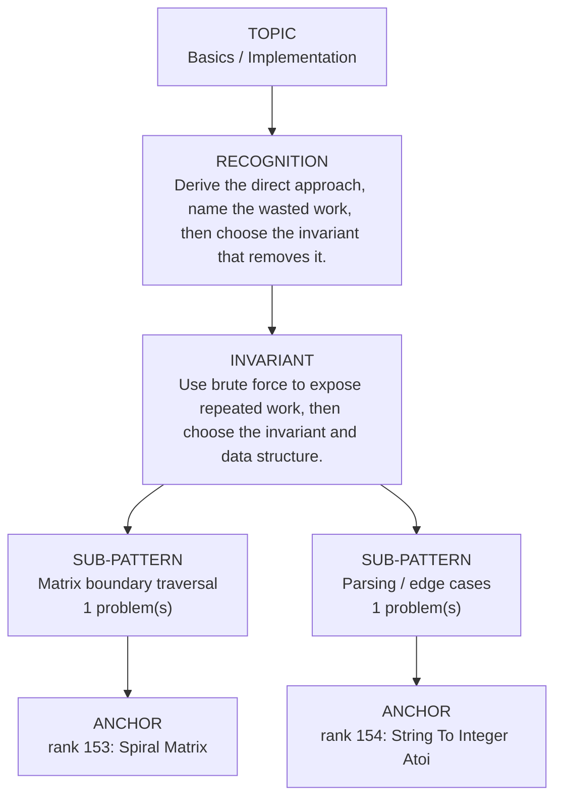

# Basics / Implementation

Focused pattern pass. Keep the global rank order inside this file; lower rank means a higher score in the current interview-ROI heuristic.

## Recognition Signal

Derive the direct approach, name the wasted work, then choose the invariant that removes it.

## Interview Move

Use brute force to expose repeated work, then choose the invariant and data structure.

## Pattern Taxonomy Map

## Problems

| Global Rank | Phase | Problem | Pattern | Java | LeetCode | One-line recall | Crisp code idea |
|---:|---|---|---|---|---|---|---|
| 153 | Phase 5 - If Time | Spiral Matrix | Matrix boundary traversal | [Java](../../../src/main/java/org/chijai/day1/Arrays/session1/SpiralMatrix.java) | [LC](https://leetcode.com/problems/spiral-matrix/) | Shrink top, bottom, left, and right boundaries after traversing each side. | Traverse top row, right col, bottom row if valid, left col if valid; move boundaries inward. |
| 154 | Phase 5 - If Time | String To Integer Atoi | Parsing / edge cases | [Java](../../../src/main/java/org/chijai/day3/session3/StringToIntegerAtoi.java) | [LC](https://leetcode.com/problems/string-to-integer-atoi/) | Parse sign and digits once, clamping before overflow. | Skip spaces, read optional sign, accumulate digit while checking against INT_MAX limits. |

## Drill

1. Read only the problem title.
2. Say brute force, bottleneck, pattern, invariant, code idea, dry run.
3. Open Java only after the spoken answer is complete.
4. Code one missed problem from blank before moving to another pattern.