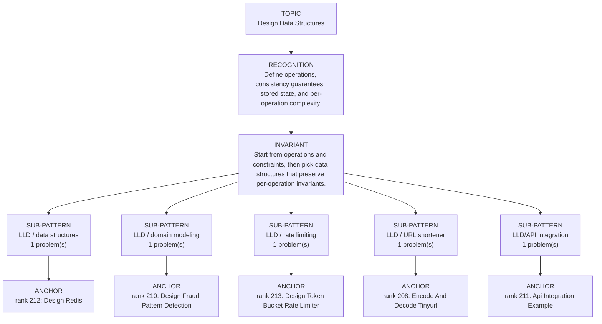

# Design Data Structures

Focused pattern pass. Keep the global rank order inside this file; lower rank means a higher score in the current interview-ROI heuristic.

## Recognition Signal

Define operations, consistency guarantees, stored state, and per-operation complexity.

## Interview Move

Start from operations and constraints, then pick data structures that preserve per-operation invariants.

## Pattern Taxonomy Map

## Problems

| Global Rank | Phase | Problem | Pattern | Java | LeetCode | One-line recall | Crisp code idea |
|---:|---|---|---|---|---|---|---|
| 208 | Phase 5 - If Time | Encode And Decode Tinyurl | LLD / URL shortener | [Java](../../../src/main/java/org/chijai/design/lld/DesignUrlShortner.java) | [LC](https://leetcode.com/problems/encode-and-decode-tinyurl/) | Encode creates a stable short key mapped to the original URL; decode is a map lookup. | Generate/increment key, store key->longUrl, return domain/key; decode extracts key and reads map. |
| 210 | Phase 5 - If Time | Design Fraud Pattern Detection | LLD / domain modeling | [Java](../../../src/main/java/org/chijai/design/lld/DesignFraudPatternDetection.java) | - | Define which transaction events are retained and which rule/window makes a pattern fraudulent. | Index recent events by account/card/merchant, evict expired entries, evaluate rules on insert. |
| 211 | Phase 5 - If Time | Api Integration Example | LLD/API integration | [Java](../../../src/main/java/org/chijai/design/lld/ApiIntegrationExample.java) | - | Model request, response, retry, timeout, and idempotency boundaries explicitly. | Wrap client call with typed DTOs, timeout/retry policy, status handling, and clear failure result. |
| 212 | Phase 5 - If Time | Design Redis | LLD / data structures | [Java](../../../src/main/java/org/chijai/design/lld/DesignRedis.java) | - | Key-value operations need storage, expiry metadata, and eviction/cleanup policy. | Store value plus expireAt, check expiry on get/set, and maintain cleanup or eviction structure. |
| 213 | Phase 5 - If Time | Design Token Bucket Rate Limiter | LLD / rate limiting | [Java](../../../src/main/java/org/chijai/design/lld/DesignTokenBucketRateLimiter.java) | - | A bucket refills by elapsed time and each request consumes one token if available. | Per key, compute tokens = min(capacity, tokens + elapsed*rate), allow if tokens >= cost. |

## Drill

1. Read only the problem title.
2. Say brute force, bottleneck, pattern, invariant, code idea, dry run.
3. Open Java only after the spoken answer is complete.
4. Code one missed problem from blank before moving to another pattern.