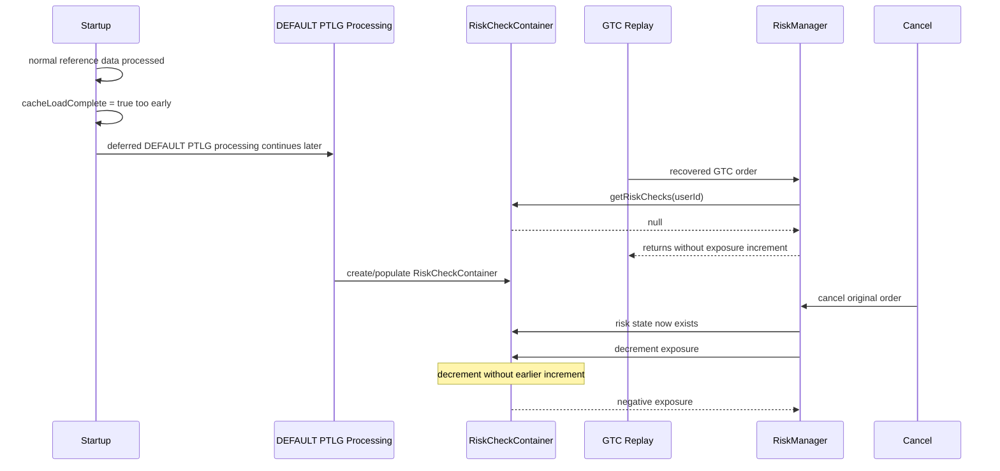
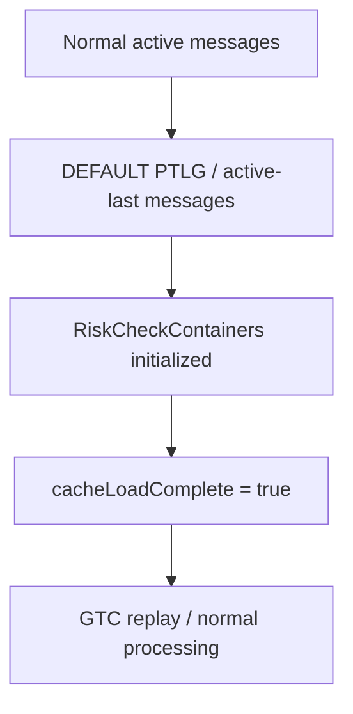

# Technical Challenge — Negative Exposure / DEFAULT PTLG Startup Ordering

This is the primary technical story to master.

---

# 1. Hook

Say:

> **Production. Negative exposure. Intermittent after startup. The arithmetic looked correct.**

Then let the interviewer ask why.

A second strong line:

> **The arithmetic wasn't wrong; the required state wasn't ready.**

---

# 2. The violated invariant

> Before an order can affect exposure for a product/risk group, the corresponding risk state must already be initialized.

That is the story.

Everything else explains how the invariant was violated.

---

# 3. Source-grounded causal chain

```text
DEFAULT PTLG
    ↓
intentionally deferred / processed last
    ↓
cacheLoadComplete could become TRUE too early
    ↓
startOfDay semantics changed too early
    ↓
DEFAULT PTLG limits followed delayed/rate-limited path
    ↓
RiskCheckContainer not ready yet
    ↓
recovered GTC order arrives
    ↓
getRiskChecks(userId) == null
    ↓
order risk processing returns / increment not registered
    ↓
later risk state exists
    ↓
CANCEL is processed normally
    ↓
exposure decremented from state that never received increment
    ↓
NEGATIVE EXPOSURE
```

---

# 4. Why DEFAULT PTLG is special

DEFAULT PTLG is a catch-all group.

Conceptually:

```text
load explicit PTLGs
load participants/users
determine who is already assigned
THEN
process default catch-all assignment
```

So "process default last" was not itself the bug.

The bug was:

> **the lifecycle/readiness boundary was placed before the deferred default processing had completed.**

---

# 5. Why the bug was hard

It combined several properties:

```text
startup-only
+ stateful
+ timing-dependent
+ recovered GTC orders
+ deferred configuration path
+ symptom appears later on CANCEL
```

The line that signals technical depth:

> The visible negative value was two causal steps away from the real defect. The decrement was valid. The missing earlier increment was the problem, and that happened because the risk state did not yet exist.

---

# 6. Investigation path

```text
Symptom
  ↓
Increase observability
  ↓
Replay customer event stream / DSF
  ↓
Reconstruct exact ordering
  ↓
Form startup-timing hypothesis
  ↓
Amplify timing window
  ↓
Reproduce deterministically
  ↓
Locate readiness-boundary error
  ↓
Fix invariant
  ↓
Synthetic validation
  ↓
Original-event replay
```

Do not reduce this to "I found a null."

The engineering value was turning a non-reproducible state/order problem into a deterministic experiment.

---

# 7. Reproduction technique

The key experimental move was deliberately increasing:

```text
RX_SRV_SEND_LIMITS_INTERVAL
```

Conceptually:

```text
normal interval
→ vulnerable window small
→ issue intermittent

larger interval
→ vulnerable window larger
→ failure easier to observe

very large interval
→ failure consistently reproducible
```

Interview sentence:

> I didn't wait for the timing problem to happen. I enlarged the suspected timing window until the hypothesis became falsifiable and reproducible.

---

# 8. Root cause at code/lifecycle level

Before the fix, effective ordering was closer to:

```text
normal active reference data
       ↓
cacheLoadComplete = true
       ↓
system can progress / GTC replay
       ↓
DEFAULT PTLG active-last work
       ↓
RiskCheckContainer created too late
```

Correct contract:

```text
normal active messages
       ↓
active-last / DEFAULT PTLG messages
       ↓
RiskCheckContainers initialized
       ↓
cacheLoadComplete = true
       ↓
normal processing / replay can continue safely
```

That is a readiness-contract fix, not merely a null-check fix.

---

# 9. Mermaid — failure sequence



---

# 10. Mermaid — corrected startup



Memory:

> **Ready means downstream risk representation is ready, not merely that reference-data input was received.**

---

# 11. 30-second answer

> The hardest issue I investigated was negative exposure after startup. It was an event-ordering problem, not bad arithmetic. DEFAULT PTLG risk state was intentionally deferred, but `cacheLoadComplete` could be set before that deferred queue had completed. Recovered GTC orders could therefore arrive before their `RiskCheckContainer` existed, so the initial exposure increment was skipped. Later cancellation decremented normally and exposure became negative. I replayed the event stream, deliberately enlarged the timing window until it reproduced consistently, fixed the readiness ordering and validated the patch with synthetic and original replay.

---

# 12. 60-second answer

> We had customer cases where exposure became negative after startup. Initially it looked like a calculation bug, but the arithmetic was correct and the issue was intermittent, so I reconstructed the event sequence rather than changing the formula.
>
> DEFAULT PTLGs are catch-all groups and are intentionally processed after the normal group/user data. The problem was that `cacheLoadComplete` could become true before that deferred work finished. That changed the semantics of how those limits were distributed and created a window where a recovered GTC order could reach the risk path before its `RiskCheckContainer` existed. The order path returned without registering the initial exposure. Later, after configuration existed, a cancellation decremented that exposure from zero.
>
> To prove it, I increased `RX_SRV_SEND_LIMITS_INTERVAL`, which enlarged the timing window and made the failure deterministic. The fix was to move the readiness boundary so the deferred DEFAULT PTLG work completed before `cacheLoadComplete=true`. Then I validated it with both synthetic reproduction and the original event replay.

---

# 13. 2-minute deep dive

Use only if they keep drilling.

> The important invariant was that no order should affect exposure until its corresponding risk configuration and container exist. DEFAULT PTLGs made this subtle because they are catch-all groups, so processing them later is correct — you need the explicit PTLG/user assignment state first.
>
> The lifecycle bug was where "ready" was declared. The system could mark `cacheLoadComplete` after normal active messages but before the process-last DEFAULT PTLG messages. `PreTradeLimitGroupUpdater` derives start-of-day behavior from the cache-complete state, so those default limits could then be treated more like normal intraday updates and go through the delayed/rate-limited distribution path.
>
> That created an intermittent window. A recovered GTC order could call `getRiskChecks(userId)` before the corresponding `RiskCheckContainer` had been created. The order path logged that no risk checks were available and returned, so the exposure increment was never registered. Later, once the limit had been installed, cancelling the same order followed the normal path and decremented exposure. The negative number was therefore the delayed symptom of an earlier missing transition.
>
> I used DSF/event replay to reconstruct the ordering, then deliberately increased the limit-send interval. The failure frequency increased with the interval, which strongly supported the timing hypothesis. Once reproducible, the fix was small: process the deferred active-last messages before setting `cacheLoadComplete=true`. The important part wasn't the number of changed lines; it was restoring the lifecycle invariant and proving it with both controlled reproduction and the customer's original event sequence.

---

# 14. Likely probes

## "Was this a race condition?"

> I would call it primarily an initialization/event-ordering bug rather than a classic shared-memory race. The system progressed past a readiness boundary while required risk state was still deferred.

## "Why not just add a null check?"

> The order path already effectively handled missing risk checks by returning. That behavior is what allowed the missing increment. Another null guard would hide the symptom; the correct fix was to make the state exist before processing is allowed to depend on it.

## "Why didn't non-default PTLGs fail?"

> Based on the investigation, normal PTLG limits were installed earlier, while DEFAULT PTLGs followed the deferred path, so the vulnerable ordering window primarily existed for the default groups.

## "Why was it intermittent?"

> The order had to arrive in a narrow interval after the system had advanced its readiness state but before the corresponding deferred risk state was installed.

## "How did you prove causality?"

> I changed the suspected timing variable. Increasing the interval enlarged the vulnerable window and increased reproducibility. Then the startup-order fix removed the failure under both synthetic and original replay.

## "What did you learn?"

> Treat readiness as an invariant over all required downstream state, not as a convenient lifecycle flag.

---

# 15. Important conflict to avoid

One later draft of the story said:

```text
limits were loaded from database
but consumption had not been rebuilt from event log
```

That is **not the same root cause** as the source-grounded DEFAULT PTLG / `RiskCheckContainer` ordering issue above.

Do not blend them.

Use the DEFAULT PTLG readiness story unless separate source evidence establishes the other mechanism.
