# PTR End-to-End + Mermaid Diagrams

The attached design PDFs are useful because they create a clear zoom sequence:

```text
SYSTEM FLOW
   ↓
RISK COMPONENT
   ↓
CLASS DESIGN
   ↓
CODE
   ↓
CONCURRENCY EVOLUTION
```

Use only the first two diagrams by default in a live interview.

---

# 1. Source-safe high-level PTR flow

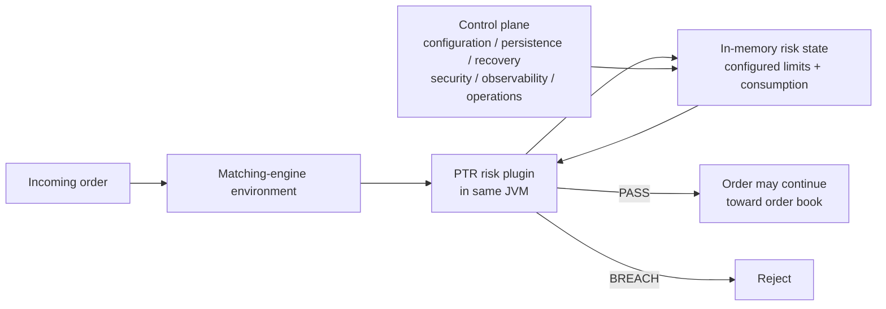

## 60-second narration

> The order reaches the matching-engine environment and PTR must produce a synchronous decision before the order can continue toward the order book. The risk plugin executes inside the matching-engine JVM, and the hot decision uses in-memory state to avoid a database or remote-service dependency on every order.
>
> The state is not static: orders, cancellations, trades and configuration changes affect what the next decision sees. Separately, the control plane is responsible for configuration, persistence, recovery, observability, security and operational concerns.
>
> The important architectural boundary is that the hot path consumes already-ready state. The negative-exposure incident happened when startup declared readiness before some deferred DEFAULT PTLG state was actually installed.

---

# 2. Interview/system-design high-level diagram

The attached high-level PDF contains a richer conceptual design. Use this when discussing the exercise, not automatically as a factual production diagram.

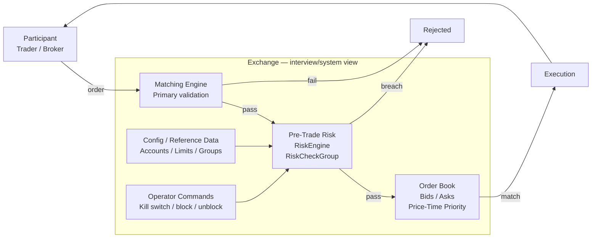

Do not claim a specific REST API, UI, DB or protocol from this diagram unless independently confirmed.

---

# 3. 60–90 second class diagram

This is the best default class-level drawing from the attached PDFs.

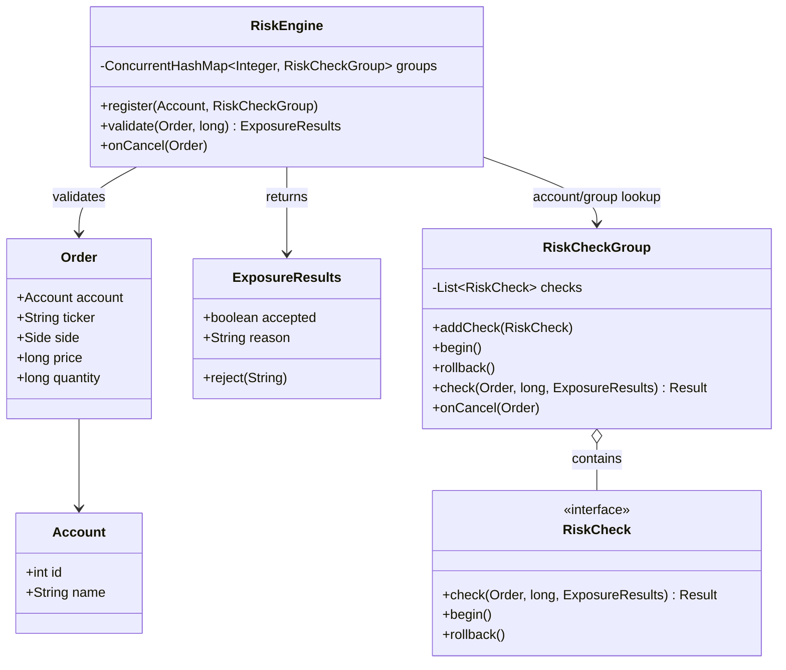

## Spoken explanation

> RiskEngine is the orchestration boundary. It finds the applicable risk group for the account and asks that group to evaluate the order. The group owns the set of checks that have to behave as one logical decision. Individual `RiskCheck` implementations own rule-specific logic. That keeps orchestration separate from the rules without forcing the CoderPad implementation into a large framework.

---

# 4. Detailed class hierarchy

Only draw this if the interviewer asks about extension or rollback.

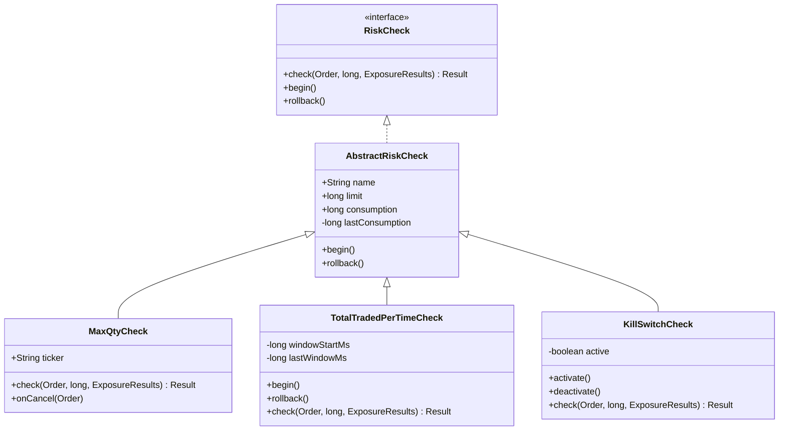

## Why this design can be useful

```text
RiskEngine        = orchestration
RiskCheckGroup    = decision boundary / grouped invariant
RiskCheck         = individual rule
AbstractRiskCheck = shared consumption snapshot/rollback behavior
```

But for only two checks in a 30-minute exercise, direct candidate-state calculation may be easier to write.

---

# 5. Group transaction / rollback

The attached Java foundation uses `begin()` and `rollback()` because individual checks may mutate their own consumption during evaluation.

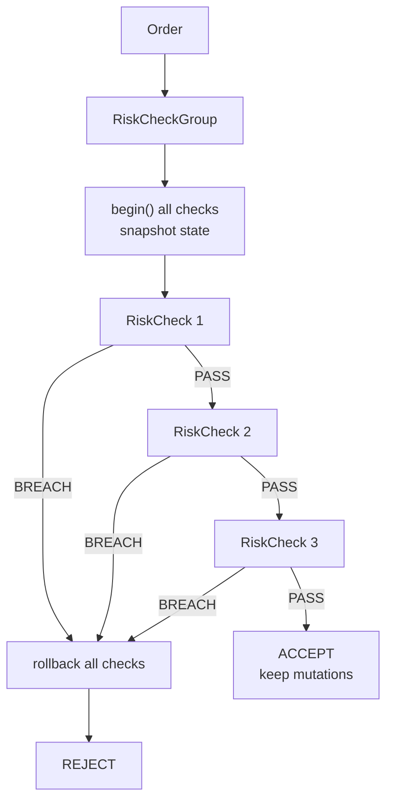

## Simpler CoderPad equivalent

```text
read current state
→ compute candidate position
→ compute candidate notional
→ validate both
→ commit only if both pass
```

That is easier to reconstruct and avoids rollback machinery.

---

# 6. Source-grounded startup/control-plane boundary

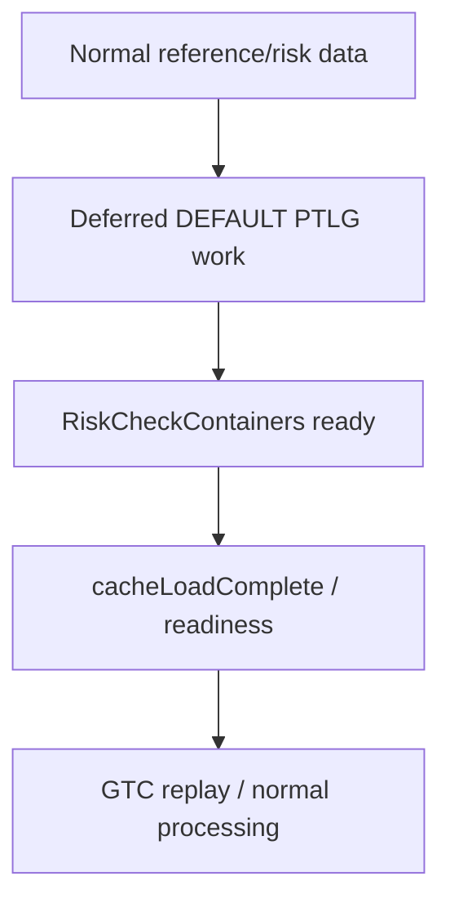

The key rule:

> **Readiness must mean all required downstream risk state is usable, including deferred work.**

---

# 7. Failure ordering from the negative-exposure incident

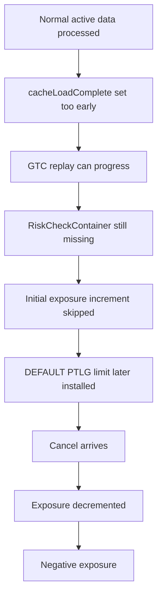

---

# 8. Attached Java architecture progression

## Level 1 — direct concurrent group access

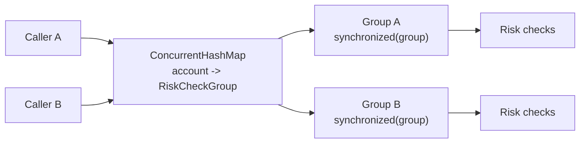

Different groups can be processed independently; same group is serialized.

---

# 9. Level 2 — in-process synchronous message bus

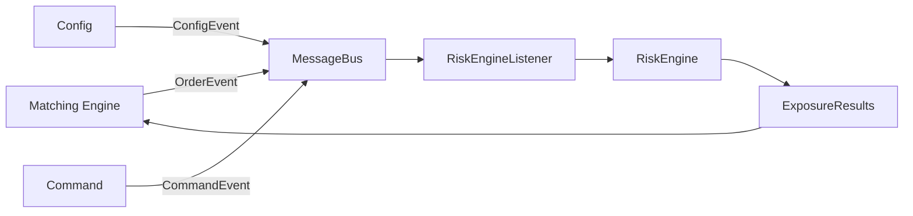

Important: in the attached implementation, `publish()` invokes handlers directly. This is event-driven integration, not asynchronous worker execution.

---

# 10. Level 3a — partitioned organization, caller-thread execution

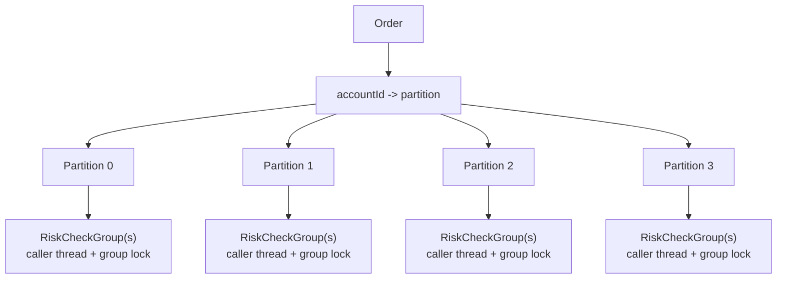

Partitioning here creates an explicit sharding/ownership structure, but it does **not** itself replace the group locks.

---

# 11. Level 3b — desired true partition-owner model

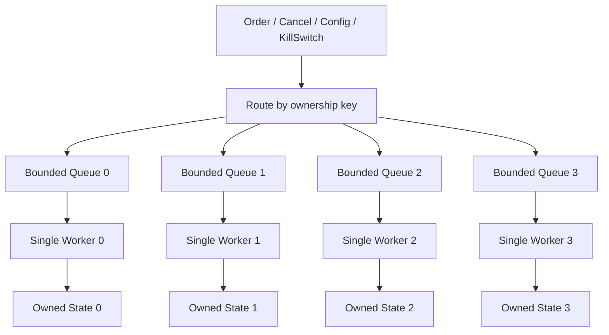

For the "zero locks inside partition" claim to be true, **all mutations** must go through the partition owner.

---

# 12. Matching-engine practice diagram

The attached `MatchingEngine.java` is a separate trading-domain drill.

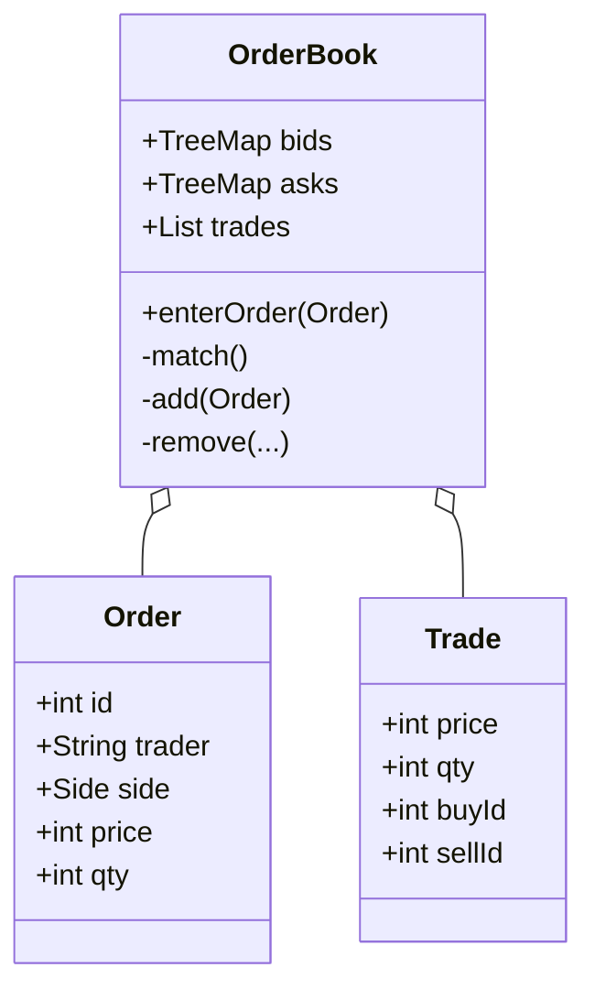

Data-structure anchor:

```text
bids -> prices descending
asks -> prices ascending
same price -> FIFO queue
```

---

# 13. What to draw live

Default:

```text
FIRST:  high-level order -> risk -> decision flow      ~60 sec
SECOND: RiskEngine -> RiskCheckGroup -> RiskCheck     ~60 sec
THIRD:  start coding
```

Only draw detailed inheritance, startup sequencing or partitioning when the interviewer drills into that concern.

---

# 14. Synchronous Hot-Path Sequence — MUST KNOW

This is the clearest diagram for:

> "How does PTR interact with the matching engine?"

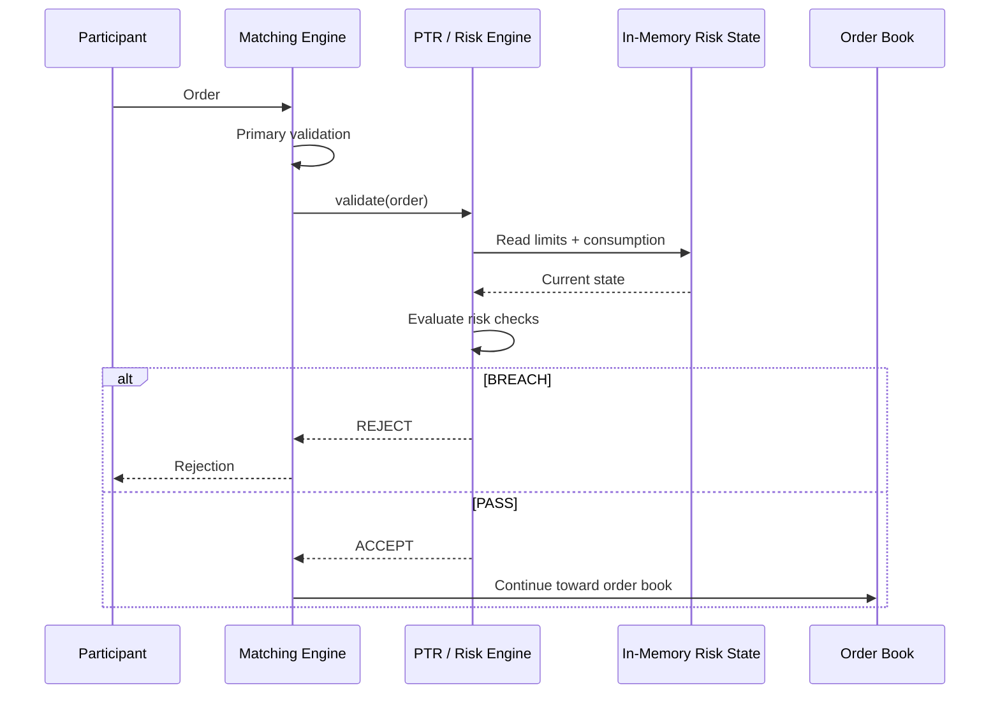

Core point:

```text
ME calls PTR
→ PTR evaluates synchronously
→ PTR returns ACCEPT / REJECT
→ ME continues
```

---

# 15. Startup Lifecycle State Machine — MUST KNOW

This is the best visual for the negative-exposure readiness bug.

```mermaid
stateDiagram-v2
    [*] --> LoadingReferenceData

    LoadingReferenceData --> ProcessingDeferredDefaultPTLG:
        normal reference data loaded

    ProcessingDeferredDefaultPTLG --> RiskStateReady:
        DEFAULT PTLG limits installed
        RiskCheckContainers ready

    RiskStateReady --> ReplayGTC:
        readiness invariant satisfied

    ReplayGTC --> Live:
        recovery complete

    Live --> Live:
        orders / cancels / trades / config
```

Correct lifecycle:

```text
reference data
→ deferred DEFAULT PTLG work
→ RiskCheckContainers ready
→ readiness
→ GTC replay
→ live processing
```

The bug was effectively:

```text
reference data
→ readiness declared too early
→ GTC replay starts

while DEFAULT PTLG risk state is still incomplete
```

Memory line:

> **Readiness is a lifecycle invariant, not just a boolean flag.**

---

# 16. 10× / Multi-JVM Ownership — FOLLOW-UP ONLY

Use only when asked how you would scale beyond one process.

**INTERVIEW DESIGN — not a claim about actual PTR topology.**

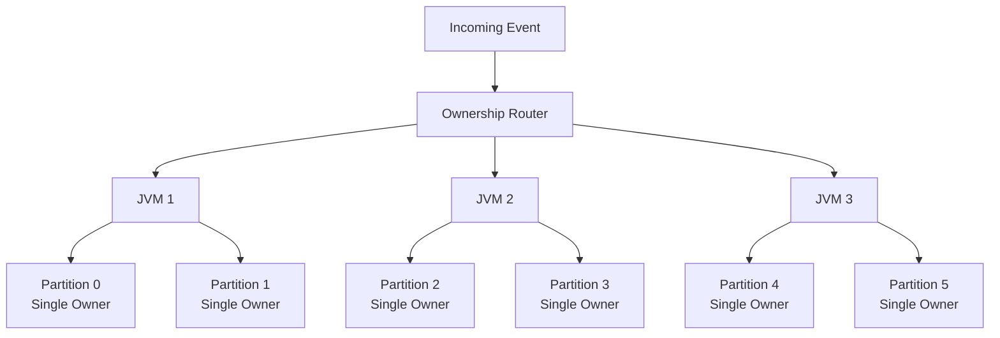

Invariant:

```text
SAME OWNERSHIP KEY
→ SAME OWNER
→ ORDER PRESERVED

DIFFERENT OWNERSHIP KEYS
→ DIFFERENT OWNERS
→ PARALLELISM
```

The hard problems at this level are ownership transfer, failover, recovery, skew and preventing two owners from becoming authoritative simultaneously.

