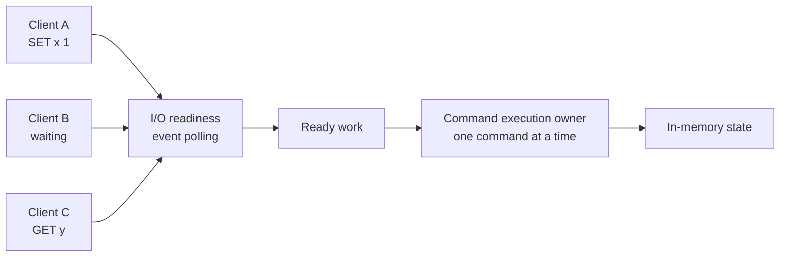
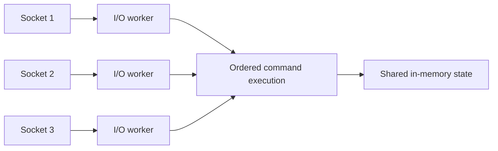
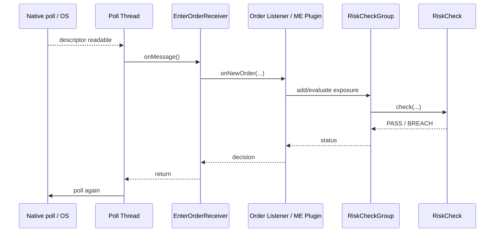
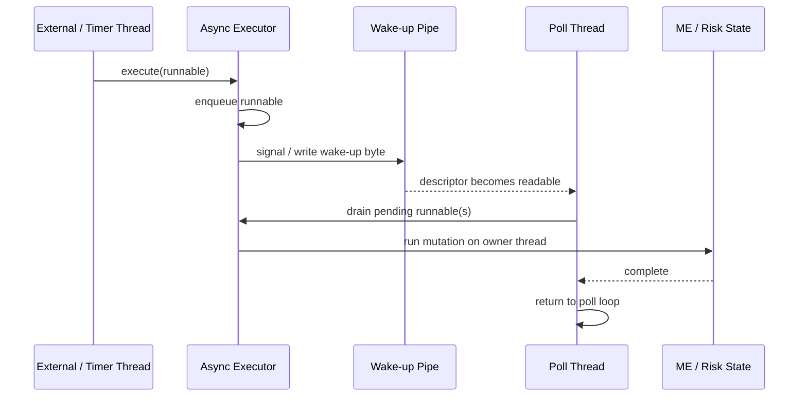
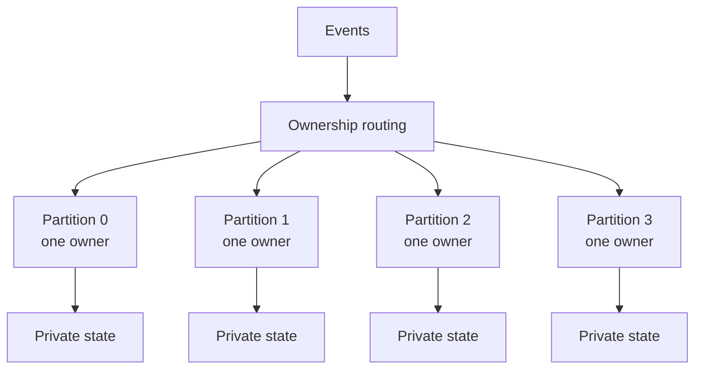

# Redis Single-Threaded Deep Dive + Connection to the ME/PTR Model

This is a **drill-down reference**, not part of the default 60-second PTR answer.

The useful idea is not "Redis proves our architecture." The useful idea is:

> **A system can support many concurrent inputs while deliberately serializing mutation of one ordered state domain.**

---

# 1. Concurrency is not parallelism

A single execution owner can serve many ready inputs without running their business logic simultaneously.



Conceptually:

```text
many clients / sockets
        ↓
I/O readiness
        ↓
one ordered execution stream
        ↓
shared in-memory state
```

This is **concurrency** because many clients can be in progress.

It is not necessarily **parallel command execution** because the state transition can still be serialized.

---

# 2. Why a single mutation owner can be attractive

If the business operation is tiny and state is shared, arbitrary parallel mutation can introduce more machinery than value:

```text
multiple mutators
    ↓
coordination
    ├── locks
    ├── CAS/retries
    ├── cache-coherence traffic
    ├── queueing
    └── ordering logic
```

With one owner:

```text
event 1
event 2
event 3
    ↓
same owner
    ↓
state changes in one explicit order
```

Benefits:

- no lock contention **inside that ownership domain**;
- simple ordering semantics;
- fewer partially-observed state transitions;
- easier replay and deterministic reasoning;
- potentially lower latency variance.

Cost:

- one owner has a finite throughput ceiling;
- blocking work is dangerous;
- a long-running task blocks everything behind it;
- scaling requires finding independent ownership domains.

The interview question is therefore not:

> "Are threads fast or slow?"

It is:

> **"Is this work independent enough to parallelize without violating the state invariant?"**

---

# 3. Redis — safe conceptual explanation

A useful simplified model of Redis command processing is:

```text
socket readiness
      ↓
event loop
      ↓
command available
      ↓
execute command against in-memory state
      ↓
produce response
      ↓
return to event loop
```

Redis is useful here because it separates two ideas that candidates often mix up:

```text
many clients can be connected concurrently
                    ≠
all commands must mutate state in parallel
```

Modern Redis has additional threading details, including network-I/O threading in some configurations/versions, so avoid the absolute statement:

> "Everything in Redis is single-threaded."

The interview-safe point is narrower:

> **Redis is a well-known example of an event-driven in-memory system where command execution has historically relied heavily on serialized execution rather than one worker thread per client.**

---

# 4. What changes when I/O is parallelized?

Conceptually:



The architectural lesson is valuable:

> **Parallelize the independent work; keep the state transition serialized when ordering/shared-state semantics demand it.**

This is the same principle behind the interview-design progression:

```text
parallel transport / independent partitions
                +
serialized mutation inside one ownership domain
```

---

# 5. Connection to the ME/PTR model — what is source-grounded

The attached PTR reference material supports this high-level model:

```text
order reaches matching-engine environment
            ↓
PTR risk plugin executes inside matching-engine JVM
            ↓
matching engine synchronously waits for risk decision
            ↓
risk calculation uses in-memory state
            ↓
no DB or remote-service call on every hot-path decision
```

It also supports the rationale that **single-owner mutable state reduces synchronization complexity and makes event ordering easier to reason about**, with predictable tail latency prioritized over maximizing parallel throughput.

That is enough for the interview answer.

---

# 6. User-provided source-code mapping — keep separate from verified pack facts

The supplied notes describe a deeper source-code path:

```text
PollThread.run()
    ↓
PollArray.poll0()
    ↓
network fd becomes readable
    ↓
EnterOrderReceiver.onMessage()
    ↓
notifyOrderEventListener(...)
    ↓
orderEventListener.onNewOrder()
    ↓
AbstractMEPlugin.addExposure()
    ↓
RiskCheckGroup
    ↓
AbstractRiskCheck.check()
    ↓
status returned
```

The same notes describe an external-thread handoff mechanism:

```text
external/background thread
      ↓
asyncExec(Runnable)
      ↓
enqueue runnable + signal pipe
      ↓
poll wakes because pipe is readable
      ↓
runnable executes on main/poll thread
```

And specifically mention:

```text
PipeAsyncExec
TimeBasedRiskCheckCleaner
mainThread.execute(cleaner)
```

**Important source label:** these exact class/method relationships come from the text supplied for this deep dive. They were not independently re-established from the five attached interview Java exercise files. Keep them as **USER-PROVIDED SOURCE-CODE MAPPING** until the underlying MME source excerpts are available in the interview pack.

Do not let these implementation details overwrite the smaller source-grounded PTR answer.

---

# 7. Mermaid — user-provided ME call-chain model



Use this only when discussing the source-code mapping supplied above.

---

# 8. Mermaid — pipe wake-up / rejoin model



This diagram captures the intended principle:

> **A background thread can request work without directly mutating owner-thread state.**

Again, treat this exact mechanism as user-provided source mapping until independently sourced.

---

# 9. Why blocking work breaks the model

Single-owner/event-loop execution works only if each state transition stays short.

Bad hot-path operation:

```text
event owner
   ↓
DB/network call
   ↓
wait 50 ms
   ↓
EVERY later event waits behind it
```

So the design requirements pair naturally:

```text
single owner
+
in-memory state
+
no blocking remote dependency
+
short bounded work
```

That connection **is** important to the PTR story because the matching engine synchronously waits for the risk result.

---

# 10. Why multiple threads exist at all

Threads are useful when they exploit real independence.

## Blocking work

One task waits on DB/network/file I/O.

Another thread can make progress while it waits.

## Independent CPU work

Two calculations have no shared ordering/state constraint.

Two cores can genuinely execute them at the same time.

## Independent ownership domains

```text
Partition A -> Owner A
Partition B -> Owner B
Partition C -> Owner C
```

Each owner is serial internally, but the system is parallel across owners.

This is the highest-ROI concurrency connection to PTR interview design.

---

# 11. Partitioning instead of shared mutation



Key invariant:

```text
events sharing an invariant
        ↓
same owner
        ↓
ordered mutation

independent invariants
        ↓
different owners
        ↓
parallel execution
```

This is analogous to Kafka partition ownership, but it is **INTERVIEW DESIGN** unless the exact deployed PTR partition topology is separately established.

---

# 12. Why the concurrency primitives exist

Consider the classic lost update:

```text
position = 100

Thread A reads 100
Thread B reads 100

A adds 50 -> writes 150
B adds 10 -> writes 110

correct result should be 160
```

This is why shared-state systems need mechanisms such as:

```text
synchronized
locks
atomic/CAS operations
ConcurrentHashMap
message queues
single-owner event loops
immutable/versioned state
```

But these mechanisms solve different scopes.

For example:

```text
AtomicLong
```

can make one counter update atomic.

It does **not** automatically make:

```text
read position
+ read rate consumption
+ validate both limits
+ commit both
```

one atomic business transaction.

That is why ownership boundaries matter.

---

# 13. Concurrency vs parallelism

## Concurrency

Several tasks can be in progress.

Example:

```text
1000 connected clients
+
one event loop
```

## Parallelism

Several tasks physically execute at the same time.

Example:

```text
four independent partitions
+
four cores
+
four owner threads
```

Memory line:

> **Concurrency is about dealing with multiple things; parallelism is about executing multiple things simultaneously.**

---

# 14. Decision table

| Workload property | Strong candidate |
|---|---|
| Fast in-memory work + shared ordered state | Single-owner/event-loop |
| Blocking external I/O | Async I/O / worker threads |
| Independent CPU-heavy work | Parallel workers |
| Need more throughput but keys are independent | Partitioned single-owner |
| Shared compound invariant across threads | Lock/ownership/transaction boundary |
| Tail-latency predictability critical | Minimize contention, queueing, allocation and handoff |

Do not turn this into dogma. Measure the real bottleneck.

---

# 15. Interview answer — "why not multi-thread everything?"

> Multi-threading would solve the wrong problem if the state transition itself is ordered and already fast. The risk decision is synchronous and stateful, so allowing arbitrary threads to mutate the same state buys parallelism only by adding coordination and harder ordering semantics.
>
> I would first keep one clear mutation owner for an invariant-bearing state domain. If throughput became the bottleneck, I would partition independent ownership domains and run those owners in parallel. That increases system concurrency without turning one shared state object into a lock-contention problem.

---

# 16. Interview answer — connect Redis carefully

> A useful analogy is Redis: many clients can be connected concurrently without requiring one business-logic thread per client. The broader pattern is event-driven I/O plus very short in-memory state transitions. I wouldn't claim PTR is Redis internally, but the design lesson is similar — when state is shared and operations are tiny, avoiding unnecessary shared-state coordination can produce simpler and more predictable execution.

This version lands the insight without making an unverifiable architecture claim.

---

# 17. Public-number claims — do not memorize yet

The supplied notes include approximate claims such as:

```text
Redis command ~100 ns
context switch ~1,000–10,000 ns
mutex ~20–100 ns
Redis 1M+ ops/sec on one core
single core ~1–6M operations/sec
```

These are highly environment-dependent and should **not** be part of the default interview answer without source verification.

The qualitative point is sufficient:

> **If the useful work is very small, coordination overhead can become material relative to the work itself.**

Exact nanosecond comparisons are not necessary to win the design discussion.

---

# 18. The three lines worth retaining

> **Many concurrent inputs do not require parallel mutation of the same state.**

> **Parallelize independent work; preserve one ordering boundary for state that shares an invariant.**

> **Single-owner only works when the owner never performs slow/blocking work on the critical path.**
